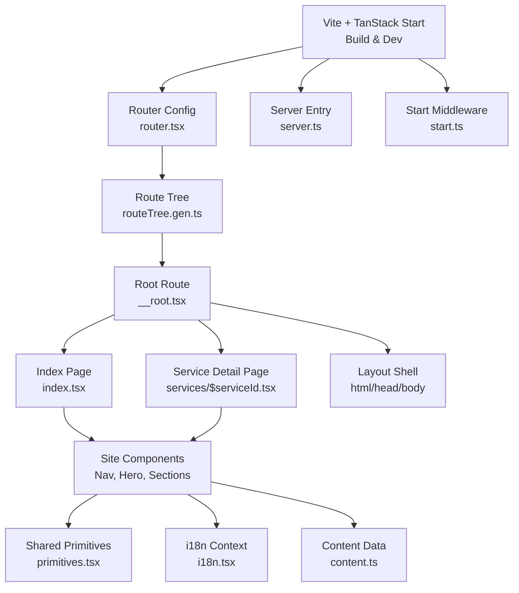
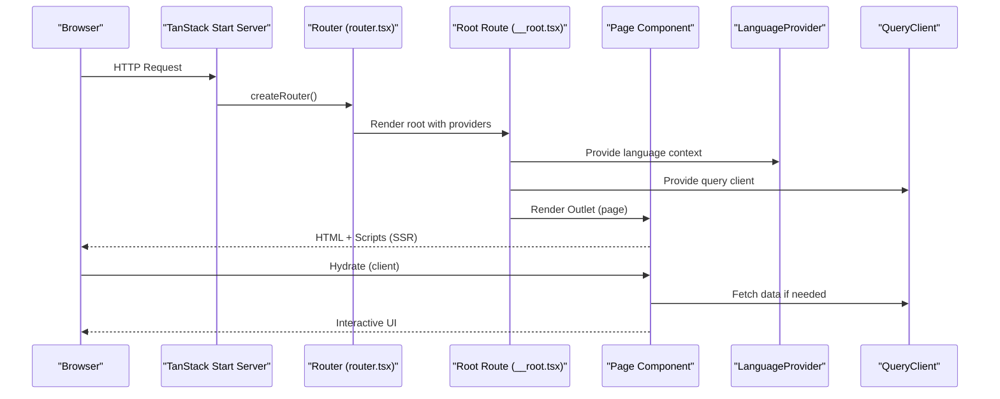
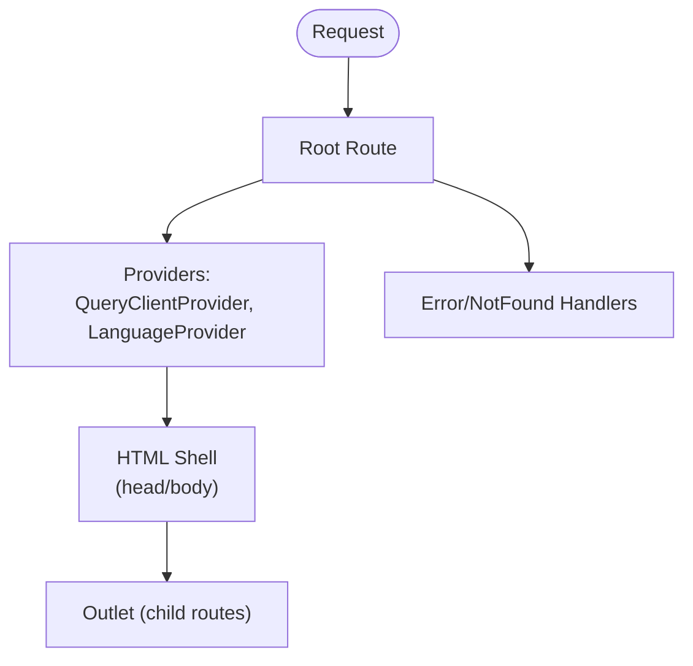
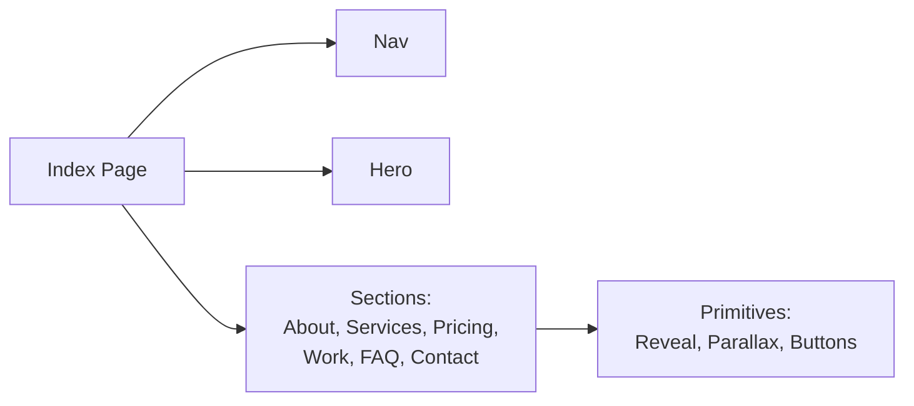
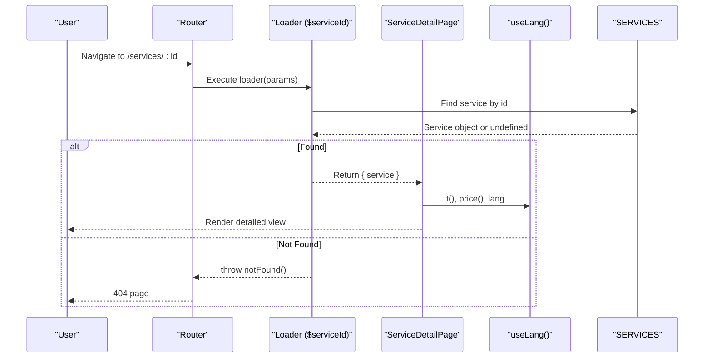
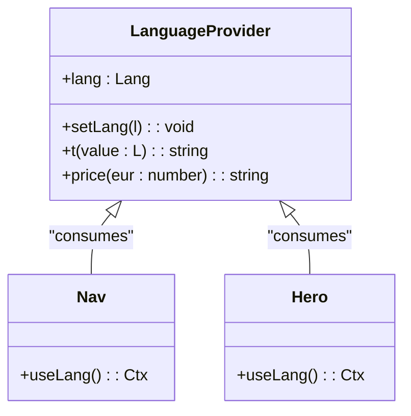
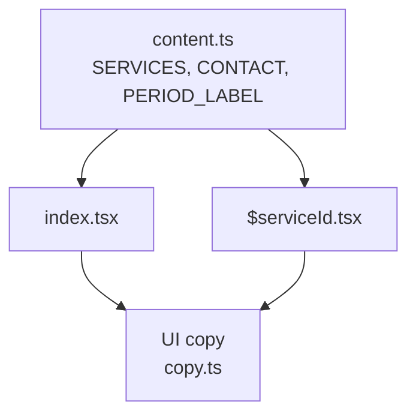
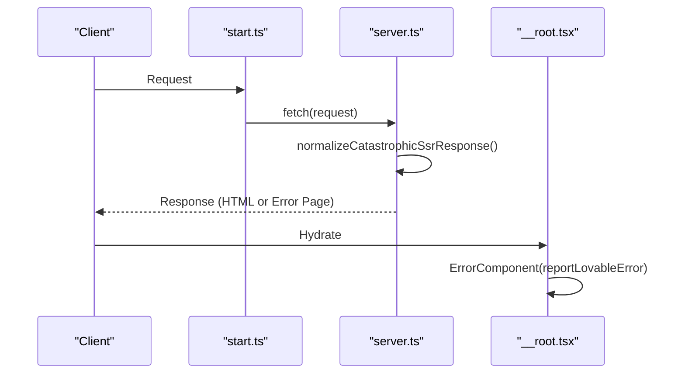
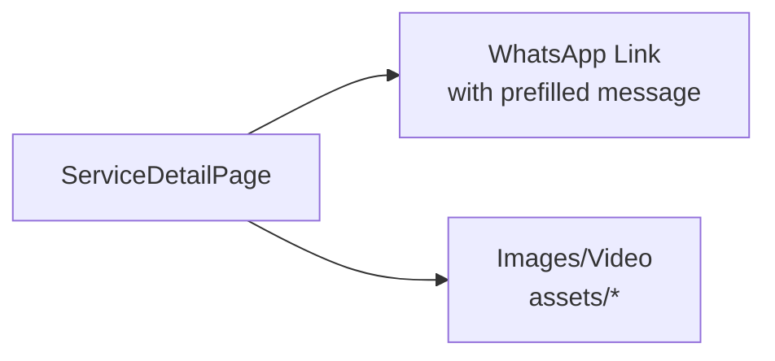
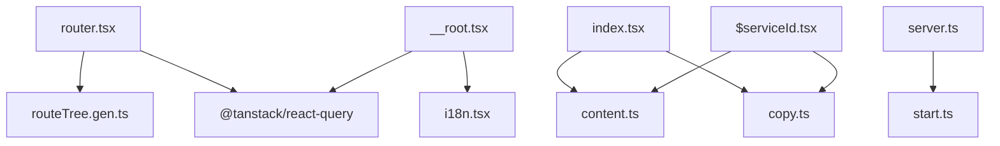

# Architecture Overview

<cite>
**Referenced Files in This Document**
- [src/routes/__root.tsx](file://src/routes/__root.tsx)
- [src/routes/index.tsx](file://src/routes/index.tsx)
- [src/routes/services/$serviceId.tsx](file://src/routes/services/$serviceId.tsx)
- [src/router.tsx](file://src/router.tsx)
- [src/server.ts](file://src/server.ts)
- [src/start.ts](file://src/start.ts)
- [vite.config.ts](file://vite.config.ts)
- [package.json](file://package.json)
- [src/lib/i18n.tsx](file://src/lib/i18n.tsx)
- [src/lib/content.ts](file://src/lib/content.ts)
- [src/lib/copy.ts](file://src/lib/copy.ts)
- [src/components/site/Nav.tsx](file://src/components/site/Nav.tsx)
- [src/components/site/Hero.tsx](file://src/components/site/Hero.tsx)
- [src/components/site/primitives.tsx](file://src/components/site/primitives.tsx)
</cite>

## Table of Contents

1. [Introduction](#introduction)
2. [Project Structure](#project-structure)
3. [Core Components](#core-components)
4. [Architecture Overview](#architecture-overview)
5. [Detailed Component Analysis](#detailed-component-analysis)
6. [Dependency Analysis](#dependency-analysis)
7. [Performance Considerations](#performance-considerations)
8. [Troubleshooting Guide](#troubleshooting-guide)
9. [Conclusion](#conclusion)

## Introduction

This document describes the architecture of Xragency, a marketing and services website built on TanStack Start with React 19. It explains the file-based routing, server-side rendering (SSR) setup, client hydration, component hierarchy, data flow for content and internationalization, system boundaries between server and client, API integration points, and cross-cutting concerns such as error handling, performance optimization, and SEO.

## Project Structure

The application follows a feature-oriented layout under src:

- Routes define pages and nested layouts using TanStack Router’s file-based conventions.
- Shared UI components live under src/components/site and src/components/ui.
- Cross-cutting logic is centralized in src/lib (content, i18n, utilities).
- Server entry and middleware are defined in src/server.ts and src/start.ts.
- Build configuration is managed via Vite and TanStack Start plugins.

**Diagram sources**

- [src/router.tsx:1-17](file://src/router.tsx#L1-L17)
- [src/routes/__root.tsx:1-154](file://src/routes/__root.tsx#L1-L154)
- [src/routes/index.tsx:1-59](file://src/routes/index.tsx#L1-L59)
- [src/routes/services/$serviceId.tsx:1-522](file://src/routes/services/$serviceId.tsx#L1-L522)
- [src/server.ts:1-62](file://src/server.ts#L1-L62)
- [src/start.ts:1-30](file://src/start.ts#L1-L30)

**Section sources**

- [package.json:1-88](file://package.json#L1-L88)
- [vite.config.ts:1-16](file://vite.config.ts#L1-L16)

## Core Components

- Root route provides global providers (React Query, LanguageProvider), HTML shell, head metadata, and error/404 handling.
- Index page composes site sections (Hero, About, Services, Pricing, Work, FAQ, Contact) and sets page-level SEO metadata.
- Service detail page loads service data via loader, renders dynamic content, pricing, comparisons, and CTAs.
- Navigation and primitives provide reusable UI building blocks and interactions (parallax, reveal animations, buttons).

Key responsibilities:

- Routing and context wiring at root level.
- Content-driven rendering from centralized data files.
- Internationalization via context propagation.
- SSR-friendly metadata and error handling.

**Section sources**

- [src/routes/__root.tsx:76-154](file://src/routes/__root.tsx#L76-L154)
- [src/routes/index.tsx:13-59](file://src/routes/index.tsx#L13-L59)
- [src/routes/services/$serviceId.tsx:40-68](file://src/routes/services/$serviceId.tsx#L40-L68)
- [src/components/site/Nav.tsx:15-130](file://src/components/site/Nav.tsx#L15-L130)
- [src/components/site/primitives.tsx:69-154](file://src/components/site/primitives.tsx#L69-L154)

## Architecture Overview

Xragency uses TanStack Start to deliver a hybrid SSR/hydration model:

- Server builds an initial HTML response with critical content and metadata.
- Client hydrates the app, attaching event listeners and enabling interactivity.
- React Query manages data fetching and caching across routes.
- Language context persists user preference and propagates translations throughout the tree.

**Diagram sources**

- [src/start.ts:1-30](file://src/start.ts#L1-L30)
- [src/router.tsx:1-17](file://src/router.tsx#L1-L17)
- [src/routes/__root.tsx:76-154](file://src/routes/__root.tsx#L76-L154)

## Detailed Component Analysis

### Root Layout and Providers

- The root route configures meta tags, links, and global error/404 components.
- Wraps the app with QueryClientProvider and LanguageProvider to share state and data across all routes.
- Renders the HTML shell including HeadContent and Scripts for SSR and hydration.

**Diagram sources**

- [src/routes/__root.tsx:76-154](file://src/routes/__root.tsx#L76-L154)

**Section sources**

- [src/routes/__root.tsx:16-74](file://src/routes/__root.tsx#L16-L74)
- [src/routes/__root.tsx:76-154](file://src/routes/__root.tsx#L76-L154)

### Index Page Composition

- Defines page-level SEO metadata via head function.
- Composes top-level sections: Nav, Hero, Intelligence, About, Services, Pricing, Feature, Work, Testimonials, Faq, Contact.
- Uses Tailwind classes and custom primitives for layout and effects.

**Diagram sources**

- [src/routes/index.tsx:13-59](file://src/routes/index.tsx#L13-L59)
- [src/components/site/primitives.tsx:69-154](file://src/components/site/primitives.tsx#L69-L154)

**Section sources**

- [src/routes/index.tsx:13-59](file://src/routes/index.tsx#L13-L59)

### Service Detail Page

- Uses a file-based route with a loader to fetch service data by ID; throws notFound when missing.
- Dynamically renders hero, metrics, process steps, pricing plans, comparison matrix, and related services.
- Integrates WhatsApp CTAs with pre-filled messages based on selected plan and current language.

**Diagram sources**

- [src/routes/services/$serviceId.tsx:40-68](file://src/routes/services/$serviceId.tsx#L40-L68)
- [src/lib/content.ts:77-346](file://src/lib/content.ts#L77-L346)

**Section sources**

- [src/routes/services/$serviceId.tsx:40-68](file://src/routes/services/$serviceId.tsx#L40-L68)
- [src/routes/services/$serviceId.tsx:70-522](file://src/routes/services/$serviceId.tsx#L70-L522)

### Internationalization Context

- Provides language selection persisted in localStorage and inferred from navigator language.
- Exposes t(key) for localized strings and price(eur) for currency formatting per region.
- Propagates through the entire component tree via LanguageProvider.

**Diagram sources**

- [src/lib/i18n.tsx:51-89](file://src/lib/i18n.tsx#L51-L89)
- [src/components/site/Nav.tsx:15-130](file://src/components/site/Nav.tsx#L15-L130)
- [src/components/site/Hero.tsx:15-121](file://src/components/site/Hero.tsx#L15-L121)

**Section sources**

- [src/lib/i18n.tsx:11-89](file://src/lib/i18n.tsx#L11-L89)

### Content Management

- Centralized content file defines services, plans, metrics, comparisons, and contact info.
- Pages read this data to render structured sections without hardcoding copy in components.
- Supports multi-language labels and pricing periods.

**Diagram sources**

- [src/lib/content.ts:12-346](file://src/lib/content.ts#L12-L346)
- [src/lib/copy.ts:3-418](file://src/lib/copy.ts#L3-L418)
- [src/routes/index.tsx:13-59](file://src/routes/index.tsx#L13-L59)
- [src/routes/services/$serviceId.tsx:70-522](file://src/routes/services/$serviceId.tsx#L70-L522)

**Section sources**

- [src/lib/content.ts:12-346](file://src/lib/content.ts#L12-L346)
- [src/lib/copy.ts:3-418](file://src/lib/copy.ts#L3-L418)

### System Boundaries: Server vs Client

- Server entry normalizes catastrophic SSR errors and returns a rendered error page when necessary.
- Start middleware wraps requests with error handling and CSRF protection for server functions.
- Root route handles client-side errors and reporting.

**Diagram sources**

- [src/start.ts:5-29](file://src/start.ts#L5-L29)
- [src/server.ts:21-62](file://src/server.ts#L21-L62)
- [src/routes/__root.tsx:38-74](file://src/routes/__root.tsx#L38-L74)

**Section sources**

- [src/start.ts:5-29](file://src/start.ts#L5-L29)
- [src/server.ts:21-62](file://src/server.ts#L21-L62)
- [src/routes/__root.tsx:38-74](file://src/routes/__root.tsx#L38-L74)

### API Integration Points

- WhatsApp messaging is integrated via direct links with pre-filled messages derived from service and plan selections.
- No backend APIs are used for content; data is static and served from content files.
- External assets include images and video loops referenced via imports.

**Diagram sources**

- [src/routes/services/$serviceId.tsx:82-87](file://src/routes/services/$serviceId.tsx#L82-L87)
- [src/components/site/Hero.tsx:21-30](file://src/components/site/Hero.tsx#L21-L30)

**Section sources**

- [src/routes/services/$serviceId.tsx:82-87](file://src/routes/services/$serviceId.tsx#L82-L87)
- [src/components/site/Hero.tsx:21-30](file://src/components/site/Hero.tsx#L21-L30)

## Dependency Analysis

High-level dependencies and relationships:

- Router depends on generated route tree and provides React Query client.
- Root route depends on LanguageProvider and QueryClientProvider.
- Pages depend on shared content and UI primitives.
- Server and Start modules encapsulate request lifecycle and error normalization.

**Diagram sources**

- [src/router.tsx:1-17](file://src/router.tsx#L1-L17)
- [src/routes/__root.tsx:76-154](file://src/routes/__root.tsx#L76-L154)
- [src/routes/index.tsx:13-59](file://src/routes/index.tsx#L13-L59)
- [src/routes/services/$serviceId.tsx:40-68](file://src/routes/services/$serviceId.tsx#L40-L68)
- [src/server.ts:1-62](file://src/server.ts#L1-L62)
- [src/start.ts:1-30](file://src/start.ts#L1-L30)

**Section sources**

- [src/router.tsx:1-17](file://src/router.tsx#L1-L17)
- [src/routes/__root.tsx:76-154](file://src/routes/__root.tsx#L76-L154)
- [src/routes/index.tsx:13-59](file://src/routes/index.tsx#L13-L59)
- [src/routes/services/$serviceId.tsx:40-68](file://src/routes/services/$serviceId.tsx#L40-L68)
- [src/server.ts:1-62](file://src/server.ts#L1-L62)
- [src/start.ts:1-30](file://src/start.ts#L1-L30)

## Performance Considerations

- SSR-first rendering reduces time-to-first-byte and improves SEO.
- React Query client is provided globally to cache and deduplicate data across routes.
- Lightweight parallax and reveal animations use IntersectionObserver and requestAnimationFrame for smooth scrolling effects.
- Static content is centralized to minimize bundle size and enable efficient updates.
- Media assets are imported directly; ensure appropriate compression and lazy loading strategies where applicable.

[No sources needed since this section provides general guidance]

## Troubleshooting Guide

- Server-side errors: start.ts middleware catches unhandled errors and returns a rendered error page; server.ts normalizes h3-swallowed errors and logs them.
- Client-side errors: __root.tsx error component reports via lovable-error-reporting and offers retry/reset actions.
- Not found handling: __root.tsx provides a dedicated 404 component; service detail loader throws notFound for invalid IDs.

**Section sources**

- [src/start.ts:5-29](file://src/start.ts#L5-L29)
- [src/server.ts:21-62](file://src/server.ts#L21-L62)
- [src/routes/__root.tsx:16-74](file://src/routes/__root.tsx#L16-L74)
- [src/routes/services/$serviceId.tsx:40-47](file://src/routes/services/$serviceId.tsx#L40-L47)

## Conclusion

Xragency leverages TanStack Start to deliver a performant, SEO-friendly, and maintainable application. The architecture cleanly separates concerns: routing and providers at the root, content-driven pages, centralized internationalization, and robust error handling across server and client. The modular component structure and static content model facilitate scalability and ease of updates while preserving a high-quality user experience.
