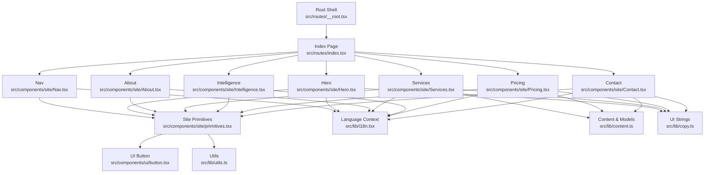
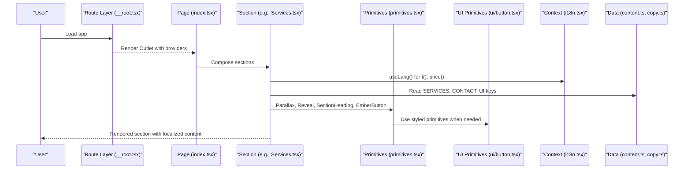
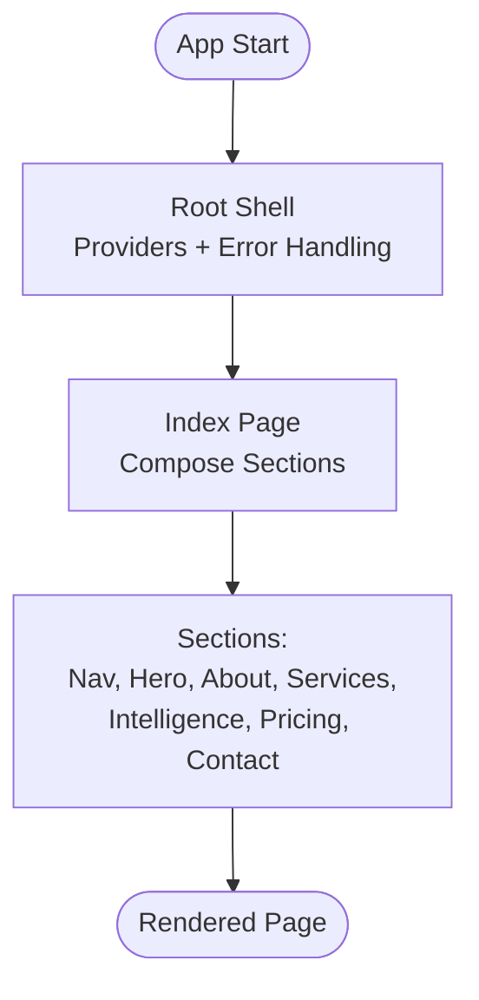
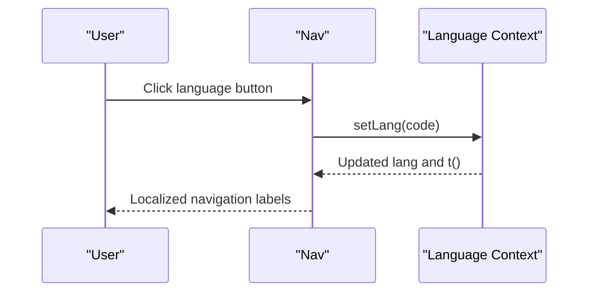
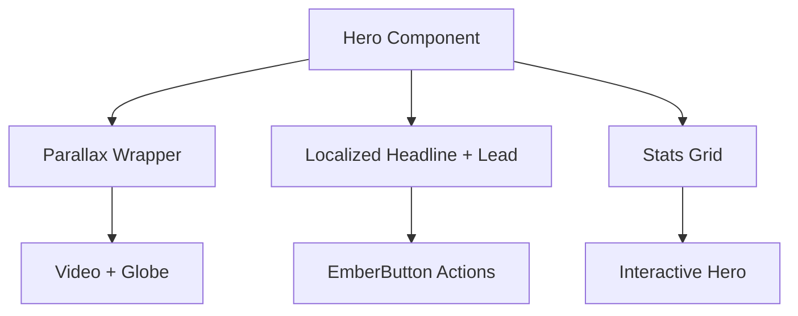
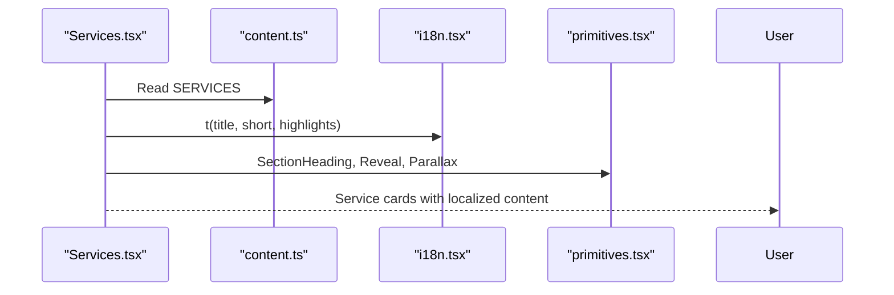
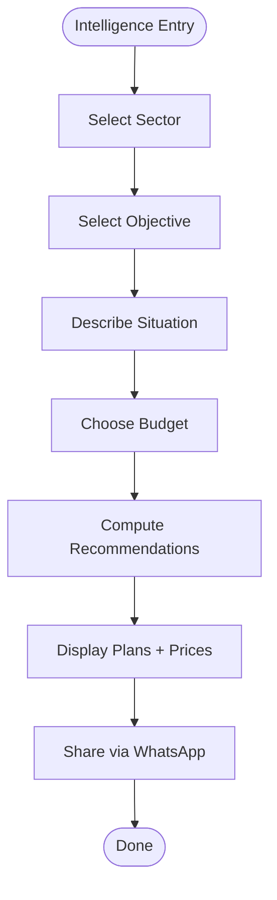
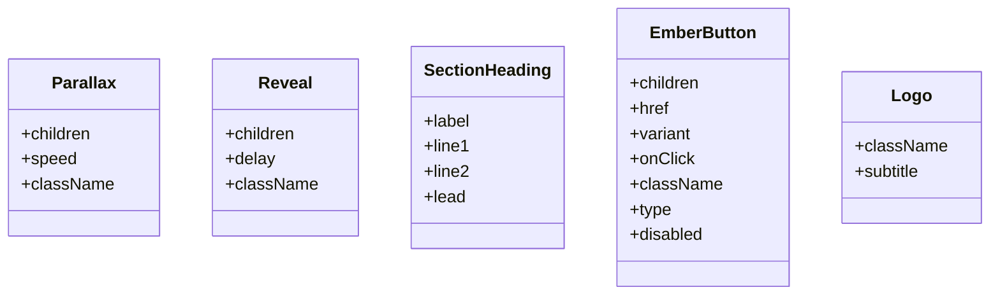
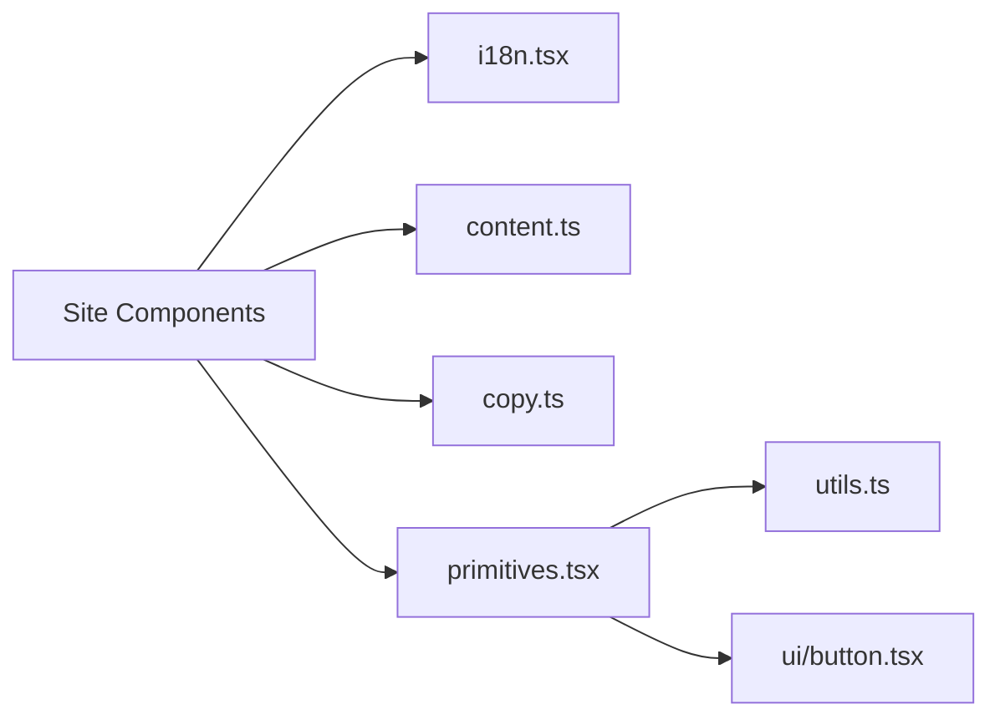

# Component Hierarchy

<cite>
**Referenced Files in This Document**
- [__root.tsx](file://src/routes/__root.tsx)
- [index.tsx](file://src/routes/index.tsx)
- [Nav.tsx](file://src/components/site/Nav.tsx)
- [Hero.tsx](file://src/components/site/Hero.tsx)
- [About.tsx](file://src/components/site/About.tsx)
- [Services.tsx](file://src/components/site/Services.tsx)
- [Intelligence.tsx](file://src/components/site/Intelligence.tsx)
- [Pricing.tsx](file://src/components/site/Pricing.tsx)
- [Contact.tsx](file://src/components/site/Contact.tsx)
- [primitives.tsx](file://src/components/site/primitives.tsx)
- [button.tsx](file://src/components/ui/button.tsx)
- [i18n.tsx](file://src/lib/i18n.tsx)
- [content.ts](file://src/lib/content.ts)
- [copy.ts](file://src/lib/copy.ts)
- [utils.ts](file://src/lib/utils.ts)
</cite>

## Table of Contents

1. Introduction
2. Project Structure
3. Core Components
4. Architecture Overview
5. Detailed Component Analysis
6. Dependency Analysis
7. Performance Considerations
8. Troubleshooting Guide
9. Conclusion

## Introduction

This document explains the Xragency application’s modular component architecture with a focus on the three-tier hierarchy:

- Site-specific components under src/components/site/
- Reusable UI primitives under src/components/ui/
- Shared business logic and content under src/lib/

It describes how root layout components compose page sections (Hero, Services, Pricing, Contact), how site components consume UI primitives, and how shared data is accessed via centralized files. It also covers composition patterns, context usage for language and pricing, state management approaches, naming conventions, folder organization, and interaction diagrams showing data flow and event propagation.

## Project Structure

The app follows a clear separation of concerns:

- Routes define top-level pages and shell providers
- Site components implement page sections and orchestrate composition
- UI primitives provide generic building blocks
- lib holds shared utilities, i18n context, and content models

**Diagram sources**

- [__root.tsx:76-153](file://src/routes/__root.tsx#L76-L153)
- [index.tsx:13-58](file://src/routes/index.tsx#L13-L58)
- [Nav.tsx:15-129](file://src/components/site/Nav.tsx#L15-L129)
- [Hero.tsx:15-120](file://src/components/site/Hero.tsx#L15-L120)
- [About.tsx:15-63](file://src/components/site/About.tsx#L15-L63)
- [Services.tsx:26-119](file://src/components/site/Services.tsx#L26-L119)
- [Intelligence.tsx:374-636](file://src/components/site/Intelligence.tsx#L374-L636)
- [Pricing.tsx:9-99](file://src/components/site/Pricing.tsx#L9-L99)
- [Contact.tsx:16-160](file://src/components/site/Contact.tsx#L16-L160)
- [primitives.tsx:6-241](file://src/components/site/primitives.tsx#L6-L241)
- [button.tsx:7-49](file://src/components/ui/button.tsx#L7-L49)
- [i18n.tsx:51-88](file://src/lib/i18n.tsx#L51-L88)
- [content.ts:12-79](file://src/lib/content.ts#L12-L79)
- [copy.ts:3-417](file://src/lib/copy.ts#L3-L417)
- [utils.ts:4-6](file://src/lib/utils.ts#L4-L6)

**Section sources**

- [__root.tsx:76-153](file://src/routes/__root.tsx#L76-L153)
- [index.tsx:13-58](file://src/routes/index.tsx#L13-L58)

## Core Components

- Root shell provides global providers (query client, language provider) and error handling.
- Index page composes the full landing page by stacking site sections.
- Site primitives (Parallax, Reveal, SectionHeading, EmberButton, Logo) encapsulate reusable visual behaviors used across sections.
- UI primitives (e.g., Button) offer base primitives for consistent styling and variants.
- Shared libraries centralize internationalization, content models, and utility functions.

Key responsibilities:

- Language and pricing are provided via context to avoid prop drilling.
- Content models (SERVICES, CONTACT, PERIOD_LABEL) are consumed by site components to render dynamic data.
- UI strings are centralized in copy.ts and resolved through the i18n hook.

**Section sources**

- [__root.tsx:76-153](file://src/routes/__root.tsx#L76-L153)
- [index.tsx:13-58](file://src/routes/index.tsx#L13-L58)
- [primitives.tsx:6-241](file://src/components/site/primitives.tsx#L6-L241)
- [button.tsx:7-49](file://src/components/ui/button.tsx#L7-L49)
- [i18n.tsx:51-88](file://src/lib/i18n.tsx#L51-L88)
- [content.ts:12-79](file://src/lib/content.ts#L12-L79)
- [copy.ts:3-417](file://src/lib/copy.ts#L3-L417)

## Architecture Overview

The application uses a layered approach:

- Route layer: defines shell and page composition
- Site layer: orchestrates sections and applies animations, layouts, and interactions
- UI layer: provides generic primitives for buttons, cards, etc.
- Lib layer: supplies i18n context, content models, and utilities

**Diagram sources**

- [__root.tsx:76-153](file://src/routes/__root.tsx#L76-L153)
- [index.tsx:13-58](file://src/routes/index.tsx#L13-L58)
- [Services.tsx:26-119](file://src/components/site/Services.tsx#L26-L119)
- [primitives.tsx:6-241](file://src/components/site/primitives.tsx#L6-L241)
- [button.tsx:7-49](file://src/components/ui/button.tsx#L7-L49)
- [i18n.tsx:51-88](file://src/lib/i18n.tsx#L51-L88)
- [content.ts:12-79](file://src/lib/content.ts#L12-L79)
- [copy.ts:3-417](file://src/lib/copy.ts#L3-L417)

## Detailed Component Analysis

### Root and Page Composition

- The root shell wraps the app with QueryClientProvider and LanguageProvider, ensuring all descendants can access language and pricing without prop drilling.
- The index page stacks site sections in a logical order and provides a consistent background and z-indexing strategy.

**Diagram sources**

- [__root.tsx:76-153](file://src/routes/__root.tsx#L76-L153)
- [index.tsx:13-58](file://src/routes/index.tsx#L13-L58)

**Section sources**

- [__root.tsx:76-153](file://src/routes/__root.tsx#L76-L153)
- [index.tsx:13-58](file://src/routes/index.tsx#L13-L58)

### Navigation (Nav)

- Uses LanguageProvider to localize labels and switch languages.
- Implements scroll-aware header styling and mobile menu toggling.
- Links navigate to anchor sections within the same page.

**Diagram sources**

- [Nav.tsx:15-129](file://src/components/site/Nav.tsx#L15-L129)
- [i18n.tsx:51-88](file://src/lib/i18n.tsx#L51-L88)

**Section sources**

- [Nav.tsx:15-129](file://src/components/site/Nav.tsx#L15-L129)
- [i18n.tsx:51-88](file://src/lib/i18n.tsx#L51-L88)

### Hero

- Displays parallax video and globe visuals, localized text, and stats.
- Consumes i18n for localized strings and content for contact info.
- Uses site primitives for parallax and reveal effects.

**Diagram sources**

- [Hero.tsx:15-120](file://src/components/site/Hero.tsx#L15-L120)
- [primitives.tsx:69-153](file://src/components/site/primitives.tsx#L69-L153)
- [i18n.tsx:51-88](file://src/lib/i18n.tsx#L51-L88)
- [content.ts:12-19](file://src/lib/content.ts#L12-L19)

**Section sources**

- [Hero.tsx:15-120](file://src/components/site/Hero.tsx#L15-L120)
- [primitives.tsx:69-153](file://src/components/site/primitives.tsx#L69-L153)
- [i18n.tsx:51-88](file://src/lib/i18n.tsx#L51-L88)
- [content.ts:12-19](file://src/lib/content.ts#L12-L19)

### About

- Presents brand messaging and image gallery with staggered reveals and parallax.
- Uses i18n for localized text and site primitives for animations.

**Section sources**

- [About.tsx:15-63](file://src/components/site/About.tsx#L15-L63)
- [primitives.tsx:69-153](file://src/components/site/primitives.tsx#L69-L153)
- [i18n.tsx:51-88](file://src/lib/i18n.tsx#L51-L88)

### Services

- Renders a responsive grid of service cards with images, highlights, and pricing hints.
- Reads services from centralized content and localizes titles/descriptions.
- Uses Link for routing to service detail pages and primitives for reveal and parallax.

**Diagram sources**

- [Services.tsx:26-119](file://src/components/site/Services.tsx#L26-L119)
- [content.ts:77-346](file://src/lib/content.ts#L77-L346)
- [i18n.tsx:51-88](file://src/lib/i18n.tsx#L51-L88)
- [primitives.tsx:167-195](file://src/components/site/primitives.tsx#L167-L195)

**Section sources**

- [Services.tsx:26-119](file://src/components/site/Services.tsx#L26-L119)
- [content.ts:77-346](file://src/lib/content.ts#L77-L346)
- [i18n.tsx:51-88](file://src/lib/i18n.tsx#L51-L88)
- [primitives.tsx:167-195](file://src/components/site/primitives.tsx#L167-L195)

### Intelligence

- Multi-step questionnaire that computes recommendations based on user inputs.
- Uses local state for step progression and answers; memoizes recommendations.
- Integrates with WhatsApp sharing using localized messages.

**Diagram sources**

- [Intelligence.tsx:374-636](file://src/components/site/Intelligence.tsx#L374-L636)
- [content.ts:77-346](file://src/lib/content.ts#L77-L346)
- [i18n.tsx:51-88](file://src/lib/i18n.tsx#L51-L88)

**Section sources**

- [Intelligence.tsx:374-636](file://src/components/site/Intelligence.tsx#L374-L636)
- [content.ts:77-346](file://src/lib/content.ts#L77-L346)
- [i18n.tsx:51-88](file://src/lib/i18n.tsx#L51-L88)

### Pricing

- Allows selecting a service to view its plans and features.
- Uses local state to track active service and renders plan cards with localized prices.
- Leverages primitives for reveal and parallax effects.

**Section sources**

- [Pricing.tsx:9-99](file://src/components/site/Pricing.tsx#L9-L99)
- [content.ts:77-346](file://src/lib/content.ts#L77-L346)
- [i18n.tsx:51-88](file://src/lib/i18n.tsx#L51-L88)
- [primitives.tsx:69-153](file://src/components/site/primitives.tsx#L69-L153)

### Contact

- Provides multiple contact channels and localized messaging.
- Uses content for email, phone, and social links; primitives for reveal and branding elements.

**Section sources**

- [Contact.tsx:16-160](file://src/components/site/Contact.tsx#L16-L160)
- [content.ts:12-19](file://src/lib/content.ts#L12-L19)
- [primitives.tsx:6-67](file://src/components/site/primitives.tsx#L6-L67)
- [i18n.tsx:51-88](file://src/lib/i18n.tsx#L51-L88)

### Site Primitives

- Parallax: Scroll-driven transform with requestAnimationFrame and reduced motion support.
- Reveal: IntersectionObserver-based entrance animation with configurable delay.
- SectionHeading: Composed heading with label, title lines, and lead paragraph.
- EmberButton: Unified button/link with variants and accessibility attributes.
- Logo: Brand mark with hover effects and optional subtitle.

**Diagram sources**

- [primitives.tsx:6-241](file://src/components/site/primitives.tsx#L6-L241)

**Section sources**

- [primitives.tsx:6-241](file://src/components/site/primitives.tsx#L6-L241)

### UI Primitives

- Button: Base primitive with variants and sizes, built on class-variance-authority and Radix Slot for flexible composition.

**Section sources**

- [button.tsx:7-49](file://src/components/ui/button.tsx#L7-L49)

## Dependency Analysis

- Site components depend on:
  - i18n context for localization and pricing
  - content models for services, contact, and period labels
  - copy for UI strings
  - primitives for visual behaviors
- Primitives depend on:
  - utils for class merging
  - i18n for localized text in some primitives
- UI primitives are independent and reusable across site components

**Diagram sources**

- [i18n.tsx:51-88](file://src/lib/i18n.tsx#L51-L88)
- [content.ts:12-79](file://src/lib/content.ts#L12-L79)
- [copy.ts:3-417](file://src/lib/copy.ts#L3-L417)
- [primitives.tsx:6-241](file://src/components/site/primitives.tsx#L6-L241)
- [utils.ts:4-6](file://src/lib/utils.ts#L4-L6)
- [button.tsx:7-49](file://src/components/ui/button.tsx#L7-L49)

**Section sources**

- [i18n.tsx:51-88](file://src/lib/i18n.tsx#L51-L88)
- [content.ts:12-79](file://src/lib/content.ts#L12-L79)
- [copy.ts:3-417](file://src/lib/copy.ts#L3-L417)
- [primitives.tsx:6-241](file://src/components/site/primitives.tsx#L6-L241)
- [utils.ts:4-6](file://src/lib/utils.ts#L4-L6)
- [button.tsx:7-49](file://src/components/ui/button.tsx#L7-L49)

## Performance Considerations

- Parallax uses requestAnimationFrame and passive scroll listeners to minimize reflows.
- Reduced motion preference is respected to avoid unnecessary animations.
- Images use lazy loading where appropriate.
- Memoization is used in complex computations (e.g., recommendations) to prevent redundant recalculations.
- Class merging via utils ensures efficient style updates.

[No sources needed since this section provides general guidance]

## Troubleshooting Guide

- If language switching does not update UI, ensure components call useLang() and that LanguageProvider wraps them.
- If content does not render, verify imports from content.ts and that keys exist in copy.ts.
- For animation issues, check browser reduced motion settings and observer thresholds in Reveal.
- For pricing discrepancies, confirm currency conversion rates in i18n.tsx and that price() is used consistently.

**Section sources**

- [i18n.tsx:51-88](file://src/lib/i18n.tsx#L51-L88)
- [primitives.tsx:113-153](file://src/components/site/primitives.tsx#L113-L153)
- [content.ts:12-79](file://src/lib/content.ts#L12-L79)
- [copy.ts:3-417](file://src/lib/copy.ts#L3-L417)

## Conclusion

Xragency’s architecture cleanly separates site-specific logic, reusable UI primitives, and shared business logic. The root shell provides global context, while site components compose page sections using primitives and centralized data. Internationalization and pricing are handled via context to avoid prop drilling, and content models keep data centralized and maintainable. This structure supports scalability, reusability, and consistent user experiences across the application.

[No sources needed since this section summarizes without analyzing specific files]
