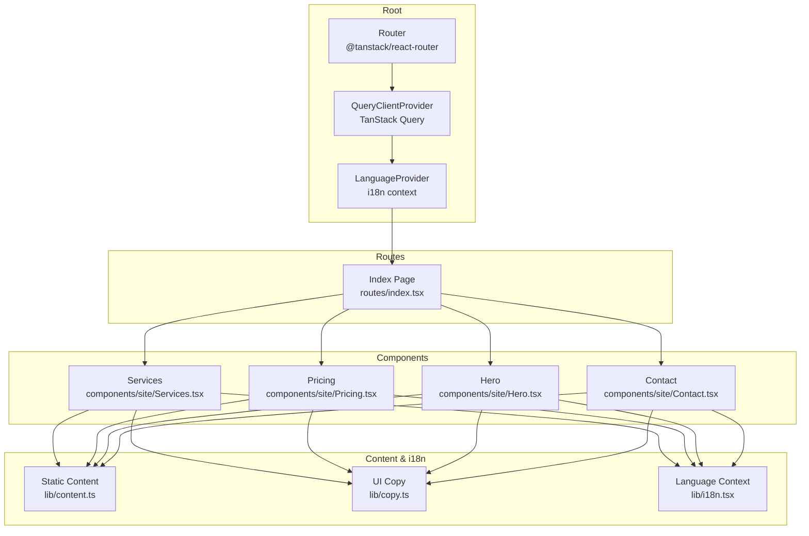
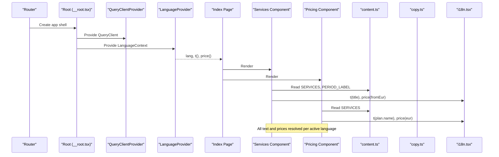
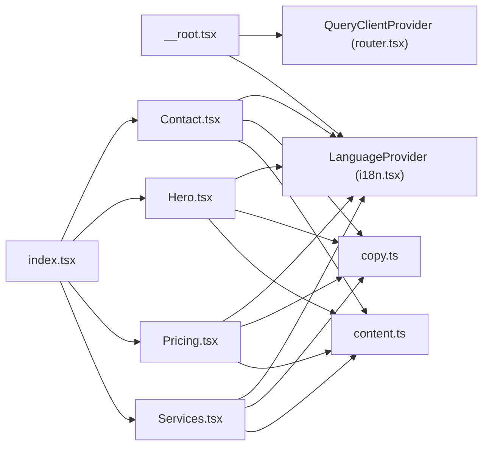

# Data Flow Patterns

<cite>
**Referenced Files in This Document**
- [content.ts](file://src/lib/content.ts)
- [i18n.tsx](file://src/lib/i18n.tsx)
- [__root.tsx](file://src/routes/__root.tsx)
- [index.tsx](file://src/routes/index.tsx)
- [router.tsx](file://src/router.tsx)
- [Services.tsx](file://src/components/site/Services.tsx)
- [Pricing.tsx](file://src/components/site/Pricing.tsx)
- [Hero.tsx](file://src/components/site/Hero.tsx)
- [Contact.tsx](file://src/components/site/Contact.tsx)
- [copy.ts](file://src/lib/copy.ts)
- [primitives.tsx](file://src/components/site/primitives.tsx)
- [utils.ts](file://src/lib/utils.ts)
- [server.ts](file://src/server.ts)
- [error-page.ts](file://src/lib/error-page.ts)
- [lovable-error-reporting.ts](file://src/lib/lovable-error-reporting.ts)
</cite>

## Table of Contents

1. Introduction
2. Project Structure
3. Core Components
4. Architecture Overview
5. Detailed Component Analysis
6. Dependency Analysis
7. Performance Considerations
8. Troubleshooting Guide
9. Conclusion

## Introduction

This document explains the data flow patterns that power Xragency’s content management, internationalization, and rendering pipeline. It focuses on how static content is centralized, how language preferences propagate through the component tree, and how server-side caching via TanStack Query is wired at the root. It also outlines form handling patterns, error handling, loading states, and strategies for keeping client state synchronized with server data when API integration is added.

## Project Structure

At a high level:

- Static content (services, pricing, contact info) is defined in a single module and consumed by UI components.
- Internationalization provides a context that supplies translation and price formatting functions to all components.
- The application root sets up TanStack Query and wraps the app with the i18n provider.
- Route-level pages compose sections that consume both static content and i18n utilities.

**Diagram sources**

- [__root.tsx:76-153](file://src/routes/__root.tsx#L76-L153)
- [index.tsx:13-58](file://src/routes/index.tsx#L13-L58)
- [Services.tsx:26-119](file://src/components/site/Services.tsx#L26-L119)
- [Pricing.tsx:9-99](file://src/components/site/Pricing.tsx#L9-L99)
- [Hero.tsx:15-120](file://src/components/site/Hero.tsx#L15-L120)
- [Contact.tsx:16-160](file://src/components/site/Contact.tsx#L16-L160)
- [content.ts:12-75](file://src/lib/content.ts#L12-L75)
- [copy.ts:3-418](file://src/lib/copy.ts#L3-L418)
- [i18n.tsx:11-88](file://src/lib/i18n.tsx#L11-L88)

**Section sources**

- [__root.tsx:76-153](file://src/routes/__root.tsx#L76-L153)
- [index.tsx:13-58](file://src/routes/index.tsx#L13-L58)
- [router.tsx:5-16](file://src/router.tsx#L5-L16)

## Core Components

- Centralized content: Services, pricing plans, contact details, and period labels are exported from a single file and reused across components.
- Internationalization context: Provides current language, setter, translation function, and currency formatter; persists language preference in localStorage and updates document language.
- Root providers: The root route configures TanStack Query and wraps the app with LanguageProvider so all child routes and components can access these contexts.

Key responsibilities:

- content.ts: Defines typed structures and static arrays for services, pricing, and contact information.
- i18n.tsx: Manages language state, default detection, persistence, and formatting helpers.
- __root.tsx: Wires QueryClientProvider and LanguageProvider around the entire app shell.

**Section sources**

- [content.ts:21-75](file://src/lib/content.ts#L21-L75)
- [i18n.tsx:11-88](file://src/lib/i18n.tsx#L11-L88)
- [__root.tsx:76-153](file://src/routes/__root.tsx#L76-L153)

## Architecture Overview

The data flow follows a clear separation:

- Static content flows from content.ts into components.
- UI copy strings flow from copy.ts into components.
- Language context flows from i18n.tsx into components for translations and price formatting.
- Server data would be fetched via TanStack Query (configured at root), enabling caching and synchronization when APIs are integrated.

**Diagram sources**

- [__root.tsx:76-153](file://src/routes/__root.tsx#L76-L153)
- [index.tsx:13-58](file://src/routes/index.tsx#L13-L58)
- [Services.tsx:26-119](file://src/components/site/Services.tsx#L26-L119)
- [Pricing.tsx:9-99](file://src/components/site/Pricing.tsx#L9-L99)
- [content.ts:21-75](file://src/lib/content.ts#L21-L75)
- [copy.ts:3-418](file://src/lib/copy.ts#L3-L418)
- [i18n.tsx:11-88](file://src/lib/i18n.tsx#L11-L88)

## Detailed Component Analysis

### Centralized Content Management (content.ts)

- Exports typed models for services, plans, steps, deliverables, metrics, comparisons, and period labels.
- Contains the full list of services with localized titles, descriptions, highlights, steps, metrics, comparisons, and plan options.
- Provides CONTACT constants for email, phone, social links, and cities.

Data usage:

- Services.tsx reads SERVICES and PERIOD_LABEL to render service cards with localized titles, short/description text, highlights, and “from” pricing formatted with the active language.
- Pricing.tsx reads SERVICES to switch between service tabs and render plan cards with localized names, audiences, features, and prices.
- Hero.tsx and Contact.tsx read CONTACT for static contact details.

Complexity considerations:

- Rendering large static arrays is O(n) per section; acceptable for marketing sites.
- Localization lookup is O(1) per string using the language key.

Optimization opportunities:

- Memoize derived lists if services grow significantly.
- Lazy-load heavy assets per service card if needed.

**Section sources**

- [content.ts:21-75](file://src/lib/content.ts#L21-L75)
- [Services.tsx:26-119](file://src/components/site/Services.tsx#L26-L119)
- [Pricing.tsx:9-99](file://src/components/site/Pricing.tsx#L9-L99)
- [Hero.tsx:15-120](file://src/components/site/Hero.tsx#L15-L120)
- [Contact.tsx:16-160](file://src/components/site/Contact.tsx#L16-L160)

### Internationalization Context (i18n.tsx)

- Defines supported languages and a type for localized strings.
- Provides a LanguageProvider that:
  - Initializes language from localStorage or navigator language.
  - Persists language changes to localStorage and updates document.documentElement.lang.
  - Exposes t(value) to resolve localized strings and price(eur) to format currency based on language-specific rates.

Propagation:

- Components call useLang() to get t and price, ensuring consistent localization throughout the tree.

Performance:

- useMemo ensures stable context value; re-renders only on language change.
- Currency conversion uses simple multiplication and rounding; negligible cost.

Error handling:

- Throws if useLang is used outside LanguageProvider, preventing silent failures.

**Section sources**

- [i18n.tsx:11-88](file://src/lib/i18n.tsx#L11-L88)

### Root Providers and Routing (__root.tsx, router.tsx)

- Root route creates a QueryClient and provides it via QueryClientProvider.
- Wraps the app with LanguageProvider so all routes and components share the same language context.
- Configures head metadata and error/not-found components.

Routing:

- The index page composes site sections that consume content and i18n.

Caching strategy:

- TanStack Query is available globally; future server data fetches will benefit from its cache, background refetch, and stale-time policies configured at the router level.

**Section sources**

- [__root.tsx:76-153](file://src/routes/__root.tsx#L76-L153)
- [router.tsx:5-16](file://src/router.tsx#L5-L16)
- [index.tsx:13-58](file://src/routes/index.tsx#L13-L58)

### Component-Level Data Flows

#### Services Section

- Reads SERVICES and PERIOD_LABEL from content.ts.
- Uses useLang().t for localized titles, descriptions, and highlights.
- Uses useLang().price to display “from” pricing with correct currency and period label.

Rendering pattern:

- Maps over services to create cards with images, overlays, and interactive hover effects.
- Links to dynamic service detail routes using service id.

**Section sources**

- [Services.tsx:26-119](file://src/components/site/Services.tsx#L26-L119)
- [content.ts:21-75](file://src/lib/content.ts#L21-L75)
- [i18n.tsx:11-88](file://src/lib/i18n.tsx#L11-L88)

#### Pricing Section

- Maintains local state for the currently selected service tab.
- Renders plan cards with localized names, audiences, features, and prices.
- Uses useLang().price for currency formatting and t for labels.

State synchronization:

- Local state drives which service’s plans are shown; no server sync required for this view.

**Section sources**

- [Pricing.tsx:9-99](file://src/components/site/Pricing.tsx#L9-L99)
- [content.ts:21-75](file://src/lib/content.ts#L21-L75)
- [i18n.tsx:11-88](file://src/lib/i18n.tsx#L11-L88)

#### Hero and Contact Sections

- Hero displays static stats and localized copy from copy.ts, plus CONTACT.cities.
- Contact renders localized messaging and direct links to email and WhatsApp using CONTACT constants.

**Section sources**

- [Hero.tsx:15-120](file://src/components/site/Hero.tsx#L15-L120)
- [Contact.tsx:16-160](file://src/components/site/Contact.tsx#L16-L160)
- [copy.ts:3-418](file://src/lib/copy.ts#L3-L418)
- [content.ts:12-19](file://src/lib/content.ts#L12-L19)

### Form Handling and Validation Patterns

- The project includes a form primitives layer built on react-hook-form (see components/ui/form.tsx).
- While not used in the analyzed pages, the pattern supports controlled fields, validation rules, and submission handlers.
- For future forms, recommended approach:
  - Use react-hook-form Controller for field binding and validation.
  - Integrate with TanStack Query mutations to submit data and update cache optimistically where appropriate.
  - Surface user-facing errors via UI feedback and global error reporting hooks.

[No sources needed since this section describes general patterns without analyzing specific files]

### API Integration Patterns with TanStack Query

- The root provides a QueryClient instance, enabling queries and mutations across the app.
- When integrating APIs:
  - Use queryClient to fetch data in loaders or components via useQuery/useMutation.
  - Leverage staleTime and cache policies configured at router level for efficient caching.
  - Handle loading states with skeleton components and error states with user-friendly messages.
  - Implement optimistic updates by updating local cache immediately and rolling back on failure.

[No sources needed since this section provides general guidance]

### Caching Strategies and Data Persistence

- Client-side caching: TanStack Query manages server data cache, background refetching, and staleness.
- User preferences: Language preference is persisted in localStorage and restored on load.
- No additional persistence layer is used for content; all content is static and bundled.

**Section sources**

- [i18n.tsx:51-69](file://src/lib/i18n.tsx#L51-L69)
- [router.tsx:5-16](file://src/router.tsx#L5-L16)

### State Synchronization Between Server and Client

- Current implementation relies on static content; no server state to synchronize.
- When adding APIs:
  - Use TanStack Query to keep UI in sync with server data.
  - Invalidate or refetch queries after mutations to ensure consistency.
  - Use optimistic UI updates for better perceived performance, with rollback on error.

[No sources needed since this section provides general guidance]

### Error Handling Patterns and Loading States

- Root error component catches runtime errors and offers retry actions.
- Server entry normalizes catastrophic SSR responses and renders a friendly error page.
- Global error reporting utility forwards errors to editor telemetry for debugging.

Loading states:

- Components use animation primitives for reveal effects; when fetching data, integrate skeletons or spinners tied to query states.

**Section sources**

- [__root.tsx:38-74](file://src/routes/__root.tsx#L38-L74)
- [server.ts:21-61](file://src/server.ts#L21-L61)
- [error-page.ts:1-30](file://src/lib/error-page.ts#L1-L30)
- [lovable-error-reporting.ts:26-57](file://src/lib/lovable-error-reporting.ts#L26-L57)

## Dependency Analysis

The following diagram shows how components depend on content, UI copy, and i18n context, and how the root wires providers.

**Diagram sources**

- [__root.tsx:76-153](file://src/routes/__root.tsx#L76-L153)
- [index.tsx:13-58](file://src/routes/index.tsx#L13-L58)
- [Services.tsx:26-119](file://src/components/site/Services.tsx#L26-L119)
- [Pricing.tsx:9-99](file://src/components/site/Pricing.tsx#L9-L99)
- [Hero.tsx:15-120](file://src/components/site/Hero.tsx#L15-L120)
- [Contact.tsx:16-160](file://src/components/site/Contact.tsx#L16-L160)
- [content.ts:21-75](file://src/lib/content.ts#L21-L75)
- [copy.ts:3-418](file://src/lib/copy.ts#L3-L418)
- [i18n.tsx:11-88](file://src/lib/i18n.tsx#L11-L88)
- [router.tsx:5-16](file://src/router.tsx#L5-L16)

**Section sources**

- [__root.tsx:76-153](file://src/routes/__root.tsx#L76-L153)
- [index.tsx:13-58](file://src/routes/index.tsx#L13-L58)
- [Services.tsx:26-119](file://src/components/site/Services.tsx#L26-L119)
- [Pricing.tsx:9-99](file://src/components/site/Pricing.tsx#L9-L99)
- [Hero.tsx:15-120](file://src/components/site/Hero.tsx#L15-L120)
- [Contact.tsx:16-160](file://src/components/site/Contact.tsx#L16-L160)
- [content.ts:21-75](file://src/lib/content.ts#L21-L75)
- [copy.ts:3-418](file://src/lib/copy.ts#L3-L418)
- [i18n.tsx:11-88](file://src/lib/i18n.tsx#L11-L88)
- [router.tsx:5-16](file://src/router.tsx#L5-L16)

## Performance Considerations

- Static content rendering is efficient; avoid unnecessary re-renders by memoizing derived values if datasets grow.
- Language switching triggers minimal re-renders due to context memoization.
- Image and video assets are loaded with lazy attributes where applicable; consider further optimization with responsive images and compression.
- TanStack Query caching reduces network requests once server data is integrated.

[No sources needed since this section provides general guidance]

## Troubleshooting Guide

Common issues and resolutions:

- Language context not available: Ensure components are rendered within LanguageProvider; useLang throws otherwise.
- Incorrect currency formatting: Verify language setting and rate configuration in i18n context.
- SSR errors: Check server entry normalization and error page rendering; inspect logs for swallowed errors.
- Runtime errors: Use the error reporting utility to capture exceptions and route context for debugging.

**Section sources**

- [i18n.tsx:84-88](file://src/lib/i18n.tsx#L84-L88)
- [server.ts:21-61](file://src/server.ts#L21-L61)
- [error-page.ts:1-30](file://src/lib/error-page.ts#L1-L30)
- [lovable-error-reporting.ts:26-57](file://src/lib/lovable-error-reporting.ts#L26-L57)

## Conclusion

Xragency’s data architecture centers on a clean separation of concerns:

- Static content is centralized and strongly typed, making it easy to maintain and reuse.
- Internationalization is provided via a context that propagates language preferences and formatting throughout the component tree.
- The root integrates TanStack Query for robust server data caching and synchronization when APIs are introduced.
- Error handling is layered, covering both client and server boundaries, with telemetry support for debugging.

This structure enables scalable growth: add new services, expand translations, and integrate APIs while maintaining consistent data flow and user experience.
