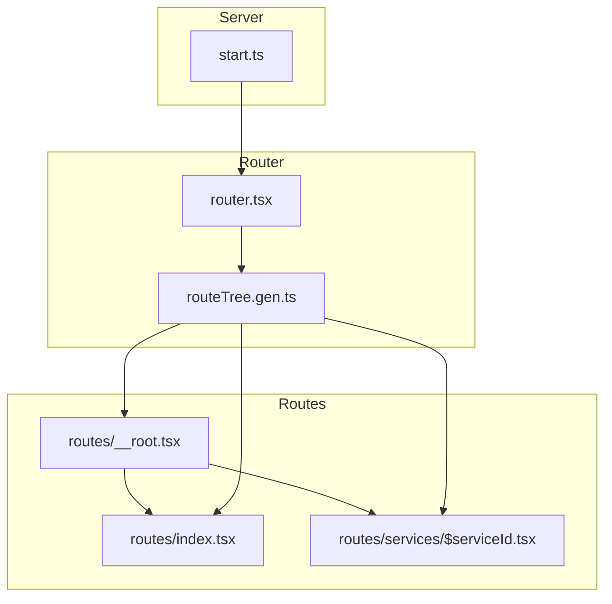
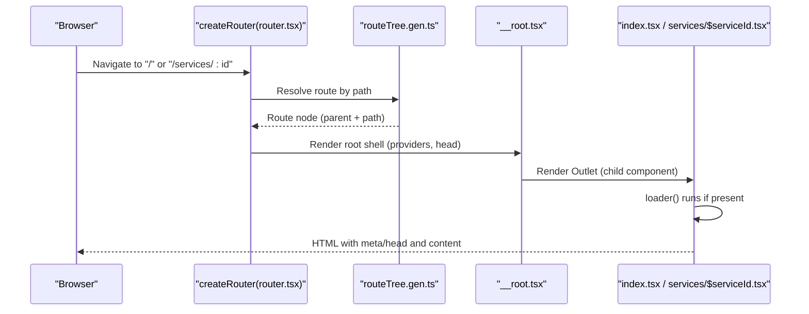
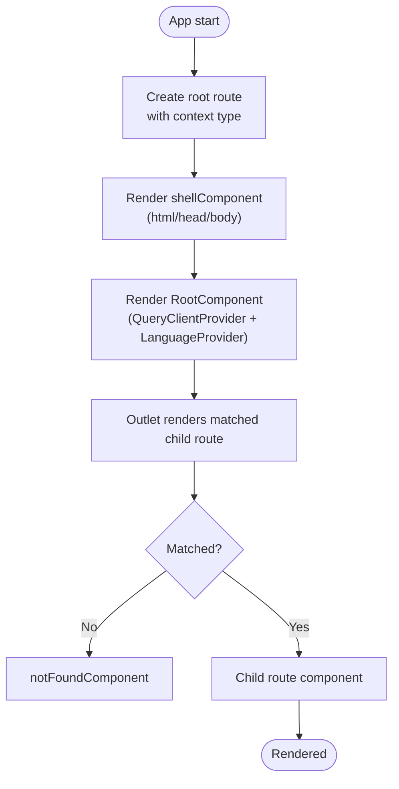
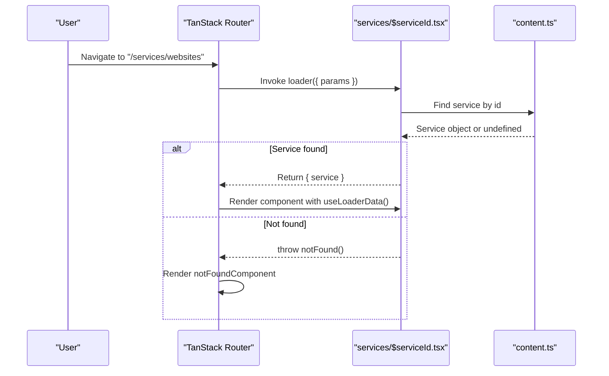
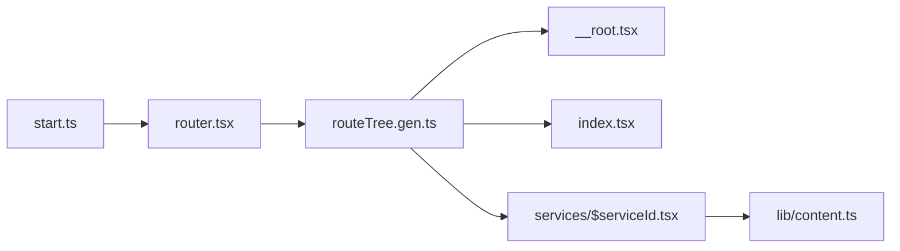

# Routing Structure

<cite>
**Referenced Files in This Document**
- [__root.tsx](file://src/routes/__root.tsx)
- [index.tsx](file://src/routes/index.tsx)
- [$serviceId.tsx](file://src/routes/services/$serviceId.tsx)
- [router.tsx](file://src/router.tsx)
- [routeTree.gen.ts](file://src/routeTree.gen.ts)
- [README.md](file://src/routes/README.md)
- [start.ts](file://src/start.ts)
- [content.ts](file://src/lib/content.ts)
</cite>

## Table of Contents

1. [Introduction](#introduction)
2. [Project Structure](#project-structure)
3. [Core Components](#core-components)
4. [Architecture Overview](#architecture-overview)
5. [Detailed Component Analysis](#detailed-component-analysis)
6. [Dependency Analysis](#dependency-analysis)
7. [Performance Considerations](#performance-considerations)
8. [Troubleshooting Guide](#troubleshooting-guide)
9. [Conclusion](#conclusion)

## Introduction

This document explains the file-based routing structure of the Xragency application built with TanStack Router. It covers how routes are declared via files, how the root layout composes global providers and error boundaries, how dynamic service pages use parameterized routes and loaders, and how SEO metadata is set per route. It also documents navigation patterns used across the app (Link-based declarative navigation), data fetching via route loaders, and best practices for URL conventions and maintainability.

## Project Structure

The application uses TanStack Start’s file-based routing:

- Each .tsx file under src/routes defines a route.
- The root shell is defined in __root.tsx.
- A generated route tree maps file paths to route IDs and children.
- The router instance wires the route tree and provides shared context (e.g., React Query client).

**Diagram sources**

- [__root.tsx:76-126](file://src/routes/__root.tsx#L76-L126)
- [index.tsx:13-33](file://src/routes/index.tsx#L13-L33)
- [$serviceId.tsx:40-68](file://src/routes/services/$serviceId.tsx#L40-L68)
- [router.tsx:5-16](file://src/router.tsx#L5-L16)
- [routeTree.gen.ts:11-24](file://src/routeTree.gen.ts#L11-L24)
- [start.ts:27-29](file://src/start.ts#L27-L29)

**Section sources**

- [README.md:1-22](file://src/routes/README.md#L1-L22)
- [routeTree.gen.ts:11-24](file://src/routeTree.gen.ts#L11-L24)
- [router.tsx:5-16](file://src/router.tsx#L5-L16)

## Core Components

- Root route (__root.tsx): Defines the app shell, global head metadata, not-found and error components, and wraps child routes with providers (React Query and i18n).
- Index route (index.tsx): Declares the home page with its own head metadata and composes site sections.
- Dynamic service route (services/$serviceId.tsx): Implements a parameterized route that loads service data by ID, sets per-page SEO metadata, and renders a detailed service page.

Key responsibilities:

- Global providers and layout composition in the root route.
- Per-route head configuration for SEO.
- Data loading via route loaders and consumption via useLoaderData.
- Declarative navigation using Link.

**Section sources**

- [__root.tsx:76-153](file://src/routes/__root.tsx#L76-L153)
- [index.tsx:13-33](file://src/routes/index.tsx#L13-L33)
- [$serviceId.tsx:40-68](file://src/routes/services/$serviceId.tsx#L40-L68)

## Architecture Overview

TanStack Router builds a typed route tree from the file system. The generated routeTree connects each route file to its parent and path. The router instance creates a single router with shared context (QueryClient) and options like scroll restoration.

**Diagram sources**

- [router.tsx:5-16](file://src/router.tsx#L5-L16)
- [routeTree.gen.ts:11-24](file://src/routeTree.gen.ts#L11-L24)
- [__root.tsx:76-153](file://src/routes/__root.tsx#L76-L153)
- [index.tsx:13-33](file://src/routes/index.tsx#L13-L33)
- [$serviceId.tsx:40-68](file://src/routes/services/$serviceId.tsx#L40-L68)

## Detailed Component Analysis

### Root Route: Global Providers, Error Boundaries, Layout Composition

- Creates the root route with context typing for QueryClient.
- Sets global head metadata (charset, viewport, title, description, Open Graph, Twitter cards) and links (global stylesheet, favicon).
- Provides a shellComponent that renders html/head/body with HeadContent and Scripts.
- Renders a RootComponent that:
  - Reads the shared QueryClient from route context.
  - Wraps children with QueryClientProvider and LanguageProvider.
  - Uses Outlet to render nested routes.
- Defines notFoundComponent and errorComponent for graceful fallbacks.

**Diagram sources**

- [__root.tsx:76-153](file://src/routes/__root.tsx#L76-L153)

**Section sources**

- [__root.tsx:16-74](file://src/routes/__root.tsx#L16-L74)
- [__root.tsx:76-153](file://src/routes/__root.tsx#L76-L153)

### Home Route: SEO Metadata and Page Composition

- Declares the index route with createFileRoute("/").
- Provides head metadata specific to the home page (title, description, OG tags, Twitter card).
- Renders a full landing page composed of multiple site sections.

Best practices demonstrated:

- Keep route-level head scoped to the page.
- Compose large pages from smaller components.

**Section sources**

- [index.tsx:13-33](file://src/routes/index.tsx#L13-L33)
- [index.tsx:35-59](file://src/routes/index.tsx#L35-L59)

### Dynamic Service Route: Parameter Handling, Loader, SEO, Navigation

- Declares a parameterized route at "/services/$serviceId".
- Uses a loader to fetch service data by params.serviceId from a centralized content module; throws notFound when missing.
- Computes per-route head metadata based on loaderData.
- Consumes loader data via Route.useLoaderData in the component.
- Uses Link for declarative navigation back to the home page and between services.

**Diagram sources**

- [$serviceId.tsx:40-68](file://src/routes/services/$serviceId.tsx#L40-L68)
- [content.ts:77-346](file://src/lib/content.ts#L77-L346)

**Section sources**

- [$serviceId.tsx:40-68](file://src/routes/services/$serviceId.tsx#L40-L68)
- [$serviceId.tsx:70-79](file://src/routes/services/$serviceId.tsx#L70-L79)
- [content.ts:77-346](file://src/lib/content.ts#L77-L346)

### Navigation Patterns Used

- Declarative navigation: Link components navigate within the app without full reloads.
- Hash-based anchors: Links to sections on the same page using hash props.
- Programmatic navigation: While not explicitly used in these routes, TanStack Router supports programmatic navigation via hooks; the current codebase favors declarative Link usage for simplicity and SEO friendliness.

Examples in this codebase:

- Back to home and cross-service navigation via Link.
- Hash navigation to sections like pricing or intelligence estimator.

**Section sources**

- [$serviceId.tsx:103-115](file://src/routes/services/$serviceId.tsx#L103-L115)
- [$serviceId.tsx:172-178](file://src/routes/services/$serviceId.tsx#L172-L178)
- [$serviceId.tsx:477-491](file://src/routes/services/$serviceId.tsx#L477-L491)

### SEO Optimization via Meta Tags

- Global defaults in root route ensure charset, viewport, base title/description, social meta, and favicon.
- Per-route head overrides or augment metadata:
  - Home route sets page-specific title and description.
  - Service detail route dynamically sets title and description based on loaded service data.

Recommendations:

- Always define head at the most specific route possible.
- Use loaderData to compute dynamic metadata for better SEO and social sharing.

**Section sources**

- [__root.tsx:76-121](file://src/routes/__root.tsx#L76-L121)
- [index.tsx:14-31](file://src/routes/index.tsx#L14-L31)
- [$serviceId.tsx:48-66](file://src/routes/services/$serviceId.tsx#L48-L66)

### Nested Routes and Layout Composition

- The root route acts as the only layout wrapper, rendering an Outlet for child routes.
- All routes are direct children of the root route in this project.
- The README clarifies conventions for nested routes, optional segments, splats, and layouts.

Practical implications:

- Add new top-level routes by creating files under src/routes.
- Create nested routes by placing files in subfolders; they will be mounted into the root Outlet.

**Section sources**

- [__root.tsx:142-153](file://src/routes/__root.tsx#L142-L153)
- [README.md:8-21](file://src/routes/README.md#L8-L21)

### Lazy Loading Strategies

- Current routes do not use explicit lazy imports; all route components are statically imported.
- For performance scaling, consider lazy-loading heavy route components using React.lazy or TanStack Router’s built-in code splitting features where applicable.

Note: No lazy loading is implemented in the analyzed routes.

[No sources needed since this section provides general guidance]

### Data Fetching Patterns

- Route loaders centralize data retrieval before rendering.
- The service detail route demonstrates:
  - Reading params.serviceId.
  - Finding data in a local content module.
  - Throwing notFound for invalid IDs.
  - Returning structured data consumed by the component.

Benefits:

- Predictable data availability during render.
- Centralized error handling via notFound.
- Clear separation between data fetching and UI.

**Section sources**

- [$serviceId.tsx:40-47](file://src/routes/services/$serviceId.tsx#L40-L47)
- [$serviceId.tsx:70-79](file://src/routes/services/$serviceId.tsx#L70-L79)
- [content.ts:77-346](file://src/lib/content.ts#L77-L346)

### URL Structure Conventions and Best Practices

- File-based mapping:
  - index.tsx → /
  - services/$serviceId.tsx → /services/:serviceId
- Parameters:
  - Bare $ denotes required parameters (e.g., $serviceId).
  - Optional segments and splats follow documented conventions.
- Consistency:
  - Use lowercase kebab-case for paths.
  - Keep route definitions close to their page components.

**Section sources**

- [README.md:10-18](file://src/routes/README.md#L10-L18)
- [routeTree.gen.ts:15-24](file://src/routeTree.gen.ts#L15-L24)

## Dependency Analysis

The routing layer depends on:

- Generated route tree for path-to-route mapping.
- Router configuration for context and behavior.
- Server middleware for error handling and CSRF protection.

**Diagram sources**

- [start.ts:27-29](file://src/start.ts#L27-L29)
- [router.tsx:5-16](file://src/router.tsx#L5-L16)
- [routeTree.gen.ts:11-24](file://src/routeTree.gen.ts#L11-L24)
- [__root.tsx:76-153](file://src/routes/__root.tsx#L76-L153)
- [index.tsx:13-33](file://src/routes/index.tsx#L13-L33)
- [$serviceId.tsx:40-68](file://src/routes/services/$serviceId.tsx#L40-L68)
- [content.ts:77-346](file://src/lib/content.ts#L77-L346)

**Section sources**

- [start.ts:5-18](file://src/start.ts#L5-L18)
- [router.tsx:5-16](file://src/router.tsx#L5-L16)
- [routeTree.gen.ts:11-24](file://src/routeTree.gen.ts#L11-L24)

## Performance Considerations

- Scroll restoration is enabled in the router configuration for better UX.
- Default preload stale time is set to 0, meaning preloaded data is considered fresh immediately.
- Avoid heavy synchronous work in loaders; prefer lightweight lookups and defer heavy computations to components if necessary.
- Consider lazy-loading large route components to reduce initial bundle size.

[No sources needed since this section provides general guidance]

## Troubleshooting Guide

- 404 handling:
  - Invalid dynamic parameters trigger notFound in the loader, which renders the root notFoundComponent.
- Global errors:
  - The root errorComponent logs errors and reports them via the error reporting utility. Users can retry or go home.
- Server-side errors:
  - Custom server middleware catches unhandled errors and returns a 500 response with an error page.

Recommended checks:

- Ensure params match route definitions exactly.
- Verify loader returns data or throws notFound consistently.
- Confirm head functions handle missing loaderData gracefully.

**Section sources**

- [$serviceId.tsx:40-47](file://src/routes/services/$serviceId.tsx#L40-L47)
- [__root.tsx:16-74](file://src/routes/__root.tsx#L16-L74)
- [start.ts:5-18](file://src/start.ts#L5-L18)

## Conclusion

Xragency’s routing leverages TanStack Router’s file-based conventions to deliver a clean, scalable architecture:

- Root layout centralizes providers and global SEO.
- Per-route head enables precise SEO control.
- Loaders provide predictable data access and robust error handling.
- Declarative navigation keeps routing simple and maintainable.
  Following the documented conventions ensures consistent URLs, clear data flows, and strong SEO outcomes as the application grows.
