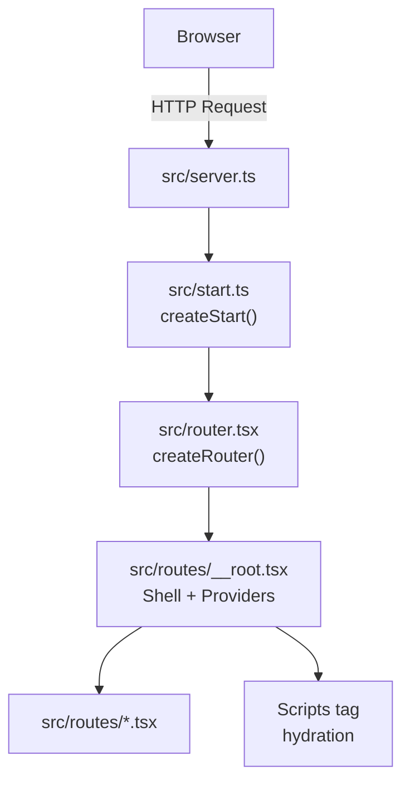
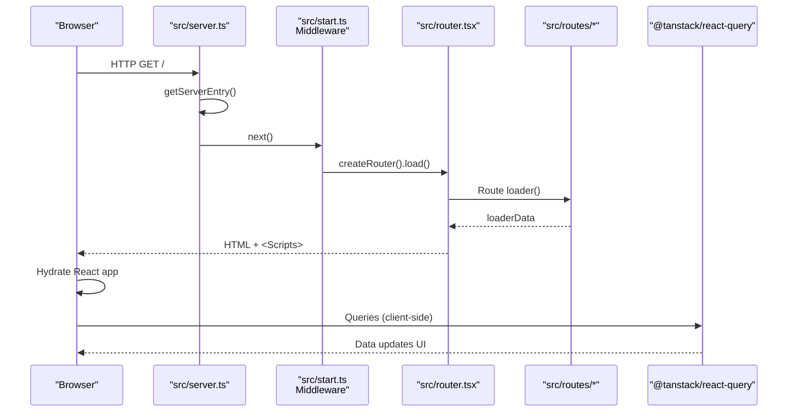
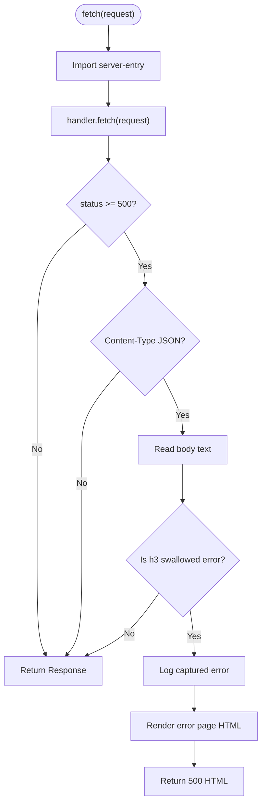
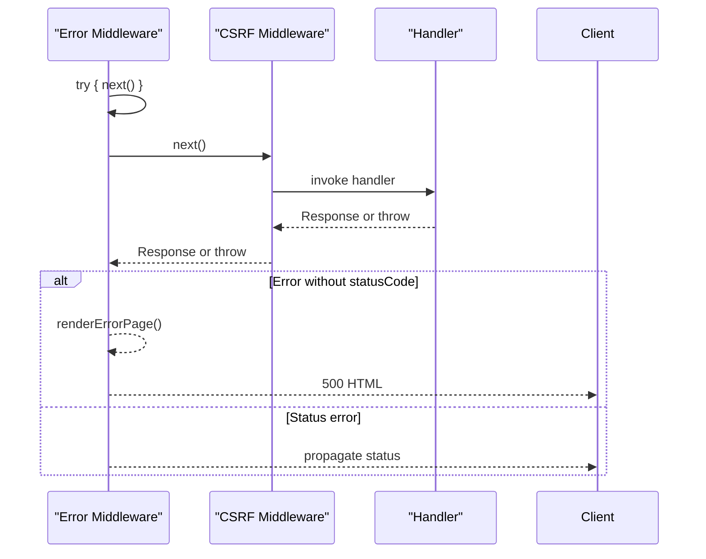
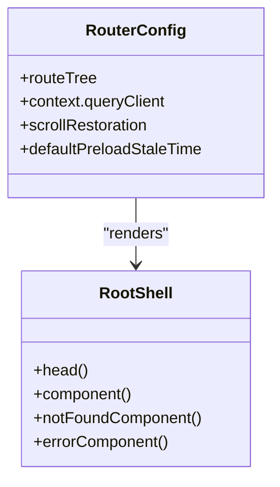
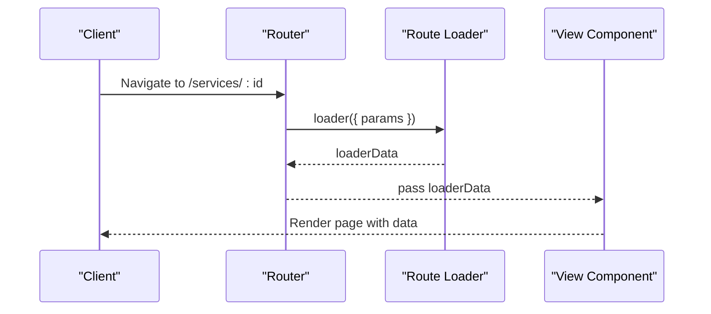
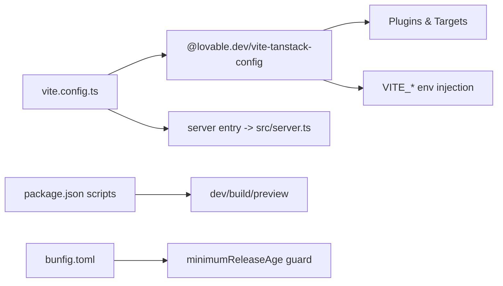
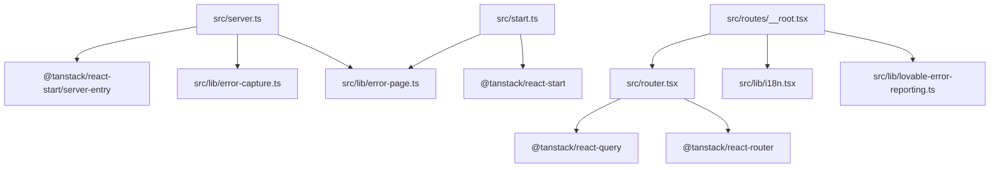

# Server-Client Communication

<cite>
**Referenced Files in This Document**
- [start.ts](file://src/start.ts)
- [server.ts](file://src/server.ts)
- [router.tsx](file://src/router.tsx)
- [__root.tsx](file://src/routes/__root.tsx)
- [index.tsx](file://src/routes/index.tsx)
- [$serviceId.tsx](file://src/routes/services/$serviceId.tsx)
- [error-capture.ts](file://src/lib/error-capture.ts)
- [error-page.ts](file://src/lib/error-page.ts)
- [i18n.tsx](file://src/lib/i18n.tsx)
- [lovable-error-reporting.ts](file://src/lib/lovable-error-reporting.ts)
- [vite.config.ts](file://vite.config.ts)
- [package.json](file://package.json)
- [bunfig.toml](file://bunfig.toml)
</cite>

## Table of Contents

1. [Introduction](#introduction)
2. [Project Structure](#project-structure)
3. [Core Components](#core-components)
4. [Architecture Overview](#architecture-overview)
5. [Detailed Component Analysis](#detailed-component-analysis)
6. [Dependency Analysis](#dependency-analysis)
7. [Performance Considerations](#performance-considerations)
8. [Troubleshooting Guide](#troubleshooting-guide)
9. [Conclusion](#conclusion)
10. [Appendices](#appendices)

## Introduction

This document explains the full-stack server-client communication for the Xragency application built with TanStack Start. It covers how server-side rendering (SSR) and client-side hydration are orchestrated, how requests flow from initial page load through subsequent data fetching, and how errors, security, and performance are handled end-to-end. It also provides guidance on environment configuration, build-time optimizations, debugging techniques, and production best practices.

## Project Structure

The application uses a file-based routing model under src/routes, a root shell that sets up providers and scripts, and a custom server entry that wraps the framework’s runtime to improve error handling. The Vite configuration delegates most setup to a shared TanStack config while pointing the server entry to a custom wrapper.

**Diagram sources**

- [server.ts:47-61](file://src/server.ts#L47-L61)
- [start.ts:27-29](file://src/start.ts#L27-L29)
- [router.tsx:5-16](file://src/router.tsx#L5-L16)
- [__root.tsx:128-153](file://src/routes/__root.tsx#L128-L153)

**Section sources**

- [vite.config.ts:9-15](file://vite.config.ts#L9-L15)
- [package.json:14-66](file://package.json#L14-L66)

## Core Components

- Server entry and SSR normalization: A thin adapter imports the framework’s server entry and normalizes catastrophic SSR errors into a user-friendly HTML response.
- Start instance and middleware: Central request pipeline includes an error-handling middleware and CSRF protection for server functions.
- Router and root shell: Creates a React Query client, wires it into route context, and renders the HTML shell with head content and scripts for hydration.
- Routes: File-based routes define loaders, head metadata, and components; one route demonstrates loader-driven data fetching.
- Error capture and reporting: Captures unhandled errors and integrates with external reporting hooks when available.
- Internationalization: Provides language context and price formatting used across UI.

**Section sources**

- [server.ts:1-61](file://src/server.ts#L1-L61)
- [start.ts:1-29](file://src/start.ts#L1-L29)
- [router.tsx:1-17](file://src/router.tsx#L1-L17)
- [__root.tsx:1-154](file://src/routes/__root.tsx#L1-L154)
- [$serviceId.tsx:40-68](file://src/routes/services/$serviceId.tsx#L40-L68)
- [error-capture.ts:1-82](file://src/lib/error-capture.ts#L1-L82)
- [error-page.ts:1-31](file://src/lib/error-page.ts#L1-L31)
- [i18n.tsx:1-89](file://src/lib/i18n.tsx#L1-L89)

## Architecture Overview

The request lifecycle begins at the platform’s fetch handler, which delegates to the TanStack Start server entry. Middleware runs before route handlers, providing global error handling and CSRF validation for server functions. The router resolves routes, executes loaders, and renders the root shell with providers. On the client, scripts hydrate the app and connect to React Query for subsequent data operations.

**Diagram sources**

- [server.ts:47-61](file://src/server.ts#L47-L61)
- [start.ts:5-29](file://src/start.ts#L5-L29)
- [router.tsx:5-16](file://src/router.tsx#L5-L16)
- [__root.tsx:128-153](file://src/routes/__root.tsx#L128-L153)

## Detailed Component Analysis

### Server Entry and SSR Error Normalization

- Dynamically imports the framework’s server entry once per process.
- Wraps the response to detect h3-swallowed SSR errors and convert them to a friendly HTML error page.
- Captures the last thrown error via a console.error hook so stack traces can be recovered even when the underlying framework swallows exceptions.

**Diagram sources**

- [server.ts:12-19](file://src/server.ts#L12-L19)
- [server.ts:21-45](file://src/server.ts#L21-L45)
- [server.ts:47-61](file://src/server.ts#L47-L61)
- [error-capture.ts:52-81](file://src/lib/error-capture.ts#L52-L81)

**Section sources**

- [server.ts:1-61](file://src/server.ts#L1-L61)
- [error-capture.ts:1-82](file://src/lib/error-capture.ts#L1-L82)
- [error-page.ts:1-31](file://src/lib/error-page.ts#L1-L31)

### Start Instance and Request Middleware

- Registers a server middleware that catches non-status errors and returns a 500 HTML error page.
- Enables CSRF protection specifically for server functions by filtering on handler type.
- Exposes a start instance configured with the middleware chain.

**Diagram sources**

- [start.ts:5-18](file://src/start.ts#L5-L18)
- [start.ts:23-25](file://src/start.ts#L23-L25)
- [start.ts:27-29](file://src/start.ts#L27-L29)

**Section sources**

- [start.ts:1-29](file://src/start.ts#L1-L29)

### Router, Root Shell, and Hydration

- Creates a React Query client and injects it into route context for consistent data management.
- Renders the HTML shell with meta/head content and script tags required for hydration.
- Provides global error and not-found boundaries at the root level.

**Diagram sources**

- [router.tsx:5-16](file://src/router.tsx#L5-L16)
- [__root.tsx:76-126](file://src/routes/__root.tsx#L76-L126)
- [__root.tsx:128-153](file://src/routes/__root.tsx#L128-L153)

**Section sources**

- [router.tsx:1-17](file://src/router.tsx#L1-L17)
- [__root.tsx:1-154](file://src/routes/__root.tsx#L1-L154)

### Routes and Data Fetching Patterns

- File-based routes define loaders that run on the server during SSR and on the client during navigation.
- Example: a dynamic service detail route uses a loader to validate parameters and return data to the component.
- Head metadata is set per route to control SEO and social sharing.

**Diagram sources**

- [$serviceId.tsx:40-68](file://src/routes/services/$serviceId.tsx#L40-L68)

**Section sources**

- [$serviceId.tsx:40-68](file://src/routes/services/$serviceId.tsx#L40-L68)
- [index.tsx:13-33](file://src/routes/index.tsx#L13-L33)

### Environment Variables, Configuration, and Build-Time Optimizations

- Vite configuration delegates to a shared TanStack config that includes devtools, plugins, Nitro target, env injection, path aliases, and deduplication.
- The server entry is explicitly pointed to a custom wrapper for SSR error normalization.
- Package scripts provide dev, build, preview, lint, and format commands.
- Bun configuration enforces a minimum release age for dependencies to reduce supply-chain risk.

**Diagram sources**

- [vite.config.ts:1-15](file://vite.config.ts#L1-L15)
- [package.json:6-12](file://package.json#L6-L12)
- [bunfig.toml:1-8](file://bunfig.toml#L1-L8)

**Section sources**

- [vite.config.ts:1-15](file://vite.config.ts#L1-L15)
- [package.json:6-12](file://package.json#L6-L12)
- [bunfig.toml:1-8](file://bunfig.toml#L1-L8)

### Security Considerations

- CSRF protection is enabled for server functions via a dedicated middleware that filters by handler type.
- Input validation should be performed in route loaders and server functions; consider using a schema validator such as Zod where applicable.
- Ensure all sensitive endpoints use HTTPS in production and restrict access to server-only code paths.

**Section sources**

- [start.ts:23-25](file://src/start.ts#L23-L25)

### Logging and Monitoring

- Global console.error is wrapped to expand error chains and record the last error for recovery in the server entry.
- Root error boundary reports errors to an optional external reporting hook when present.
- Use structured logging in production to forward logs to your observability platform.

**Section sources**

- [error-capture.ts:52-81](file://src/lib/error-capture.ts#L52-L81)
- [lovable-error-reporting.ts:26-57](file://src/lib/lovable-error-reporting.ts#L26-L57)
- [__root.tsx:38-74](file://src/routes/__root.tsx#L38-L74)

### Debugging Techniques

- Server-side: Inspect normalized responses and captured errors; leverage the expanded error strings produced by the console.error wrapper.
- Client-side: Use React Query devtools and browser network panel to inspect queries and mutations.
- Navigation issues: Verify route loaders and ensure notFound is thrown for invalid parameters.

**Section sources**

- [server.ts:21-45](file://src/server.ts#L21-L45)
- [error-capture.ts:18-38](file://src/lib/error-capture.ts#L18-L38)
- [$serviceId.tsx:40-47](file://src/routes/services/$serviceId.tsx#L40-L47)

## Dependency Analysis

High-level dependencies between core modules:

**Diagram sources**

- [server.ts:1-4](file://src/server.ts#L1-L4)
- [start.ts:1-3](file://src/start.ts#L1-L3)
- [router.tsx:1-3](file://src/router.tsx#L1-L3)
- [__root.tsx:1-14](file://src/routes/__root.tsx#L1-L14)

**Section sources**

- [server.ts:1-61](file://src/server.ts#L1-L61)
- [start.ts:1-29](file://src/start.ts#L1-L29)
- [router.tsx:1-17](file://src/router.tsx#L1-L17)
- [__root.tsx:1-154](file://src/routes/__root.tsx#L1-L154)

## Performance Considerations

- SSR-first rendering reduces time-to-first-byte; ensure loaders are efficient and avoid heavy computations in hot paths.
- Use React Query caching and stale times to minimize redundant network calls.
- Keep route components focused; defer heavy work to background tasks or server functions.
- Leverage build-time optimizations provided by the shared Vite/TanStack config (deduplication, tree-shaking, minification).

[No sources needed since this section provides general guidance]

## Troubleshooting Guide

- Unexpected 500 responses: Check whether h3 swallowed an error; the server entry will log the captured error and render a friendly page.
- Missing data on first load: Verify route loaders execute and return expected data; confirm client-side hydration did not overwrite server state.
- CSRF errors on server functions: Ensure CSRF middleware is active and tokens are correctly included for mutating server functions.
- Internationalization issues: Confirm LanguageProvider wraps the app and that locale detection logic matches expectations.

**Section sources**

- [server.ts:21-45](file://src/server.ts#L21-L45)
- [start.ts:5-18](file://src/start.ts#L5-L18)
- [i18n.tsx:51-81](file://src/lib/i18n.tsx#L51-L81)

## Conclusion

Xragency’s architecture leverages TanStack Start to deliver fast SSR with robust client hydration. The custom server entry improves resilience by capturing and normalizing SSR errors, while middleware ensures secure server function execution. Routes use loaders for predictable data flow, and React Query powers efficient client-side data management. With careful attention to input validation, logging, and build-time optimizations, the application is well-positioned for reliable production deployments.

[No sources needed since this section summarizes without analyzing specific files]

## Appendices

### Request-Response Cycle Summary

- Initial page load: Platform fetch -> server entry -> middleware -> router -> route loaders -> root shell -> HTML + scripts -> hydration.
- Subsequent navigation: Client router triggers loaders, updates React Query cache, and re-renders efficiently.
- API-like interactions: Prefer server functions behind CSRF protection; validate inputs and serialize outputs consistently.

**Section sources**

- [server.ts:47-61](file://src/server.ts#L47-L61)
- [start.ts:5-29](file://src/start.ts#L5-L29)
- [router.tsx:5-16](file://src/router.tsx#L5-L16)
- [$serviceId.tsx:40-68](file://src/routes/services/$serviceId.tsx#L40-L68)
