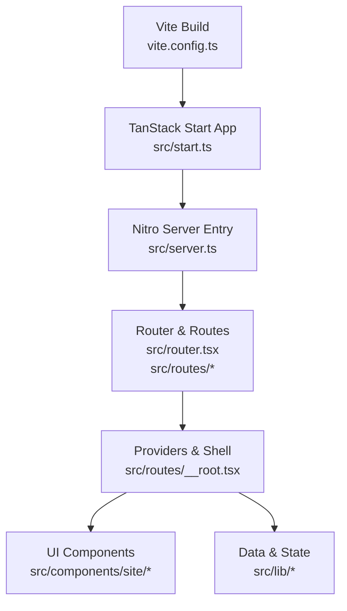
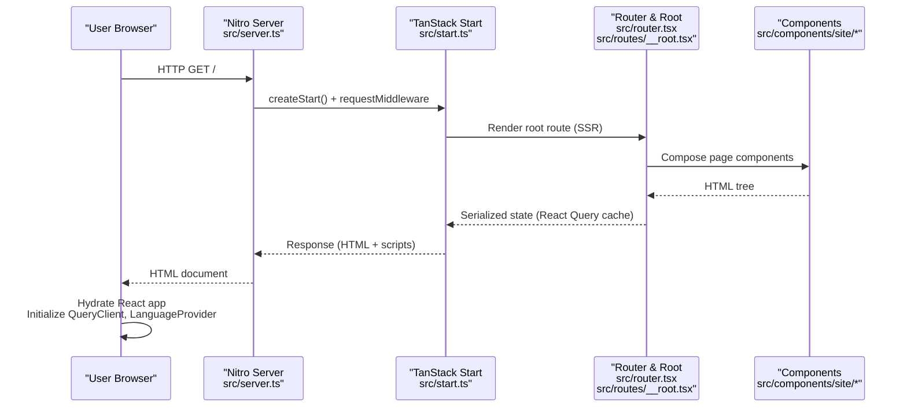
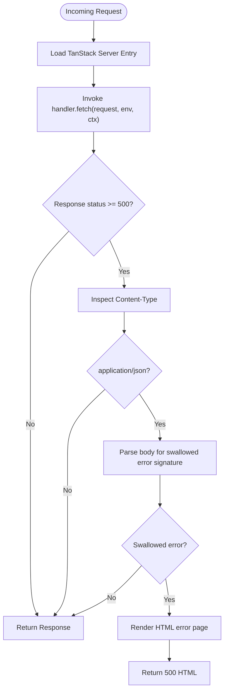
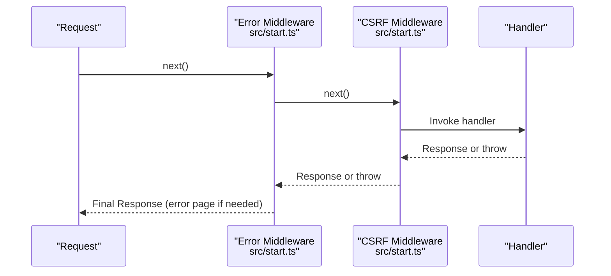
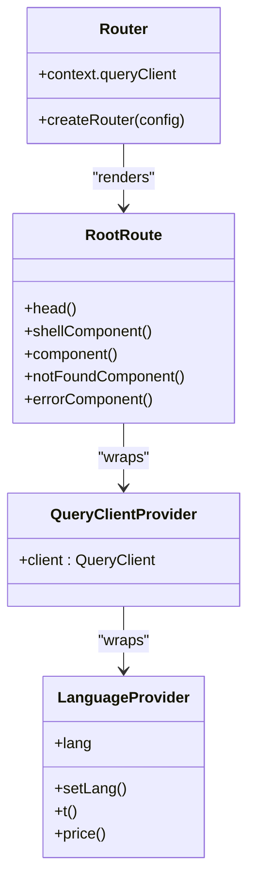
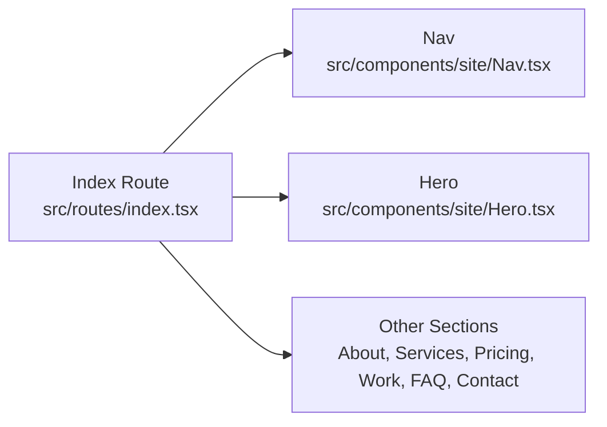
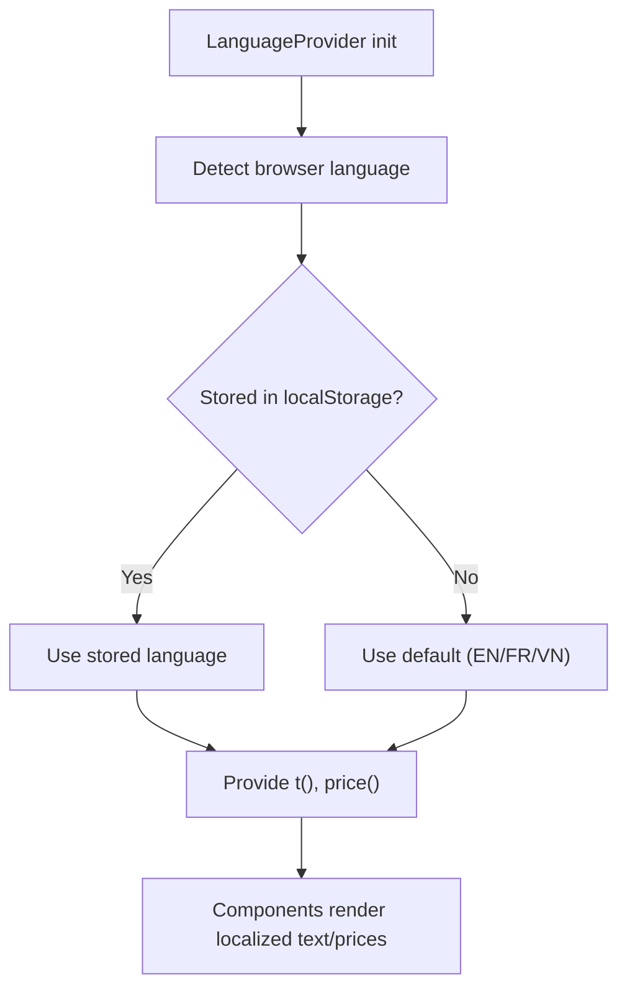
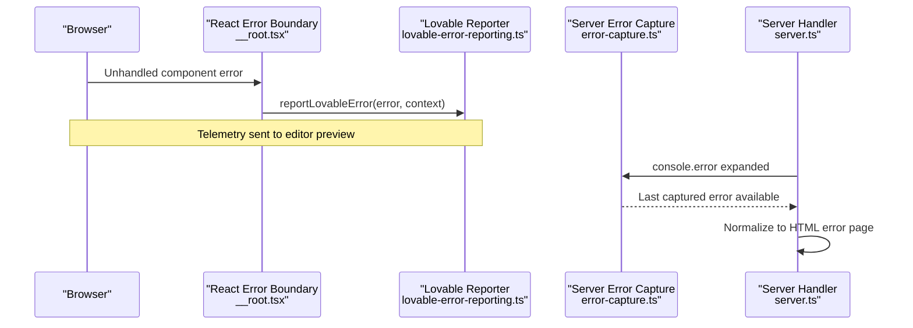
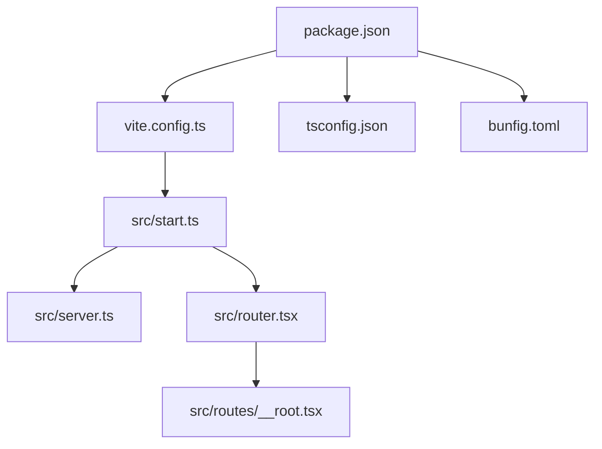

# System Architecture

<cite>
**Referenced Files in This Document**
- [package.json](file://package.json)
- [vite.config.ts](file://vite.config.ts)
- [bunfig.toml](file://bunfig.toml)
- [tsconfig.json](file://tsconfig.json)
- [src/start.ts](file://src/start.ts)
- [src/server.ts](file://src/server.ts)
- [src/router.tsx](file://src/router.tsx)
- [src/routes/__root.tsx](file://src/routes/__root.tsx)
- [src/routes/index.tsx](file://src/routes/index.tsx)
- [src/lib/i18n.tsx](file://src/lib/i18n.tsx)
- [src/lib/error-capture.ts](file://src/lib/error-capture.ts)
- [src/lib/lovable-error-reporting.ts](file://src/lib/lovable-error-reporting.ts)
- [src/components/site/Nav.tsx](file://src/components/site/Nav.tsx)
- [src/components/site/Hero.tsx](file://src/components/site/Hero.tsx)
- [README.md](file://README.md)
</cite>

## Table of Contents

1. Introduction
2. Project Structure
3. Core Components
4. Architecture Overview
5. Detailed Component Analysis
6. Dependency Analysis
7. Performance Considerations
8. Troubleshooting Guide
9. Conclusion

## Introduction

This document describes the system architecture of the Xragency application, a full-stack website built on TanStack Start with React 19 and TypeScript. It explains how server-side rendering (SSR) and client-side hydration work together, outlines the technology stack (including Tailwind CSS v4 and Radix UI primitives), and documents the build and deployment configuration powered by Vite and Nitro. It also covers system boundaries between server and client code, API integration patterns, third-party integrations such as WhatsApp and analytics, and provides guidance for performance, security, and scalability.

## Project Structure

The project is organized around TanStack Router file-based routing under src/routes, shared UI components under src/components, reusable utilities and providers under src/lib, and runtime entry points for SSR and middleware under src/server.ts and src/start.ts. Configuration lives at the repository root (package.json, vite.config.ts, tsconfig.json, bunfig.toml).

**Diagram sources**

- [vite.config.ts:1-16](file://vite.config.ts#L1-L16)
- [src/start.ts:1-30](file://src/start.ts#L1-L30)
- [src/server.ts:1-62](file://src/server.ts#L1-L62)
- [src/router.tsx:1-17](file://src/router.tsx#L1-L17)
- [src/routes/__root.tsx:1-154](file://src/routes/__root.tsx#L1-L154)

**Section sources**

- [package.json:1-88](file://package.json#L1-L88)
- [vite.config.ts:1-16](file://vite.config.ts#L1-L16)
- [tsconfig.json:1-28](file://tsconfig.json#L1-L28)
- [bunfig.toml:1-8](file://bunfig.toml#L1-L8)

## Core Components

- Runtime bootstrap and middleware: The TanStack Start instance registers request middleware to centralize error handling and CSRF protection for server functions.
- Server entry: A thin Nitro-compatible handler wraps the framework’s server entry, normalizes catastrophic SSR errors, and returns user-friendly HTML error pages.
- Routing and shell: The router configures React Query and scroll restoration; the root route defines head metadata, global providers (QueryClient, LanguageProvider), and error/404 fallbacks.
- UI composition: Page routes compose site sections from reusable components (e.g., Nav, Hero) that consume i18n and content utilities.

Key responsibilities:

- Error capture and reporting across server and client layers.
- Internationalization and localized pricing display.
- Centralized query caching via React Query.

**Section sources**

- [src/start.ts:1-30](file://src/start.ts#L1-L30)
- [src/server.ts:1-62](file://src/server.ts#L1-L62)
- [src/router.tsx:1-17](file://src/router.tsx#L1-L17)
- [src/routes/__root.tsx:1-154](file://src/routes/__root.tsx#L1-L154)
- [src/lib/i18n.tsx:1-89](file://src/lib/i18n.tsx#L1-L89)

## Architecture Overview

The application follows a hybrid SSR/hydration model:

- On first load, the server renders HTML using TanStack Start and React.
- The browser hydrates the app, initializing React Query and language context.
- Client-side navigation uses TanStack Router for fast transitions and prefetching.

**Diagram sources**

- [src/server.ts:1-62](file://src/server.ts#L1-L62)
- [src/start.ts:1-30](file://src/start.ts#L1-L30)
- [src/router.tsx:1-17](file://src/router.tsx#L1-L17)
- [src/routes/__root.tsx:1-154](file://src/routes/__root.tsx#L1-L154)

## Detailed Component Analysis

### Server Entry and Error Normalization

- Wraps the framework’s server entry to intercept and normalize unhandled SSR errors into readable HTML responses.
- Captures original error stacks when h3 swallows exceptions, ensuring observability.

**Diagram sources**

- [src/server.ts:1-62](file://src/server.ts#L1-L62)
- [src/lib/error-capture.ts:1-82](file://src/lib/error-capture.ts#L1-L82)

**Section sources**

- [src/server.ts:1-62](file://src/server.ts#L1-L62)
- [src/lib/error-capture.ts:1-82](file://src/lib/error-capture.ts#L1-L82)

### Middleware and CSRF Protection

- Registers a global error middleware that catches thrown errors and returns a consistent HTML error response.
- Adds CSRF protection for server functions to mitigate cross-site request forgery.

**Diagram sources**

- [src/start.ts:1-30](file://src/start.ts#L1-L30)

**Section sources**

- [src/start.ts:1-30](file://src/start.ts#L1-L30)

### Router, Root Shell, and Providers

- Creates a single router instance with React Query client and scroll restoration.
- Root route sets up meta/head tags, global providers, and error/404 fallbacks.
- Provides LanguageProvider for internationalization and localized pricing.

**Diagram sources**

- [src/router.tsx:1-17](file://src/router.tsx#L1-L17)
- [src/routes/__root.tsx:1-154](file://src/routes/__root.tsx#L1-L154)
- [src/lib/i18n.tsx:1-89](file://src/lib/i18n.tsx#L1-L89)

**Section sources**

- [src/router.tsx:1-17](file://src/router.tsx#L1-L17)
- [src/routes/__root.tsx:1-154](file://src/routes/__root.tsx#L1-L154)
- [src/lib/i18n.tsx:1-89](file://src/lib/i18n.tsx#L1-L89)

### Home Page Composition

- The index route composes multiple site sections (Hero, About, Services, Pricing, Work, FAQ, Contact) into a cohesive landing experience.
- Head metadata is set per route for SEO and social sharing.

**Diagram sources**

- [src/routes/index.tsx:1-59](file://src/routes/index.tsx#L1-L59)
- [src/components/site/Nav.tsx:1-130](file://src/components/site/Nav.tsx#L1-L130)
- [src/components/site/Hero.tsx:1-121](file://src/components/site/Hero.tsx#L1-L121)

**Section sources**

- [src/routes/index.tsx:1-59](file://src/routes/index.tsx#L1-L59)

### Internationalization and Pricing

- Language context supports French, English, and Vietnamese with persistent selection and automatic detection.
- Prices are derived from EUR reference values and formatted per locale, including a market adjustment for Vietnam.

**Diagram sources**

- [src/lib/i18n.tsx:1-89](file://src/lib/i18n.tsx#L1-L89)

**Section sources**

- [src/lib/i18n.tsx:1-89](file://src/lib/i18n.tsx#L1-L89)

### Error Reporting and Observability

- Server layer captures and expands error stacks even when underlying frameworks swallow them.
- Client layer reports runtime errors to Lovable’s telemetry hooks for preview/editor environments.

**Diagram sources**

- [src/routes/__root.tsx:1-154](file://src/routes/__root.tsx#L1-L154)
- [src/lib/lovable-error-reporting.ts:1-58](file://src/lib/lovable-error-reporting.ts#L1-L58)
- [src/lib/error-capture.ts:1-82](file://src/lib/error-capture.ts#L1-L82)
- [src/server.ts:1-62](file://src/server.ts#L1-L62)

**Section sources**

- [src/lib/lovable-error-reporting.ts:1-58](file://src/lib/lovable-error-reporting.ts#L1-L58)
- [src/lib/error-capture.ts:1-82](file://src/lib/error-capture.ts#L1-L82)
- [src/server.ts:1-62](file://src/server.ts#L1-L62)
- [src/routes/__root.tsx:1-154](file://src/routes/__root.tsx#L1-L154)

## Dependency Analysis

High-level dependencies and their roles:

- Vite and TanStack plugins orchestrate builds, dev server, SSR, and routing.
- React 19 powers UI and SSR.
- Tailwind CSS v4 and Radix UI primitives provide styling and accessible components.
- React Query manages data fetching and caching.
- Nitro serves the SSR bundle.

**Diagram sources**

- [package.json:1-88](file://package.json#L1-L88)
- [vite.config.ts:1-16](file://vite.config.ts#L1-L16)
- [tsconfig.json:1-28](file://tsconfig.json#L1-L28)
- [bunfig.toml:1-8](file://bunfig.toml#L1-L8)
- [src/start.ts:1-30](file://src/start.ts#L1-L30)
- [src/server.ts:1-62](file://src/server.ts#L1-L62)
- [src/router.tsx:1-17](file://src/router.tsx#L1-L17)
- [src/routes/__root.tsx:1-154](file://src/routes/__root.tsx#L1-L154)

**Section sources**

- [package.json:1-88](file://package.json#L1-L88)
- [vite.config.ts:1-16](file://vite.config.ts#L1-L16)
- [tsconfig.json:1-28](file://tsconfig.json#L1-L28)
- [bunfig.toml:1-8](file://bunfig.toml#L1-L8)

## Performance Considerations

- SSR-first rendering reduces time-to-first-paint and improves SEO through pre-rendered HTML.
- React Query enables efficient data caching and background updates.
- Tailwind CSS v4 and minimal JS payloads keep bundles lean.
- Scroll restoration and route-level head management improve perceived performance and SEO.
- Asset optimization: video assets are referenced efficiently and can be lazy-loaded where appropriate.

[No sources needed since this section provides general guidance]

## Troubleshooting Guide

Common issues and resolutions:

- SSR 500 errors: The server entry normalizes swallowed errors and returns an HTML error page; check logs for expanded error stacks captured by the error capture module.
- CSRF failures on server functions: Ensure requests include required CSRF tokens; the CSRF middleware protects serverFn handlers.
- Client-side errors: Errors caught in the root boundary are reported to Lovable telemetry; use the provided reporter to send context like route and mechanism.

Operational tips:

- Verify environment variables and build mode flags used by Vite.
- Confirm Nitro target settings in the Vite config comment block for production deployments.

**Section sources**

- [src/server.ts:1-62](file://src/server.ts#L1-L62)
- [src/start.ts:1-30](file://src/start.ts#L1-L30)
- [src/lib/error-capture.ts:1-82](file://src/lib/error-capture.ts#L1-L82)
- [src/lib/lovable-error-reporting.ts:1-58](file://src/lib/lovable-error-reporting.ts#L1-L58)
- [vite.config.ts:1-16](file://vite.config.ts#L1-L16)

## Conclusion

Xragency leverages TanStack Start to deliver a performant, SEO-friendly, and maintainable full-stack application. SSR ensures fast initial loads while client-side hydration enables rich interactivity. Centralized error handling, robust i18n, and a modern UI toolkit form a solid foundation for scaling features and integrating third-party services such as WhatsApp and analytics. The Vite-driven build pipeline and Nitro server simplify development and production operations.

[No sources needed since this section summarizes without analyzing specific files]
