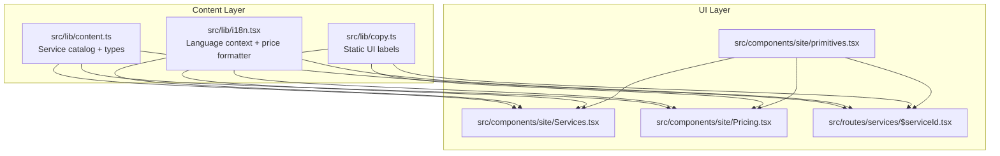
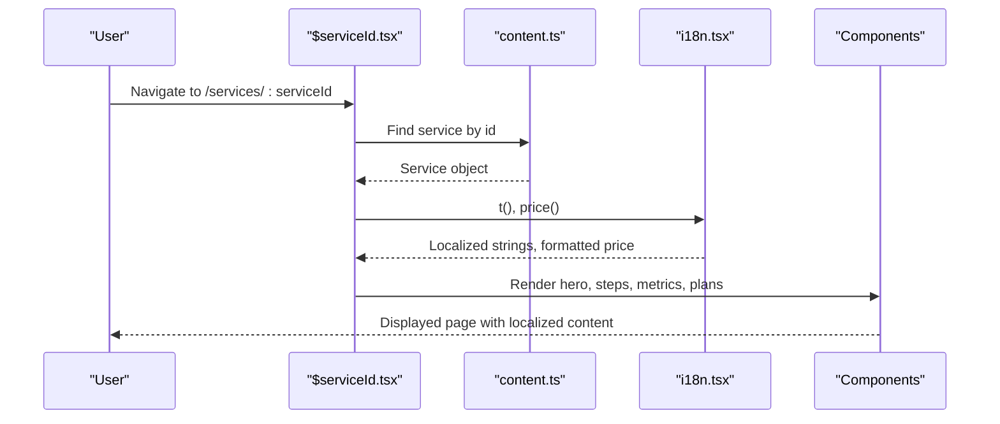
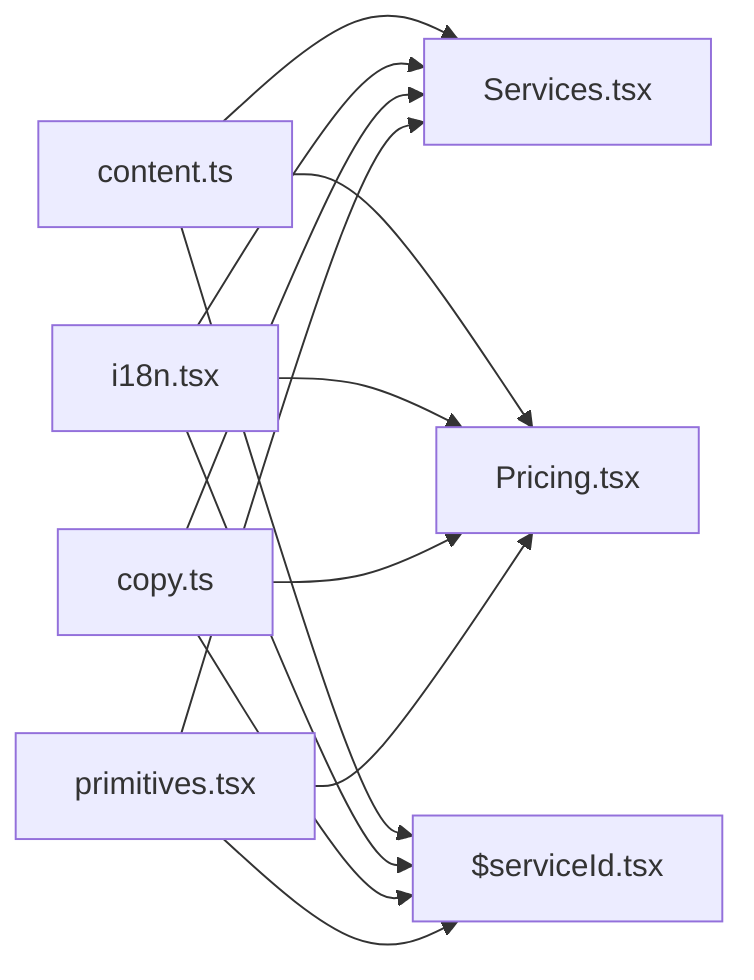

# Content Management

<cite>
**Referenced Files in This Document**
- [content.ts](file://src/lib/content.ts)
- [i18n.tsx](file://src/lib/i18n.tsx)
- [copy.ts](file://src/lib/copy.ts)
- [Services.tsx](file://src/components/site/Services.tsx)
- [Pricing.tsx](file://src/components/site/Pricing.tsx)
- [$serviceId.tsx](file://src/routes/services/$serviceId.tsx)
- [primitives.tsx](file://src/components/site/primitives.tsx)
</cite>

## Table of Contents

1. [Introduction](#introduction)
2. [Project Structure](#project-structure)
3. [Core Components](#core-components)
4. [Architecture Overview](#architecture-overview)
5. [Detailed Component Analysis](#detailed-component-analysis)
6. [Dependency Analysis](#dependency-analysis)
7. [Performance Considerations](#performance-considerations)
8. [Troubleshooting Guide](#troubleshooting-guide)
9. [Conclusion](#conclusion)
10. [Appendices](#appendices)

## Introduction

This document explains how the content management system centralizes service data, pricing information, and static UI copy using TypeScript interfaces for type safety. It details the service catalog structure (plans, steps, metrics, descriptions), shows how to add new services, modify pricing, update descriptions, and manage multimedia assets. It also documents how content files drive UI components, propagation of changes across the app, versioning strategies, asset optimization, performance considerations for large datasets, and guidelines for maintaining multilingual consistency.

## Project Structure

The content is centralized in a single source file that defines typed models and the full service catalog. UI components consume this data through a language-aware context that handles translations and currency formatting. Static UI strings are kept separate from business content to keep concerns clean.

**Diagram sources**

- [content.ts:21-69](file://src/lib/content.ts#L21-L69)
- [i18n.tsx:11-40](file://src/lib/i18n.tsx#L11-L40)
- [copy.ts:1-418](file://src/lib/copy.ts#L1-L418)
- [Services.tsx:1-120](file://src/components/site/Services.tsx#L1-L120)
- [Pricing.tsx:1-100](file://src/components/site/Pricing.tsx#L1-L100)
- [$serviceId.tsx:40-68](file://src/routes/services/$serviceId.tsx#L40-L68)
- [primitives.tsx:69-196](file://src/components/site/primitives.tsx#L69-L196)

**Section sources**

- [content.ts:21-69](file://src/lib/content.ts#L21-L69)
- [i18n.tsx:11-40](file://src/lib/i18n.tsx#L11-L40)
- [copy.ts:1-418](file://src/lib/copy.ts#L1-L418)
- [Services.tsx:1-120](file://src/components/site/Services.tsx#L1-L120)
- [Pricing.tsx:1-100](file://src/components/site/Pricing.tsx#L1-L100)
- [$serviceId.tsx:40-68](file://src/routes/services/$serviceId.tsx#L40-L68)
- [primitives.tsx:69-196](file://src/components/site/primitives.tsx#L69-L196)

## Core Components

- Centralized content model:
  - Service, Plan, ServiceStep, ServiceMetric, ServiceComparison define the shape of all service-related content with strict typing.
  - A global SERVICES array holds the complete catalog used by multiple pages.
- Language and pricing:
  - i18n provides a language context with t() for localized strings and price() for currency conversion and formatting.
  - RATES map languages to conversion factors; formatPrice applies region-specific formatting.
- Static UI copy:
  - UI object contains all non-business labels (e.g., section headings, buttons) as localized records.

Key responsibilities:

- content.ts: Defines types and the authoritative dataset for services and pricing.
- i18n.tsx: Provides translation and pricing utilities consumed by components.
- copy.ts: Centralizes UI text so components remain decoupled from business content.
- Services.tsx, Pricing.tsx, $serviceId.tsx: Render catalogs and detail views driven by content.ts via i18n.tsx.

**Section sources**

- [content.ts:21-69](file://src/lib/content.ts#L21-L69)
- [i18n.tsx:11-40](file://src/lib/i18n.tsx#L11-L40)
- [copy.ts:1-418](file://src/lib/copy.ts#L1-L418)

## Architecture Overview

The application follows a unidirectional data flow:

- Data layer: content.ts exports typed models and the SERVICES array.
- Presentation layer: Components read from content.ts and use i18n.tsx to render localized text and formatted prices.
- Routing: The service detail route loads a specific service by id and renders its plans, steps, metrics, and comparisons.

**Diagram sources**

- [$serviceId.tsx:40-68](file://src/routes/services/$serviceId.tsx#L40-L68)
- [content.ts:21-69](file://src/lib/content.ts#L21-L69)
- [i18n.tsx:11-40](file://src/lib/i18n.tsx#L11-L40)

## Detailed Component Analysis

### Service Catalog Data Model

- Types:
  - Plan: name, audience, eur, period, features, popular flag.
  - ServiceStep: num, title, desc.
  - ServiceDeliverable: title, desc.
  - ServiceMetric: metric, label, desc.
  - ServiceComparison: feature, us, them.
  - Service: id, num, title, short, description, fromEur, fromPeriod, highlights, plans, premium, steps, deliverables, metrics, comparisons, serviceFaqs.
- Period labels:
  - PERIOD_LABEL maps plan periods to localized strings.

Validation rules enforced by TypeScript:

- All user-facing strings must be L (Record<"fr"|"en"|"vi", string>).
- Prices are numbers in EUR; periods are restricted to once/month/year.
- Optional fields allow flexible service definitions without breaking consumers.

Complexity:

- Rendering lists (steps, metrics, comparisons, plans) is O(n) per service.
- Lookup by id is O(n) over SERVICES; acceptable for current size but consider indexing if catalog grows significantly.

**Section sources**

- [content.ts:21-69](file://src/lib/content.ts#L21-L69)
- [content.ts:71-75](file://src/lib/content.ts#L71-L75)

### Services List Component

- Reads SERVICES and renders a responsive grid with images, titles, short descriptions, highlights, and starting price.
- Uses i18n.t() for localization and PERIOD_LABEL for pricing units.
- Links to service detail routes with params.

Propagation:

- Adding or editing entries in SERVICES updates both the list and detail pages automatically.

**Section sources**

- [Services.tsx:1-120](file://src/components/site/Services.tsx#L1-L120)
- [content.ts:21-69](file://src/lib/content.ts#L21-L69)

### Pricing Component

- Renders tabs for each service and displays their plans with prices and features.
- Highlights the “popular” plan and formats prices using i18n.price().

Propagation:

- Changes to any plan’s name, features, or price reflect immediately across the pricing view.

**Section sources**

- [Pricing.tsx:1-100](file://src/components/site/Pricing.tsx#L1-L100)
- [i18n.tsx:11-40](file://src/lib/i18n.tsx#L11-L40)

### Service Detail Page

- Loader resolves a service by id; throws notFound if missing.
- Renders hero image, description, highlights, metrics, steps, comparison matrix, and interactive plans.
- Integrates WhatsApp pre-filled messages using CONTACT info and selected plan.

Data flow:

- Loader fetches service from SERVICES.
- Components consume i18n.t() and i18n.price() for localized rendering.

**Section sources**

- [$serviceId.tsx:40-68](file://src/routes/services/$serviceId.tsx#L40-L68)
- [$serviceId.tsx:70-180](file://src/routes/services/$serviceId.tsx#L70-L180)
- [$serviceId.tsx:234-463](file://src/routes/services/$serviceId.tsx#L234-L463)

### Language and Pricing Context

- LANGS enumerates supported locales.
- RATES defines conversion multipliers per locale.
- formatPrice converts EUR to USD/VND/EUR based on active language and formats accordingly.
- LanguageProvider persists selection and sets document language attribute.

Usage:

- Components call t(value) for localized strings and price(eur) for formatted currency.

**Section sources**

- [i18n.tsx:11-40](file://src/lib/i18n.tsx#L11-L40)
- [i18n.tsx:51-89](file://src/lib/i18n.tsx#L51-L89)

### Static UI Copy

- UI object centralizes all interface labels and sections (e.g., nav items, headings, CTAs).
- Each entry is a localized record ensuring consistent translations across the app.

Propagation:

- Updating UI strings affects all components that reference them, keeping UI copy consistent.

**Section sources**

- [copy.ts:1-418](file://src/lib/copy.ts#L1-L418)

## Dependency Analysis

- content.ts is the single source of truth for service data and pricing.
- i18n.tsx is consumed by all UI components for localization and pricing.
- copy.ts is consumed by UI components for static labels.
- Services.tsx, Pricing.tsx, and $serviceId.tsx depend on content.ts and i18n.tsx.
- primitives.tsx provides shared UI building blocks used by these components.

**Diagram sources**

- [content.ts:21-69](file://src/lib/content.ts#L21-L69)
- [i18n.tsx:11-40](file://src/lib/i18n.tsx#L11-L40)
- [copy.ts:1-418](file://src/lib/copy.ts#L1-L418)
- [Services.tsx:1-120](file://src/components/site/Services.tsx#L1-L120)
- [Pricing.tsx:1-100](file://src/components/site/Pricing.tsx#L1-L100)
- [$serviceId.tsx:40-68](file://src/routes/services/$serviceId.tsx#L40-L68)
- [primitives.tsx:69-196](file://src/components/site/primitives.tsx#L69-L196)

**Section sources**

- [content.ts:21-69](file://src/lib/content.ts#L21-L69)
- [i18n.tsx:11-40](file://src/lib/i18n.tsx#L11-L40)
- [copy.ts:1-418](file://src/lib/copy.ts#L1-L418)
- [Services.tsx:1-120](file://src/components/site/Services.tsx#L1-L120)
- [Pricing.tsx:1-100](file://src/components/site/Pricing.tsx#L1-L100)
- [$serviceId.tsx:40-68](file://src/routes/services/$serviceId.tsx#L40-L68)
- [primitives.tsx:69-196](file://src/components/site/primitives.tsx#L69-L196)

## Performance Considerations

- Data size:
  - Current SERVICES array is small; O(n) lookup is fine. If growing large, index by id for O(1) access.
- Rendering:
  - Lists (steps, metrics, comparisons, plans) are rendered per service; virtualization can help if counts grow large.
- Images:
  - Use lazy loading and optimized sizes; avoid heavy inline images in content objects. Prefer external URLs or CDN-hosted assets.
- Localization:
  - t() and price() are lightweight; ensure they are memoized where needed if called frequently in tight loops.
- Memory:
  - Avoid duplicating large content objects; import from content.ts rather than redefining locally.

[No sources needed since this section provides general guidance]

## Troubleshooting Guide

Common issues and resolutions:

- Missing service:
  - If navigating to an invalid service id, the loader throws notFound. Ensure the id exists in SERVICES.
- Missing translations:
  - All strings must be L; adding a new language requires updating every L record and RATES if pricing differs.
- Incorrect pricing:
  - Verify eur values are in EUR and period matches PERIOD_LABEL keys.
- UI copy mismatch:
  - Ensure UI keys referenced in components exist in copy.ts to avoid runtime errors.

**Section sources**

- [$serviceId.tsx:40-46](file://src/routes/services/$serviceId.tsx#L40-L46)
- [i18n.tsx:11-40](file://src/lib/i18n.tsx#L11-L40)
- [copy.ts:1-418](file://src/lib/copy.ts#L1-L418)

## Conclusion

The content management system uses a centralized, type-safe approach to manage services, pricing, and static UI copy. TypeScript enforces consistency, while i18n ensures multilingual support and localized pricing. Components consume this data declaratively, making updates straightforward and predictable. For scalability, consider indexing services by id, virtualizing long lists, and optimizing assets. Maintain strict adherence to L types and centralized UI copy to preserve consistency across languages and regions.

[No sources needed since this section summarizes without analyzing specific files]

## Appendices

### How to Add a New Service

Steps:

1. Define the service object in SERVICES following the Service type.
2. Include required fields: id, num, title, short, description, fromEur, fromPeriod, highlights, plans.
3. Optionally add steps, deliverables, metrics, comparisons, serviceFaqs.
4. Ensure all L fields have translations for fr, en, vi.
5. Update PERIOD_LABEL usage only if introducing new period types.

References:

- Service type and arrays: [content.ts:21-69](file://src/lib/content.ts#L21-L69)
- Example usage in components: [Services.tsx:40-114](file://src/components/site/Services.tsx#L40-L114), [Pricing.tsx:24-94](file://src/components/site/Pricing.tsx#L24-L94), [$serviceId.tsx:70-180](file://src/routes/services/$serviceId.tsx#L70-L180)

**Section sources**

- [content.ts:21-69](file://src/lib/content.ts#L21-L69)
- [Services.tsx:40-114](file://src/components/site/Services.tsx#L40-L114)
- [Pricing.tsx:24-94](file://src/components/site/Pricing.tsx#L24-L94)
- [$serviceId.tsx:70-180](file://src/routes/services/$serviceId.tsx#L70-L180)

### How to Modify Pricing Plans

Steps:

1. Locate the service’s plans array in content.ts.
2. Adjust eur, period, features, and optional popular flag.
3. Ensure features are L records for translations.
4. Verify PERIOD_LABEL covers the period used.

References:

- Plan type and examples: [content.ts:21-28](file://src/lib/content.ts#L21-L28), [content.ts:236-345](file://src/lib/content.ts#L236-L345)
- Period labels: [content.ts:71-75](file://src/lib/content.ts#L71-L75)
- Pricing component consumption: [Pricing.tsx:65-84](file://src/components/site/Pricing.tsx#L65-L84)

**Section sources**

- [content.ts:21-28](file://src/lib/content.ts#L21-L28)
- [content.ts:71-75](file://src/lib/content.ts#L71-L75)
- [content.ts:236-345](file://src/lib/content.ts#L236-L345)
- [Pricing.tsx:65-84](file://src/components/site/Pricing.tsx#L65-L84)

### How to Update Service Descriptions

Steps:

1. Edit title, short, description fields in the relevant service object.
2. Provide translations for all three languages.
3. Confirm highlights and other optional fields are updated consistently.

References:

- Service fields: [content.ts:53-69](file://src/lib/content.ts#L53-L69)
- Usage in list and detail views: [Services.tsx:76-105](file://src/components/site/Services.tsx#L76-L105), [$serviceId.tsx:132-142](file://src/routes/services/$serviceId.tsx#L132-L142)

**Section sources**

- [content.ts:53-69](file://src/lib/content.ts#L53-L69)
- [Services.tsx:76-105](file://src/components/site/Services.tsx#L76-L105)
- [$serviceId.tsx:132-142](file://src/routes/services/$serviceId.tsx#L132-L142)

### Managing Multimedia Assets

Guidelines:

- Keep images external or hosted on a CDN for performance.
- Use lazy loading in components to defer offscreen images.
- Avoid embedding large media directly in content objects; reference URLs instead.
- Optimize image sizes and formats for web delivery.

References:

- Image imports and usage: [Services.tsx:6-24](file://src/components/site/Services.tsx#L6-L24), [$serviceId.tsx:20-38](file://src/routes/services/$serviceId.tsx#L20-L38)

**Section sources**

- [Services.tsx:6-24](file://src/components/site/Services.tsx#L6-L24)
- [$serviceId.tsx:20-38](file://src/routes/services/$serviceId.tsx#L20-L38)

### Content Versioning Strategies

Recommendations:

- Tag versions in git commits when updating content.
- Maintain a changelog for major content updates (new services, pricing changes).
- Use semantic versioning for content releases if integrating with CI/CD pipelines.
- Store critical content snapshots for rollback capability.

[No sources needed since this section provides general guidance]

### Asset Optimization and Performance Tips

- Lazy load images and defer non-critical assets.
- Use responsive images and appropriate sizing.
- Minimize bundle size by avoiding large inline assets.
- Consider code splitting for heavy components if added later.

[No sources needed since this section provides general guidance]

### Multilingual Consistency Guidelines

- Always provide translations for all L fields (fr, en, vi).
- Keep terminology consistent across services and UI copy.
- Validate translations during reviews to prevent drift.
- Use i18n.t() exclusively for user-facing strings; do not hardcode text.

References:

- L type definition: [i18n.tsx:11-12](file://src/lib/i18n.tsx#L11-L12)
- Usage patterns: [Services.tsx:27-105](file://src/components/site/Services.tsx#L27-L105), [Pricing.tsx:10-94](file://src/components/site/Pricing.tsx#L10-L94), [$serviceId.tsx:72-180](file://src/routes/services/$serviceId.tsx#L72-L180)

**Section sources**

- [i18n.tsx:11-12](file://src/lib/i18n.tsx#L11-L12)
- [Services.tsx:27-105](file://src/components/site/Services.tsx#L27-L105)
- [Pricing.tsx:10-94](file://src/components/site/Pricing.tsx#L10-L94)
- [$serviceId.tsx:72-180](file://src/routes/services/$serviceId.tsx#L72-L180)
