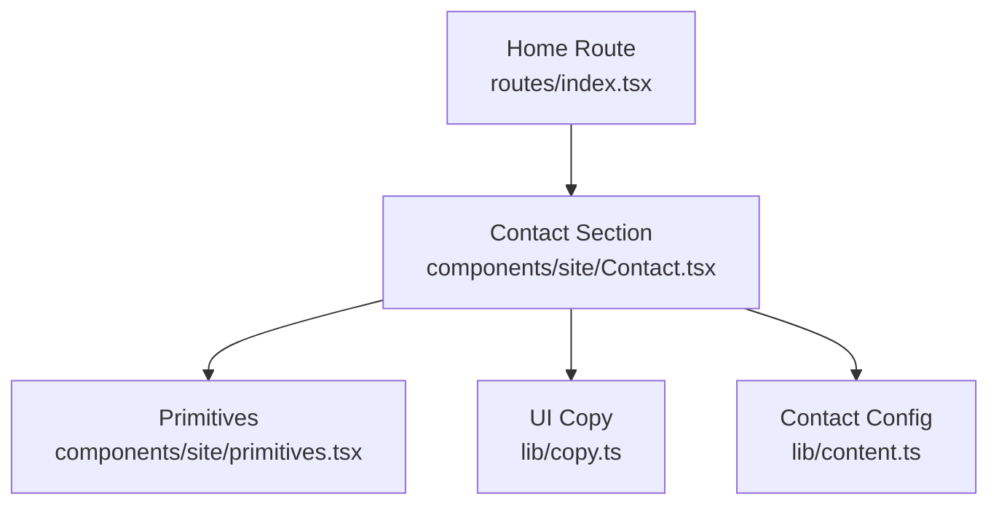
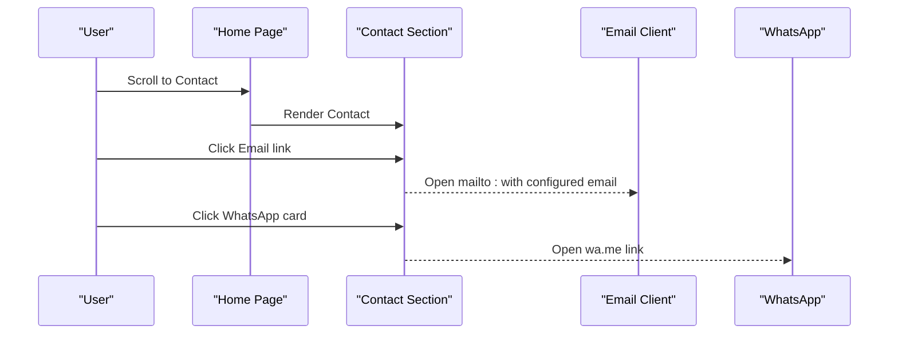
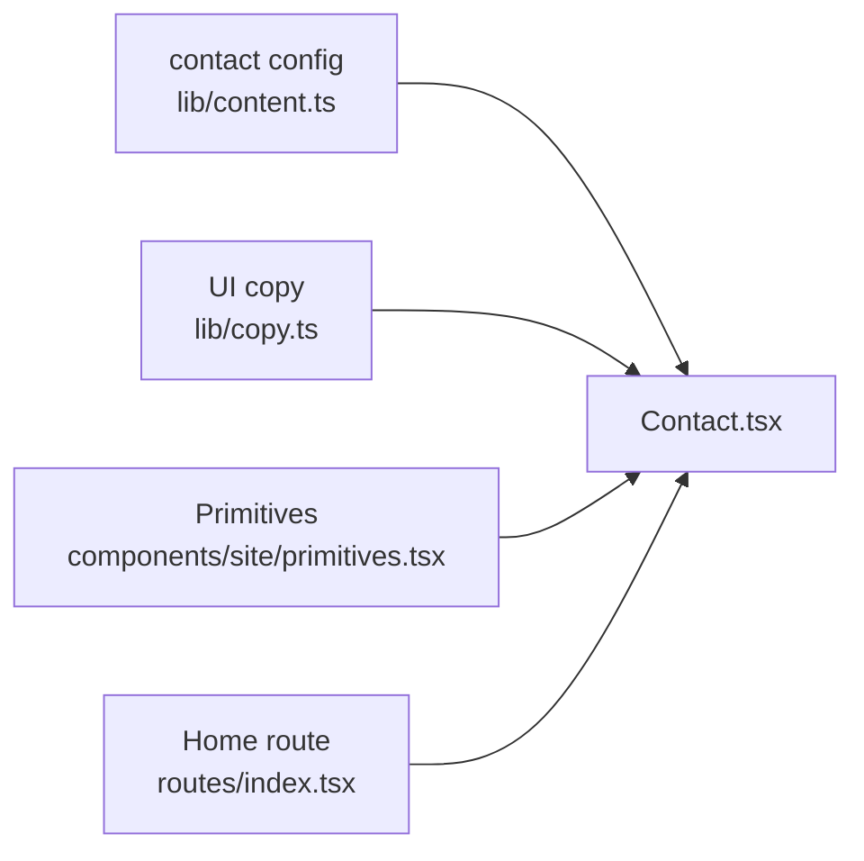

# Contact Component

<cite>
**Referenced Files in This Document**
- [Contact.tsx](file://src/components/site/Contact.tsx)
- [content.ts](file://src/lib/content.ts)
- [copy.ts](file://src/lib/copy.ts)
- [index.tsx](file://src/routes/index.tsx)
- [primitives.tsx](file://src/components/site/primitives.tsx)
- [form.tsx](file://src/components/ui/form.tsx)
- [$serviceId.tsx](file://src/routes/services/$serviceId.tsx)
</cite>

## Table of Contents

1. [Introduction](#introduction)
2. [Project Structure](#project-structure)
3. [Core Components](#core-components)
4. [Architecture Overview](#architecture-overview)
5. [Detailed Component Analysis](#detailed-component-analysis)
6. [Dependency Analysis](#dependency-analysis)
7. [Performance Considerations](#performance-considerations)
8. [Troubleshooting Guide](#troubleshooting-guide)
9. [Conclusion](#conclusion)
10. [Appendices](#appendices)

## Introduction

This document explains the Contact component’s role in customer engagement and lead generation for the site. It covers how contact methods are presented, WhatsApp integration, email links, and how to extend the section with a full contact form, validation, submission handling, automated responses, analytics, accessibility, mobile responsiveness, and security considerations. The current implementation focuses on direct contact channels (email and WhatsApp) and provides clear entry points to start conversations and request quotes or audits.

## Project Structure

The Contact section is rendered as part of the home page route and composes reusable UI primitives. Contact configuration is centralized so it can be updated without touching component code.

**Diagram sources**

- [index.tsx:35-55](file://src/routes/index.tsx#L35-L55)
- [Contact.tsx:16-159](file://src/components/site/Contact.tsx#L16-L159)
- [primitives.tsx:69-153](file://src/components/site/primitives.tsx#L69-L153)
- [copy.ts:292-328](file://src/lib/copy.ts#L292-L328)
- [content.ts:12-19](file://src/lib/content.ts#L12-L19)

**Section sources**

- [index.tsx:35-55](file://src/routes/index.tsx#L35-L55)
- [Contact.tsx:16-159](file://src/components/site/Contact.tsx#L16-L159)
- [content.ts:12-19](file://src/lib/content.ts#L12-L19)
- [copy.ts:292-328](file://src/lib/copy.ts#L292-L328)
- [primitives.tsx:69-153](file://src/components/site/primitives.tsx#L69-L153)

## Core Components

- Contact section: Presents contact methods, highlights response time, languages, cities, and includes email and WhatsApp CTAs.
- Configuration: Centralized contact details (email, WhatsApp link, phone, social links, cities).
- UI copy: Multilingual labels used throughout the Contact section.
- Primitives: Reusable building blocks like Parallax, Reveal, EmberButton, Logo.

Key responsibilities:

- Provide accessible, responsive contact CTAs.
- Keep contact details configurable via content.
- Maintain consistent visual language using primitives and copy.

**Section sources**

- [Contact.tsx:16-159](file://src/components/site/Contact.tsx#L16-L159)
- [content.ts:12-19](file://src/lib/content.ts#L12-L19)
- [copy.ts:292-328](file://src/lib/copy.ts#L292-L328)
- [primitives.tsx:69-153](file://src/components/site/primitives.tsx#L69-L153)

## Architecture Overview

The Contact section composes a visually engaging layout that guides users toward two primary actions:

- Email: Opens the user’s mail client with a pre-filled address.
- WhatsApp: Opens WhatsApp with a direct chat link.

It also offers quick access to an analysis flow and additional contact options.

**Diagram sources**

- [Contact.tsx:66-96](file://src/components/site/Contact.tsx#L66-L96)
- [content.ts:12-19](file://src/lib/content.ts#L12-L19)

**Section sources**

- [Contact.tsx:66-96](file://src/components/site/Contact.tsx#L66-L96)
- [content.ts:12-19](file://src/lib/content.ts#L12-L19)

## Detailed Component Analysis

### Contact Section Behavior

- Displays a headline, lead text, and chips highlighting response time, languages, and cities.
- Provides an email link that opens the default mail client.
- Offers a prominent WhatsApp card linking directly to WhatsApp with the configured number.
- Includes secondary CTAs to start an analysis flow or email again.
- Footer includes logo, branding text, and social links.

Accessibility and UX notes:

- Uses semantic links for navigation and external actions.
- Leverages primitives for reveal animations and parallax effects.
- Mobile-friendly grid layout adapts from single column to multi-column on larger screens.

Configuration:

- All contact details (email, WhatsApp URL, phone, social URLs, cities) are defined centrally and referenced by the component.

Extensibility:

- To add a full contact form, integrate the existing form primitives and validation utilities described below.

**Section sources**

- [Contact.tsx:16-159](file://src/components/site/Contact.tsx#L16-L159)
- [content.ts:12-19](file://src/lib/content.ts#L12-L19)
- [copy.ts:292-328](file://src/lib/copy.ts#L292-L328)
- [primitives.tsx:69-153](file://src/components/site/primitives.tsx#L69-L153)

### WhatsApp Integration

- Direct link to WhatsApp is provided via a configured URL.
- On service pages, WhatsApp links include pre-filled messages tailored to the selected plan or service, improving conversion context.

Implementation pattern:

- Construct a base WhatsApp URL from configuration.
- Append query parameters such as a pre-filled message when needed.

Example usage patterns:

- Contact section uses the base WhatsApp link for general inquiries.
- Service detail pages construct a message referencing the specific service and plan.

**Section sources**

- [Contact.tsx:81-96](file://src/components/site/Contact.tsx#L81-L96)
- [content.ts:12-19](file://src/lib/content.ts#L12-L19)
- [$serviceId.tsx:82-86](file://src/routes/services/$serviceId.tsx#L82-L86)
- [$serviceId.tsx:163-171](file://src/routes/services/$serviceId.tsx#L163-L171)
- [$serviceId.tsx:322-325](file://src/routes/services/$serviceId.tsx#L322-L325)

### Consultation Booking Flow

- The Contact section promotes a free consultation call and provides CTAs to start an AI-driven analysis or reach out via email/WhatsApp.
- While no calendar booking widget is embedded here, the design supports adding one by integrating a third-party scheduling tool and linking from the CTAs.

Recommended approach:

- Add a “Book a call” button that opens a scheduling modal or redirects to an external booking system.
- Use the same multilingual copy and primitives for consistency.

[No sources needed since this section proposes enhancements beyond current code]

### Form Validation Patterns (for future contact form)

The project includes a robust form primitive built on react-hook-form with Radix-based components. When implementing a full contact form, follow these patterns:

- Use FormProvider to manage state and validation.
- Wrap fields with FormField and use useFormField to bind IDs and ARIA attributes.
- Display errors with FormMessage and descriptions with FormDescription.
- Ensure labels are linked to inputs via htmlFor and ids generated by the form primitives.

Validation strategy:

- Define schema-based validation rules per field (e.g., required, email format, min/max length).
- Show inline error messages tied to each field.
- Prevent submission until all validations pass.

Accessibility:

- Inputs receive aria-invalid when there is an error.
- Descriptions and messages are programmatically associated with inputs for screen readers.

**Section sources**

- [form.tsx:16-171](file://src/components/ui/form.tsx#L16-L171)

### Submission Handling and External Messaging APIs

Current behavior:

- Email: Uses a mailto link to open the user’s email client.
- WhatsApp: Uses a wa.me link to open WhatsApp.

For server-side submissions or API integrations:

- Replace mailto with a secure backend endpoint that sends emails via a transactional provider.
- For WhatsApp Business API, use a server-to-server flow to send messages securely rather than relying solely on client-side links.
- Always sanitize and validate inputs before sending them to any external API.

Security considerations:

- Validate and sanitize all user inputs on both client and server.
- Rate-limit endpoints to prevent abuse.
- Use HTTPS and secure headers.
- Avoid exposing secrets in client code; handle sensitive operations server-side.

Analytics and tracking:

- Track CTA clicks (Email, WhatsApp, Book Call) with analytics events.
- Capture funnel metrics: impressions, clicks, conversions.
- Respect privacy settings and consent where applicable.

[No sources needed since this section provides guidance beyond current code]

### Accessibility Features

- Semantic links for actions improve keyboard navigation and screen reader support.
- The form primitives provide proper ARIA attributes and label associations when used.
- Animations respect reduced motion preferences via primitives.

Best practices:

- Ensure all interactive elements have visible focus states.
- Provide descriptive labels for icons and buttons.
- Test with keyboard-only navigation and screen readers.

**Section sources**

- [primitives.tsx:69-153](file://src/components/site/primitives.tsx#L69-L153)
- [form.tsx:103-118](file://src/components/ui/form.tsx#L103-L118)

### Mobile-Responsive Design

- The Contact section uses responsive grids and typography scaling to adapt across devices.
- CTAs are sized and spaced for touch interactions.
- Cards stack vertically on small screens and align side-by-side on larger screens.

**Section sources**

- [Contact.tsx:32-125](file://src/components/site/Contact.tsx#L32-L125)

### Security Considerations for Submissions

- Prefer server-side processing for sensitive data.
- Sanitize and validate inputs on both client and server.
- Use HTTPS and secure headers.
- Implement rate limiting and CAPTCHA if necessary.
- Log and monitor suspicious activity.

[No sources needed since this section provides general guidance]

## Dependency Analysis

The Contact section depends on:

- Centralized contact configuration for consistency.
- UI copy for multilingual labels.
- Primitives for animations, buttons, and layout helpers.
- Home route composition to render the section within the page.

**Diagram sources**

- [content.ts:12-19](file://src/lib/content.ts#L12-L19)
- [copy.ts:292-328](file://src/lib/copy.ts#L292-L328)
- [primitives.tsx:69-153](file://src/components/site/primitives.tsx#L69-L153)
- [index.tsx:35-55](file://src/routes/index.tsx#L35-L55)
- [Contact.tsx:16-159](file://src/components/site/Contact.tsx#L16-L159)

**Section sources**

- [content.ts:12-19](file://src/lib/content.ts#L12-L19)
- [copy.ts:292-328](file://src/lib/copy.ts#L292-L328)
- [primitives.tsx:69-153](file://src/components/site/primitives.tsx#L69-L153)
- [index.tsx:35-55](file://src/routes/index.tsx#L35-L55)
- [Contact.tsx:16-159](file://src/components/site/Contact.tsx#L16-L159)

## Performance Considerations

- Use lazy loading for heavy assets near the Contact section if needed.
- Keep animations lightweight; primitives already respect reduced motion.
- Minimize re-renders by memoizing derived values if extending the component.
- Prefer static links for WhatsApp and email to avoid unnecessary network calls.

[No sources needed since this section provides general guidance]

## Troubleshooting Guide

Common issues and resolutions:

- WhatsApp link not opening: Verify the configured WhatsApp URL and ensure the device has WhatsApp installed or a web fallback.
- Email link not working: Confirm the mailto link is correct and the user’s default mail client is set up.
- Form validation errors not showing: Ensure fields are wrapped with the form primitives and that error messages are bound to the correct IDs.
- Accessibility warnings: Check that labels are associated with inputs and that ARIA attributes are present where needed.

**Section sources**

- [form.tsx:103-118](file://src/components/ui/form.tsx#L103-L118)
- [form.tsx:138-160](file://src/components/ui/form.tsx#L138-L160)

## Conclusion

The Contact component provides a clean, accessible, and responsive way to initiate customer engagement through email and WhatsApp. It centralizes contact configuration and leverages reusable primitives for consistent UX. To enhance lead generation, consider adding a validated contact form, booking integration, analytics tracking, and server-side submission handling while maintaining strong security and accessibility standards.

[No sources needed since this section summarizes without analyzing specific files]

## Appendices

### How to Configure Contact Methods

- Update email, WhatsApp URL, phone, and social links in the centralized configuration file.
- Reference these values in the Contact section to keep content consistent across the site.

**Section sources**

- [content.ts:12-19](file://src/lib/content.ts#L12-L19)

### How to Customize Form Fields (when adding a form)

- Use the form primitives to create fields with labels, descriptions, and error messages.
- Bind validation rules per field and display messages using the form message component.
- Ensure accessibility by linking labels to inputs and providing appropriate ARIA attributes.

**Section sources**

- [form.tsx:16-171](file://src/components/ui/form.tsx#L16-L171)

### Automated Responses and Analytics

- Integrate a backend service to send automated confirmations after form submission.
- Track CTA clicks and form submissions with analytics events to measure conversion performance.
- Respect user privacy and consent requirements.

[No sources needed since this section provides general guidance]
