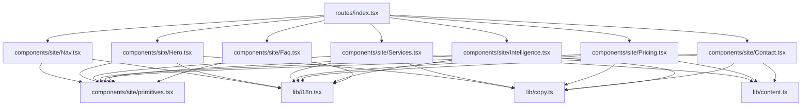
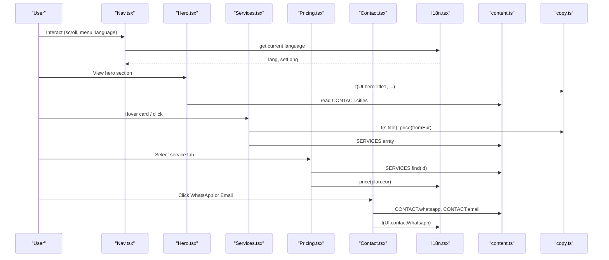
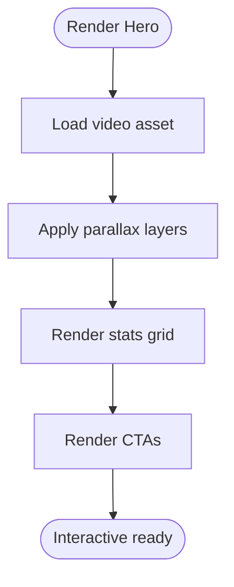
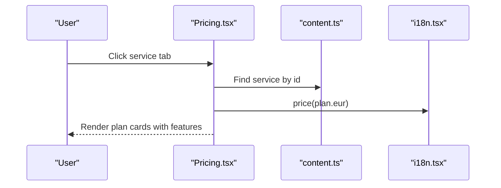
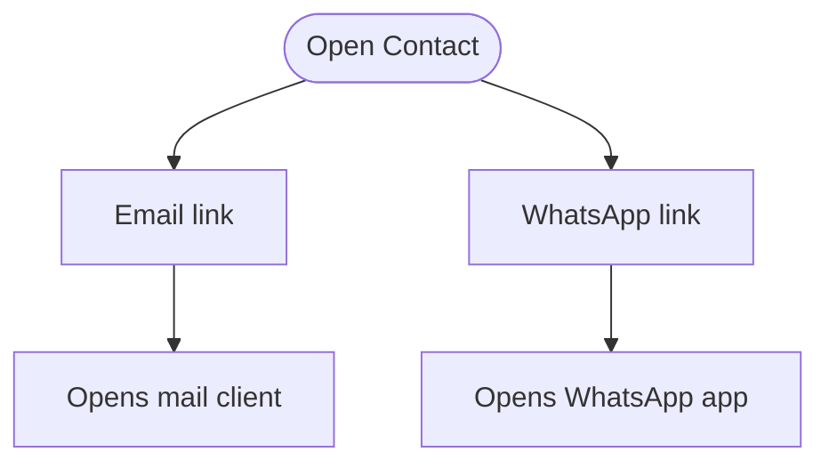
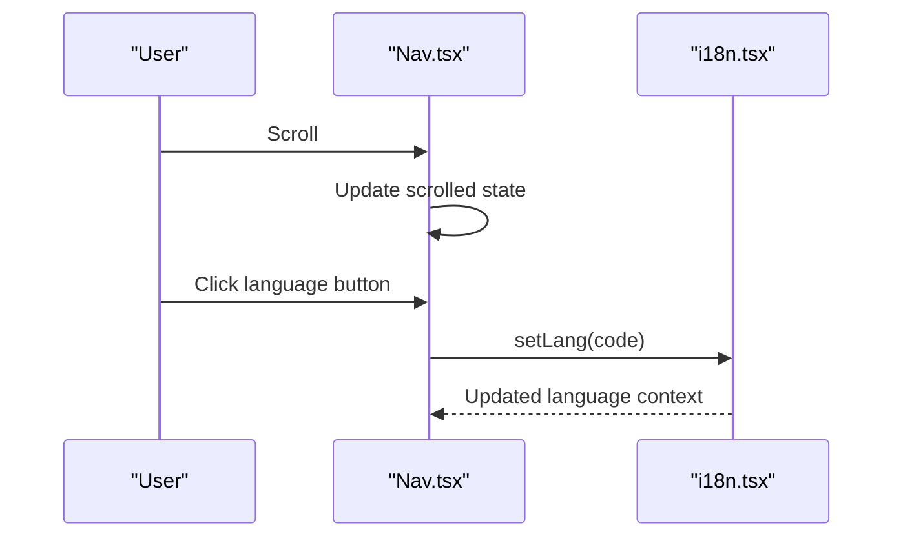
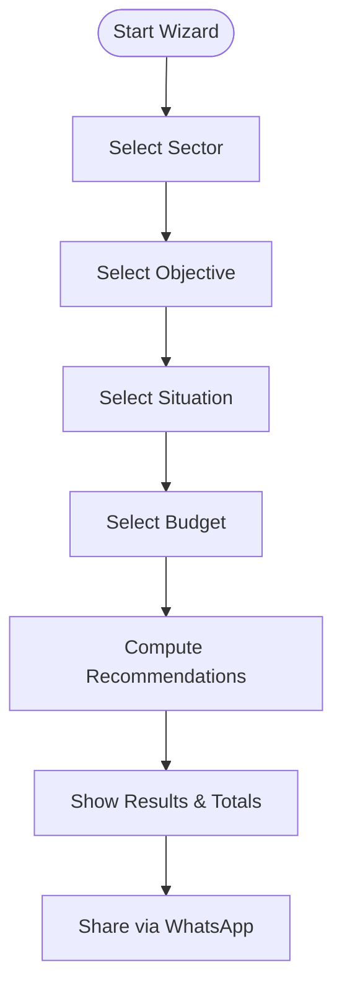
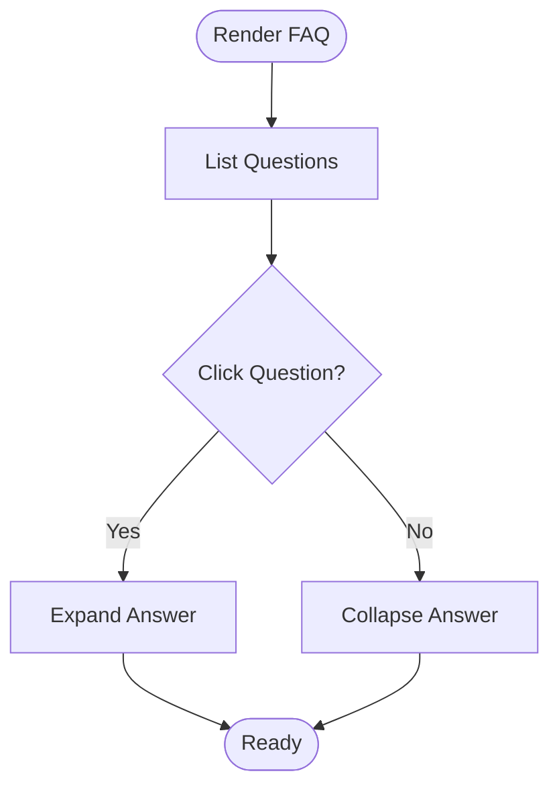
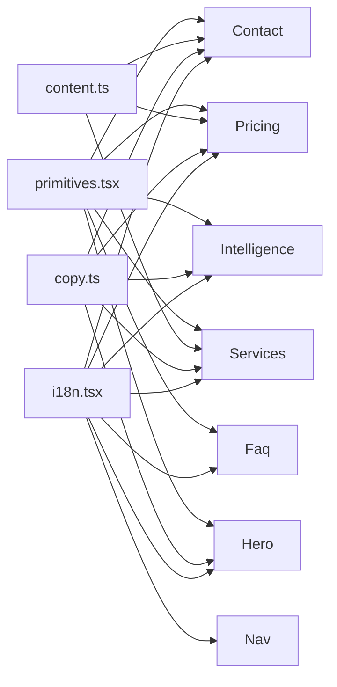

# Core Components

<cite>
**Referenced Files in This Document**
- [Hero.tsx](file://src/components/site/Hero.tsx)
- [Services.tsx](file://src/components/site/Services.tsx)
- [Pricing.tsx](file://src/components/site/Pricing.tsx)
- [Contact.tsx](file://src/components/site/Contact.tsx)
- [Nav.tsx](file://src/components/site/Nav.tsx)
- [Intelligence.tsx](file://src/components/site/Intelligence.tsx)
- [Faq.tsx](file://src/components/site/Faq.tsx)
- [primitives.tsx](file://src/components/site/primitives.tsx)
- [content.ts](file://src/lib/content.ts)
- [copy.ts](file://src/lib/copy.ts)
- [i18n.tsx](file://src/lib/i18n.tsx)
- [index.tsx](file://src/routes/index.tsx)
</cite>

## Table of Contents

1. Introduction
2. Project Structure
3. Core Components
4. Architecture Overview
5. Detailed Component Analysis
6. Dependency Analysis
7. Performance Considerations
8. Troubleshooting Guide
9. Conclusion

## Introduction

This document explains the core business-facing components of the Xragency website, focusing on how presentation is separated from business logic and content. It covers the Hero with video background, Services showcase with interactive cards, Pricing tables with plan comparison, Contact forms with WhatsApp integration, Navigation systems, and supporting utilities like i18n, shared primitives, and content management. For each component, you will find props, events, customization options, responsive behavior, accessibility notes, performance considerations, and usage guidance via file references.

## Project Structure

The site is composed of:

- Business-facing components under src/components/site (Hero, Services, Pricing, Contact, Nav, Intelligence, Faq).
- Shared UI primitives under src/components/site/primitives.tsx (Logo, Parallax, Reveal, SectionHeading, EmberButton).
- Content and copy under src/lib/content.ts and src/lib/copy.ts.
- Internationalization and pricing under src/lib/i18n.tsx.
- Route assembly under src/routes/index.tsx that composes the page sections.



**Diagram sources**

- [index.tsx:1-59](file://src/routes/index.tsx#L1-L59)
- [Nav.tsx:1-130](file://src/components/site/Nav.tsx#L1-L130)
- [Hero.tsx:1-121](file://src/components/site/Hero.tsx#L1-L121)
- [Services.tsx:1-120](file://src/components/site/Services.tsx#L1-L120)
- [Pricing.tsx:1-100](file://src/components/site/Pricing.tsx#L1-L100)
- [Contact.tsx:1-161](file://src/components/site/Contact.tsx#L1-L161)
- [Intelligence.tsx:1-637](file://src/components/site/Intelligence.tsx#L1-L637)
- [Faq.tsx:1-58](file://src/components/site/Faq.tsx#L1-L58)
- [primitives.tsx:1-242](file://src/components/site/primitives.tsx#L1-L242)
- [content.ts:12-80](file://src/lib/content.ts#L12-L80)
- [copy.ts:1-418](file://src/lib/copy.ts#L1-L418)
- [i18n.tsx:1-89](file://src/lib/i18n.tsx#L1-L89)

**Section sources**

- [index.tsx:1-59](file://src/routes/index.tsx#L1-L59)

## Core Components

- Hero: Video background with parallax, animated hero text, stats grid, and CTAs.
- Services: Interactive image cards with hover reveals, pricing hints, and navigation to service detail pages.
- Pricing: Tabbed service selector with plan cards, feature lists, and CTAs.
- Contact: Email link, WhatsApp CTA, social links, and call-to-action buttons.
- Navigation: Fixed header with scroll-aware styling, language switcher, desktop and mobile menus.
- Intelligence: Multi-step configurator that recommends services and plans based on user inputs and integrates WhatsApp sharing.
- FAQ: Accordion-style questions with reveal animations.

All components use shared primitives for consistent motion, typography, and interaction patterns, and they consume centralized content and i18n for localization and pricing.

**Section sources**

- [Hero.tsx:1-121](file://src/components/site/Hero.tsx#L1-L121)
- [Services.tsx:1-120](file://src/components/site/Services.tsx#L1-L120)
- [Pricing.tsx:1-100](file://src/components/site/Pricing.tsx#L1-L100)
- [Contact.tsx:1-161](file://src/components/site/Contact.tsx#L1-L161)
- [Nav.tsx:1-130](file://src/components/site/Nav.tsx#L1-L130)
- [Intelligence.tsx:1-637](file://src/components/site/Intelligence.tsx#L1-L637)
- [Faq.tsx:1-58](file://src/components/site/Faq.tsx#L1-L58)

## Architecture Overview

The architecture separates concerns clearly:

- Presentation layer: Site components render UI using Tailwind CSS classes and shared primitives.
- Business logic layer: Components manage local state (e.g., active tab, step progress), compute derived values (e.g., totals), and handle interactions (e.g., opening WhatsApp).
- Data layer: Centralized content (SERVICES, CONTACT, FAQ) and copy (UI strings) provide content without hardcoding in components.
- Internationalization layer: Language context provides t() and price() helpers used across components.



**Diagram sources**

- [Nav.tsx:1-130](file://src/components/site/Nav.tsx#L1-L130)
- [Hero.tsx:1-121](file://src/components/site/Hero.tsx#L1-L121)
- [Services.tsx:1-120](file://src/components/site/Services.tsx#L1-L120)
- [Pricing.tsx:1-100](file://src/components/site/Pricing.tsx#L1-L100)
- [Contact.tsx:1-161](file://src/components/site/Contact.tsx#L1-L161)
- [i18n.tsx:1-89](file://src/lib/i18n.tsx#L1-L89)
- [content.ts:12-80](file://src/lib/content.ts#L12-L80)
- [copy.ts:1-418](file://src/lib/copy.ts#L1-L418)

## Detailed Component Analysis

### Hero Component

- Purpose: Introduce the brand with a video background, headline, lead text, stats, and CTAs.
- Props: None (component is self-contained).
- Events: None exposed; internal animations are driven by CSS keyframes and React stateless rendering.
- Customization:
  - Video source is imported from assets; adjust media in asset imports if needed.
  - Stats data is defined locally; extend STATS to add metrics.
  - CTAs navigate to sections via href anchors.
- Responsive design: Uses clamp-based typography and responsive spacing; adapts layout on small screens.
- Accessibility:
  - aria-hidden used for decorative overlays.
  - Semantic headings and paragraphs structure content.
- Performance:
  - Video uses preload="auto", muted, loop, playsInline for autoplay compatibility.
  - Parallax effect respects reduced motion preference.
- Composition: Uses primitives Parallax, EmberButton, and content from copy and content modules.



**Diagram sources**

- [Hero.tsx:1-121](file://src/components/site/Hero.tsx#L1-L121)
- [primitives.tsx:69-111](file://src/components/site/primitives.tsx#L69-L111)

**Section sources**

- [Hero.tsx:1-121](file://src/components/site/Hero.tsx#L1-L121)
- [primitives.tsx:69-111](file://src/components/site/primitives.tsx#L69-L111)

### Services Component

- Purpose: Showcase services with interactive cards linking to detailed pages.
- Props: None (reads from centralized content).
- Events:
  - Card hover triggers scale and grayscale transitions.
  - Link navigates to "/services/$serviceId" with params.
- Customization:
  - VISUAL map controls images and grid spans per service.
  - Highlights slice limits displayed items per card.
- Responsive design: Grid auto-rows and col-span classes adapt to screen sizes.
- Accessibility:
  - Images have alt texts from localized titles.
  - Links include descriptive labels via localized text.
- Performance:
  - Images use lazy loading.
  - Parallax applied to background images.
- Composition: Uses primitives Reveal, Parallax, SectionHeading; reads SERVICES and UI from content and copy.

```mermaid
classDiagram
class Services {
+render() JSX
-VISUAL : Record<string, {img : string; span : string}>
-SERVICES : Service[]
}
class ServiceCard {
+hover effects
+link to service detail
+price display
}
Services --> ServiceCard : "maps over SERVICES"
```

**Diagram sources**

- [Services.tsx:1-120](file://src/components/site/Services.tsx#L1-L120)
- [content.ts:77-346](file://src/lib/content.ts#L77-L346)

**Section sources**

- [Services.tsx:1-120](file://src/components/site/Services.tsx#L1-L120)
- [content.ts:77-346](file://src/lib/content.ts#L77-L346)

### Pricing Component

- Purpose: Present transparent pricing per service with plan comparisons and CTAs.
- Props: None (state-driven selection).
- Events:
  - Tab buttons switch active service.
  - Plan cards animate on mount with staggered delays.
- Customization:
  - Active service determined by state; can be extended to persist selection.
  - Popular plan badge controlled by plan.popular flag.
- Responsive design: Grid columns increase on larger screens; cards stack on small screens.
- Accessibility:
  - Buttons are keyboard accessible.
  - Plans include semantic headings and lists.
- Performance:
  - Minimal re-renders due to simple state.
  - Animations use CSS transforms and opacity.
- Composition: Uses primitives Reveal, Parallax, SectionHeading, EmberButton; reads SERVICES and UI.



**Diagram sources**

- [Pricing.tsx:1-100](file://src/components/site/Pricing.tsx#L1-L100)
- [content.ts:77-346](file://src/lib/content.ts#L77-L346)
- [i18n.tsx:30-40](file://src/lib/i18n.tsx#L30-L40)

**Section sources**

- [Pricing.tsx:1-100](file://src/components/site/Pricing.tsx#L1-L100)

### Contact Component

- Purpose: Provide contact channels including email and WhatsApp, plus social links and CTAs.
- Props: None (reads from centralized content).
- Events:
  - Email link opens mail client.
  - WhatsApp link opens chat with pre-filled message context.
- Customization:
  - CONTACT object centralizes all contact details; update there to change channels.
  - Chips show response time, languages, and cities.
- Responsive design: Two-column layout on medium+ screens; stacks on smaller screens.
- Accessibility:
  - External links use target="_blank" and rel="noreferrer".
  - Icons paired with visible text for clarity.
- Performance: Lightweight links and minimal DOM updates.
- Composition: Uses primitives Logo, Parallax, Reveal, EmberButton; reads CONTACT and UI.



**Diagram sources**

- [Contact.tsx:1-161](file://src/components/site/Contact.tsx#L1-L161)
- [content.ts:12-19](file://src/lib/content.ts#L12-L19)

**Section sources**

- [Contact.tsx:1-161](file://src/components/site/Contact.tsx#L1-L161)

### Navigation Component

- Purpose: Fixed header with logo, navigation links, language switcher, and mobile menu.
- Props: None (self-contained).
- Events:
  - Scroll listener toggles sticky style and blur backdrop.
  - Mobile menu toggle opens/closes overlay.
  - Language buttons update global language context.
- Customization:
  - LINKS array defines navigation entries; extend or reorder as needed.
  - Styling adapts on scroll via className composition.
- Responsive design: Desktop links visible on large screens; mobile menu appears on small screens.
- Accessibility:
  - Menu button has aria-label.
  - Links are semantic anchor elements.
- Performance: Passive scroll listener; minimal state changes.
- Composition: Uses primitives Logo, EmberButton; reads UI and i18n.



**Diagram sources**

- [Nav.tsx:1-130](file://src/components/site/Nav.tsx#L1-L130)
- [i18n.tsx:51-82](file://src/lib/i18n.tsx#L51-L82)

**Section sources**

- [Nav.tsx:1-130](file://src/components/site/Nav.tsx#L1-L130)

### Intelligence Component

- Purpose: Multi-step configurator that recommends services and plans based on user inputs and allows WhatsApp sharing.
- Props: None (state-driven wizard).
- Events:
  - Step navigation advances or goes back.
  - Option buttons select answers and move to next step.
  - Final result includes totals and WhatsApp share link.
- Customization:
  - SECTORS, OBJECTIVES, SITUATIONS, BUDGETS arrays define options.
  - buildReco function determines recommendations based on inputs.
- Responsive design: Grid layouts adapt to screen size; progress bar scales.
- Accessibility:
  - Buttons have aria-labels for steps.
  - Progress indicators are visually clear.
- Performance:
  - useMemo recomputes recommendations only when dependencies change.
  - Local state keeps interactions fast.
- Composition: Uses primitives Reveal, EmberButton; reads SERVICES, CONTACT, and UI.



**Diagram sources**

- [Intelligence.tsx:1-637](file://src/components/site/Intelligence.tsx#L1-L637)
- [content.ts:77-346](file://src/lib/content.ts#L77-L346)

**Section sources**

- [Intelligence.tsx:1-637](file://src/components/site/Intelligence.tsx#L1-L637)

### FAQ Component

- Purpose: Accordion-style frequently asked questions with reveal animations.
- Props: None (reads from centralized content).
- Events:
  - Toggle open/close per question.
  - Plus icon rotates when expanded.
- Customization:
  - FAQ array defines questions and answers; extend or reorder.
- Responsive design: Single column with padding adjustments.
- Accessibility:
  - Buttons are keyboard accessible.
  - Answers expand/collapse with smooth transitions.
- Performance: Minimal state; CSS transitions for animation.
- Composition: Uses primitives Parallax, Reveal, SectionHeading; reads UI and FAQ.



**Diagram sources**

- [Faq.tsx:1-58](file://src/components/site/Faq.tsx#L1-L58)

**Section sources**

- [Faq.tsx:1-58](file://src/components/site/Faq.tsx#L1-L58)

## Dependency Analysis

Components depend on:

- Shared primitives for consistent motion and UI patterns.
- Centralized content for services, contact info, and FAQs.
- Copy module for localized UI strings.
- i18n context for language switching and price formatting.



**Diagram sources**

- [primitives.tsx:1-242](file://src/components/site/primitives.tsx#L1-L242)
- [content.ts:12-80](file://src/lib/content.ts#L12-L80)
- [copy.ts:1-418](file://src/lib/copy.ts#L1-L418)
- [i18n.tsx:1-89](file://src/lib/i18n.tsx#L1-L89)
- [Hero.tsx:1-121](file://src/components/site/Hero.tsx#L1-L121)
- [Services.tsx:1-120](file://src/components/site/Services.tsx#L1-L120)
- [Pricing.tsx:1-100](file://src/components/site/Pricing.tsx#L1-L100)
- [Contact.tsx:1-161](file://src/components/site/Contact.tsx#L1-L161)
- [Intelligence.tsx:1-637](file://src/components/site/Intelligence.tsx#L1-L637)
- [Faq.tsx:1-58](file://src/components/site/Faq.tsx#L1-L58)
- [Nav.tsx:1-130](file://src/components/site/Nav.tsx#L1-L130)

**Section sources**

- [primitives.tsx:1-242](file://src/components/site/primitives.tsx#L1-L242)
- [content.ts:12-80](file://src/lib/content.ts#L12-L80)
- [copy.ts:1-418](file://src/lib/copy.ts#L1-L418)
- [i18n.tsx:1-89](file://src/lib/i18n.tsx#L1-L89)

## Performance Considerations

- Video background: Autoplay requires muted and inline playback; consider reducing resolution or using optimized formats for slower networks.
- Parallax: Respects reduced motion preferences; uses requestAnimationFrame for efficient updates.
- Image loading: Lazy loading on service cards reduces initial payload.
- State updates: Components minimize re-renders by keeping state local and scoped.
- Animations: CSS transforms and opacity ensure GPU-accelerated animations.
- i18n: Price formatting is memoized within context; avoid unnecessary recalculations.

[No sources needed since this section provides general guidance]

## Troubleshooting Guide

- Video not autoplaying: Ensure muted and playsInline attributes are present; check browser policies for autoplay.
- Parallax not working: Verify element has correct dimensions and window listeners are attached; confirm reduced motion settings do not disable animations.
- Language not switching: Confirm LanguageProvider wraps the app and setLang updates localStorage and document language attribute.
- WhatsApp link not opening: Validate CONTACT.whatsapp URL format and ensure device supports wa.me links.
- Pricing currency incorrect: Check RATES configuration and ensure price() is called with EUR values.

**Section sources**

- [Hero.tsx:21-30](file://src/components/site/Hero.tsx#L21-L30)
- [primitives.tsx:81-104](file://src/components/site/primitives.tsx#L81-L104)
- [i18n.tsx:51-82](file://src/lib/i18n.tsx#L51-L82)
- [Contact.tsx:81-96](file://src/components/site/Contact.tsx#L81-L96)
- [i18n.tsx:30-40](file://src/lib/i18n.tsx#L30-L40)

## Conclusion

The Xragency site’s core components demonstrate a clean separation between presentation and business logic, leveraging shared primitives, centralized content, and robust internationalization. Each component is designed for responsiveness, accessibility, and performance, with clear extension points for customization. The architecture supports scalable growth through modular composition and reusable utilities.

[No sources needed since this section summarizes without analyzing specific files]
