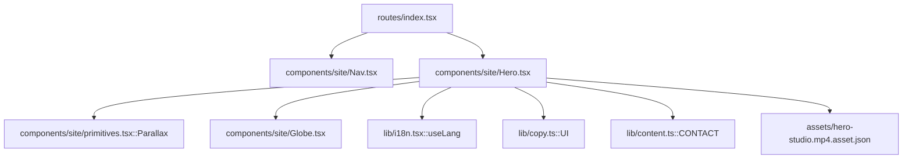
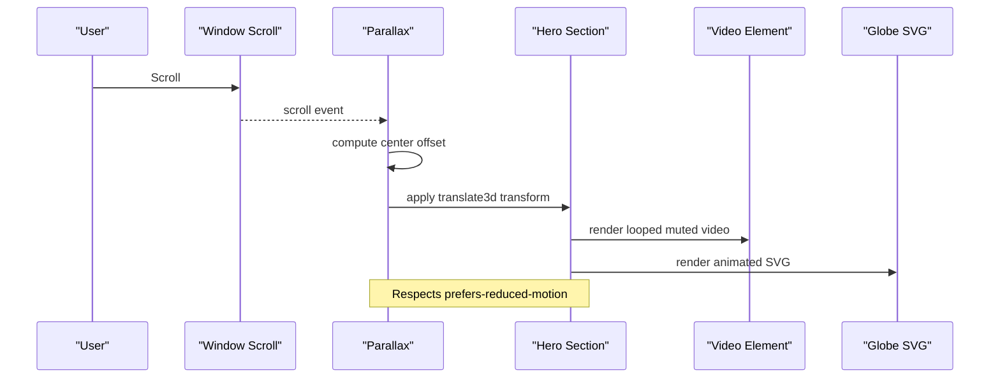
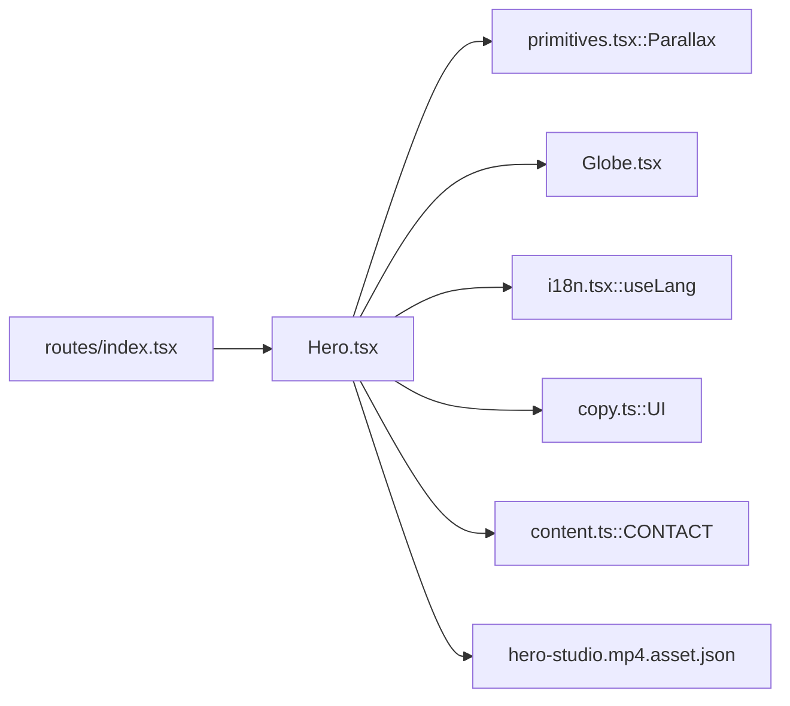

# Hero Component

<cite>
**Referenced Files in This Document**
- [Hero.tsx](file://src/components/site/Hero.tsx)
- [Globe.tsx](file://src/components/site/Globe.tsx)
- [primitives.tsx](file://src/components/site/primitives.tsx)
- [i18n.tsx](file://src/lib/i18n.tsx)
- [copy.ts](file://src/lib/copy.ts)
- [content.ts](file://src/lib/content.ts)
- [index.tsx](file://src/routes/index.tsx)
- [styles.css](file://src/styles.css)
- [hero-studio.mp4.asset.json](file://src/assets/hero-studio.mp4.asset.json)
</cite>

## Table of Contents

1. [Introduction](#introduction)
2. [Project Structure](#project-structure)
3. [Core Components](#core-components)
4. [Architecture Overview](#architecture-overview)
5. [Detailed Component Analysis](#detailed-component-analysis)
6. [Dependency Analysis](#dependency-analysis)
7. [Performance Considerations](#performance-considerations)
8. [Troubleshooting Guide](#troubleshooting-guide)
9. [Conclusion](#conclusion)
10. [Appendices](#appendices)

## Introduction

This document provides detailed documentation for the Hero component, which renders the main landing section of the Xragency website. It explains the architecture and implementation details including:

- Video background with parallax scrolling
- Animated globe integration
- Responsive layout patterns using Tailwind CSS
- Internationalization (i18n) integration for multilingual support
- Accessibility considerations
- Performance optimizations for video loading
- Customization guidance for content, parallax speeds, and overlay effects

## Project Structure

The Hero component is part of a modular site structure where reusable primitives, i18n utilities, and assets are shared across components. The root route composes the page sections, including Hero at the top.

**Diagram sources**

- [index.tsx:35-55](file://src/routes/index.tsx#L35-L55)
- [Hero.tsx:1-121](file://src/components/site/Hero.tsx#L1-L121)
- [primitives.tsx:69-111](file://src/components/site/primitives.tsx#L69-L111)
- [Globe.tsx:12-132](file://src/components/site/Globe.tsx#L12-L132)
- [i18n.tsx:51-88](file://src/lib/i18n.tsx#L51-L88)
- [copy.ts:12-50](file://src/lib/copy.ts#L12-L50)
- [content.ts:12-19](file://src/lib/content.ts#L12-L19)
- [hero-studio.mp4.asset.json:1-10](file://src/assets/hero-studio.mp4.asset.json#L1-L10)

**Section sources**

- [index.tsx:35-55](file://src/routes/index.tsx#L35-L55)
- [Hero.tsx:1-121](file://src/components/site/Hero.tsx#L1-L121)

## Core Components

- Hero: Renders the hero section with layered parallax elements, video background, animated globe, headline, lead text, CTAs, stats grid, and footer-like metadata.
- Parallax: Lightweight scroll-based parallax that translates children based on viewport position; respects reduced motion preferences.
- Globe: SVG-based animated globe with star field, meridians, parallels, connection arcs, and pulsing nodes.
- i18n: Language context provider and translation hook to render localized strings.
- UI copy: Centralized multilingual strings used by Hero.
- Content: Shared constants like CONTACT.cities used in the hero header.
- Styles: Tailwind theme and custom animations (ember-rise, slow-spin, pulse-soft) applied via utility classes.

**Section sources**

- [Hero.tsx:15-118](file://src/components/site/Hero.tsx#L15-L118)
- [primitives.tsx:69-111](file://src/components/site/primitives.tsx#L69-L111)
- [Globe.tsx:12-132](file://src/components/site/Globe.tsx#L12-L132)
- [i18n.tsx:51-88](file://src/lib/i18n.tsx#L51-L88)
- [copy.ts:12-50](file://src/lib/copy.ts#L12-L50)
- [content.ts:12-19](file://src/lib/content.ts#L12-L19)
- [styles.css:214-267](file://src/styles.css#L214-L267)

## Architecture Overview

The Hero layering strategy uses multiple Parallax containers to create depth:

- Background video with subtle grayscale and contrast adjustments
- A translucent radial gradient overlay for visual polish
- An animated Globe with low opacity for atmospheric effect
- Foreground content wrapped in its own Parallax for cohesive movement

**Diagram sources**

- [primitives.tsx:81-104](file://src/components/site/primitives.tsx#L81-L104)
- [Hero.tsx:19-33](file://src/components/site/Hero.tsx#L19-L33)
- [Globe.tsx:43-128](file://src/components/site/Globe.tsx#L43-L128)

## Detailed Component Analysis

### Hero Component

Responsibilities:

- Compose layered parallax backgrounds (video, globe, overlays)
- Render localized headline, lead, and metadata using i18n
- Provide call-to-action buttons and a stats grid
- Apply responsive layouts and animations

Key behaviors:

- Video background: autoplay, muted, loop, playsInline, preload="auto", styled with object-cover and color filters
- Parallax layers: different speeds for background, globe, and foreground content
- Overlay: radial gradient and linear gradient for depth and readability
- Stats grid: responsive grid with hover states and staggered entrance animations
- Footer metadata: page number, services list, and domain

Customization points:

- Adjust parallax speeds per layer
- Modify video styling (opacity, grayscale, contrast)
- Update overlay gradients or colors
- Change CTA links and labels via UI copy keys
- Edit stats values and labels via UI copy keys

Internationalization:

- Uses useLang().t() to resolve strings from UI copy for all visible text
- Supports FR, EN, VI locales

Accessibility:

- aria-hidden on decorative overlays and globe SVG to avoid screen reader noise
- Semantic headings and paragraphs for content hierarchy
- Keyboard navigable CTAs

Mobile responsiveness:

- Flexbox and grid layouts adapt to smaller screens
- Hidden elements on small screens (e.g., status indicator text)
- Fluid typography using clamp for headline sizing

Performance:

- Video preload="auto" for immediate playback
- Muted autoplay and playsInline for broad compatibility
- Reduced motion respected via Parallax

**Section sources**

- [Hero.tsx:15-118](file://src/components/site/Hero.tsx#L15-L118)
- [copy.ts:12-50](file://src/lib/copy.ts#L12-L50)
- [content.ts:12-19](file://src/lib/content.ts#L12-L19)
- [styles.css:214-267](file://src/styles.css#L214-L267)

#### Hero Props and Configuration

- No explicit props; configuration is achieved through:
  - Parallax speed values per layer
  - Tailwind classes for layout and styling
  - i18n keys for content
  - Video attributes for behavior and performance

**Section sources**

- [Hero.tsx:19-33](file://src/components/site/Hero.tsx#L19-L33)
- [Hero.tsx:43-117](file://src/components/site/Hero.tsx#L43-L117)

### Parallax Primitive

Behavior:

- Listens to scroll and resize events
- Computes element center relative to viewport
- Applies GPU-accelerated translate3d transform
- Debounces updates via requestAnimationFrame
- Honors prefers-reduced-motion

Usage in Hero:

- Background video layer with positive speed
- Globe layer with moderate speed
- Foreground content with slight negative speed for depth

Customization:

- Adjust speed prop per layer to control parallax intensity
- Wrap any content to enable parallax behavior

**Section sources**

- [primitives.tsx:69-111](file://src/components/site/primitives.tsx#L69-L111)

### Globe Component

Features:

- Star field generated deterministically with randomized positions and sizes
- Blurred radial gradient backdrop for glow
- SVG globe with meridians and parallels
- Connection arcs with dashed strokes and soft pulse animation
- Pulsing node markers with staggered delays

Animation:

- Slow rotation via animate-slow-spin
- Soft pulsing via animate-pulse-soft
- Staggered animation delays for organic feel

Accessibility:

- aria-hidden on the SVG to mark as decorative

Styling:

- Uses CSS variables for gradients and colors
- Fully responsive via vmin units

**Section sources**

- [Globe.tsx:12-132](file://src/components/site/Globe.tsx#L12-L132)
- [styles.css:225-267](file://src/styles.css#L225-L267)

### Internationalization Integration

- LanguageProvider sets default language from localStorage or browser locale
- useLang returns t(key) to resolve localized strings
- Hero uses t(UI.*) to render all user-facing text
- Supports FR, EN, VI locales

Localization keys used in Hero:

- Kicker, title parts, lead, meta, CTAs, stats labels, duration label, online status

**Section sources**

- [i18n.tsx:51-88](file://src/lib/i18n.tsx#L51-L88)
- [copy.ts:12-50](file://src/lib/copy.ts#L12-L50)
- [Hero.tsx:47-105](file://src/components/site/Hero.tsx#L47-L105)

### Styling Approach (Tailwind CSS)

- Layout: flexbox, grid, spacing utilities
- Typography: display-serif and label-mono custom utilities
- Colors: semantic tokens mapped to CSS variables
- Animations: ember-rise, slow-spin, pulse-soft
- Overlays: radial and linear gradients for depth
- Grain texture: pseudo-element with inline SVG noise

**Section sources**

- [styles.css:21-69](file://src/styles.css#L21-L69)
- [styles.css:172-205](file://src/styles.css#L172-L205)
- [styles.css:214-267](file://src/styles.css#L214-L267)

## Dependency Analysis

**Diagram sources**

- [Hero.tsx:1-6](file://src/components/site/Hero.tsx#L1-L6)
- [index.tsx:35-45](file://src/routes/index.tsx#L35-L45)

**Section sources**

- [Hero.tsx:1-6](file://src/components/site/Hero.tsx#L1-L6)
- [index.tsx:35-45](file://src/routes/index.tsx#L35-L45)

## Performance Considerations

- Video loading:
  - preload="auto" ensures early resource acquisition
  - muted autoplay and playsInline improve compatibility and reduce data usage
  - Grayscale and contrast filters add minimal overhead
- Parallax:
  - Uses requestAnimationFrame to batch updates
  - Respects prefers-reduced-motion to avoid unnecessary work
- Globe:
  - Pure SVG and CSS animations; no heavy libraries
  - Deterministic star generation avoids runtime cost beyond initial render
- Accessibility:
  - aria-hidden on decorative elements reduces screen reader load
- Mobile:
  - Fluid typography and responsive grids optimize rendering on small screens

[No sources needed since this section provides general guidance]

## Troubleshooting Guide

Common issues and resolutions:

- Video not playing:
  - Ensure muted and playsInline are set for autoplay policies
  - Verify asset URL resolves correctly
- Parallax not working:
  - Check that window matchMedia prefers-reduced-motion is not blocking
  - Confirm scroll events fire and ref is attached
- Globe not visible:
  - Verify CSS variables for gradients are defined
  - Ensure container has sufficient size (vmin units rely on viewport)
- i18n keys missing:
  - Confirm UI keys exist in copy.ts and are passed to t()
  - Validate current language selection in LanguageProvider
- Accessibility warnings:
  - Remove aria-hidden from interactive elements
  - Ensure headings and landmarks are semantically correct

**Section sources**

- [primitives.tsx:81-104](file://src/components/site/primitives.tsx#L81-L104)
- [Hero.tsx:21-33](file://src/components/site/Hero.tsx#L21-L33)
- [Globe.tsx:43-128](file://src/components/site/Globe.tsx#L43-L128)
- [i18n.tsx:51-88](file://src/lib/i18n.tsx#L51-L88)

## Conclusion

The Hero component delivers a visually rich, accessible, and performant landing section through layered parallax, a lightweight animated globe, and robust internationalization. Its design leverages Tailwind CSS utilities and custom animations while maintaining clear separation of concerns via primitives and shared resources. Customization is straightforward through props, classes, and i18n keys, enabling flexible branding and content updates without compromising performance or accessibility.

[No sources needed since this section summarizes without analyzing specific files]

## Appendices

### How to Customize Hero Content

- Update headlines, lead, and metadata by editing UI copy keys referenced in Hero
- Change CTA destinations by modifying hrefs on EmberButton components
- Adjust stats values and labels via UI copy keys

**Section sources**

- [Hero.tsx:58-105](file://src/components/site/Hero.tsx#L58-L105)
- [copy.ts:12-50](file://src/lib/copy.ts#L12-L50)

### How to Adjust Parallax Speeds

- Modify speed prop on each Parallax wrapper to increase or decrease movement intensity
- Use positive values for background layers and negative values for foreground to enhance depth

**Section sources**

- [Hero.tsx:20-33](file://src/components/site/Hero.tsx#L20-L33)
- [Hero.tsx:43-46](file://src/components/site/Hero.tsx#L43-L46)
- [primitives.tsx:69-111](file://src/components/site/primitives.tsx#L69-L111)

### How to Modify Video Overlay Effects

- Adjust video class styles (opacity, grayscale, contrast) to change visual emphasis
- Tweak overlay gradients to improve contrast and readability
- Add or remove grain texture via the grain utility

**Section sources**

- [Hero.tsx:21-41](file://src/components/site/Hero.tsx#L21-L41)
- [styles.css:192-205](file://src/styles.css#L192-L205)

### Browser Compatibility Notes

- Autoplay requires muted and playsInline for most browsers
- Reduced motion preference is respected to ensure comfortable experiences
- SVG animations and CSS variables are widely supported

**Section sources**

- [Hero.tsx:21-28](file://src/components/site/Hero.tsx#L21-L28)
- [primitives.tsx:81-85](file://src/components/site/primitives.tsx#L81-L85)
