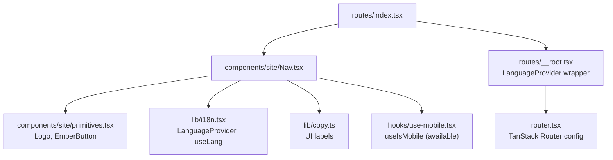
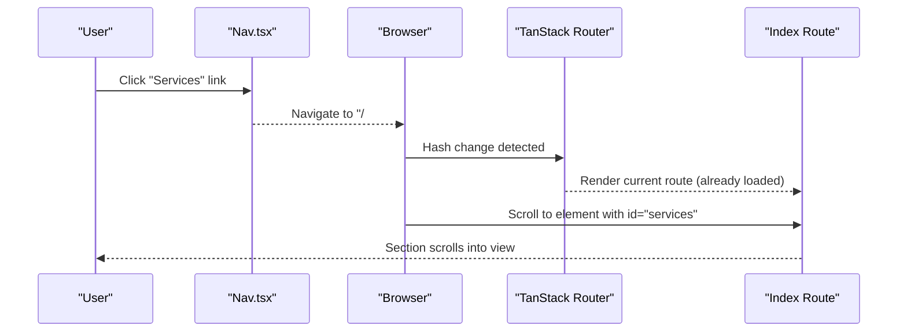
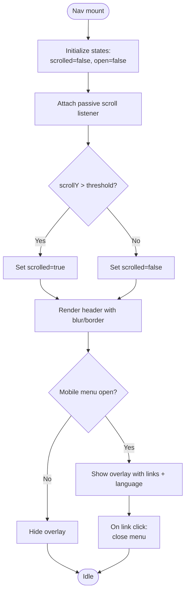
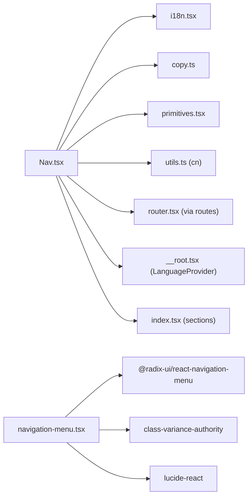

# Navigation Component

<cite>
**Referenced Files in This Document**
- [Nav.tsx](file://src/components/site/Nav.tsx)
- [navigation-menu.tsx](file://src/components/ui/navigation-menu.tsx)
- [index.tsx](file://src/routes/index.tsx)
- [__root.tsx](file://src/routes/__root.tsx)
- [router.tsx](file://src/router.tsx)
- [use-mobile.tsx](file://src/hooks/use-mobile.tsx)
- [i18n.tsx](file://src/lib/i18n.tsx)
- [copy.ts](file://src/lib/copy.ts)
- [primitives.tsx](file://src/components/site/primitives.tsx)
</cite>

## Table of Contents

1. [Introduction](#introduction)
2. [Project Structure](#project-structure)
3. [Core Components](#core-components)
4. [Architecture Overview](#architecture-overview)
5. [Detailed Component Analysis](#detailed-component-analysis)
6. [Dependency Analysis](#dependency-analysis)
7. [Performance Considerations](#performance-considerations)
8. [Troubleshooting Guide](#troubleshooting-guide)
9. [Conclusion](#conclusion)
10. [Appendices](#appendices)

## Introduction

This document explains the Navigation component and related menu systems used for site navigation and mobile menus. It covers responsive patterns, mobile menu behavior, smooth scrolling via anchor links, state management, integration with the routing system, accessibility considerations, and performance optimizations for large navigation structures and touch interactions. It also provides guidance on adding new items, customizing styles, and implementing dropdowns using the shared UI primitives.

## Project Structure

The navigation is implemented as a fixed header that renders:

- A logo link to the home page
- Desktop navigation links (hidden on small screens)
- Language switcher buttons
- A call-to-action button
- A mobile menu toggle that reveals a full-screen overlay with the same links and language controls

**Diagram sources**

- [index.tsx:1-59](file://src/routes/index.tsx#L1-L59)
- [Nav.tsx:1-130](file://src/components/site/Nav.tsx#L1-L130)
- [primitives.tsx:1-242](file://src/components/site/primitives.tsx#L1-L242)
- [i18n.tsx:1-89](file://src/lib/i18n.tsx#L1-L89)
- [copy.ts:1-418](file://src/lib/copy.ts#L1-L418)
- [use-mobile.tsx:1-20](file://src/hooks/use-mobile.tsx#L1-L20)
- [__root.tsx:1-154](file://src/routes/__root.tsx#L1-L154)
- [router.tsx:1-17](file://src/router.tsx#L1-L17)

**Section sources**

- [index.tsx:1-59](file://src/routes/index.tsx#L1-L59)
- [Nav.tsx:1-130](file://src/components/site/Nav.tsx#L1-L130)
- [__root.tsx:76-154](file://src/routes/__root.tsx#L76-L154)
- [router.tsx:1-17](file://src/router.tsx#L1-L17)

## Core Components

- Nav: The main navigation component providing desktop links, mobile menu toggle, scroll-aware styling, and language switching.
- primitives.Logo and EmberButton: Reusable UI elements used within the navigation.
- i18n: Provides current language, translation function, and setter; persists selection.
- copy: Centralized UI strings keyed by identifiers used by Nav.
- navigation-menu: Shared Radix-based components for building accessible dropdown menus elsewhere in the app.

Key responsibilities:

- Responsive layout: desktop horizontal links vs. mobile overlay menu
- Scroll-aware header: adds background blur and border when scrolled
- Mobile menu open/close state
- Language switching without reload
- Anchor-based smooth scrolling to sections on the same page

**Section sources**

- [Nav.tsx:1-130](file://src/components/site/Nav.tsx#L1-L130)
- [primitives.tsx:1-242](file://src/components/site/primitives.tsx#L1-L242)
- [i18n.tsx:1-89](file://src/lib/i18n.tsx#L1-L89)
- [copy.ts:1-418](file://src/lib/copy.ts#L1-L418)
- [navigation-menu.tsx:1-121](file://src/components/ui/navigation-menu.tsx#L1-L121)

## Architecture Overview

The navigation integrates with the application shell and router:

- The root route wraps the app with LanguageProvider so Nav can access translations.
- The index route renders Nav at the top of the page.
- Links use anchor hrefs to target section IDs on the same page, enabling native smooth scrolling.
- The router is configured with scroll restoration enabled, preserving scroll position across navigations.

**Diagram sources**

- [Nav.tsx:7-13](file://src/components/site/Nav.tsx#L7-L13)
- [index.tsx:35-59](file://src/routes/index.tsx#L35-L59)
- [router.tsx:5-16](file://src/router.tsx#L5-L16)

**Section sources**

- [__root.tsx:76-154](file://src/routes/__root.tsx#L76-L154)
- [index.tsx:1-59](file://src/routes/index.tsx#L1-L59)
- [router.tsx:1-17](file://src/router.tsx#L1-L17)

## Detailed Component Analysis

### Nav Component

Responsibilities:

- Renders a fixed header with scroll-aware visual state
- Displays desktop navigation links from a centralized LINKS array
- Toggles a mobile menu overlay with the same links and language controls
- Integrates with i18n for localized labels and language switching

Behavior highlights:

- Scroll detection: toggles a blurred background and border after a threshold
- Mobile menu: controlled by local open state; closing on link click
- Language switcher: updates global language context and persists to storage

Accessibility notes:

- Menu toggle includes an aria-label for screen readers
- Links are standard anchors; focus management relies on browser defaults

Smooth scrolling:

- Uses hash-based anchor links (e.g., "/#services") which trigger native smooth scrolling if supported by the browser or CSS.

**Diagram sources**

- [Nav.tsx:15-127](file://src/components/site/Nav.tsx#L15-L127)

**Section sources**

- [Nav.tsx:1-130](file://src/components/site/Nav.tsx#L1-L130)

### Primitives Used by Nav

- Logo: Returns a link to the home page with hover effects and optional subtitle.
- EmberButton: A styled anchor/button with variants and disabled state support.

These are used to render the brand link and the primary call-to-action in the header.

**Section sources**

- [primitives.tsx:6-67](file://src/components/site/primitives.tsx#L6-L67)
- [primitives.tsx:198-242](file://src/components/site/primitives.tsx#L198-L242)

### Shared Dropdown Menu Primitives

The project includes a Radix-based navigation menu primitive set that supports:

- Accessible triggers, content, viewport, and indicator
- Keyboard navigation and focus management out of the box
- Styling hooks via class-variance-authority and Tailwind classes

Use these components to build dropdown menus anywhere in the application where nested navigation is required.

**Section sources**

- [navigation-menu.tsx:1-121](file://src/components/ui/navigation-menu.tsx#L1-L121)

### Routing Integration

- Root route sets up providers including LanguageProvider, ensuring Nav has access to translations.
- Index route renders Nav and all page sections with corresponding IDs for anchor targets.
- Router configuration enables scroll restoration, improving UX when navigating back/forward.

**Section sources**

- [__root.tsx:76-154](file://src/routes/__root.tsx#L76-L154)
- [index.tsx:1-59](file://src/routes/index.tsx#L1-L59)
- [router.tsx:1-17](file://src/router.tsx#L1-L17)

## Dependency Analysis

Nav depends on:

- i18n for language state and translation
- copy for UI text keys
- primitives for Logo and EmberButton
- Tailwind utility cn for conditional class merging

Navigation menu primitives depend on:

- Radix Navigation Menu for accessibility and behavior
- Class Variance Authority for style variants
- Lucide icons for chevron indicators

**Diagram sources**

- [Nav.tsx:1-130](file://src/components/site/Nav.tsx#L1-L130)
- [i18n.tsx:1-89](file://src/lib/i18n.tsx#L1-L89)
- [copy.ts:1-418](file://src/lib/copy.ts#L1-L418)
- [primitives.tsx:1-242](file://src/components/site/primitives.tsx#L1-L242)
- [navigation-menu.tsx:1-121](file://src/components/ui/navigation-menu.tsx#L1-L121)
- [__root.tsx:76-154](file://src/routes/__root.tsx#L76-L154)
- [index.tsx:1-59](file://src/routes/index.tsx#L1-L59)
- [router.tsx:1-17](file://src/router.tsx#L1-L17)

**Section sources**

- [Nav.tsx:1-130](file://src/components/site/Nav.tsx#L1-L130)
- [navigation-menu.tsx:1-121](file://src/components/ui/navigation-menu.tsx#L1-L121)

## Performance Considerations

- Passive scroll listeners: The Nav attaches a passive scroll listener to avoid blocking the main thread during scroll events.
- Conditional rendering: Mobile menu only renders when open, reducing DOM size on desktop.
- Minimal re-renders: State changes are scoped to scrolled and open booleans.
- Reduced motion: Parallax utilities respect prefers-reduced-motion; similar care should be applied to any animations around navigation.
- Large navigation lists: For many items, consider virtualization or pagination in dropdowns built with the shared navigation-menu primitives.
- Touch interactions: Ensure tap targets meet minimum sizes and spacing for mobile usability.

[No sources needed since this section provides general guidance]

## Troubleshooting Guide

Common issues and resolutions:

- Links do not scroll to sections:
  - Verify that each target section has a matching id attribute corresponding to the href fragment.
  - Confirm that the index route renders those sections in order.
- Mobile menu does not close on link click:
  - Ensure the onClick handler closes the open state.
- Language switcher not persisting:
  - Check that the language is stored in localStorage and document.documentElement.lang is updated.
- Dropdown keyboard navigation not working:
  - Use the provided navigation-menu primitives which implement Radix’s accessible behaviors.

**Section sources**

- [index.tsx:35-59](file://src/routes/index.tsx#L35-L59)
- [Nav.tsx:94-126](file://src/components/site/Nav.tsx#L94-L126)
- [i18n.tsx:51-82](file://src/lib/i18n.tsx#L51-L82)
- [navigation-menu.tsx:1-121](file://src/components/ui/navigation-menu.tsx#L1-L121)

## Conclusion

The Navigation component provides a clean, responsive, and accessible header with integrated language switching and smooth anchor scrolling. It leverages shared primitives for consistent UI and integrates seamlessly with the routing setup. For complex menus, the Radix-based navigation-menu components offer robust accessibility and extensibility.

[No sources needed since this section summarizes without analyzing specific files]

## Appendices

### Adding a New Navigation Item

Steps:

- Add a new entry to the LINKS array in Nav with a unique href fragment and a key referencing a label in copy.
- Ensure the target section exists on the page with a matching id.
- Optionally add a localized label in copy under the same key.

Example references:

- LINKS definition and usage: [Nav.tsx:7-13](file://src/components/site/Nav.tsx#L7-L13), [Nav.tsx:39-49](file://src/components/site/Nav.tsx#L39-L49)
- Section rendering in index: [index.tsx:44-55](file://src/routes/index.tsx#L44-L55)
- Label mapping: [copy.ts:3-10](file://src/lib/copy.ts#L3-L10)

**Section sources**

- [Nav.tsx:7-13](file://src/components/site/Nav.tsx#L7-L13)
- [index.tsx:44-55](file://src/routes/index.tsx#L44-L55)
- [copy.ts:3-10](file://src/lib/copy.ts#L3-L10)

### Customizing Menu Styles

- Desktop links: Adjust classes on the anchor elements inside the desktop list.
- Mobile overlay: Modify container classes for background, spacing, and typography.
- Header appearance: Update scroll-aware classes to change blur, borders, or transitions.

References:

- Header styling based on scroll state: [Nav.tsx:27-35](file://src/components/site/Nav.tsx#L27-L35)
- Desktop links: [Nav.tsx:39-49](file://src/components/site/Nav.tsx#L39-L49)
- Mobile menu overlay: [Nav.tsx:94-126](file://src/components/site/Nav.tsx#L94-L126)

**Section sources**

- [Nav.tsx:27-35](file://src/components/site/Nav.tsx#L27-L35)
- [Nav.tsx:39-49](file://src/components/site/Nav.tsx#L39-L49)
- [Nav.tsx:94-126](file://src/components/site/Nav.tsx#L94-L126)

### Implementing Dropdown Menus

Use the shared navigation-menu primitives to create accessible dropdowns:

- Wrap items in NavigationMenuList and NavigationMenuItem
- Use NavigationMenuTrigger for the parent item
- Provide NavigationMenuContent for the dropdown panel
- Leverage NavigationMenuViewport and NavigationMenuIndicator for proper positioning and arrow

References:

- Primitive definitions: [navigation-menu.tsx:8-121](file://src/components/ui/navigation-menu.tsx#L8-L121)

**Section sources**

- [navigation-menu.tsx:8-121](file://src/components/ui/navigation-menu.tsx#L8-L121)

### Accessibility Features

Current implementation:

- Menu toggle includes aria-label for screen reader clarity.
- Standard anchor elements provide native keyboard and focus behavior.
- Language context updates document language for assistive technologies.

Recommendations:

- For complex menus, prefer the Radix-based navigation-menu primitives for built-in keyboard navigation and focus trapping.
- Ensure all interactive elements have visible focus styles and sufficient contrast.
- Test with screen readers and keyboard-only navigation.

References:

- Menu toggle aria-label: [Nav.tsx:71-90](file://src/components/site/Nav.tsx#L71-L90)
- Language provider updates document language: [i18n.tsx:65-69](file://src/lib/i18n.tsx#L65-L69)
- Dropdown primitives accessibility: [navigation-menu.tsx:1-121](file://src/components/ui/navigation-menu.tsx#L1-L121)

**Section sources**

- [Nav.tsx:71-90](file://src/components/site/Nav.tsx#L71-L90)
- [i18n.tsx:65-69](file://src/lib/i18n.tsx#L65-L69)
- [navigation-menu.tsx:1-121](file://src/components/ui/navigation-menu.tsx#L1-L121)

### Smooth Scrolling Behavior

- The navigation uses hash-based anchor links to navigate to sections on the same page.
- Browsers typically handle smooth scrolling automatically; ensure target sections exist with matching ids.
- If additional control is needed, apply CSS scroll-behavior or JS-driven smooth scrolling to target sections.

References:

- Anchor links: [Nav.tsx:7-13](file://src/components/site/Nav.tsx#L7-L13)
- Sections rendered in order: [index.tsx:44-55](file://src/routes/index.tsx#L44-L55)

**Section sources**

- [Nav.tsx:7-13](file://src/components/site/Nav.tsx#L7-L13)
- [index.tsx:44-55](file://src/routes/index.tsx#L44-L55)
