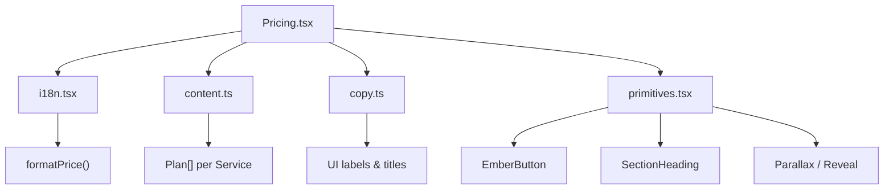
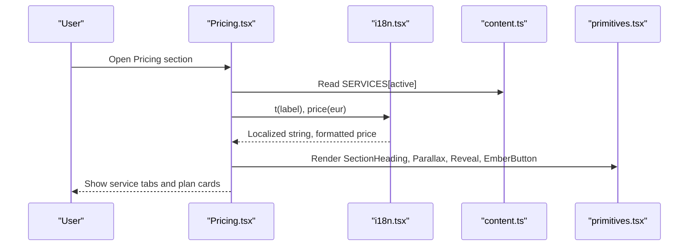
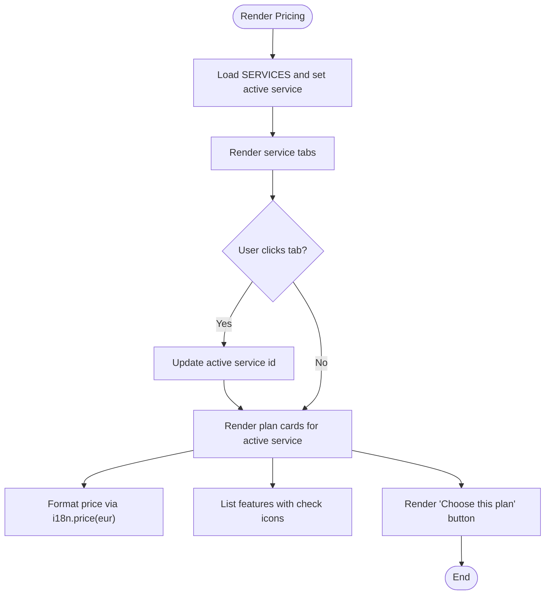
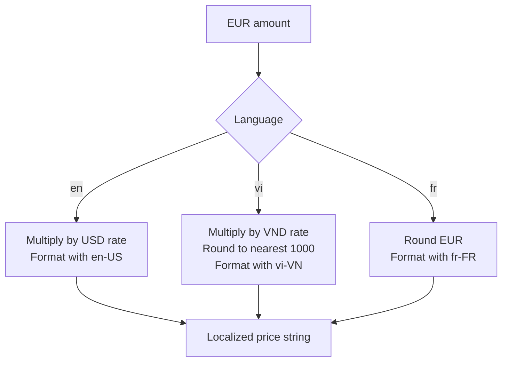
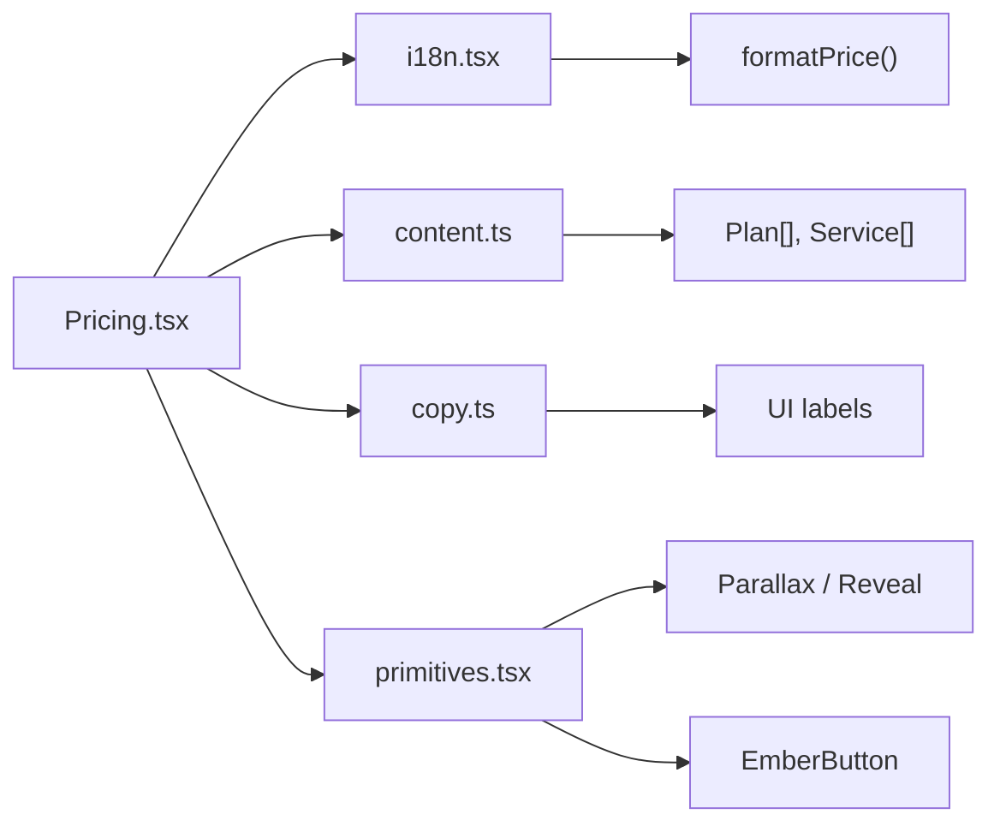

# Pricing Component

<cite>
**Referenced Files in This Document**
- [Pricing.tsx](file://src/components/site/Pricing.tsx)
- [i18n.tsx](file://src/lib/i18n.tsx)
- [content.ts](file://src/lib/content.ts)
- [copy.ts](file://src/lib/copy.ts)
- [primitives.tsx](file://src/components/site/primitives.tsx)
</cite>

## Table of Contents

1. [Introduction](#introduction)
2. [Project Structure](#project-structure)
3. [Core Components](#core-components)
4. [Architecture Overview](#architecture-overview)
5. [Detailed Component Analysis](#detailed-component-analysis)
6. [Dependency Analysis](#dependency-analysis)
7. [Performance Considerations](#performance-considerations)
8. [Troubleshooting Guide](#troubleshooting-guide)
9. [Conclusion](#conclusion)
10. [Appendices](#appendices)

## Introduction

This document explains the Pricing component that displays service plans and pricing structures, supports multi-currency formatting, and enables interactive plan selection. It covers the data model for plans, configuration options for features, integration with the internationalization system, responsive design patterns, accessibility considerations, and user experience optimizations for plan comparison workflows.

## Project Structure

The Pricing feature is composed of:

- A presentation component that renders service tabs and plan cards
- An internationalization context providing translation and currency formatting
- Centralized content definitions for services, plans, and UI strings
- Shared primitives for animations, headings, buttons, and parallax effects

**Diagram sources**

- [Pricing.tsx:1-99](file://src/components/site/Pricing.tsx#L1-L99)
- [i18n.tsx:20-40](file://src/lib/i18n.tsx#L20-L40)
- [content.ts:21-75](file://src/lib/content.ts#L21-L75)
- [copy.ts:207-217](file://src/lib/copy.ts#L207-L217)
- [primitives.tsx:69-154](file://src/components/site/primitives.tsx#L69-L154)

**Section sources**

- [Pricing.tsx:1-99](file://src/components/site/Pricing.tsx#L1-L99)
- [i18n.tsx:1-89](file://src/lib/i18n.tsx#L1-L89)
- [content.ts:21-75](file://src/lib/content.ts#L21-L75)
- [copy.ts:207-217](file://src/lib/copy.ts#L207-L217)
- [primitives.tsx:69-154](file://src/components/site/primitives.tsx#L69-L154)

## Core Components

- Pricing component: Renders a section with a heading, service selector tabs, and plan cards. It uses the current language to translate labels and formats prices via the i18n context.
- Internationalization context: Provides language switching, translation function, and price formatting across currencies (EUR, USD, VND).
- Content model: Defines Plan and Service types and populates SERVICES with multiple offerings, each containing plans, features, and metadata.
- UI copy: Centralizes all user-facing strings used by the Pricing section and other parts of the app.
- Primitives: Provide reusable building blocks like SectionHeading, EmberButton, Parallax, and Reveal for consistent UX and performance.

Key responsibilities:

- Displaying service tabs and selecting an active service
- Rendering plan cards with name, audience, price, period label, and features
- Formatting prices according to the selected language
- Translating all visible text through the i18n context

**Section sources**

- [Pricing.tsx:9-99](file://src/components/site/Pricing.tsx#L9-L99)
- [i18n.tsx:20-89](file://src/lib/i18n.tsx#L20-L89)
- [content.ts:21-75](file://src/lib/content.ts#L21-L75)
- [copy.ts:207-217](file://src/lib/copy.ts#L207-L217)
- [primitives.tsx:167-242](file://src/components/site/primitives.tsx#L167-L242)

## Architecture Overview

The Pricing component composes data from content.ts with UI strings from copy.ts and renders them using primitives. The i18n context supplies both translations and localized price formatting.

**Diagram sources**

- [Pricing.tsx:9-99](file://src/components/site/Pricing.tsx#L9-L99)
- [i18n.tsx:20-89](file://src/lib/i18n.tsx#L20-L89)
- [content.ts:71-75](file://src/lib/content.ts#L71-L75)
- [primitives.tsx:69-154](file://src/components/site/primitives.tsx#L69-L154)

## Detailed Component Analysis

### Pricing Component

Responsibilities:

- Manage active service state and render tabs for each service
- Render plan cards with name, audience, price, period label, and features
- Use i18n for translations and currency formatting
- Apply animations and responsive layout via primitives

Data flow:

- Reads SERVICES from content.ts
- Uses useLang().t for labels and useLang().price for EUR-based amounts
- Renders plan lists with features and call-to-action buttons

Interactive behavior:

- Clicking a service tab updates the active service and re-renders plan cards
- Each plan card includes a button linking to the intelligence/configurator section

Responsive behavior:

- Grid adapts from single column on small screens to two or three columns on larger screens
- Parallax and reveal effects enhance visual hierarchy without impacting usability

Accessibility highlights:

- Semantic HTML structure with section, article, h3 elements
- Keyboard-navigable tabs implemented as buttons
- Clear visual distinction for popular plan via badge styling

**Diagram sources**

- [Pricing.tsx:9-99](file://src/components/site/Pricing.tsx#L9-L99)
- [i18n.tsx:20-40](file://src/lib/i18n.tsx#L20-L40)

**Section sources**

- [Pricing.tsx:9-99](file://src/components/site/Pricing.tsx#L9-L99)

### Internationalization and Currency Conversion

- Language context provides:
  - Current language and setter
  - Translation function t(value) returning localized string
  - Price formatter price(eur) converting EUR to USD or VND based on language
- Rates are defined centrally; Vietnam uses a market adjustment rounding strategy
- Language preference persists in localStorage and sets document language attribute

Currency logic:

- English: converts EUR to USD using rate and formats with locale-specific separators
- Vietnamese: converts EUR to VND, rounds to nearest thousand, and formats with locale
- French: displays rounded EUR with locale formatting

**Diagram sources**

- [i18n.tsx:20-40](file://src/lib/i18n.tsx#L20-L40)

**Section sources**

- [i18n.tsx:20-89](file://src/lib/i18n.tsx#L20-L89)

### Data Model for Pricing Plans

- Plan type includes:
  - Multilingual name and optional audience
  - Base price in EUR and billing period
  - Array of multilingual features
  - Optional popular flag
- Service type includes:
  - Identifier, number, title, short description, long description
  - Starting price and period
  - Highlights, steps, deliverables, metrics, comparisons
  - Array of Plan objects

Period labels:

- Centralized mapping for once/month/year periods with translations

Example usage:

- Services array contains multiple offerings, each with multiple plans
- Each plan’s features list is rendered with check icons and translated labels

**Section sources**

- [content.ts:21-75](file://src/lib/content.ts#L21-L75)
- [content.ts:71-75](file://src/lib/content.ts#L71-L75)

### Configuration Options for Plan Features

- Features are defined as arrays of multilingual strings within each plan
- Popular plans can be highlighted via a boolean flag
- Audience strings provide contextual targeting for each plan
- Period labels are centralized to ensure consistency across languages

Extensibility:

- Add new features by appending entries to the plan’s features array
- Mark a plan as popular to show a badge
- Adjust pricing by changing the eur field while keeping period consistent

**Section sources**

- [content.ts:21-75](file://src/lib/content.ts#L21-L75)

### Integration with Internationalization System

- All visible text is sourced from copy.ts and translated via t()
- Prices are formatted via price(eur) which respects the current language
- Period labels are translated using PERIOD_LABEL mapping
- UI strings such as “Most popular” and “Choose this plan” are centralized

Best practices:

- Keep all user-facing strings in copy.ts
- Use L type for multilingual values to enforce type safety
- Avoid hardcoding strings in components

**Section sources**

- [copy.ts:207-217](file://src/lib/copy.ts#L207-L217)
- [content.ts:71-75](file://src/lib/content.ts#L71-L75)
- [Pricing.tsx:17-22](file://src/components/site/Pricing.tsx#L17-L22)

### Responsive Design Patterns

- Grid layout adapts from one column on mobile to two or three columns on larger screens
- Parallax wrapper enhances visual depth without affecting layout stability
- Reveal animations trigger on intersection to improve perceived performance
- Buttons and badges scale appropriately across breakpoints

Accessibility considerations:

- Reduced motion preference respected by parallax effect
- Semantic elements and keyboard navigation support
- Clear focus states and contrast for readability

**Section sources**

- [Pricing.tsx:43-95](file://src/components/site/Pricing.tsx#L43-L95)
- [primitives.tsx:69-154](file://src/components/site/primitives.tsx#L69-L154)

### Interactive Plan Selection

- Service tabs are implemented as buttons with active state styling
- Clicking a tab updates the active service and re-renders plan cards
- Each plan card includes a call-to-action button linking to the configurator

User experience optimizations:

- Staggered animation delays for plan cards improve visual flow
- Popular plan badge draws attention to recommended option
- Consistent spacing and typography aid scanning and comparison

**Section sources**

- [Pricing.tsx:24-41](file://src/components/site/Pricing.tsx#L24-L41)
- [Pricing.tsx:48-95](file://src/components/site/Pricing.tsx#L48-L95)

## Dependency Analysis

The Pricing component depends on:

- i18n context for translations and price formatting
- Content model for services and plans
- UI copy for labels and titles
- Primitives for shared UI behaviors

**Diagram sources**

- [Pricing.tsx:1-99](file://src/components/site/Pricing.tsx#L1-L99)
- [i18n.tsx:20-89](file://src/lib/i18n.tsx#L20-L89)
- [content.ts:21-75](file://src/lib/content.ts#L21-L75)
- [copy.ts:207-217](file://src/lib/copy.ts#L207-L217)
- [primitives.tsx:69-154](file://src/components/site/primitives.tsx#L69-L154)

**Section sources**

- [Pricing.tsx:1-99](file://src/components/site/Pricing.tsx#L1-L99)
- [i18n.tsx:20-89](file://src/lib/i18n.tsx#L20-L89)
- [content.ts:21-75](file://src/lib/content.ts#L21-L75)
- [copy.ts:207-217](file://src/lib/copy.ts#L207-L217)
- [primitives.tsx:69-154](file://src/components/site/primitives.tsx#L69-L154)

## Performance Considerations

- Minimal re-renders: Only the active service changes when tabs are clicked
- Animation efficiency: Parallax uses requestAnimationFrame and respects reduced motion preferences
- IntersectionObserver: Reveal animations only run when elements enter the viewport
- Layout stability: Grid and spacing avoid layout shifts during transitions

Optimization tips:

- Keep plan lists concise to reduce DOM size
- Avoid heavy computations inside render loops
- Leverage memoization if adding complex derived data

[No sources needed since this section provides general guidance]

## Troubleshooting Guide

Common issues and resolutions:

- Missing translations: Ensure all keys exist in copy.ts and content.ts for the active language
- Incorrect currency format: Verify language setting and RATES in i18n.tsx
- Broken links: Confirm href targets (e.g., #intelligence) exist in the page
- Accessibility problems: Check semantic tags, keyboard navigation, and focus states

Debugging steps:

- Inspect the active language via console logs or dev tools
- Validate plan data structure against the Plan type
- Test with different screen sizes to confirm responsive behavior

**Section sources**

- [i18n.tsx:51-89](file://src/lib/i18n.tsx#L51-L89)
- [Pricing.tsx:86-92](file://src/components/site/Pricing.tsx#L86-L92)

## Conclusion

The Pricing component delivers a clear, accessible, and internationally supported plan comparison experience. It leverages a robust data model, centralized translations, and efficient rendering patterns to present service plans effectively. By following the guidelines for adding tiers, customizing features, and optimizing UX, teams can extend and maintain the component with confidence.

[No sources needed since this section summarizes without analyzing specific files]

## Appendices

### Adding a New Pricing Tier

Steps:

- Define a new Plan object in the desired Service’s plans array
- Include name, audience, eur, period, features, and optional popular flag
- Ensure all strings are provided in all supported languages
- Optionally mark the plan as popular to highlight it

References:

- Plan type definition and examples
- Services array structure

**Section sources**

- [content.ts:21-75](file://src/lib/content.ts#L21-L75)

### Customizing Plan Features

Approach:

- Add or remove feature strings in the plan’s features array
- Use multilingual keys to support all languages
- Maintain consistent phrasing across plans for comparability

References:

- Feature rendering in plan cards
- Translation function usage

**Section sources**

- [Pricing.tsx:77-84](file://src/components/site/Pricing.tsx#L77-L84)
- [content.ts:21-75](file://src/lib/content.ts#L21-L75)

### Implementing Dynamic Pricing Calculations

Options:

- Extend formatPrice to accept additional parameters (e.g., discounts, taxes)
- Introduce dynamic rates fetched from a configuration source
- Compute adjusted prices before passing to price()

Considerations:

- Preserve localization and rounding rules
- Ensure backward compatibility with existing plans
- Test across all supported languages

References:

- Current price formatting logic
- Rate constants and language detection

**Section sources**

- [i18n.tsx:20-40](file://src/lib/i18n.tsx#L20-L40)
