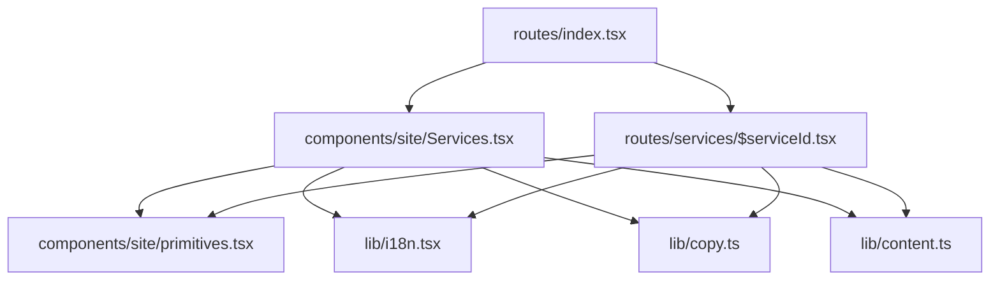
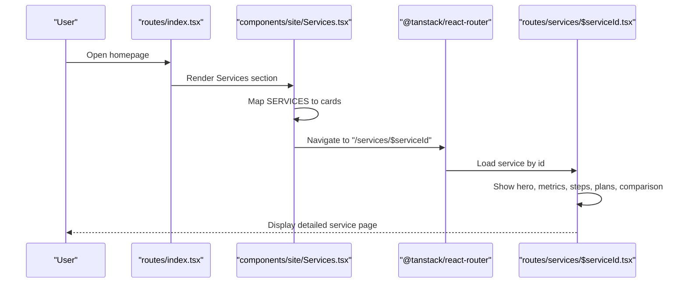
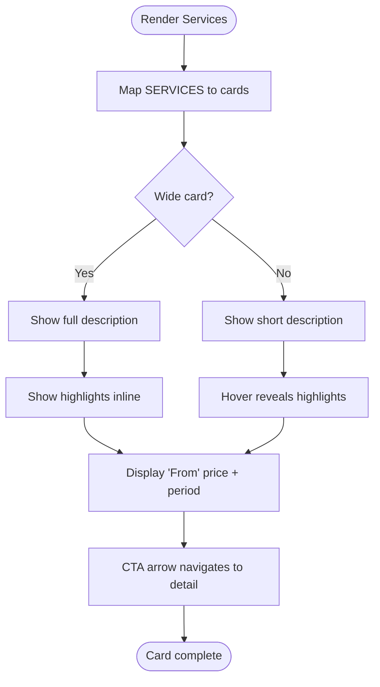
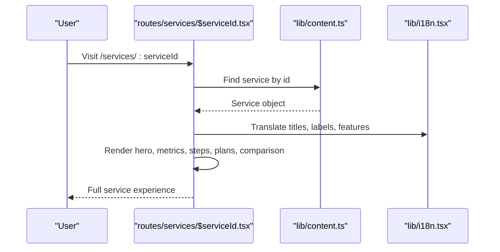
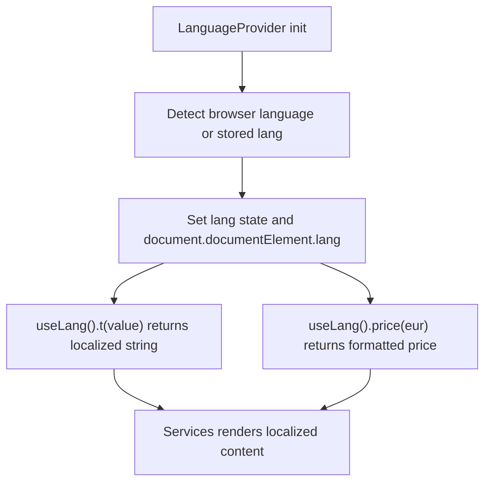
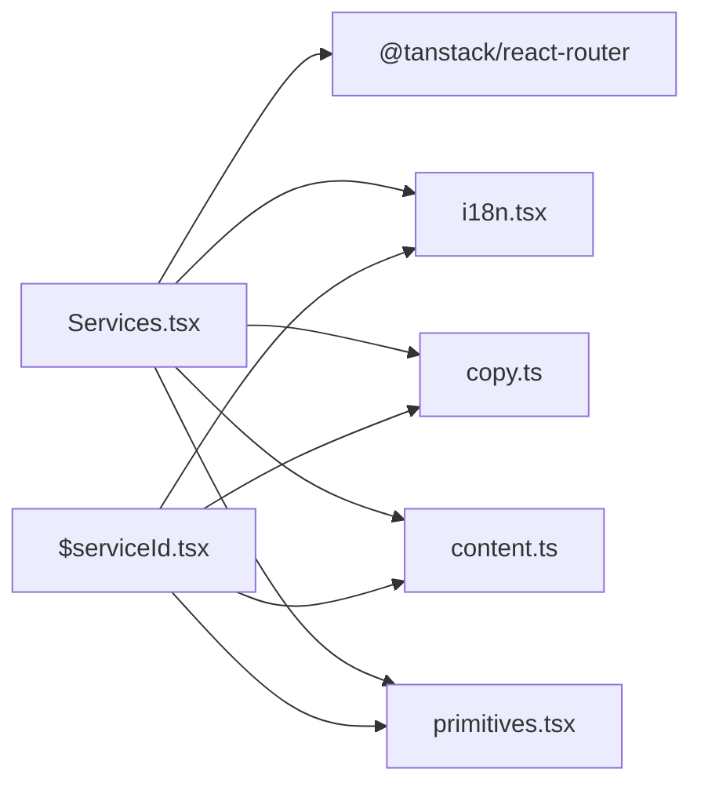

# Services Component

<cite>
**Referenced Files in This Document**
- [Services.tsx](file://src/components/site/Services.tsx)
- [content.ts](file://src/lib/content.ts)
- [i18n.tsx](file://src/lib/i18n.tsx)
- [copy.ts](file://src/lib/copy.ts)
- [primitives.tsx](file://src/components/site/primitives.tsx)
- [$serviceId.tsx](file://src/routes/services/$serviceId.tsx)
- [index.tsx](file://src/routes/index.tsx)
</cite>

## Table of Contents

1. [Introduction](#introduction)
2. [Project Structure](#project-structure)
3. [Core Components](#core-components)
4. [Architecture Overview](#architecture-overview)
5. [Detailed Component Analysis](#detailed-component-analysis)
6. [Dependency Analysis](#dependency-analysis)
7. [Performance Considerations](#performance-considerations)
8. [Troubleshooting Guide](#troubleshooting-guide)
9. [Conclusion](#conclusion)
10. [Appendices](#appendices)

## Introduction

This document explains the Services component that showcases the digital agency’s service offerings. It covers how interactive service cards are rendered with hover effects, pricing information, and call-to-action behavior; how data flows from the content management layer; how to customize card appearance; how the internationalization system is integrated; and how to optimize performance for large catalogs and mobile touch interactions.

## Project Structure

The Services feature spans a few focused files:

- The Services section on the homepage renders an interactive grid of service cards.
- A detail page exists per service for deeper exploration and pricing plans.
- Content (services, labels, periods) is centralized for reuse and i18n.
- Shared UI primitives provide parallax, reveal animations, and buttons.



**Diagram sources**

- [index.tsx:1-59](file://src/routes/index.tsx#L1-L59)
- [Services.tsx:1-120](file://src/components/site/Services.tsx#L1-L120)
- [primitives.tsx:1-242](file://src/components/site/primitives.tsx#L1-L242)
- [i18n.tsx:1-89](file://src/lib/i18n.tsx#L1-L89)
- [copy.ts:1-418](file://src/lib/copy.ts#L1-L418)
- [content.ts:1-800](file://src/lib/content.ts#L1-L800)
- [$serviceId.tsx:1-522](file://src/routes/services/$serviceId.tsx#L1-L522)

**Section sources**

- [index.tsx:1-59](file://src/routes/index.tsx#L1-L59)
- [Services.tsx:1-120](file://src/components/site/Services.tsx#L1-L120)

## Core Components

- Services section: Renders a responsive grid of service cards with images, titles, short descriptions, highlights, pricing, and a CTA arrow. Each card links to a dedicated service detail route.
- Service detail page: Loads a specific service by id, shows hero info, metrics, process steps, pricing plans, comparison matrix, and related services.
- Internationalization: Provides language switching, localized strings via t(), and price formatting based on currency rates.
- Content model: Centralized definitions for services, plans, periods, and UI copy used across components.
- Primitives: Reusable building blocks like Parallax, Reveal, SectionHeading, and EmberButton.

Key responsibilities:

- Data binding: Services reads SERVICES array and maps it to visual cards.
- Localization: Uses useLang() to translate titles, descriptions, highlights, and period labels.
- Pricing: Displays “From” prices using formatted currency and period labels.
- Interaction: Hover effects on cards, smooth transitions, and navigation to detail pages.

**Section sources**

- [Services.tsx:26-119](file://src/components/site/Services.tsx#L26-L119)
- [$serviceId.tsx:40-68](file://src/routes/services/$serviceId.tsx#L40-L68)
- [i18n.tsx:20-89](file://src/lib/i18n.tsx#L20-L89)
- [content.ts:21-75](file://src/lib/content.ts#L21-L75)
- [primitives.tsx:69-196](file://src/components/site/primitives.tsx#L69-L196)

## Architecture Overview

The Services feature follows a clear separation between presentation, data, and localization:

- Presentation: Services.tsx composes cards using primitives and Tailwind classes.
- Data: content.ts defines the Service type and the SERVICES array, including plans, steps, metrics, comparisons.
- Localization: i18n.tsx provides LanguageProvider and useLang hook for t() and price().
- Routing: index.tsx includes Services section; $serviceId.tsx handles per-service detail routes.



**Diagram sources**

- [index.tsx:35-55](file://src/routes/index.tsx#L35-L55)
- [Services.tsx:40-114](file://src/components/site/Services.tsx#L40-L114)
- [$serviceId.tsx:40-68](file://src/routes/services/$serviceId.tsx#L40-L68)

## Detailed Component Analysis

### Services Section: Interactive Cards and Grid

- Layout: Responsive grid with auto rows and column spans for varied card sizes. Wide cards span more columns and show longer descriptions; narrow cards show short descriptions and expandable highlights on hover.
- Visuals: Background image with grayscale and hover color restoration; gradient overlay for readability; parallax effect for depth.
- Interactions: Hover lifts card slightly, increases scale, removes grayscale, reveals highlights, and shifts arrow icon.
- Accessibility: Images have alt text derived from localized title; aria-hidden used for decorative overlays; keyboard focus handled by Link wrapper.
- Pricing: Shows “From” price using price() formatter and period label from PERIOD_LABEL.



**Diagram sources**

- [Services.tsx:39-114](file://src/components/site/Services.tsx#L39-L114)

**Section sources**

- [Services.tsx:16-24](file://src/components/site/Services.tsx#L16-L24)
- [Services.tsx:39-114](file://src/components/site/Services.tsx#L39-L114)

### Service Detail Page: Plans, Metrics, Process, Comparison

- Loader: Finds service by id or throws notFound.
- Hero: Title, description, highlights, and direct CTAs (plans anchor, WhatsApp, AI quote).
- Metrics: Optional section showcasing key performance numbers.
- Process: Step-by-step workflow cards with numbered stages.
- Plans: Interactive selection with popular plan highlighting and WhatsApp ordering per plan.
- Comparison: Matrix comparing XR Agency vs market standards.
- Other Services: Discovery bar linking to other services.



**Diagram sources**

- [$serviceId.tsx:40-68](file://src/routes/services/$serviceId.tsx#L40-L68)
- [$serviceId.tsx:70-521](file://src/routes/services/$serviceId.tsx#L70-L521)
- [content.ts:53-75](file://src/lib/content.ts#L53-L75)
- [i18n.tsx:71-89](file://src/lib/i18n.tsx#L71-L89)

**Section sources**

- [$serviceId.tsx:40-68](file://src/routes/services/$serviceId.tsx#L40-L68)
- [$serviceId.tsx:70-521](file://src/routes/services/$serviceId.tsx#L70-L521)

### Data Model and Content Management

- Service type: Defines id, num, title, short, description, fromEur, fromPeriod, highlights, plans, optional steps, deliverables, metrics, comparisons, serviceFaqs.
- Period labels: Maps once/month/year to localized strings.
- Services array: Contains multiple services with rich metadata, plans, steps, metrics, and comparisons.

```mermaid
classDiagram
class Service {
+string id
+string num
+L title
+L short
+L description
+number fromEur
+PlanPeriod fromPeriod
+L[] highlights
+Plan[] plans
+boolean premium?
+ServiceStep[] steps?
+ServiceDeliverable[] deliverables?
+ServiceMetric[] metrics?
+ServiceComparison[] comparisons?
+{q : L,a : L}[] serviceFaqs?
}
class Plan {
+L name
+L audience?
+number eur
+PlanPeriod period
+L[] features
+boolean popular?
}
class ServiceStep {
+string num
+L title
+L desc
}
class ServiceMetric {
+string metric
+L label
+L desc
}
class ServiceComparison {
+L feature
+L us
+L them
}
Service --> Plan : "has many"
Service --> ServiceStep : "has many"
Service --> ServiceMetric : "has many"
Service --> ServiceComparison : "has many"
```

**Diagram sources**

- [content.ts:21-75](file://src/lib/content.ts#L21-L75)

**Section sources**

- [content.ts:21-75](file://src/lib/content.ts#L21-L75)

### Internationalization Integration

- Language context: Provides current language, setter, t() function, and price() formatter.
- Rates: Currency conversion for English (USD) and Vietnamese (VND), with French defaulting to EUR.
- Usage: Services uses t() for titles, descriptions, highlights, and period labels; price() formats “From” prices.



**Diagram sources**

- [i18n.tsx:20-89](file://src/lib/i18n.tsx#L20-L89)
- [Services.tsx:26-114](file://src/components/site/Services.tsx#L26-L114)

**Section sources**

- [i18n.tsx:20-89](file://src/lib/i18n.tsx#L20-L89)
- [Services.tsx:26-114](file://src/components/site/Services.tsx#L26-L114)

### Customization and Props

- Services component does not accept external props; it consumes global content and i18n.
- To customize:
  - Add new services by extending the SERVICES array in content.ts.
  - Adjust visuals mapping in Services.tsx to assign images and grid spans.
  - Modify UI copy in copy.ts for labels and headings.
  - Extend i18n rates and languages if needed.

Examples:

- Adding a new service: Append a new Service object to SERVICES with required fields (id, num, title, short, description, fromEur, fromPeriod, highlights, plans).
- Customizing card appearance: Update VISUAL mapping for image and span classes; adjust hover styles and gradients in Services.tsx.
- Integrating i18n: Ensure all user-facing strings are L types and wrapped with t(); add translations in content.ts and copy.ts.

**Section sources**

- [Services.tsx:16-24](file://src/components/site/Services.tsx#L16-L24)
- [content.ts:53-75](file://src/lib/content.ts#L53-L75)
- [copy.ts:196-205](file://src/lib/copy.ts#L196-L205)
- [i18n.tsx:20-89](file://src/lib/i18n.tsx#L20-L89)

### Responsive Grid Layouts

- Grid configuration: Auto rows with minmax constraints; column spans vary by service type.
- Wide cards: Span 4 columns on medium+ screens; show long descriptions inline.
- Narrow cards: Span 2-3 columns; reveal highlights on hover via CSS transitions.
- Mobile: Stacks naturally due to grid; ensure tap targets are accessible.

**Section sources**

- [Services.tsx:39-114](file://src/components/site/Services.tsx#L39-L114)

### Interaction Patterns and Animations

- Hover effects: Card lift, image scale, grayscale removal, highlight reveal, arrow translation.
- Parallax: Background image moves subtly with scroll for depth.
- Reveal: Elements animate into view using IntersectionObserver-based reveal with staggered delays.
- Reduced motion: Respects prefers-reduced-motion for accessibility.

**Section sources**

- [Services.tsx:48-114](file://src/components/site/Services.tsx#L48-L114)
- [primitives.tsx:69-154](file://src/components/site/primitives.tsx#L69-L154)

### Accessibility Features

- Alt text: Image alt sourced from localized title.
- Decorative elements: aria-hidden on non-interactive overlays.
- Keyboard navigation: Links wrap entire cards for focusability.
- Motion preferences: Parallax disabled when reduced motion is preferred.

**Section sources**

- [Services.tsx:51-65](file://src/components/site/Services.tsx#L51-L65)
- [primitives.tsx:81-104](file://src/components/site/primitives.tsx#L81-L104)

## Dependency Analysis

- Services depends on:
  - @tanstack/react-router for Link navigation.
  - i18n for t() and price().
  - copy for UI labels.
  - content for SERVICES and PERIOD_LABEL.
  - primitives for Parallax, Reveal, SectionHeading.
- Detail page depends on:
  - content for service data.
  - i18n for localization.
  - copy for UI labels.
  - primitives for Reveal and EmberButton.



**Diagram sources**

- [Services.tsx:1-120](file://src/components/site/Services.tsx#L1-L120)
- [$serviceId.tsx:1-522](file://src/routes/services/$serviceId.tsx#L1-L522)

**Section sources**

- [Services.tsx:1-120](file://src/components/site/Services.tsx#L1-L120)
- [$serviceId.tsx:1-522](file://src/routes/services/$serviceId.tsx#L1-L522)

## Performance Considerations

- Large catalogs:
  - Keep SERVICES array efficient; avoid heavy computations during render.
  - Use lazy loading for images (already present via loading="lazy").
  - Consider pagination or virtualization if the number of services grows significantly.
- Animations:
  - Parallax respects reduced motion; keep speed values modest to avoid jank.
  - Reveal uses IntersectionObserver with thresholds to minimize unnecessary updates.
- Mobile touch:
  - Ensure tap targets are large enough; avoid relying solely on hover for critical actions.
  - Provide visible affordances for interactive elements (e.g., arrow CTA).
- Rendering:
  - Avoid re-renders by memoizing stable values where possible.
  - Keep card content lightweight; defer heavy computations to loaders or pre-process.

[No sources needed since this section provides general guidance]

## Troubleshooting Guide

- Missing service detail:
  - If a service id is not found, the detail route throws notFound; verify id matches SERVICES entries.
- Incorrect pricing display:
  - Ensure fromEur and fromPeriod are set correctly; check i18n rates and language context.
- Localization issues:
  - Confirm all user-facing strings are L types and wrapped with t(); add missing translations in content.ts and copy.ts.
- Animation glitches:
  - Check for prefers-reduced-motion settings; validate IntersectionObserver usage in Reveal.
- Image quality:
  - Verify image paths and aspect ratios; consider optimizing assets for faster load times.

**Section sources**

- [$serviceId.tsx:40-47](file://src/routes/services/$serviceId.tsx#L40-L47)
- [i18n.tsx:20-89](file://src/lib/i18n.tsx#L20-L89)
- [primitives.tsx:113-154](file://src/components/site/primitives.tsx#L113-L154)

## Conclusion

The Services component delivers a polished, interactive showcase of the agency’s offerings through a well-structured grid of cards, robust internationalization, and a comprehensive detail page. By centralizing content and leveraging shared primitives, the system remains maintainable and extensible. Following the customization guidelines and performance recommendations will help scale the catalog while preserving responsiveness and accessibility.

[No sources needed since this section summarizes without analyzing specific files]

## Appendices

### How to Add a New Service

- Define a new Service object in content.ts with required fields: id, num, title, short, description, fromEur, fromPeriod, highlights, plans.
- Optionally add steps, metrics, comparisons, and serviceFaqs for richer detail pages.
- Update VISUAL mapping in Services.tsx to assign an image and grid span for the new service.
- Ensure all strings are localized via L types and t() calls.

**Section sources**

- [content.ts:53-75](file://src/lib/content.ts#L53-L75)
- [Services.tsx:16-24](file://src/components/site/Services.tsx#L16-L24)

### How to Customize Card Appearance

- Adjust VISUAL mapping for image and span classes to change layout emphasis.
- Modify hover styles in Services.tsx for transforms, scales, and grayscale transitions.
- Update gradient overlays and border colors to match brand guidelines.

**Section sources**

- [Services.tsx:16-24](file://src/components/site/Services.tsx#L16-L24)
- [Services.tsx:48-114](file://src/components/site/Services.tsx#L48-L114)

### Integrating With Internationalization

- Wrap all user-facing strings with t() and ensure they are L types.
- Add translations in content.ts and copy.ts for new labels.
- Extend i18n rates and languages if supporting additional currencies or locales.

**Section sources**

- [i18n.tsx:20-89](file://src/lib/i18n.tsx#L20-L89)
- [copy.ts:196-205](file://src/lib/copy.ts#L196-L205)
- [content.ts:71-75](file://src/lib/content.ts#L71-L75)
