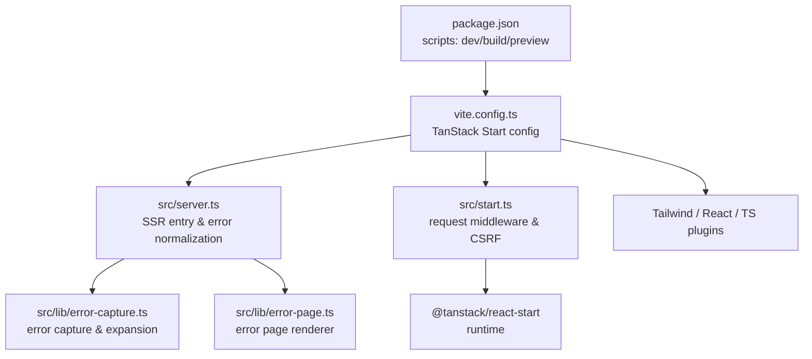
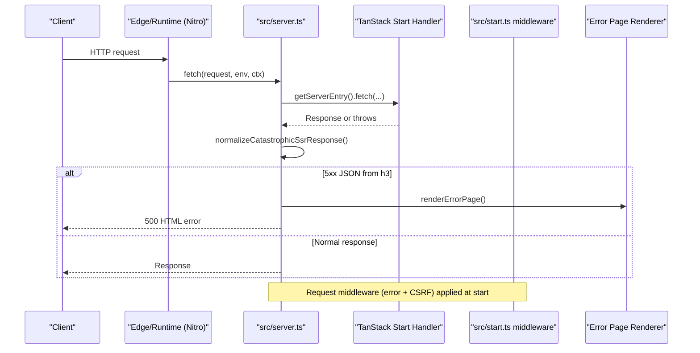
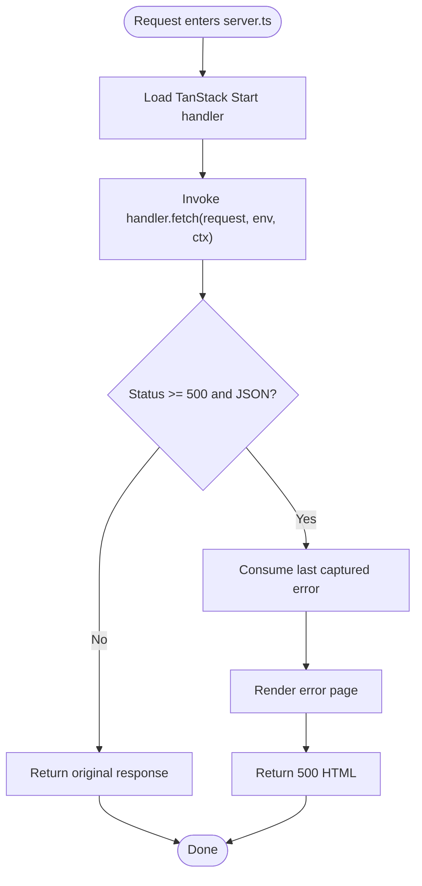
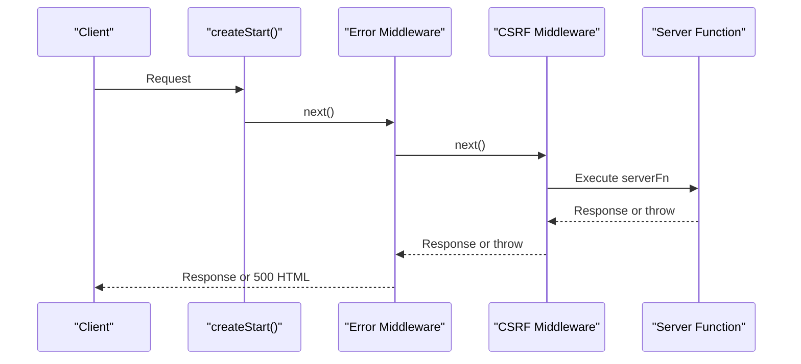
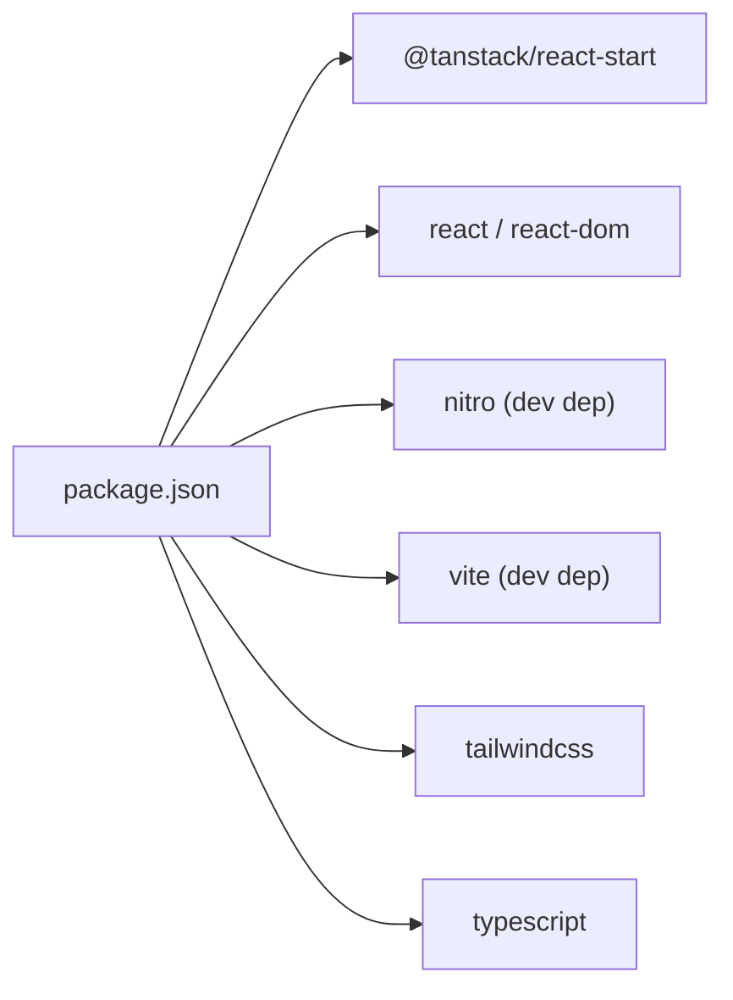

# Deployment and Production

<cite>
**Referenced Files in This Document**
- [package.json](file://package.json)
- [vite.config.ts](file://vite.config.ts)
- [bunfig.toml](file://bunfig.toml)
- [tsconfig.json](file://tsconfig.json)
- [README.md](file://README.md)
- [src/server.ts](file://src/server.ts)
- [src/start.ts](file://src/start.ts)
- [src/lib/error-capture.ts](file://src/lib/error-capture.ts)
- [src/lib/lovable-error-reporting.ts](file://src/lib/lovable-error-reporting.ts)
</cite>

## Table of Contents

1. Introduction
2. Project Structure
3. Core Components
4. Architecture Overview
5. Detailed Component Analysis
6. Dependency Analysis
7. Performance Considerations
8. Troubleshooting Guide
9. Conclusion
10. Appendices

## Introduction

This document provides a comprehensive guide to building, optimizing, and deploying the Xragency application to production. It covers Vite-based build configuration, bundle optimization strategies, asset pipeline setup, environment variable management, and production-specific configurations. It also includes guidance for monitoring, error tracking, analytics, CI/CD pipelines, automated deployments, rollback strategies, security considerations (SSL, CORS, security headers), health checks, scaling, and maintenance procedures.

## Project Structure

The project is a TanStack Start + Vite application with a Nitro-based server entrypoint. The build system uses Vite and integrates Tailwind CSS, React, TypeScript, and path aliases. The server entry is configured to use a custom SSR wrapper that normalizes errors and renders a user-friendly error page.

**Diagram sources**

- [package.json:6-12](file://package.json#L6-L12)
- [vite.config.ts:1-15](file://vite.config.ts#L1-L15)
- [src/server.ts:1-62](file://src/server.ts#L1-L62)
- [src/start.ts:1-30](file://src/start.ts#L1-L30)

**Section sources**

- [package.json:6-12](file://package.json#L6-L12)
- [vite.config.ts:1-15](file://vite.config.ts#L1-L15)
- [README.md:125-135](file://README.md#L125-L135)

## Core Components

- Build and scripts: Development, production build, preview, linting, formatting are defined in package scripts.
- Vite configuration: Uses @lovable.dev/vite-tanstack-config which sets up TanStack Start, React, Tailwind, TypeScript paths, Nitro target, env injection, and more. Server entry is redirected to src/server.ts.
- Server entry: Wraps the TanStack Start server entry, captures and normalizes SSR errors, and returns a rendered error page on failures.
- Request middleware: Adds error handling and CSRF protection for server functions.
- Error capture: Captures last error globally and expands error details for logging; used by server entry to recover swallowed errors.
- Lovable error reporting: Bridges runtime errors to Lovable’s editor telemetry when available.

**Section sources**

- [package.json:6-12](file://package.json#L6-L12)
- [vite.config.ts:1-15](file://vite.config.ts#L1-L15)
- [src/server.ts:1-62](file://src/server.ts#L1-L62)
- [src/start.ts:1-30](file://src/start.ts#L1-L30)
- [src/lib/error-capture.ts:1-82](file://src/lib/error-capture.ts#L1-L82)
- [src/lib/lovable-error-reporting.ts:1-58](file://src/lib/lovable-error-reporting.ts#L1-L58)

## Architecture Overview

The production runtime is built via Vite and runs through Nitro as a Cloudflare-compatible server function. Requests enter src/server.ts, which loads the TanStack Start handler, executes it, and ensures any h3-swallowed errors are converted into a proper HTML error response. Request-level middleware in src/start.ts adds global error handling and CSRF protection for server functions.

**Diagram sources**

- [src/server.ts:12-62](file://src/server.ts#L12-L62)
- [src/start.ts:5-29](file://src/start.ts#L5-L29)

## Detailed Component Analysis

### Build Configuration (Vite + TanStack Start)

- Scripts: Use vite build for production builds; vite preview serves the build locally.
- Config: The Vite config delegates to @lovable.dev/vanilla-tanstack-config which includes TanStack Start, React, Tailwind, TypeScript path alias (@/*), Nitro target (Cloudflare default), environment variable injection, and dedupe logic.
- Server entry: Redirects TanStack Start’s bundled server entry to src/server.ts so SSR error wrapping can be applied consistently.

Optimization notes:

- Tree-shaking and code splitting are handled by Vite/Rollup.
- Asset handling is managed by Vite; ensure images/videos are optimized and referenced efficiently.
- Environment variables prefixed for client exposure are injected automatically by the plugin stack.

**Section sources**

- [package.json:6-12](file://package.json#L6-L12)
- [vite.config.ts:1-15](file://vite.config.ts#L1-L15)
- [tsconfig.json:23-25](file://tsconfig.json#L23-L25)

### Server Entry and Error Handling

- The server entry imports error capture and error page rendering utilities.
- It lazily imports the TanStack Start server entry once per process.
- It normalizes responses that have been turned into generic 500 JSON by h3, converting them into an HTML error page while preserving logs.
- Global unhandled exceptions are caught and return a friendly error page.

**Diagram sources**

- [src/server.ts:12-62](file://src/server.ts#L12-L62)
- [src/lib/error-capture.ts:1-82](file://src/lib/error-capture.ts#L1-L82)

**Section sources**

- [src/server.ts:1-62](file://src/server.ts#L1-L62)
- [src/lib/error-capture.ts:1-82](file://src/lib/error-capture.ts#L1-L82)

### Request Middleware and CSRF Protection

- Custom error middleware wraps each request, catching thrown errors and returning a 500 HTML error page.
- CSRF middleware protects server functions from cross-site requests.

**Diagram sources**

- [src/start.ts:5-29](file://src/start.ts#L5-L29)

**Section sources**

- [src/start.ts:1-30](file://src/start.ts#L1-L30)

### Error Capture and Reporting

- Captures the most recent error globally and expands error chains for logging.
- Provides a consumer API to retrieve the last captured error within a short TTL window.
- Bridges to Lovable’s editor telemetry when running in the editor preview.

**Section sources**

- [src/lib/error-capture.ts:1-82](file://src/lib/error-capture.ts#L1-L82)
- [src/lib/lovable-error-reporting.ts:1-58](file://src/lib/lovable-error-reporting.ts#L1-L58)

## Dependency Analysis

Key runtime dependencies include TanStack Start, React, and Nitro (via the Vite plugin). Dev dependencies include Vite, ESLint, Prettier, and TypeScript tooling. The Bun lockfile indicates usage of Bun for dependency resolution and caching.

**Diagram sources**

- [package.json:14-85](file://package.json#L14-L85)

**Section sources**

- [package.json:14-85](file://package.json#L14-L85)
- [bunfig.toml:1-8](file://bunfig.toml#L1-L8)

## Performance Considerations

- Build optimizations:
  - Use production mode builds to enable minification, tree-shaking, and chunking.
  - Ensure assets (images, videos) are appropriately sized and served via CDN if possible.
  - Avoid large third-party libraries; prefer lightweight alternatives where feasible.
- Runtime performance:
  - Keep server functions small and focused; avoid heavy synchronous work.
  - Leverage TanStack Start’s data loading patterns to minimize waterfalls.
  - Monitor bundle size using Vite’s built-in analysis tools to identify large dependencies.
- Caching and delivery:
  - Configure CDN caching for static assets and immutable filenames.
  - Use appropriate cache-control headers for HTML vs assets.

[No sources needed since this section provides general guidance]

## Troubleshooting Guide

- SSR errors:
  - If you see generic 500 JSON responses, check the server entry’s error normalization logic and ensure error capture is active.
  - Inspect logs for expanded error messages produced by the error capture module.
- Frontend errors:
  - In development/editor previews, errors may be forwarded to Lovable’s telemetry; verify window hooks exist.
  - For production, integrate a dedicated error tracking service (e.g., Sentry) and forward errors from boundaries and server functions.
- CSRF issues:
  - Ensure server functions are protected by CSRF middleware and that clients send required tokens/headers.

**Section sources**

- [src/server.ts:21-62](file://src/server.ts#L21-L62)
- [src/lib/error-capture.ts:1-82](file://src/lib/error-capture.ts#L1-L82)
- [src/lib/lovable-error-reporting.ts:1-58](file://src/lib/lovable-error-reporting.ts#L1-L58)
- [src/start.ts:5-29](file://src/start.ts#L5-L29)

## Conclusion

The Xragency application uses a modern, modular stack centered around Vite, TanStack Start, and Nitro. Production builds are straightforward via standard scripts, with robust error handling and middleware in place. To harden production, add environment-based configuration, security headers, SSL termination, observability, and CI/CD automation. Follow the guidelines below to ensure reliable, secure, and scalable deployments.

[No sources needed since this section summarizes without analyzing specific files]

## Appendices

### Build and Optimization Checklist

- Run production build using the provided script.
- Verify asset sizes and lazy-load heavy components.
- Enable source maps only for production debugging if needed.
- Validate environment variables are correctly injected and not exposed unnecessarily.

**Section sources**

- [package.json:6-12](file://package.json#L6-L12)
- [vite.config.ts:1-15](file://vite.config.ts#L1-L15)

### Environment Variables Management

- Define environment variables in your hosting platform’s settings (e.g., Cloudflare Pages, Netlify, Vercel).
- Use Vite’s environment injection to expose variables to the client where appropriate.
- Keep secrets out of the repository; use platform secret managers.

[No sources needed since this section provides general guidance]

### Deployment to Common Platforms

- Cloudflare Pages:
  - Build output is generated by Vite; deploy the dist directory or configure the framework preset to use TanStack Start/Nitro.
  - Set environment variables in the dashboard or CI.
  - Enable HTTPS by default.
- Netlify:
  - Configure build command and publish directory based on Vite output.
  - Add redirects and headers for security and caching.
- Vercel:
  - Use the Next.js/Vercel adapter if applicable or configure serverless functions to serve the Nitro output.
  - Manage environment variables in the Vercel dashboard.

[No sources needed since this section provides general guidance]

### Security Considerations

- SSL/TLS:
  - Enforce HTTPS at the edge/proxy layer.
- CORS:
  - Restrict allowed origins, methods, and headers for API endpoints.
- Security Headers:
  - Set Content-Security-Policy, X-Frame-Options, Referrer-Policy, Strict-Transport-Security, and others appropriate to your app.
- CSRF:
  - Ensure CSRF middleware is enabled for server functions and clients send required tokens.

[No sources needed since this section provides general guidance]

### Monitoring, Error Tracking, and Analytics

- Error tracking:
  - Integrate a service like Sentry or Rollbar; initialize in both frontend and server layers.
  - Forward errors from React error boundaries and server functions.
- Logging:
  - Centralize logs via your platform’s log aggregation.
  - Use structured logging for traceability.
- Analytics:
  - Add privacy-compliant analytics (e.g., Plausible, GA4 with consent).
  - Respect user privacy and regional regulations.

[No sources needed since this section provides general guidance]

### CI/CD Pipeline Setup

- Stages:
  - Install dependencies (use bun.lock for deterministic installs).
  - Lint and type-check.
  - Build production artifacts.
  - Run tests (if present).
  - Deploy to staging, then production upon approval.
- Artifacts:
  - Cache node_modules/bun cache to speed up builds.
  - Upload build outputs for deployment.
- Secrets:
  - Store secrets in CI/CD vaults; inject at runtime.

**Section sources**

- [bunfig.toml:1-8](file://bunfig.toml#L1-L8)
- [package.json:6-12](file://package.json#L6-L12)

### Automated Deployment Scripts and Rollback Strategies

- Automated scripts:
  - Use platform CLI tools or APIs to trigger deployments and promotions.
  - Gate deployments behind branch protections and PR reviews.
- Rollbacks:
  - Maintain previous versions in your hosting platform’s artifact store.
  - Implement one-click rollbacks or blue/green deployments.
  - Validate health checks before switching traffic.

[No sources needed since this section provides general guidance]

### Health Checks and Scaling

- Health endpoints:
  - Expose a lightweight /health endpoint for readiness/liveness probes.
- Scaling:
  - Scale horizontally at the edge/runtime level.
  - Use CDN for static assets and cache aggressively.
  - Monitor latency and error rates; set alerts.

[No sources needed since this section provides general guidance]

### Maintenance Procedures

- Regularly update dependencies and review security advisories.
- Monitor bundle growth and remove unused dependencies.
- Review logs and error reports periodically.
- Rotate secrets and audit access permissions.

[No sources needed since this section provides general guidance]
