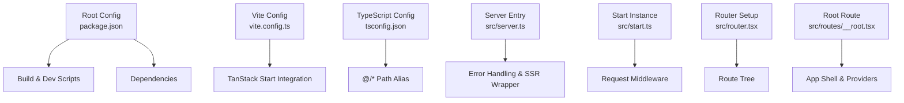
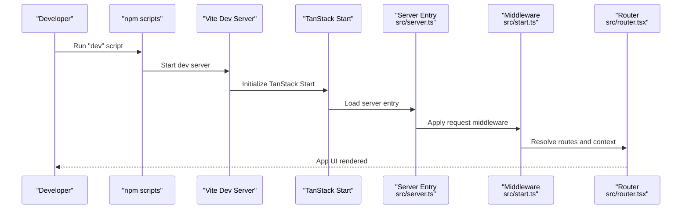
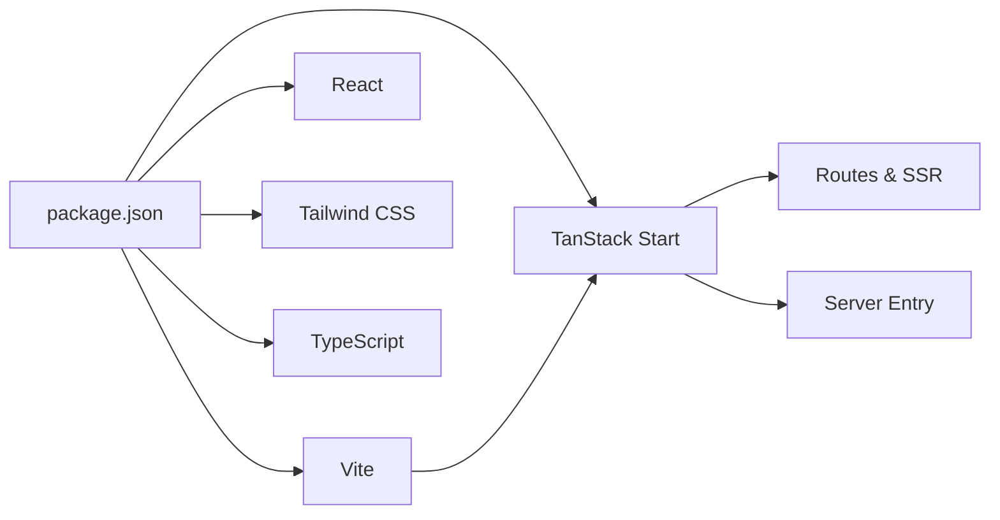

# Getting Started

<cite>
**Referenced Files in This Document**
- [package.json](file://package.json)
- [README.md](file://README.md)
- [vite.config.ts](file://vite.config.ts)
- [tsconfig.json](file://tsconfig.json)
- [bunfig.toml](file://bunfig.toml)
- [src/server.ts](file://src/server.ts)
- [src/start.ts](file://src/start.ts)
- [src/router.tsx](file://src/router.tsx)
- [src/routes/__root.tsx](file://src/routes/__root.tsx)
</cite>

## Table of Contents

1. [Introduction](#introduction)
2. [Project Structure](#project-structure)
3. [Core Components](#core-components)
4. [Architecture Overview](#architecture-overview)
5. [Detailed Component Analysis](#detailed-component-analysis)
6. [Dependency Analysis](#dependency-analysis)
7. [Performance Considerations](#performance-considerations)
8. [Troubleshooting Guide](#troubleshooting-guide)
9. [Conclusion](#conclusion)

## Introduction

This guide helps you set up and run the Xragency project locally for development. It covers prerequisites, cloning the repository, installing dependencies, starting the development server, and building for production. The project uses Vite with TanStack Start to provide a modern React-based SSR/SSG experience.

## Project Structure

At a high level:

- Configuration lives at the root (Vite, TypeScript, ESLint, Prettier).
- Application code is under src/, including routes, components, hooks, and utilities.
- Static assets are under public/.
- Server entry points and middleware are defined in src/server.ts and src/start.ts.

**Diagram sources**

- [package.json:6-12](file://package.json#L6-L12)
- [vite.config.ts:9-15](file://vite.config.ts#L9-L15)
- [tsconfig.json:23-25](file://tsconfig.json#L23-L25)
- [src/server.ts:47-60](file://src/server.ts#L47-L60)
- [src/start.ts:27-29](file://src/start.ts#L27-L29)
- [src/router.tsx:5-16](file://src/router.tsx#L5-L16)
- [src/routes/__root.tsx:76-126](file://src/routes/__root.tsx#L76-L126)

**Section sources**

- [package.json:6-12](file://package.json#L6-L12)
- [vite.config.ts:9-15](file://vite.config.ts#L9-L15)
- [tsconfig.json:23-25](file://tsconfig.json#L23-L25)
- [src/server.ts:47-60](file://src/server.ts#L47-L60)
- [src/start.ts:27-29](file://src/start.ts#L27-L29)
- [src/router.tsx:5-16](file://src/router.tsx#L5-L16)
- [src/routes/__root.tsx:76-126](file://src/routes/__root.tsx#L76-L126)

## Core Components

- Build tooling: Vite orchestrates dev and build processes; scripts are defined in package.json.
- Framework integration: TanStack Start provides routing, SSR, and server functions; configured via vite.config.ts.
- TypeScript: Strict configuration with path alias @/* mapped to src/*.
- Server entry: Custom server wrapper handles errors and integrates with TanStack Start’s runtime.
- Router: Central router setup using generated route tree and React Query client.

Key responsibilities:

- Development server startup via npm scripts.
- Production builds optimized by Vite.
- Error handling and CSRF protection through request middleware.

**Section sources**

- [package.json:6-12](file://package.json#L6-L12)
- [vite.config.ts:9-15](file://vite.config.ts#L9-L15)
- [tsconfig.json:3-25](file://tsconfig.json#L3-L25)
- [src/server.ts:47-60](file://src/server.ts#L47-L60)
- [src/start.ts:27-29](file://src/start.ts#L27-L29)
- [src/router.tsx:5-16](file://src/router.tsx#L5-L16)

## Architecture Overview

The app runs on Vite during development and builds a production bundle using TanStack Start. The server entry wraps the framework’s server handler to normalize errors and render error pages when necessary. Request middleware adds error handling and CSRF protection for server functions.

**Diagram sources**

- [package.json:6-12](file://package.json#L6-L12)
- [vite.config.ts:9-15](file://vite.config.ts#L9-L15)
- [src/server.ts:47-60](file://src/server.ts#L47-L60)
- [src/start.ts:27-29](file://src/start.ts#L27-L29)
- [src/router.tsx:5-16](file://src/router.tsx#L5-L16)

## Detailed Component Analysis

### Prerequisites and Environment

- Node.js: Required for running npm scripts and the dev server. Use a recent LTS version compatible with the project’s dependencies.
- npm: Used to install dependencies and run scripts.
- Optional lockfile: The repository includes a Bun lockfile; however, the README instructs using npm for local development.

Notes:

- The README explicitly recommends using Node.js and npm for local development.
- The project defines scripts for dev, build, preview, lint, and format tasks.

**Section sources**

- [README.md:125-134](file://README.md#L125-L134)
- [package.json:6-12](file://package.json#L6-L12)

### Cloning and Installing Dependencies

Steps:

1. Clone the repository into your local machine.
2. Navigate into the project directory.
3. Install dependencies using npm.

Commands:

- git clone <repository-url>
- cd <repository-name>
- npm i

These steps align with the documented development workflow.

**Section sources**

- [README.md:125-134](file://README.md#L125-L134)

### Running the Development Server

To start the development server:

- npm run dev

What happens:

- Vite starts the dev server with Hot Module Replacement.
- TanStack Start initializes the application with its server entry and middleware.
- The app serves both client and server code during development.

**Section sources**

- [package.json:6-12](file://package.json#L6-L12)
- [vite.config.ts:9-15](file://vite.config.ts#L9-L15)
- [src/server.ts:47-60](file://src/server.ts#L47-L60)
- [src/start.ts:27-29](file://src/start.ts#L27-L29)

### Building for Production

To create an optimized production build:

- npm run build

Additional options:

- npm run build:dev builds in development mode for debugging the build output.
- npm run preview serves the built output locally to verify the production bundle.

**Section sources**

- [package.json:6-12](file://package.json#L6-L12)

### Project Structure Quickstart

Where to begin making changes:

- Routes: Define or modify page-level logic under src/routes/.
- Components: Reusable UI lives under src/components/site/ and src/components/ui/.
- Global layout and providers: Root shell and providers are in src/routes/__root.tsx.
- Router configuration: Centralized in src/router.tsx.
- Server entry and middleware: Customize behavior in src/server.ts and src/start.ts.
- Styling: Tailwind CSS is integrated; global styles can be adjusted in src/styles.css.

**Section sources**

- [src/routes/__root.tsx:76-126](file://src/routes/__root.tsx#L76-L126)
- [src/router.tsx:5-16](file://src/router.tsx#L5-L16)
- [src/server.ts:47-60](file://src/server.ts#L47-L60)
- [src/start.ts:27-29](file://src/start.ts#L27-L29)

## Dependency Analysis

The project relies on:

- Vite for bundling and dev server orchestration.
- TanStack Start for SSR, routing, and server functions.
- React ecosystem packages for UI and state management.
- Tailwind CSS for styling.
- TypeScript for type safety and path aliases.

**Diagram sources**

- [package.json:14-85](file://package.json#L14-L85)
- [vite.config.ts:9-15](file://vite.config.ts#L9-L15)
- [src/server.ts:47-60](file://src/server.ts#L47-L60)

**Section sources**

- [package.json:14-85](file://package.json#L14-L85)
- [vite.config.ts:9-15](file://vite.config.ts#L9-L15)

## Performance Considerations

- Use the production build command to generate optimized assets before deployment.
- Keep dependencies updated to benefit from performance improvements in Vite and TanStack Start.
- Leverage the dev server’s hot reload for faster iteration without full rebuilds.

[No sources needed since this section provides general guidance]

## Troubleshooting Guide

Common issues and resolutions:

- Missing Node.js or wrong version: Ensure Node.js is installed and compatible with the project’s dependencies. Follow the README’s recommendation to use Node.js and npm.
- Dependency installation failures: Clear any existing node_modules and reinstall using npm. Verify network access if package downloads fail.
- Port conflicts: If the dev server fails to start due to port usage, stop other processes using the same port or adjust environment settings as needed.
- Build errors: Review console output for dependency or configuration issues. Confirm that all required dependencies are installed and that TypeScript paths are correctly configured.
- Server errors during SSR: The server entry normalizes certain SSR errors and renders a user-friendly error page. Check logs for details and ensure middleware is applied correctly.

Helpful references:

- Scripts and commands are defined in package.json.
- Server entry and middleware handle error normalization and CSRF protection.
- TypeScript configuration ensures strict checks and path aliases.

**Section sources**

- [README.md:125-134](file://README.md#L125-L134)
- [package.json:6-12](file://package.json#L6-L12)
- [src/server.ts:21-36](file://src/server.ts#L21-L36)
- [src/start.ts:5-18](file://src/start.ts#L5-L18)
- [tsconfig.json:3-25](file://tsconfig.json#L3-L25)

## Conclusion

You now have everything needed to set up, run, and build the Xragency project locally. Use the provided npm scripts to develop and ship your application efficiently. For further customization, explore the routes, components, and server configuration files referenced above.
