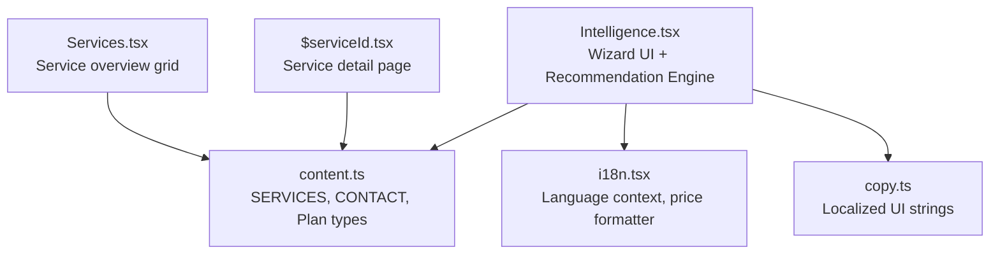
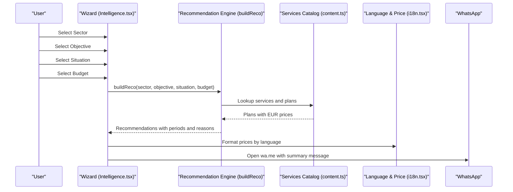
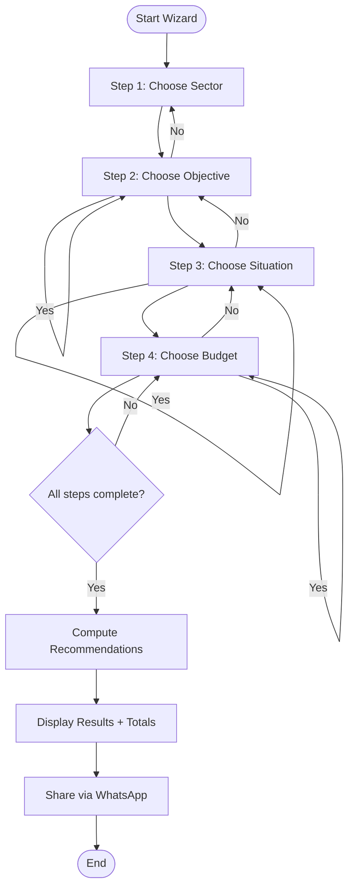
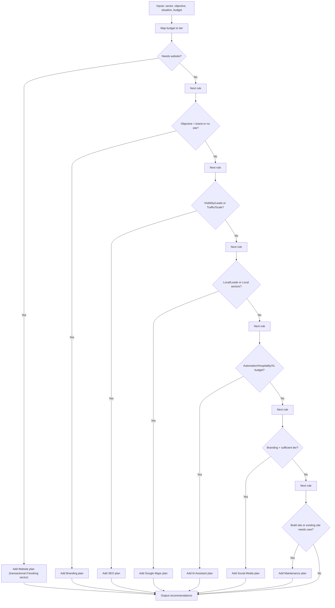
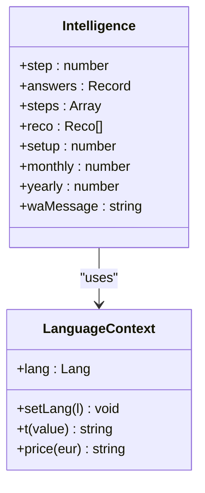
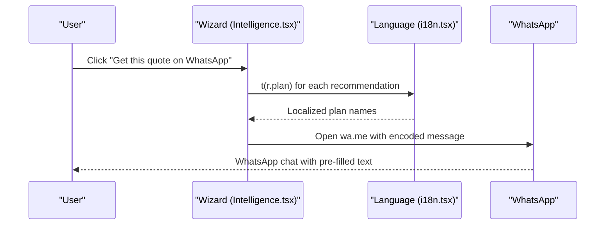
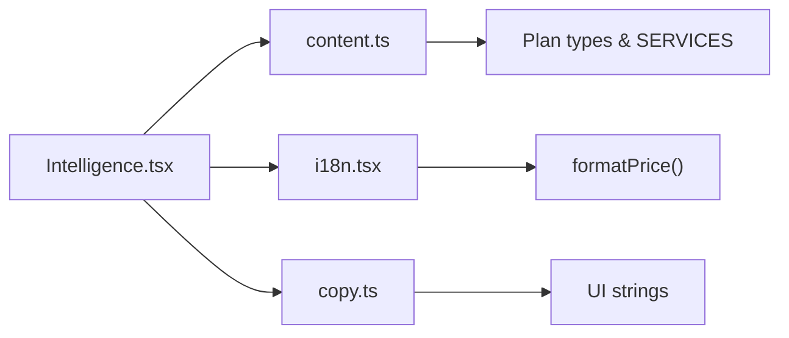

# AI Strategy Tool

<cite>
**Referenced Files in This Document**
- [Intelligence.tsx](file://src/components/site/Intelligence.tsx)
- [i18n.tsx](file://src/lib/i18n.tsx)
- [content.ts](file://src/lib/content.ts)
- [copy.ts](file://src/lib/copy.ts)
- [Services.tsx](file://src/components/site/Services.tsx)
- [$serviceId.tsx](file://src/routes/services/$serviceId.tsx)
</cite>

## Table of Contents

1. [Introduction](#introduction)
2. [Project Structure](#project-structure)
3. [Core Components](#core-components)
4. [Architecture Overview](#architecture-overview)
5. [Detailed Component Analysis](#detailed-component-analysis)
6. [Dependency Analysis](#dependency-analysis)
7. [Performance Considerations](#performance-considerations)
8. [Troubleshooting Guide](#troubleshooting-guide)
9. [Conclusion](#conclusion)
10. [Appendices](#appendices)

## Introduction

This document explains the AI-powered business analysis questionnaire component that guides users through a multi-step wizard to generate personalized service recommendations. The tool collects inputs about business sector, objectives, current situation, and budget, then computes a tailored strategy including websites, branding, SEO, Google Maps optimization, AI assistants, social media management, and maintenance services. It also documents state management using React hooks, WhatsApp integration for sharing results, pricing calculation with currency conversion, accessibility features, mobile responsiveness, and performance optimizations.

## Project Structure

The questionnaire is implemented as a single-page interactive section within the site:

- The main wizard logic and UI are in a dedicated component.
- Services and pricing data are centralized for reuse across the app.
- Internationalization and currency formatting are provided via a context provider.
- UI copy strings are localized and referenced throughout the interface.

**Diagram sources**

- [Intelligence.tsx:1-637](file://src/components/site/Intelligence.tsx#L1-L637)
- [content.ts:1-200](file://src/lib/content.ts#L1-L200)
- [i18n.tsx:1-89](file://src/lib/i18n.tsx#L1-L89)
- [copy.ts:1-418](file://src/lib/copy.ts#L1-L418)
- [Services.tsx:1-37](file://src/components/site/Services.tsx#L1-L37)
- [$serviceId.tsx:1-38](file://src/routes/services/$serviceId.tsx#L1-L38)

**Section sources**

- [Intelligence.tsx:1-637](file://src/components/site/Intelligence.tsx#L1-L637)
- [content.ts:1-200](file://src/lib/content.ts#L1-L200)
- [i18n.tsx:1-89](file://src/lib/i18n.tsx#L1-L89)
- [copy.ts:1-418](file://src/lib/copy.ts#L1-L418)
- [Services.tsx:1-37](file://src/components/site/Services.tsx#L1-L37)
- [$serviceId.tsx:1-38](file://src/routes/services/$serviceId.tsx#L1-L38)

## Core Components

- Multi-step Wizard: Four steps (sector, objective, situation, budget) with step navigation and progress indicators.
- Recommendation Engine: Computes personalized recommendations based on inputs and service tiers.
- State Management: Uses React hooks to track step index, answers, and computed results.
- Pricing and Currency: Centralized EUR-based prices converted to USD or VND depending on language.
- WhatsApp Integration: Generates a pre-filled message summarizing recommended plans for direct sharing.

**Section sources**

- [Intelligence.tsx:374-637](file://src/components/site/Intelligence.tsx#L374-L637)
- [i18n.tsx:20-40](file://src/lib/i18n.tsx#L20-L40)
- [content.ts:21-69](file://src/lib/content.ts#L21-L69)

## Architecture Overview

The system follows a clear separation of concerns:

- UI layer (wizard and results) orchestrates user interactions and displays outputs.
- Business logic (recommendation engine) processes inputs to produce recommendations.
- Data layer (services catalog) provides plan definitions and pricing.
- Context layer (language and pricing) supplies localization and currency formatting.

**Diagram sources**

- [Intelligence.tsx:239-372](file://src/components/site/Intelligence.tsx#L239-L372)
- [Intelligence.tsx:374-637](file://src/components/site/Intelligence.tsx#L374-L637)
- [content.ts:77-200](file://src/lib/content.ts#L77-L200)
- [i18n.tsx:20-40](file://src/lib/i18n.tsx#L20-L40)

## Detailed Component Analysis

### Multi-step Wizard Implementation

- Steps: Sector selection, Objective identification, Situation assessment, Budget evaluation.
- Navigation: Step index managed via state; previous steps can be revisited; progress bar updates dynamically.
- Inputs: Each step presents options with icons and localized labels; selections advance automatically.
- Results: After completing all steps, the component computes and displays recommendations, setup costs, monthly retainers, yearly costs, timeline, and optional add-ons.

**Diagram sources**

- [Intelligence.tsx:374-637](file://src/components/site/Intelligence.tsx#L374-L637)

**Section sources**

- [Intelligence.tsx:374-637](file://src/components/site/Intelligence.tsx#L374-L637)

### Recommendation Engine Logic

The engine evaluates four dimensions to determine relevant services and plan tiers:

- Sector: Determines if booking/e-commerce is required and influences local visibility needs.
- Objective: Drives inclusion of SEO, branding, automation, and online sales features.
- Situation: Influences whether a new website is needed and ongoing maintenance.
- Budget: Maps to tiered plan selection (small, medium, large, XL).

Key rules:

- Websites: Recommended when no site exists, site is outdated, or sector requires transactions/bookings. Booking sectors always get the transactional plan.
- Branding: Recommended when branding is an objective or there is no existing site.
- SEO: Recommended for visibility/leads objectives or when traffic/conversion issues exist.
- Google Maps: Recommended for local objectives, lead generation, or local-oriented sectors.
- AI Assistants: Recommended for automation objectives, hospitality/restaurant sectors, or high budgets.
- Social Media: Added when branding is prioritized and budget tier supports it.
- Maintenance: Added when building a site or when existing sites need upkeep.

**Diagram sources**

- [Intelligence.tsx:239-372](file://src/components/site/Intelligence.tsx#L239-L372)

**Section sources**

- [Intelligence.tsx:239-372](file://src/components/site/Intelligence.tsx#L239-L372)

### State Management System Using React Hooks

- Step Navigation: `step` state tracks current wizard step; buttons allow moving forward/backward and revisiting prior steps.
- Answer Collection: `answers` object stores selections per step key; updated immutably on each choice.
- Result Calculation: `useMemo` recomputes recommendations only when completion status or answers change; totals for setup, monthly, and yearly costs derived from recommendation periods.
- Language Context: `useLang` provides localized text and price formatting; language persists via localStorage and respects browser locale.

**Diagram sources**

- [Intelligence.tsx:374-637](file://src/components/site/Intelligence.tsx#L374-L637)
- [i18n.tsx:42-89](file://src/lib/i18n.tsx#L42-L89)

**Section sources**

- [Intelligence.tsx:374-637](file://src/components/site/Intelligence.tsx#L374-L637)
- [i18n.tsx:42-89](file://src/lib/i18n.tsx#L42-L89)

### Examples of Recommendation Algorithm

- Restaurant (resto):
  - If objective includes visibility/leads or situation indicates traffic/scale, SEO is added.
  - Google Maps recommended due to local sector.
  - AI assistant included due to restaurant sector; plan tier depends on budget.
  - Website recommended if no site or outdated; transactional plan if booking is needed.
- Hotel (hotel):
  - Similar to restaurant; strong emphasis on booking/e-commerce and AI assistance.
  - Maps and SEO often included for local presence and leads.
- Health (sante), Legal (juridique), Real Estate (immo):
  - Maps recommended for local presence; SEO for visibility/leads; website if needed.
- Retail/E-commerce (retail):
  - Transactional website plan recommended; SEO and Maps for local discovery.
- Crafts (artisan), Beauty (beaute):
  - Maps and SEO recommended; website if needed; social media if branding priority.
- Tech (tech):
  - SEO and website focus; AI assistant may be included for automation/higher budgets.

Objectives mapping:

- Visibility: Adds SEO; may include website if needed.
- Local Presence: Adds Google Maps; may include SEO.
- Lead Generation: Adds SEO and Maps; website if necessary.
- Branding: Adds Branding; may include Social Media at higher tiers.
- Automation: Adds AI Assistant; may include website and maintenance.
- Online Sales: Adds transactional Website plan; SEO and Maps as applicable.

Budget tiers:

- Small (under ~300 EUR/month): Lower-tier plans selected where applicable.
- Medium (~300–800 EUR/month): Mid-tier plans.
- Large (~800–2000 EUR/month): Higher-tier plans.
- XL (over ~2000 EUR/month): Top-tier plans; AI assistant upgraded.

**Section sources**

- [Intelligence.tsx:40-230](file://src/components/site/Intelligence.tsx#L40-L230)
- [Intelligence.tsx:239-372](file://src/components/site/Intelligence.tsx#L239-L372)

### WhatsApp Integration for Sharing Results

- Message Construction: Builds a localized message listing recommended plans and requests a detailed quote.
- URL Generation: Encodes the message and opens WhatsApp via a wa.me link.
- User Action: Users click “Get this quote on WhatsApp” to share their personalized strategy directly with the agency.

**Diagram sources**

- [Intelligence.tsx:397-409](file://src/components/site/Intelligence.tsx#L397-L409)
- [content.ts:12-19](file://src/lib/content.ts#L12-L19)

**Section sources**

- [Intelligence.tsx:397-409](file://src/components/site/Intelligence.tsx#L397-L409)
- [content.ts:12-19](file://src/lib/content.ts#L12-L19)

### Pricing Calculation System with Currency Conversion

- Reference Prices: All service plans store base prices in EUR.
- Currency Conversion:
  - English (USD): Multiplies EUR by a rate and formats with locale-specific thousands separators.
  - Vietnamese (VND): Converts EUR to VND, rounds to nearest thousand, and formats with locale-specific separators and currency symbol.
  - French (EUR): Formats EUR values with locale-specific thousands separators and Euro symbol.
- Display: Prices shown alongside recommendations and totals; period suffixes indicate one-time, monthly, or yearly billing.

**Section sources**

- [i18n.tsx:20-40](file://src/lib/i18n.tsx#L20-L40)
- [Intelligence.tsx:393-395](file://src/components/site/Intelligence.tsx#L393-L395)

### Accessibility Features

- Keyboard Navigation: Buttons and interactive elements support keyboard focus and activation.
- ARIA Labels: Progress indicators use descriptive labels for screen readers.
- Semantic Structure: Headings and lists provide logical content hierarchy.
- Color Contrast: Primary and background colors maintain readable contrast ratios.

**Section sources**

- [Intelligence.tsx:449-465](file://src/components/site/Intelligence.tsx#L449-L465)

### Mobile Responsiveness

- Responsive Grid: Options and results adapt to smaller screens with flexible layouts.
- Touch-Friendly Controls: Buttons sized appropriately for touch interaction.
- Readable Typography: Font sizes scale up on larger devices while remaining legible on mobile.

**Section sources**

- [Intelligence.tsx:500-529](file://src/components/site/Intelligence.tsx#L500-L529)
- [Intelligence.tsx:547-592](file://src/components/site/Intelligence.tsx#L547-L592)

### Performance Optimizations

- Memoization: Recommendations recomputed only when dependencies change using memoization.
- Lightweight UI: Minimal re-renders by updating state incrementally.
- Efficient Data Access: Service lookup uses efficient array search; plan selection capped to avoid out-of-bounds access.

**Section sources**

- [Intelligence.tsx:386-391](file://src/components/site/Intelligence.tsx#L386-L391)
- [Intelligence.tsx:239-241](file://src/components/site/Intelligence.tsx#L239-L241)

## Dependency Analysis

The wizard depends on:

- Services catalog for plan definitions and pricing.
- Language context for localization and currency formatting.
- UI copy for consistent messaging across languages.
- Contact configuration for WhatsApp link generation.

**Diagram sources**

- [Intelligence.tsx:1-637](file://src/components/site/Intelligence.tsx#L1-L637)
- [content.ts:21-69](file://src/lib/content.ts#L21-L69)
- [i18n.tsx:20-40](file://src/lib/i18n.tsx#L20-L40)
- [copy.ts:97-194](file://src/lib/copy.ts#L97-L194)

**Section sources**

- [Intelligence.tsx:1-637](file://src/components/site/Intelligence.tsx#L1-L637)
- [content.ts:21-69](file://src/lib/content.ts#L21-L69)
- [i18n.tsx:20-40](file://src/lib/i18n.tsx#L20-L40)
- [copy.ts:97-194](file://src/lib/copy.ts#L97-L194)

## Performance Considerations

- Avoid unnecessary recalculations by keeping dependency arrays minimal in memoized functions.
- Prefer functional updates for state to prevent stale closures.
- Use efficient data structures and avoid deep cloning unless necessary.
- Keep UI animations lightweight to maintain smooth interactions on mobile devices.

[No sources needed since this section provides general guidance]

## Troubleshooting Guide

Common issues and resolutions:

- Missing Language Provider: Ensure the application wraps components with the language provider to avoid runtime errors when accessing localization utilities.
- Incorrect Plan Index: Validate tier calculations to ensure plan indices remain within bounds; cap indices to maximum available plans.
- WhatsApp Link Failure: Verify contact configuration contains a valid WhatsApp URL; ensure message encoding does not break special characters.
- Localization Not Updating: Confirm language state persists correctly and document language attribute updates.

**Section sources**

- [i18n.tsx:84-89](file://src/lib/i18n.tsx#L84-L89)
- [Intelligence.tsx:239-241](file://src/components/site/Intelligence.tsx#L239-L241)
- [content.ts:12-19](file://src/lib/content.ts#L12-L19)

## Conclusion

The AI-powered business analysis questionnaire delivers a streamlined, intelligent experience that transforms user inputs into actionable digital strategies. Its modular architecture separates UI, business logic, data, and localization, enabling maintainability and scalability. With robust state management, precise recommendation logic, accessible design, responsive layout, and integrated WhatsApp sharing, the tool provides a high-quality user experience aligned with business goals.

[No sources needed since this section summarizes without analyzing specific files]

## Appendices

### Services Catalog Overview

The services catalog defines structured offerings with localized titles, descriptions, highlights, steps, metrics, comparisons, and tiered plans. This structure supports both the wizard’s recommendation engine and the broader site’s service pages.

**Section sources**

- [content.ts:21-69](file://src/lib/content.ts#L21-L69)
- [content.ts:77-200](file://src/lib/content.ts#L77-L200)

### Service Pages Integration

Service detail pages reference the same catalog and provide additional context, pricing grids, and direct links to initiate quotes via WhatsApp or navigate to the intelligence estimator.

**Section sources**

- [$serviceId.tsx:1-38](file://src/routes/services/$serviceId.tsx#L1-L38)
- [$serviceId.tsx:301-404](file://src/routes/services/$serviceId.tsx#L301-L404)
