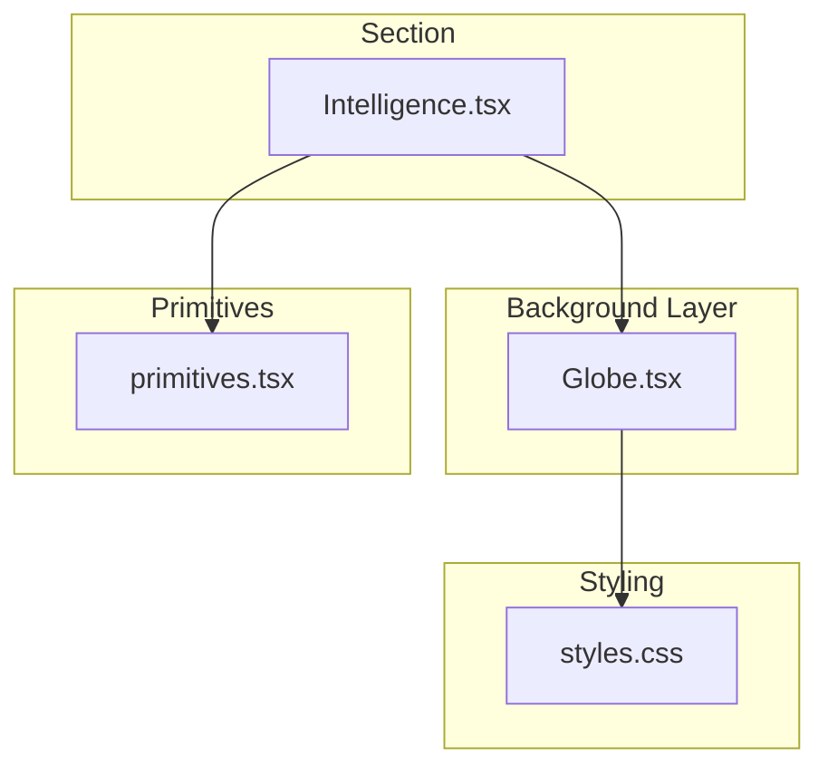
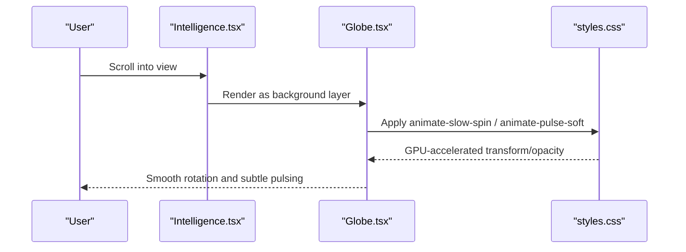
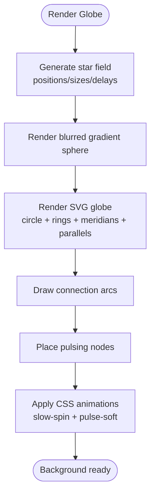
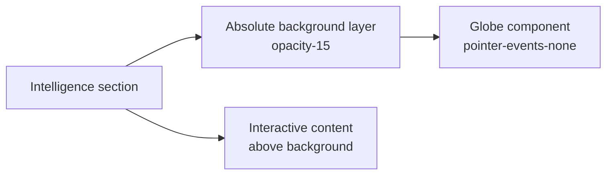
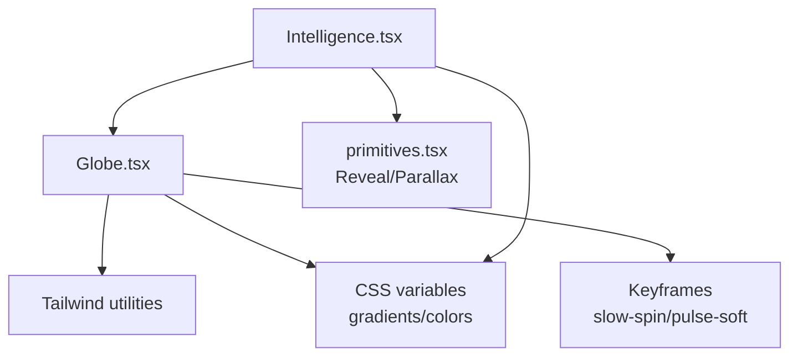

# Animated Globe Visualization

<cite>
**Referenced Files in This Document**
- [Globe.tsx](file://src/components/site/Globe.tsx)
- [Intelligence.tsx](file://src/components/site/Intelligence.tsx)
- [styles.css](file://src/styles.css)
- [primitives.tsx](file://src/components/site/primitives.tsx)
- [use-mobile.tsx](file://src/hooks/use-mobile.tsx)
</cite>

## Table of Contents

1. [Introduction](#introduction)
2. [Project Structure](#project-structure)
3. [Core Components](#core-components)
4. [Architecture Overview](#architecture-overview)
5. [Detailed Component Analysis](#detailed-component-analysis)
6. [Dependency Analysis](#dependency-analysis)
7. [Performance Considerations](#performance-considerations)
8. [Troubleshooting Guide](#troubleshooting-guide)
9. [Conclusion](#conclusion)
10. [Appendices](#appendices)

## Introduction

This document explains the animated globe visualization used as a visual background effect for the Intelligence section. The component composes a star field, a blurred gradient sphere, and an SVG globe with meridians, parallels, connection arcs, and pulsing nodes. It uses CSS animations for rotation and subtle pulsing effects, and integrates with the parent Intelligence component via opacity, positioning, and responsive sizing. The implementation prioritizes performance by avoiding heavy WebGL workloads and relying on GPU-accelerated CSS transforms and gradients.

## Project Structure

The globe is implemented as a standalone React component and embedded within the Intelligence section as a decorative background layer. Styling and animations are centralized in the global stylesheet. Shared UI primitives provide parallax and reveal behaviors used elsewhere in the site.

**Diagram sources**

- [Intelligence.tsx:411-416](file://src/components/site/Intelligence.tsx#L411-L416)
- [Globe.tsx:16-129](file://src/components/site/Globe.tsx#L16-L129)
- [styles.css:110-118](file://src/styles.css#L110-L118)
- [styles.css:214-267](file://src/styles.css#L214-L267)
- [primitives.tsx:69-111](file://src/components/site/primitives.tsx#L69-L111)

**Section sources**

- [Intelligence.tsx:411-416](file://src/components/site/Intelligence.tsx#L411-L416)
- [Globe.tsx:16-129](file://src/components/site/Globe.tsx#L16-L129)
- [styles.css:110-118](file://src/styles.css#L110-L118)
- [styles.css:214-267](file://src/styles.css#L214-L267)
- [primitives.tsx:69-111](file://src/components/site/primitives.tsx#L69-L111)

## Core Components

- Globe: Renders a decorative, rotating globe with a star field, blurred glow, SVG grid lines, dashed orbital ring, connection arcs, and pulsing nodes. Uses CSS animations for rotation and pulse effects.
- Intelligence: Hosts the interactive questionnaire and includes the Globe as a background layer with controlled opacity and absolute positioning.
- Styles: Define color tokens, gradients, shadows, and keyframe animations (slow spin, soft pulse, rise).
- Primitives: Provide reusable utilities like Parallax and Reveal that enhance scroll-based motion and entrance animations.

Key responsibilities:

- Globe: Visual composition and animation orchestration via CSS classes and inline styles.
- Intelligence: Layout, content flow, and integration of the Globe background.
- Styles: Centralized theming and animation definitions.
- Primitives: Motion utilities used across sections.

**Section sources**

- [Globe.tsx:1-132](file://src/components/site/Globe.tsx#L1-L132)
- [Intelligence.tsx:411-416](file://src/components/site/Intelligence.tsx#L411-L416)
- [styles.css:110-118](file://src/styles.css#L110-L118)
- [styles.css:214-267](file://src/styles.css#L214-L267)
- [primitives.tsx:69-111](file://src/components/site/primitives.tsx#L69-L111)

## Architecture Overview

The globe is layered behind the Intelligence content using absolute positioning and low opacity to create depth without interfering with interactions. Animations are declarative CSS keyframes applied via utility classes. The design avoids per-frame JavaScript updates for the globe, ensuring smooth rendering on all devices.

**Diagram sources**

- [Intelligence.tsx:411-416](file://src/components/site/Intelligence.tsx#L411-L416)
- [Globe.tsx:43-46](file://src/components/site/Globe.tsx#L43-L46)
- [styles.css:257-267](file://src/styles.css#L257-L267)

## Detailed Component Analysis

### Globe Component

- Star field: A precomputed array of 90 stars with randomized positions, sizes, and staggered animation delays. Each star is a small absolutely positioned element with a soft pulse animation.
- Blurred sphere: A full-size rounded div with a radial gradient and blur filter to simulate a glowing orb behind the SVG globe.
- SVG globe:
  - Base circle with radial fill and linear rim stroke.
  - Dashed outer ring for a subtle orbital feel.
  - Meridians and parallels drawn as ellipses to suggest latitude/longitude lines.
  - Connection arcs between points to imply network links.
  - Pulsing nodes at specific coordinates with staggered delays.
- Rotation: The entire SVG rotates slowly via a CSS keyframe animation class.
- Accessibility: The SVG is marked aria-hidden since it is purely decorative.

**Diagram sources**

- [Globe.tsx:1-10](file://src/components/site/Globe.tsx#L1-L10)
- [Globe.tsx:22-37](file://src/components/site/Globe.tsx#L22-L37)
- [Globe.tsx:39-42](file://src/components/site/Globe.tsx#L39-L42)
- [Globe.tsx:43-128](file://src/components/site/Globe.tsx#L43-L128)
- [styles.css:257-267](file://src/styles.css#L257-L267)

**Section sources**

- [Globe.tsx:1-132](file://src/components/site/Globe.tsx#L1-L132)
- [styles.css:214-267](file://src/styles.css#L214-L267)

### Integration with Intelligence

- Positioning: The Globe is placed inside a container with absolute inset positioning and pointer-events disabled so it does not intercept user interactions.
- Opacity: The background layer wraps the Globe with a low opacity to keep it subtle behind the content.
- Responsive sizing: The globe uses vmin units to scale proportionally to viewport size, ensuring consistent appearance across devices.
- Content overlay: The actual Intelligence content sits above the background layer in normal document flow.

**Diagram sources**

- [Intelligence.tsx:411-416](file://src/components/site/Intelligence.tsx#L411-L416)
- [Globe.tsx:16-21](file://src/components/site/Globe.tsx#L16-L21)

**Section sources**

- [Intelligence.tsx:411-416](file://src/components/site/Intelligence.tsx#L411-L416)
- [Globe.tsx:16-21](file://src/components/site/Globe.tsx#L16-L21)

### Animation System

- Slow spin: A 90-second infinite linear rotation applied to the SVG globe for a gentle, continuous movement.
- Soft pulse: A 2.6-second ease-in-out opacity oscillation used for stars and nodes to add life without distraction.
- Rise: Entrance animations for content elements when revealed by IntersectionObserver.

These animations are defined once in the stylesheet and reused via utility classes, minimizing runtime overhead.

**Section sources**

- [styles.css:214-267](file://src/styles.css#L214-L267)
- [Globe.tsx:43-46](file://src/components/site/Globe.tsx#L43-L46)
- [Globe.tsx:22-37](file://src/components/site/Globe.tsx#L22-L37)
- [Globe.tsx:117-127](file://src/components/site/Globe.tsx#L117-L127)

### Parallax and Motion Utilities

- Parallax: A lightweight utility that translates elements based on scroll position using requestAnimationFrame and respects reduced motion preferences.
- Reveal: Uses IntersectionObserver to trigger entrance animations only when elements enter the viewport.

While not directly used by the Globe, these utilities inform the broader motion strategy of the site and can be combined with the globe for advanced effects if needed.

**Section sources**

- [primitives.tsx:69-111](file://src/components/site/primitives.tsx#L69-L111)
- [primitives.tsx:113-154](file://src/components/site/primitives.tsx#L113-L154)

## Dependency Analysis

- Globe depends on:
  - Tailwind utility classes for layout and spacing.
  - Custom CSS variables for gradients and colors.
  - Global keyframe animations for rotation and pulsing.
- Intelligence depends on:
  - Globe for background decoration.
  - Primitives for reveal animations and optional parallax usage elsewhere.
  - Theme variables for consistent styling.

**Diagram sources**

- [Globe.tsx:16-129](file://src/components/site/Globe.tsx#L16-L129)
- [Intelligence.tsx:411-416](file://src/components/site/Intelligence.tsx#L411-L416)
- [styles.css:110-118](file://src/styles.css#L110-L118)
- [styles.css:214-267](file://src/styles.css#L214-L267)
- [primitives.tsx:69-154](file://src/components/site/primitives.tsx#L69-L154)

**Section sources**

- [Globe.tsx:16-129](file://src/components/site/Globe.tsx#L16-L129)
- [Intelligence.tsx:411-416](file://src/components/site/Intelligence.tsx#L411-L416)
- [styles.css:110-118](file://src/styles.css#L110-L118)
- [styles.css:214-267](file://src/styles.css#L214-L267)
- [primitives.tsx:69-154](file://src/components/site/primitives.tsx#L69-L154)

## Performance Considerations

- No WebGL: The globe avoids canvas/WebGL entirely, reducing memory pressure and complexity while still delivering a visually rich effect.
- GPU-accelerated animations: Transform and opacity changes are handled by CSS keyframes, which browsers optimize efficiently.
- Minimal DOM: The star field uses a fixed number of lightweight span elements; no per-frame JS updates occur after render.
- Reduced motion support: Motion utilities respect prefers-reduced-motion to avoid unnecessary animations for users who prefer reduced motion.
- Viewport-relative sizing: Using vmin ensures the globe scales without reflows or expensive recalculations.
- Background isolation: Absolute positioning and pointer-events-none ensure the background does not participate in hit-testing, improving interaction performance.

[No sources needed since this section provides general guidance]

## Troubleshooting Guide

- Globe not visible:
  - Ensure the parent container has sufficient height and overflow settings to allow absolute positioning to render correctly.
  - Verify opacity on the background wrapper is not set too low to hide the globe entirely.
- Animations not playing:
  - Confirm the relevant CSS classes are present and the stylesheet is loaded.
  - Check browser console for CSS errors and verify that keyframe names match those defined in the stylesheet.
- Excessive CPU usage:
  - Reduce the number of stars or disable animations on low-power devices by leveraging media queries or feature detection.
  - Avoid adding additional per-frame JavaScript animations alongside CSS animations.
- Interaction issues:
  - Ensure pointer-events is disabled on the background layer so clicks pass through to interactive content.
- Memory concerns:
  - Keep the star count modest and avoid dynamically creating large numbers of elements during runtime.
  - Reuse static data structures (like the precomputed star array) rather than regenerating them on each render.

**Section sources**

- [Globe.tsx:16-21](file://src/components/site/Globe.tsx#L16-L21)
- [Globe.tsx:22-37](file://src/components/site/Globe.tsx#L22-L37)
- [styles.css:214-267](file://src/styles.css#L214-L267)
- [primitives.tsx:81-104](file://src/components/site/primitives.tsx#L81-L104)

## Conclusion

The animated globe provides an immersive, performant background for the Intelligence section by combining a lightweight star field, a blurred gradient sphere, and an SVG globe enhanced with CSS animations. Its design emphasizes simplicity and efficiency, avoiding heavy WebGL workloads while maintaining visual appeal. Integration with the parent component is straightforward through opacity and positioning controls, and the overall approach ensures smooth animations across devices and screen sizes.

[No sources needed since this section summarizes without analyzing specific files]

## Appendices

### Customization Examples

- Adjust rotation speed: Modify the duration in the slow-spin keyframe or apply a different animation class to the SVG globe.
- Change particle density: Increase or decrease the length of the star field array to add more or fewer stars.
- Update color scheme: Edit the CSS custom properties for gradients and colors to align with brand guidelines.
- Control opacity: Adjust the opacity value on the background wrapper to make the globe more or less prominent.
- Scale behavior: Change vmin values to alter the globe’s relative size on different screens.

[No sources needed since this section provides general guidance]

### Browser Compatibility and Fallbacks

- CSS animations: Widely supported in modern browsers; fallbacks degrade gracefully to static visuals if animations are unsupported.
- Gradients and filters: Supported across major browsers; older environments may show simplified visuals without blur or gradients.
- Reduced motion: Respect user preferences via media queries to disable animations for accessibility.
- Feature detection: If extending to WebGL later, detect support and fall back to the current CSS/SVG implementation when unavailable.

[No sources needed since this section provides general guidance]

### Memory Management Strategies

- Precompute static data: Generate star positions once at module scope to avoid repeated allocations.
- Avoid dynamic DOM churn: Do not recreate elements on every render; reuse existing nodes.
- Debounce or throttle external events: When integrating with scroll or resize handlers, use requestAnimationFrame and passive listeners to minimize layout thrashing.
- Clean up observers and listeners: Ensure IntersectionObserver and event listeners are disconnected when components unmount.

**Section sources**

- [Globe.tsx:1-10](file://src/components/site/Globe.tsx#L1-L10)
- [primitives.tsx:81-104](file://src/components/site/primitives.tsx#L81-L104)
- [primitives.tsx:125-139](file://src/components/site/primitives.tsx#L125-L139)
