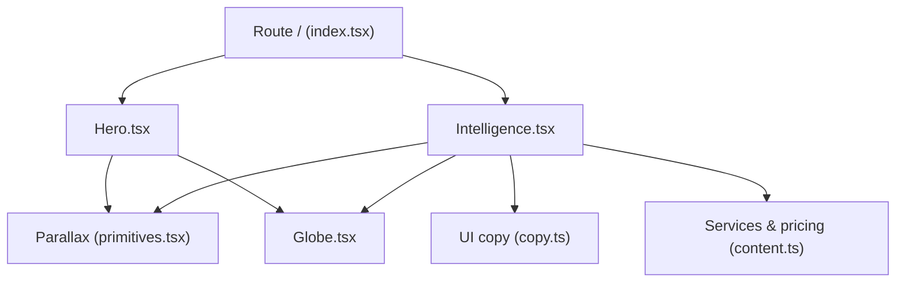
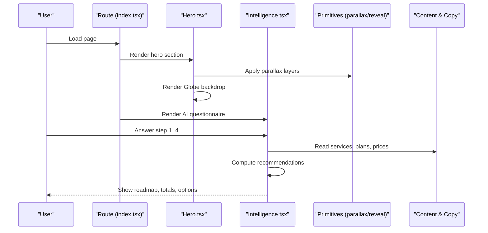
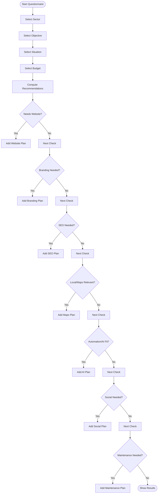
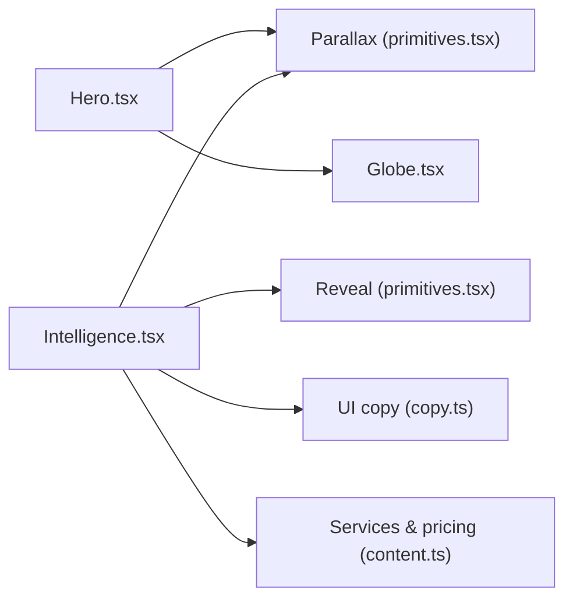

# Interactive Features

<cite>
**Referenced Files in This Document**
- [index.tsx](file://src/routes/index.tsx)
- [Hero.tsx](file://src/components/site/Hero.tsx)
- [Intelligence.tsx](file://src/components/site/Intelligence.tsx)
- [Globe.tsx](file://src/components/site/Globe.tsx)
- [primitives.tsx](file://src/components/site/primitives.tsx)
- [use-mobile.tsx](file://src/hooks/use-mobile.tsx)
- [copy.ts](file://src/lib/copy.ts)
- [content.ts](file://src/lib/content.ts)
</cite>

## Table of Contents

1. [Introduction](#introduction)
2. [Project Structure](#project-structure)
3. [Core Components](#core-components)
4. [Architecture Overview](#architecture-overview)
5. [Detailed Component Analysis](#detailed-component-analysis)
6. [Dependency Analysis](#dependency-analysis)
7. [Performance Considerations](#performance-considerations)
8. [Troubleshooting Guide](#troubleshooting-guide)
9. [Conclusion](#conclusion)
10. [Appendices](#appendices)

## Introduction

This document explains the interactive features that drive advanced user engagement on the site: an AI-powered business analysis questionnaire, an animated globe visualization, parallax scrolling and reveal animations, and responsive interactions optimized for mobile devices. It covers how the questionnaire flows through questions, processes answers, and generates tailored results; how the globe is rendered with SVG and CSS effects; how parallax and reveal primitives provide smooth transitions; and how to integrate these elements with forms, state management, and data visualization. Accessibility considerations and guidelines for adding new interactive features are also included.

## Project Structure

The interactive experience is composed of a few key components and utilities:

- The route composes page sections including Hero and Intelligence.
- Hero integrates a background video, parallax layers, and a subtle Globe backdrop.
- Intelligence implements the multi-step AI strategy tool with step navigation, answer collection, and result generation.
- primitives.tsx provides reusable Parallax and Reveal components used across the site.
- use-mobile.tsx exposes a mobile breakpoint hook for responsive behavior.
- copy.ts and content.ts centralize UI text and service/pricing data consumed by the interactive components.

**Diagram sources**

- [index.tsx:13-58](file://src/routes/index.tsx#L13-L58)
- [Hero.tsx:15-121](file://src/components/site/Hero.tsx#L15-L121)
- [Intelligence.tsx:374-637](file://src/components/site/Intelligence.tsx#L374-L637)
- [primitives.tsx:69-111](file://src/components/site/primitives.tsx#L69-L111)
- [Globe.tsx:12-132](file://src/components/site/Globe.tsx#L12-L132)
- [copy.ts:97-194](file://src/lib/copy.ts#L97-L194)
- [content.ts:77-346](file://src/lib/content.ts#L77-L346)

**Section sources**

- [index.tsx:13-58](file://src/routes/index.tsx#L13-L58)
- [Hero.tsx:15-121](file://src/components/site/Hero.tsx#L15-L121)
- [Intelligence.tsx:374-637](file://src/components/site/Intelligence.tsx#L374-L637)
- [primitives.tsx:69-111](file://src/components/site/primitives.tsx#L69-L111)
- [Globe.tsx:12-132](file://src/components/site/Globe.tsx#L12-L132)
- [copy.ts:97-194](file://src/lib/copy.ts#L97-L194)
- [content.ts:77-346](file://src/lib/content.ts#L77-L346)

## Core Components

- AI Strategy Tool (Intelligence): A four-step questionnaire that collects sector, objective, current situation, and budget, then computes a personalized recommendation set with pricing summaries and optional add-ons.
- Animated Globe (Globe): An SVG-based globe with meridians, parallels, connection arcs, pulsing nodes, and a star field, enhanced with CSS animations and gradients.
- Parallax and Reveal (primitives): Lightweight scroll-driven parallax and intersection-observer-based reveal animations that respect reduced motion preferences.
- Mobile Hook (use-mobile): A simple media query hook to detect mobile viewport width.

These components collaborate to deliver a cohesive, performant, and accessible interactive experience.

**Section sources**

- [Intelligence.tsx:374-637](file://src/components/site/Intelligence.tsx#L374-L637)
- [Globe.tsx:12-132](file://src/components/site/Globe.tsx#L12-L132)
- [primitives.tsx:69-154](file://src/components/site/primitives.tsx#L69-L154)
- [use-mobile.tsx:1-20](file://src/hooks/use-mobile.tsx#L1-L20)

## Architecture Overview

The application composes interactive experiences at the route level, which mounts Hero and Intelligence alongside other sections. Hero uses parallax layers and a subtle Globe backdrop to create depth. Intelligence orchestrates the AI questionnaire flow, using local React state to manage steps and answers, and computes recommendations based on centralized service and pricing data.

**Diagram sources**

- [index.tsx:13-58](file://src/routes/index.tsx#L13-L58)
- [Hero.tsx:15-121](file://src/components/site/Hero.tsx#L15-L121)
- [Intelligence.tsx:374-637](file://src/components/site/Intelligence.tsx#L374-L637)
- [primitives.tsx:69-154](file://src/components/site/primitives.tsx#L69-L154)
- [content.ts:77-346](file://src/lib/content.ts#L77-L346)
- [copy.ts:97-194](file://src/lib/copy.ts#L97-L194)

## Detailed Component Analysis

### AI Strategy Tool (Intelligence)

The AI strategy tool guides users through a four-step questionnaire:

- Step 1: Sector selection (e.g., restaurant, hotel, health, legal, real estate, retail, crafts, beauty, tech, other).
- Step 2: Priority objective (visibility, local customers, leads, brand building, automation, online sales/bookings).
- Step 3: Current situation (no site, outdated site, exists but low conversion, solid and scaling).
- Step 4: Budget range (monthly tiers).

Answer processing and result generation:

- The component maintains local state for the current step and collected answers.
- On completion, it computes recommendations by evaluating:
  - Whether a website build or upgrade is needed based on situation and objectives.
  - Whether branding is recommended based on objective or situation.
  - Whether SEO is recommended based on objective or situation.
  - Whether Google Maps optimization is relevant for local sectors or objectives.
  - Whether AI assistant support fits automation needs or high budgets.
  - Whether social media maintenance is appropriate for branding goals and tier.
  - Whether maintenance is sensible when a site is built or already live.
- Results include plan names, one-time/monthly/yearly costs, and rationale per recommendation.
- Totals are computed for setup, monthly retainers, and yearly items.
- Users can share results via WhatsApp with a pre-filled message constructed from their selections and language.

**Diagram sources**

- [Intelligence.tsx:239-372](file://src/components/site/Intelligence.tsx#L239-L372)

Implementation highlights:

- State management: Local React state tracks step index and answers map.
- Memoization: Recommendations are recomputed only when necessary using memoized logic.
- Pricing integration: Prices and periods come from centralized service definitions and are formatted via i18n-aware price formatting.
- Shareability: Final results can be sent via WhatsApp with a localized message string.

Accessibility notes:

- Navigation between steps uses buttons with descriptive labels and aria attributes where applicable.
- Progress indicators communicate current step and completion.

**Section sources**

- [Intelligence.tsx:374-637](file://src/components/site/Intelligence.tsx#L374-L637)
- [Intelligence.tsx:239-372](file://src/components/site/Intelligence.tsx#L239-L372)
- [copy.ts:97-194](file://src/lib/copy.ts#L97-L194)
- [content.ts:77-346](file://src/lib/content.ts#L77-L346)

### Animated Globe (Globe)

The Globe component renders a stylized, rotating SVG globe with:

- A generated star field using deterministic pseudo-random positions and sizes.
- A blurred gradient orb behind the globe for atmospheric glow.
- Meridians and parallels drawn as ellipses to simulate latitude/longitude lines.
- Connection arcs with dashed strokes and staggered pulse animations.
- Pulsing node markers at key coordinates.

Effects and performance:

- Animations rely on CSS classes and transforms rather than heavy JS loops.
- The globe is marked as decorative with aria-hidden to avoid screen reader noise.
- Star field and nodes use minimal DOM nodes and CSS animations for smoothness.

Integration:

- Used as a background element in Hero and Intelligence sections to reinforce the global, strategic theme.

**Section sources**

- [Globe.tsx:1-132](file://src/components/site/Globe.tsx#L1-L132)
- [Hero.tsx:15-121](file://src/components/site/Hero.tsx#L15-L121)
- [Intelligence.tsx:412-416](file://src/components/site/Intelligence.tsx#L412-L416)

### Parallax Scrolling and Smooth Transitions (Primitives)

- Parallax: A lightweight wrapper that translates its children based on scroll position using requestAnimationFrame and respects prefers-reduced-motion. Uses passive scroll listeners for performance.
- Reveal: Triggers entrance animations when elements enter the viewport via IntersectionObserver, with configurable delay and no layout shifts before reveal.

Usage patterns:

- Applied to hero backgrounds, service cards, and section headings to create layered depth and progressive disclosure.
- Combined with CSS transitions and transforms for smooth visual feedback.

Mobile considerations:

- Reduced motion preference is respected automatically.
- Passive event listeners minimize main thread contention during scroll.

**Section sources**

- [primitives.tsx:69-154](file://src/components/site/primitives.tsx#L69-L154)
- [Hero.tsx:15-121](file://src/components/site/Hero.tsx#L15-L121)
- [Services.tsx:26-120](file://src/components/site/Services.tsx#L26-L120)

### Mobile-Specific Interactions and Performance

- Mobile detection: useIsMobile hook leverages matchMedia to determine if the viewport is under a defined breakpoint.
- Responsive behavior: Components use Tailwind responsive utilities to adapt layouts and spacing.
- Performance optimizations:
  - Parallax uses requestAnimationFrame and passive scroll listeners.
  - Reveal uses IntersectionObserver to avoid unnecessary computations until elements are visible.
  - Globe relies on CSS animations and SVG, avoiding heavy WebGL overhead while still delivering engaging visuals.

Touch gestures:

- The site does not implement custom touch gesture handlers; interactions rely on standard click/tap events and native browser behaviors.
- Buttons and links are sized appropriately for touch targets.

**Section sources**

- [use-mobile.tsx:1-20](file://src/hooks/use-mobile.tsx#L1-L20)
- [primitives.tsx:69-154](file://src/components/site/primitives.tsx#L69-L154)
- [Hero.tsx:15-121](file://src/components/site/Hero.tsx#L15-L121)

### Integrating Interactive Elements with Forms, State Management, and Data Visualization

- Form handling: The questionnaire uses controlled inputs via button selections that update local state and advance steps.
- State management: Local React state (useState) manages step progression and answers; memoization ensures efficient recomputation of results.
- Data visualization: Results display plan names, pricing, and rationale in a structured list with summary totals for setup, monthly, and yearly costs. Optional add-ons are listed for clarity.

Extensibility:

- New questions can be added by extending the steps array and corresponding option sets.
- Recommendation logic can be extended by adding conditions in the computation function.
- Data sources (services, plans, prices) are centralized and can be updated without changing component logic.

**Section sources**

- [Intelligence.tsx:374-637](file://src/components/site/Intelligence.tsx#L374-L637)
- [Intelligence.tsx:239-372](file://src/components/site/Intelligence.tsx#L239-L372)
- [content.ts:77-346](file://src/lib/content.ts#L77-L346)

## Dependency Analysis

Interactive components depend on shared primitives and centralized data:

- Hero depends on Parallax and Globe for visual depth and animation.
- Intelligence depends on Parallax, Reveal, UI copy, and service/pricing data for questionnaire flow and results.
- All components benefit from consistent styling and i18n utilities.

**Diagram sources**

- [Hero.tsx:15-121](file://src/components/site/Hero.tsx#L15-L121)
- [Intelligence.tsx:374-637](file://src/components/site/Intelligence.tsx#L374-L637)
- [primitives.tsx:69-154](file://src/components/site/primitives.tsx#L69-L154)
- [copy.ts:97-194](file://src/lib/copy.ts#L97-L194)
- [content.ts:77-346](file://src/lib/content.ts#L77-L346)

**Section sources**

- [Hero.tsx:15-121](file://src/components/site/Hero.tsx#L15-L121)
- [Intelligence.tsx:374-637](file://src/components/site/Intelligence.tsx#L374-L637)
- [primitives.tsx:69-154](file://src/components/site/primitives.tsx#L69-L154)
- [copy.ts:97-194](file://src/lib/copy.ts#L97-L194)
- [content.ts:77-346](file://src/lib/content.ts#L77-L346)

## Performance Considerations

- Prefer CSS animations and transforms over JavaScript-heavy animations for better frame rates.
- Use requestAnimationFrame for scroll-driven updates and ensure passive event listeners.
- Respect prefers-reduced-motion to improve accessibility and reduce motion-induced performance costs.
- Keep DOM nodes minimal for decorative elements (e.g., star field) and leverage CSS for effects like blur and gradients.
- Defer non-critical work until elements are visible using IntersectionObserver.
- Avoid heavy WebGL unless necessary; SVG + CSS can achieve compelling visuals with lower overhead.

[No sources needed since this section provides general guidance]

## Troubleshooting Guide

Common issues and resolutions:

- Parallax not moving: Ensure the container has sufficient height and that the element is within the viewport; verify that reduced motion is not enabled.
- Reveal animations not triggering: Confirm the element is observed by IntersectionObserver and that thresholds/margins are appropriate.
- Globe appears too large/small: Adjust sizing units (vmin) and ensure responsive constraints are applied.
- Questionnaire results seem incorrect: Validate input selections and review recommendation logic conditions; check service and pricing data integrity.

**Section sources**

- [primitives.tsx:69-154](file://src/components/site/primitives.tsx#L69-L154)
- [Globe.tsx:12-132](file://src/components/site/Globe.tsx#L12-L132)
- [Intelligence.tsx:239-372](file://src/components/site/Intelligence.tsx#L239-L372)

## Conclusion

The interactive features combine a thoughtful AI strategy questionnaire, an elegant animated globe, and smooth parallax/reveal animations to deliver an engaging user experience. The implementation emphasizes performance, accessibility, and maintainability by leveraging lightweight primitives, centralized data, and CSS-driven effects. Extending the system is straightforward through modular components and centralized configuration.

[No sources needed since this section summarizes without analyzing specific files]

## Appendices

### Accessibility Guidelines for Interactive Features

- Keyboard navigation: Ensure all interactive elements are focusable and operable via keyboard.
- Screen reader compatibility: Mark decorative elements as aria-hidden; provide meaningful labels for controls and progress indicators.
- Motion preferences: Respect prefers-reduced-motion to disable or simplify animations.
- Contrast and readability: Maintain sufficient color contrast for text and interactive states.

[No sources needed since this section provides general guidance]

### Adding New Interactive Features

- Create reusable primitives for common interactions (e.g., parallax, reveal, modals).
- Centralize content and configuration (copy, services, pricing) to keep components focused on behavior.
- Use local state for transient interactions and memoization for expensive computations.
- Test across devices and browsers; validate performance with scroll-heavy pages.
- Include accessibility checks early in development.

[No sources needed since this section provides general guidance]
