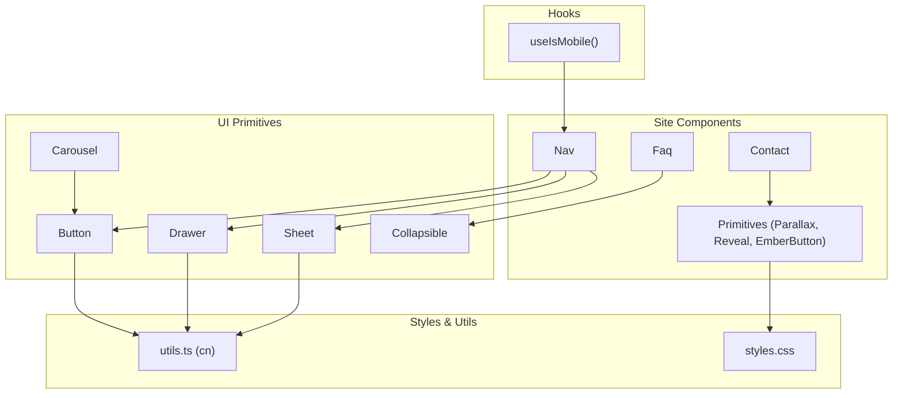
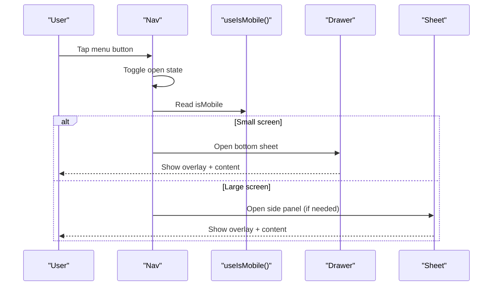
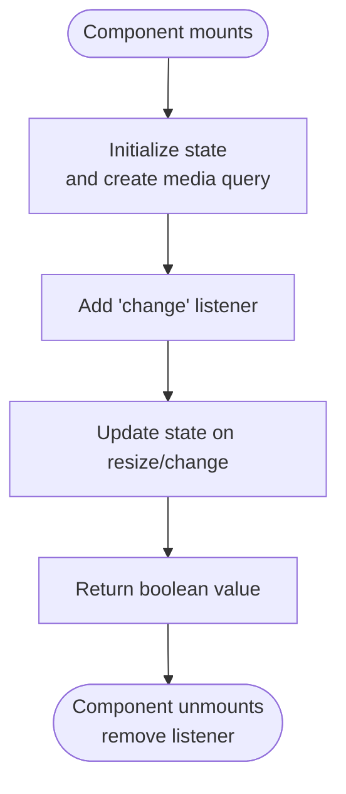
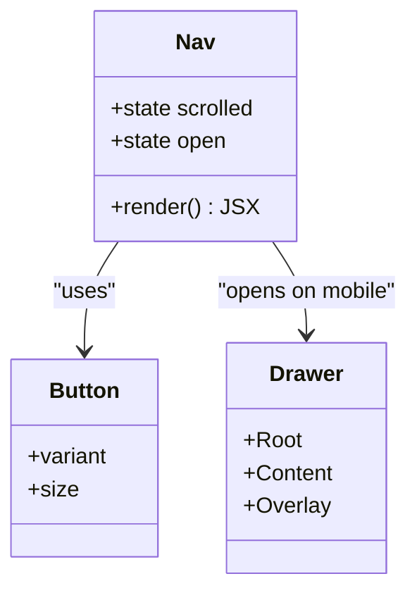
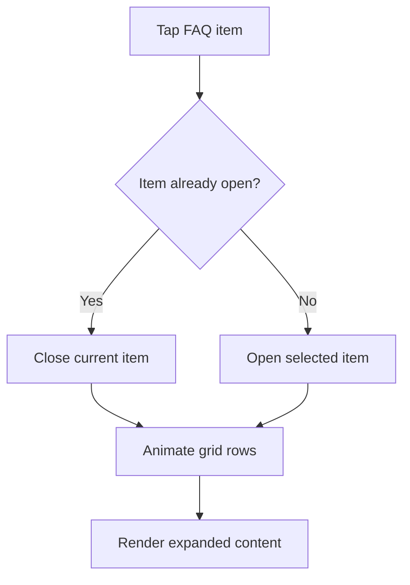
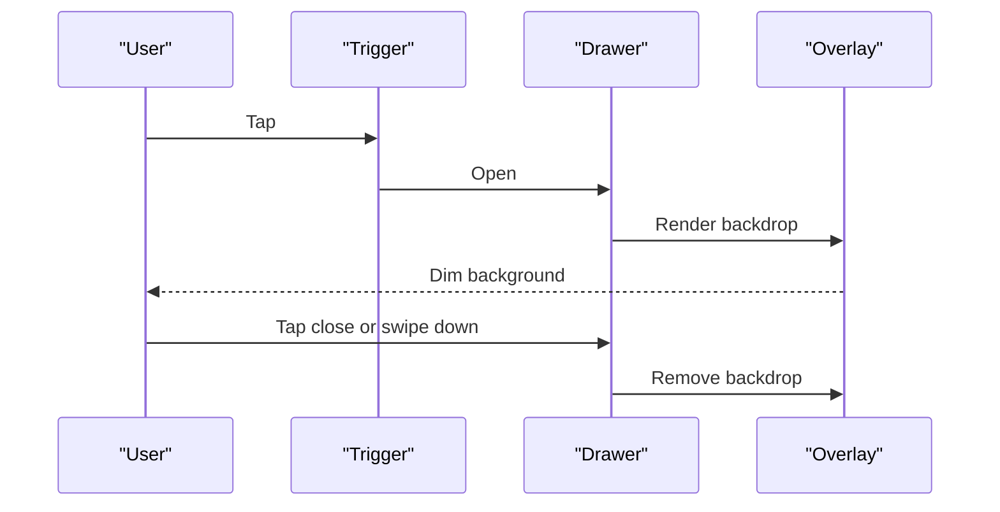
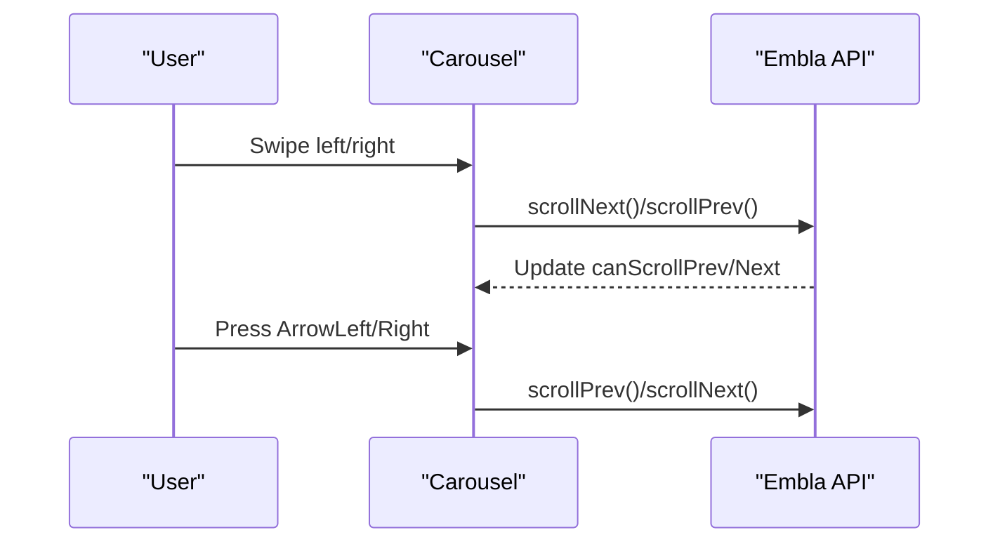
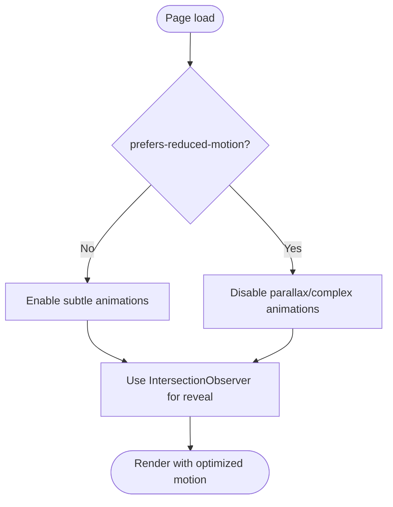
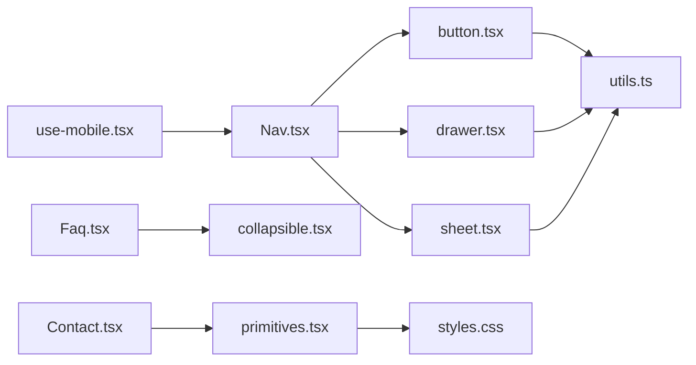

# Mobile Interactions & Responsive Design

<cite>
**Referenced Files in This Document**
- [use-mobile.tsx](file://src/hooks/use-mobile.tsx)
- [Nav.tsx](file://src/components/site/Nav.tsx)
- [button.tsx](file://src/components/ui/button.tsx)
- [collapsible.tsx](file://src/components/ui/collapsible.tsx)
- [drawer.tsx](file://src/components/ui/drawer.tsx)
- [sheet.tsx](file://src/components/ui/sheet.tsx)
- [carousel.tsx](file://src/components/ui/carousel.tsx)
- [primitives.tsx](file://src/components/site/primitives.tsx)
- [styles.css](file://src/styles.css)
- [utils.ts](file://src/lib/utils.ts)
- [Faq.tsx](file://src/components/site/Faq.tsx)
- [Contact.tsx](file://src/components/site/Contact.tsx)
</cite>

## Table of Contents

1. Introduction
2. Project Structure
3. Core Components
4. Architecture Overview
5. Detailed Component Analysis
6. Dependency Analysis
7. Performance Considerations
8. Troubleshooting Guide
9. Conclusion
10. Appendices

## Introduction

This document explains how the application implements mobile-specific interactions and responsive design patterns across its interactive features. It focuses on device capability detection with a custom hook, touch-friendly navigation and gestures, adaptive layouts using responsive utilities, and performance optimizations for mobile devices. It also provides accessibility guidance for mobile users and testing strategies to ensure cross-device compatibility.

## Project Structure

The project organizes mobile-related behavior into:

- A reusable hook for detecting mobile breakpoints
- UI primitives and components that adapt to screen sizes and input methods
- Global styles defining responsive typography, animations, and theme tokens
- Utility functions for class composition used throughout the app

**Diagram sources**

- [use-mobile.tsx:5-18](file://src/hooks/use-mobile.tsx#L5-L18)
- [Nav.tsx:15-129](file://src/components/site/Nav.tsx#L15-L129)
- [button.tsx:7-49](file://src/components/ui/button.tsx#L7-L49)
- [drawer.tsx:6-99](file://src/components/ui/drawer.tsx#L6-L99)
- [sheet.tsx:10-122](file://src/components/ui/sheet.tsx#L10-L122)
- [carousel.tsx:41-132](file://src/components/ui/carousel.tsx#L41-L132)
- [collapsible.tsx:5-11](file://src/components/ui/collapsible.tsx#L5-L11)
- [primitives.tsx:69-154](file://src/components/site/primitives.tsx#L69-L154)
- [styles.css:21-69](file://src/styles.css#L21-L69)
- [utils.ts:4-6](file://src/lib/utils.ts#L4-L6)

**Section sources**

- [use-mobile.tsx:1-19](file://src/hooks/use-mobile.tsx#L1-L19)
- [styles.css:21-69](file://src/styles.css#L21-L69)
- [utils.ts:1-7](file://src/lib/utils.ts#L1-L7)

## Core Components

- Device capability detection: useIsMobile hook returns a boolean indicating whether the viewport is below a mobile breakpoint. It uses matchMedia and listens for changes to keep state in sync.
- Navigation: The site header adapts between desktop links and a mobile menu toggle, with a slide-in panel for small screens.
- Touch-friendly controls: Button component provides consistent sizing and focus states; EmberButton offers large tap targets and clear visual feedback.
- Collapsible content: Accordion-style FAQ uses a simple open/close pattern suitable for touch interaction.
- Overlays and drawers: Drawer and Sheet provide bottom or side panels optimized for mobile gestures and keyboard/screen reader support.
- Carousel: Swipeable carousel with keyboard navigation and accessible labels.

**Section sources**

- [use-mobile.tsx:5-18](file://src/hooks/use-mobile.tsx#L5-L18)
- [Nav.tsx:15-129](file://src/components/site/Nav.tsx#L15-L129)
- [button.tsx:7-49](file://src/components/ui/button.tsx#L7-L49)
- [Faq.tsx:9-57](file://src/components/site/Faq.tsx#L9-L57)
- [drawer.tsx:6-99](file://src/components/ui/drawer.tsx#L6-L99)
- [sheet.tsx:10-122](file://src/components/ui/sheet.tsx#L10-L122)
- [carousel.tsx:41-132](file://src/components/ui/carousel.tsx#L41-L132)

## Architecture Overview

The mobile experience is built around a central breakpoint-aware hook and composable UI primitives. Components conditionally render different layouts based on screen size and user input capabilities. Animations are reduced when the user prefers reduced motion.

**Diagram sources**

- [Nav.tsx:15-129](file://src/components/site/Nav.tsx#L15-L129)
- [use-mobile.tsx:5-18](file://src/hooks/use-mobile.tsx#L5-L18)
- [drawer.tsx:6-99](file://src/components/ui/drawer.tsx#L6-L99)
- [sheet.tsx:10-122](file://src/components/ui/sheet.tsx#L10-L122)

## Detailed Component Analysis

### Mobile Breakpoint Detection (useIsMobile)

- Purpose: Provide a reactive boolean for “is mobile” based on a fixed breakpoint.
- Behavior: Initializes state, sets up a media query listener, updates on change, and cleans up listeners.
- Usage: Ideal for toggling mobile-only UI behaviors such as drawer vs. sidebar, simplified forms, or disabling heavy animations.

**Diagram sources**

- [use-mobile.tsx:5-18](file://src/hooks/use-mobile.tsx#L5-L18)

**Section sources**

- [use-mobile.tsx:1-19](file://src/hooks/use-mobile.tsx#L1-L19)

### Navigation and Mobile Menu

- Desktop: Horizontal link list and language switcher visible at larger breakpoints.
- Mobile: Hamburger button toggles a full-width panel with links and actions. Uses backdrop blur and border styling for clarity.
- Accessibility: Buttons have aria-labels; links are standard anchors.

**Diagram sources**

- [Nav.tsx:15-129](file://src/components/site/Nav.tsx#L15-L129)
- [button.tsx:7-49](file://src/components/ui/button.tsx#L7-L49)
- [drawer.tsx:6-99](file://src/components/ui/drawer.tsx#L6-L99)

**Section sources**

- [Nav.tsx:15-129](file://src/components/site/Nav.tsx#L15-L129)

### Touch-Friendly Buttons and Controls

- Button component defines consistent sizes and focus rings, ensuring adequate tap targets and clear focus visibility.
- EmberButton provides large, rounded buttons with strong contrast and hover/active states, suitable for primary calls-to-action on mobile.

Best practices applied:

- Use medium/large sizes for primary actions on small screens.
- Ensure sufficient padding and spacing between adjacent buttons.
- Keep icons within buttons sized appropriately for touch.

**Section sources**

- [button.tsx:7-49](file://src/components/ui/button.tsx#L7-L49)
- [primitives.tsx:198-241](file://src/components/site/primitives.tsx#L198-L241)

### Collapsible Sections (FAQ)

- Implements an accordion pattern with a single open item at a time.
- Uses CSS grid row animation for smooth expand/collapse transitions.
- Touch-friendly: entire row is clickable; icon rotates to indicate state.

**Diagram sources**

- [Faq.tsx:9-57](file://src/components/site/Faq.tsx#L9-L57)
- [collapsible.tsx:5-11](file://src/components/ui/collapsible.tsx#L5-L11)

**Section sources**

- [Faq.tsx:9-57](file://src/components/site/Faq.tsx#L9-L57)
- [collapsible.tsx:1-12](file://src/components/ui/collapsible.tsx#L1-L12)

### Overlays: Drawer and Sheet

- Drawer: Bottom sheet with handle and overlay, ideal for mobile actions and quick forms.
- Sheet: Side panel with configurable sides and animations, useful for settings or secondary navigation.
- Both include overlays, close buttons, and accessible labeling.

**Diagram sources**

- [drawer.tsx:6-99](file://src/components/ui/drawer.tsx#L6-L99)
- [sheet.tsx:10-122](file://src/components/ui/sheet.tsx#L10-L122)

**Section sources**

- [drawer.tsx:6-99](file://src/components/ui/drawer.tsx#L6-L99)
- [sheet.tsx:10-122](file://src/components/ui/sheet.tsx#L10-L122)

### Swipeable Carousel

- Provides horizontal or vertical orientation with Embla-based swipe handling.
- Keyboard navigation via arrow keys and accessible roles/labels for screen readers.
- Previous/Next buttons are positioned absolutely and disabled when not applicable.

**Diagram sources**

- [carousel.tsx:41-132](file://src/components/ui/carousel.tsx#L41-L132)
- [carousel.tsx:177-231](file://src/components/ui/carousel.tsx#L177-L231)

**Section sources**

- [carousel.tsx:1-241](file://src/components/ui/carousel.tsx#L1-L241)

### Adaptive Layouts and Responsive Utilities

- Tailwind utility classes drive responsive behavior (e.g., hidden/flex at specific breakpoints).
- Global styles define semantic color tokens and typography scales that adapt across devices.
- Custom utilities and keyframes are available for consistent motion and text treatments.

Key patterns:

- Hide/show elements by breakpoint (e.g., desktop nav vs. mobile menu).
- Use fluid typography and spacing for readability on small screens.
- Leverage backdrop blur and borders for layered UI without heavy assets.

**Section sources**

- [Nav.tsx:27-129](file://src/components/site/Nav.tsx#L27-L129)
- [styles.css:21-69](file://src/styles.css#L21-L69)
- [styles.css:155-177](file://src/styles.css#L155-L177)

### Performance Optimizations for Mobile

- Reduced motion: Parallax respects prefers-reduced-motion to avoid unnecessary transforms.
- Passive event listeners: Scroll and resize handlers use passive options to improve scrolling performance.
- Animation control: Reveal animations are lightweight and triggered on intersection to minimize initial load cost.
- Asset loading: Prefer inline SVGs and minimal external assets; use backdrop blur instead of heavy images where possible.

**Diagram sources**

- [primitives.tsx:69-111](file://src/components/site/primitives.tsx#L69-L111)
- [primitives.tsx:113-154](file://src/components/site/primitives.tsx#L113-L154)

**Section sources**

- [primitives.tsx:69-154](file://src/components/site/primitives.tsx#L69-L154)

## Dependency Analysis

- useIsMobile is a leaf dependency with no internal imports beyond React.
- Site components depend on UI primitives (Button, Drawer, Sheet) and shared utilities (cn).
- Styles and utilities are global and consumed across components.

**Diagram sources**

- [use-mobile.tsx:1-19](file://src/hooks/use-mobile.tsx#L1-L19)
- [Nav.tsx:1-129](file://src/components/site/Nav.tsx#L1-L129)
- [button.tsx:1-49](file://src/components/ui/button.tsx#L1-L49)
- [drawer.tsx:1-99](file://src/components/ui/drawer.tsx#L1-L99)
- [sheet.tsx:1-122](file://src/components/ui/sheet.tsx#L1-L122)
- [Faq.tsx:1-58](file://src/components/site/Faq.tsx#L1-L58)
- [collapsible.tsx:1-12](file://src/components/ui/collapsible.tsx#L1-L12)
- [Contact.tsx:1-161](file://src/components/site/Contact.tsx#L1-L161)
- [primitives.tsx:1-242](file://src/components/site/primitives.tsx#L1-L242)
- [styles.css:1-268](file://src/styles.css#L1-L268)
- [utils.ts:1-7](file://src/lib/utils.ts#L1-L7)

**Section sources**

- [use-mobile.tsx:1-19](file://src/hooks/use-mobile.tsx#L1-L19)
- [Nav.tsx:1-129](file://src/components/site/Nav.tsx#L1-L129)
- [button.tsx:1-49](file://src/components/ui/button.tsx#L1-L49)
- [drawer.tsx:1-99](file://src/components/ui/drawer.tsx#L1-L99)
- [sheet.tsx:1-122](file://src/components/ui/sheet.tsx#L1-L122)
- [Faq.tsx:1-58](file://src/components/site/Faq.tsx#L1-L58)
- [collapsible.tsx:1-12](file://src/components/ui/collapsible.tsx#L1-L12)
- [Contact.tsx:1-161](file://src/components/site/Contact.tsx#L1-L161)
- [primitives.tsx:1-242](file://src/components/site/primitives.tsx#L1-L242)
- [styles.css:1-268](file://src/styles.css#L1-L268)
- [utils.ts:1-7](file://src/lib/utils.ts#L1-L7)

## Performance Considerations

- Respect user preferences: Disable heavy animations when reduced motion is requested.
- Minimize layout thrash: Use passive event listeners for scroll/resize and batch DOM reads/writes.
- Optimize interactions: Prefer CSS transitions over JS-driven animations where possible.
- Reduce reflows: Avoid frequent style recalculations; leverage transform and opacity for animations.
- Network considerations: Defer non-critical assets and animations until after first paint.

[No sources needed since this section provides general guidance]

## Troubleshooting Guide

Common issues and resolutions:

- Mobile menu does not close after navigation: Ensure click handlers close the open state and that links trigger navigation.
- Carousel not swiping: Verify container has proper overflow and that Embla is initialized with correct orientation.
- Drawer/Sheet not closing: Confirm overlay and close button handlers are wired and that focus management is handled.
- Animations causing jank: Check for expensive transforms on large elements; prefer will-change sparingly and respect reduced motion.

**Section sources**

- [carousel.tsx:41-132](file://src/components/ui/carousel.tsx#L41-L132)
- [drawer.tsx:6-99](file://src/components/ui/drawer.tsx#L6-L99)
- [sheet.tsx:10-122](file://src/components/ui/sheet.tsx#L10-L122)
- [primitives.tsx:69-111](file://src/components/site/primitives.tsx#L69-L111)

## Conclusion

The application’s mobile experience is built on a clear separation of concerns: a breakpoint-aware hook drives conditional rendering, while composable UI primitives deliver consistent, accessible, and performant interactions. By following the patterns outlined here—touch-friendly controls, collapsible sections, overlays, and reduced-motion awareness—you can extend the system with new mobile-specific features while maintaining consistency and quality.

[No sources needed since this section summarizes without analyzing specific files]

## Appendices

### Responsive Breakpoints and Adaptive Layouts

- Breakpoint strategy: Use utility classes to show/hide elements and adjust layouts per screen size.
- Fluid typography and spacing: Scale text and spacing for readability on small screens.
- Consistent tokens: Rely on theme variables for colors and radii to maintain visual coherence.

**Section sources**

- [Nav.tsx:27-129](file://src/components/site/Nav.tsx#L27-L129)
- [styles.css:21-69](file://src/styles.css#L21-L69)

### Accessibility for Mobile Users

- Touch target sizing: Ensure minimum tap areas and adequate spacing between interactive elements.
- Screen reader support: Provide descriptive labels and roles for overlays, carousels, and dynamic regions.
- Keyboard alternatives: Offer keyboard navigation for carousels and menus alongside touch gestures.

**Section sources**

- [carousel.tsx:120-132](file://src/components/ui/carousel.tsx#L120-L132)
- [carousel.tsx:177-231](file://src/components/ui/carousel.tsx#L177-L231)
- [sheet.tsx:60-71](file://src/components/ui/sheet.tsx#L60-L71)

### Testing Strategies for Cross-Device Compatibility

- Device emulation: Test on real devices and emulators across iOS and Android browsers.
- Network throttling: Simulate slow networks to validate performance and fallbacks.
- Interaction testing: Validate touch gestures, keyboard navigation, and screen reader announcements.
- Visual regression: Capture screenshots at key breakpoints to detect layout shifts.

[No sources needed since this section provides general guidance]

### Guidelines for Adding New Mobile-Specific Features

- Start with the breakpoint hook: Decide if the feature should be mobile-only or adaptive.
- Use existing primitives: Build with Button, Drawer, Sheet, and Collapsible to ensure consistency.
- Follow accessibility standards: Include labels, roles, and keyboard support from the start.
- Optimize for performance: Prefer CSS transitions, reduce motion when requested, and defer heavy work.
- Test thoroughly: Validate on multiple devices, orientations, and network conditions.

[No sources needed since this section provides general guidance]
