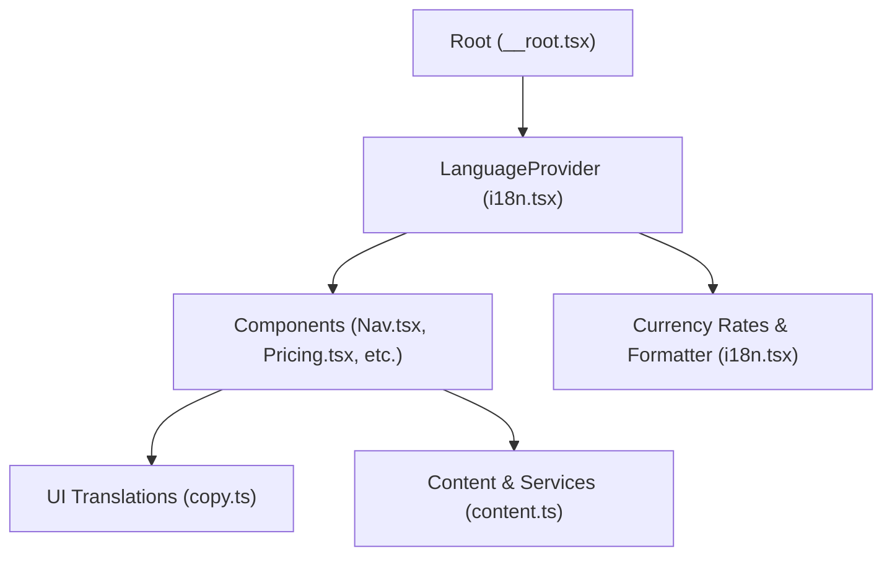
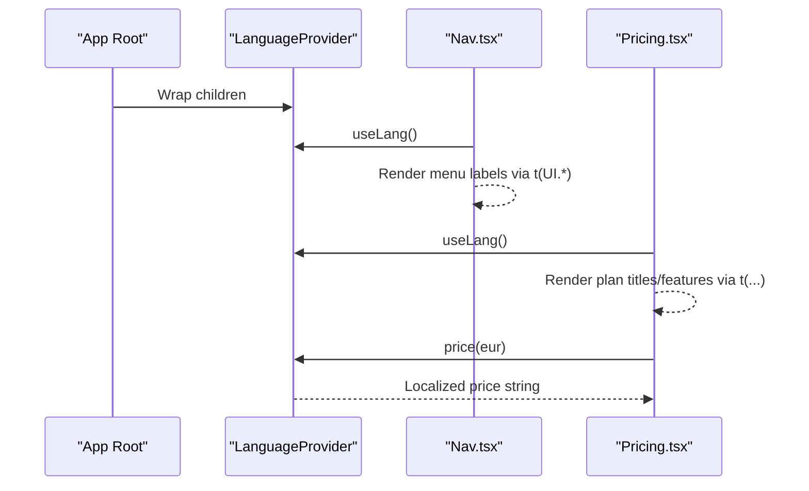
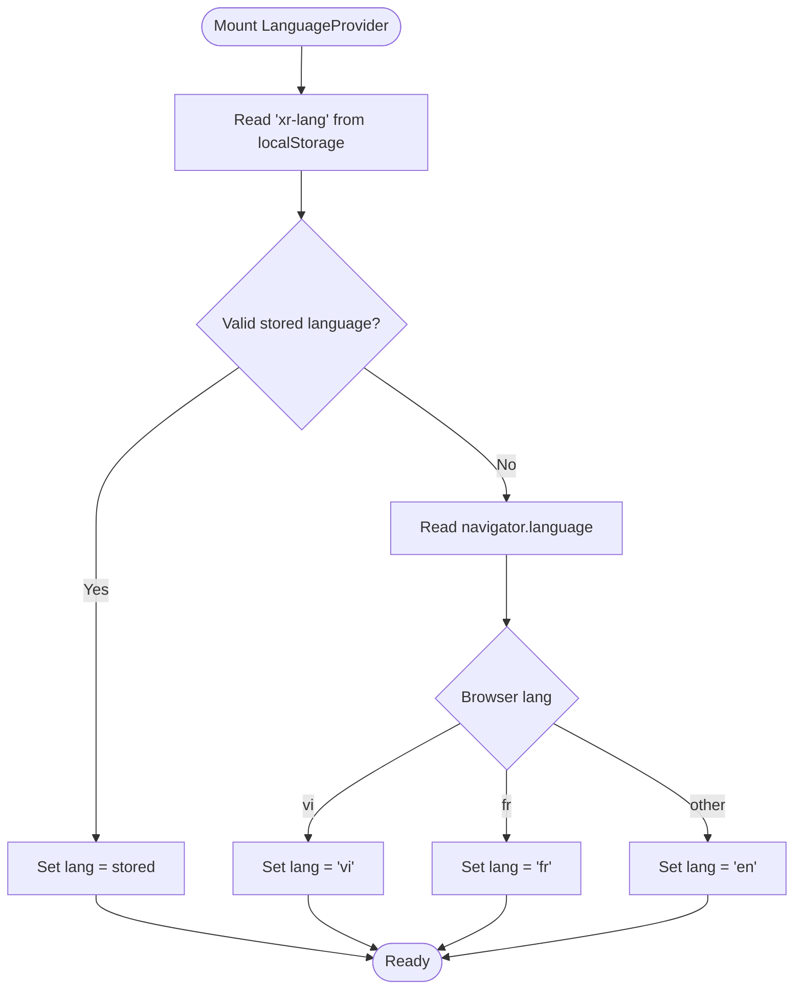
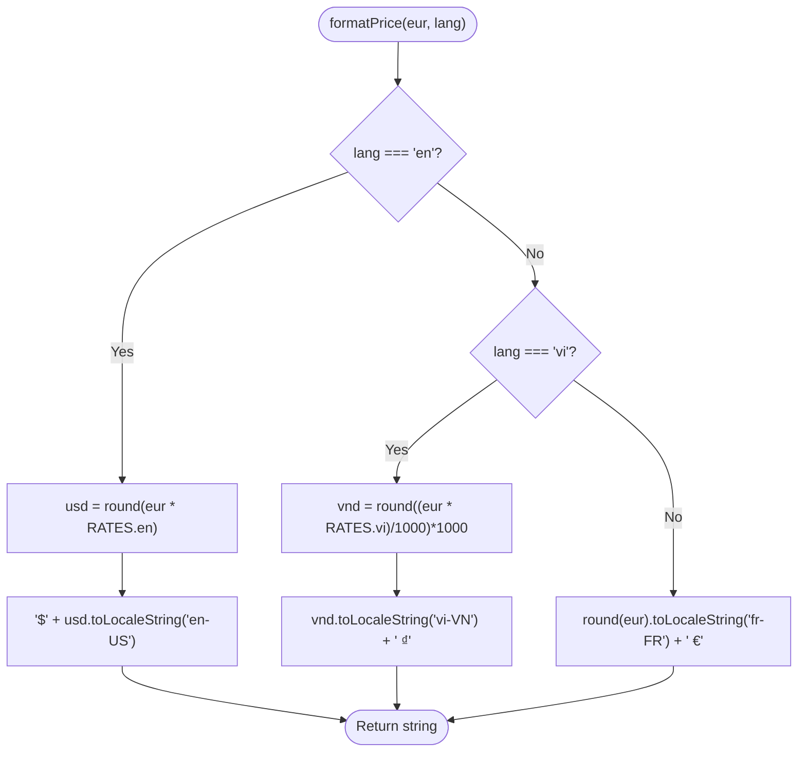
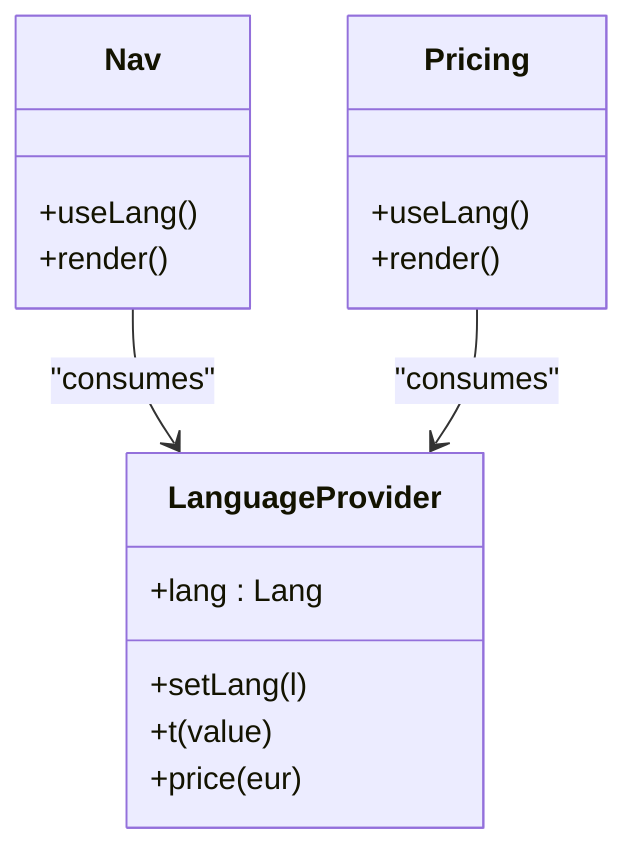
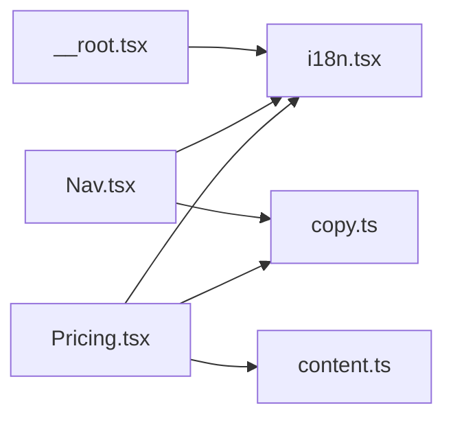

# Internationalization System

<cite>
**Referenced Files in This Document**
- [i18n.tsx](file://src/lib/i18n.tsx)
- [copy.ts](file://src/lib/copy.ts)
- [content.ts](file://src/lib/content.ts)
- [Nav.tsx](file://src/components/site/Nav.tsx)
- [Pricing.tsx](file://src/components/site/Pricing.tsx)
- [__root.tsx](file://src/routes/__root.tsx)
</cite>

## Table of Contents

1. [Introduction](#introduction)
2. [Project Structure](#project-structure)
3. [Core Components](#core-components)
4. [Architecture Overview](#architecture-overview)
5. [Detailed Component Analysis](#detailed-component-analysis)
6. [Dependency Analysis](#dependency-analysis)
7. [Performance Considerations](#performance-considerations)
8. [Troubleshooting Guide](#troubleshooting-guide)
9. [Conclusion](#conclusion)
10. [Appendices](#appendices)

## Introduction

This document explains the internationalization (i18n) system that provides trilingual support for French, English, and Vietnamese across the application. It covers the language context provider pattern, translation management architecture, currency conversion logic for EUR, USD, and VND, and how to add new languages, manage translations, and localize dynamic content. It also documents browser language detection, user preference persistence, fallback behavior, and guidelines for maintaining consistency when adding new translatable content.

## Project Structure

The i18n system is centered around a lightweight React Context that exposes:

- Current language
- Language switching function
- Translation helper
- Price formatter

Translations are stored as plain objects keyed by language codes, and components consume them via a simple hook.

**Diagram sources**

- [__root.tsx:142-151](file://src/routes/__root.tsx#L142-L151)
- [i18n.tsx:51-82](file://src/lib/i18n.tsx#L51-L82)
- [copy.ts:1-418](file://src/lib/copy.ts#L1-L418)
- [content.ts:1-800](file://src/lib/content.ts#L1-L800)

**Section sources**

- [__root.tsx:142-151](file://src/routes/__root.tsx#L142-L151)
- [i18n.tsx:11-40](file://src/lib/i18n.tsx#L11-L40)

## Core Components

- LanguageContext and Provider: Holds current language, persists selection, detects browser language, and exposes t() and price() helpers.
- Translation dictionaries: UI strings and content data structured as records with keys per supported language code.
- Currency formatting: Converts EUR reference prices into localized currency strings for EN (USD), VI (VND), and FR (EUR).

Key responsibilities:

- Provide a single source of truth for language state.
- Centralize translation lookup and formatting utilities.
- Keep components free from i18n implementation details.

**Section sources**

- [i18n.tsx:11-47](file://src/lib/i18n.tsx#L11-L47)
- [i18n.tsx:51-82](file://src/lib/i18n.tsx#L51-L82)
- [copy.ts:1-418](file://src/lib/copy.ts#L1-L418)
- [content.ts:21-75](file://src/lib/content.ts#L21-L75)

## Architecture Overview

The system uses a context-based provider pattern:

- The root wraps the app with LanguageProvider.
- Components call useLang() to access lang, setLang, t(), and price().
- UI strings live in copy.ts; service and pricing content live in content.ts.
- Prices are stored once in EUR and formatted per language using RATES.

**Diagram sources**

- [__root.tsx:142-151](file://src/routes/__root.tsx#L142-L151)
- [i18n.tsx:51-82](file://src/lib/i18n.tsx#L51-L82)
- [Nav.tsx:15-69](file://src/components/site/Nav.tsx#L15-L69)
- [Pricing.tsx:9-92](file://src/components/site/Pricing.tsx#L9-L92)

## Detailed Component Analysis

### LanguageProvider and useLang

- State: current language defaults to French.
- Initialization:
  - Reads persisted language from localStorage key xr-lang if valid.
  - Otherwise infers from navigator.language: Vietnamese maps to vi; otherwise English unless French.
- Persistence:
  - On change, writes to localStorage and sets document.documentElement.lang.
- API exposed:
  - lang: current language code
  - setLang(l): switch language
  - t(value): returns the string for the current language from an L object
  - price(eur): formats EUR price into localized currency string

**Diagram sources**

- [i18n.tsx:51-69](file://src/lib/i18n.tsx#L51-L69)

**Section sources**

- [i18n.tsx:11-47](file://src/lib/i18n.tsx#L11-L47)
- [i18n.tsx:51-82](file://src/lib/i18n.tsx#L51-L82)

### Translation Management (copy.ts and content.ts)

- UI strings: centralized in copy.ts under UI, each entry is a record with fr/en/vi values.
- Content and services: structured in content.ts with types like Plan, ServiceStep, ServiceMetric, ServiceComparison, and arrays of services/plans containing L-typed fields.
- Period labels: PERIOD_LABEL maps plan periods to localized strings.

Usage patterns:

- Components pass an L object to t() to get the current language string.
- For static short phrases, components can inline { fr, en, vi } literals or reference UI keys.

**Section sources**

- [copy.ts:1-418](file://src/lib/copy.ts#L1-L418)
- [content.ts:21-75](file://src/lib/content.ts#L21-L75)
- [content.ts:77-800](file://src/lib/content.ts#L77-L800)

### Currency Conversion and Formatting

- Reference currency: EUR.
- Conversion rates:
  - EN: USD multiplier applied to EUR
  - VI: VND conversion with rounding to nearest thousand and locale formatting
  - FR: EUR with locale formatting
- FormatPrice:
  - Returns localized currency string based on current language.

**Diagram sources**

- [i18n.tsx:20-40](file://src/lib/i18n.tsx#L20-L40)

**Section sources**

- [i18n.tsx:20-40](file://src/lib/i18n.tsx#L20-L40)

### Integration Points in Components

- Navigation:
  - Uses LANGS to render language switcher buttons.
  - Calls setLang to update language and persist it.
  - Renders menu items via t(UI[key]).
- Pricing:
  - Displays localized plan names, features, and period labels.
  - Formats plan prices using price(eur).

**Diagram sources**

- [i18n.tsx:42-82](file://src/lib/i18n.tsx#L42-L82)
- [Nav.tsx:15-69](file://src/components/site/Nav.tsx#L15-L69)
- [Pricing.tsx:9-92](file://src/components/site/Pricing.tsx#L9-L92)

**Section sources**

- [Nav.tsx:15-69](file://src/components/site/Nav.tsx#L15-L69)
- [Pricing.tsx:9-92](file://src/components/site/Pricing.tsx#L9-L92)

## Dependency Analysis

- Root component wraps the app with LanguageProvider, making i18n available globally.
- Components depend on:
  - i18n.tsx for context and utilities
  - copy.ts for UI strings
  - content.ts for service and pricing content
- No circular dependencies observed between these modules.

**Diagram sources**

- [__root.tsx:142-151](file://src/routes/__root.tsx#L142-L151)
- [Nav.tsx:1-69](file://src/components/site/Nav.tsx#L1-L69)
- [Pricing.tsx:1-92](file://src/components/site/Pricing.tsx#L1-L92)

**Section sources**

- [__root.tsx:142-151](file://src/routes/__root.tsx#L142-L151)
- [Nav.tsx:1-69](file://src/components/site/Nav.tsx#L1-L69)
- [Pricing.tsx:1-92](file://src/components/site/Pricing.tsx#L1-L92)

## Performance Considerations

- Context value memoization: The provider computes its value with useMemo to avoid unnecessary re-renders when only non-dependent props change.
- Minimal runtime overhead: Translation lookup is O(1) dictionary access; no network calls at runtime.
- Currency formatting uses native Intl APIs for efficient localization.
- Avoid large translation payloads: keep dictionaries co-located and import only what is needed.

[No sources needed since this section provides general guidance]

## Troubleshooting Guide

Common issues and resolutions:

- Missing translation key:
  - Ensure every key exists in copy.ts for all three languages.
  - If a key is missing for a language, t() will return undefined; guard against this in components or ensure completeness during updates.
- Incorrect language detection:
  - Verify localStorage contains a valid language code ("fr", "en", "vi").
  - Confirm navigator.language mapping logic aligns with business rules.
- Price not updating:
  - Ensure you call price(eur) with the correct EUR base value.
  - Confirm the current lang is set correctly before rendering.
- HTML lang attribute not updated:
  - setLang updates document.documentElement.lang; verify it runs on language changes.

**Section sources**

- [i18n.tsx:51-69](file://src/lib/i18n.tsx#L51-L69)
- [i18n.tsx:71-79](file://src/lib/i18n.tsx#L71-L79)

## Conclusion

The i18n system is a compact, type-safe solution that centralizes language state, translation lookup, and currency formatting. It leverages React Context for global availability, stores translations as typed dictionaries, and supports robust language detection and persistence. Adding new languages requires extending the type, rates, and translation dictionaries, while keeping components decoupled from implementation details.

[No sources needed since this section summarizes without analyzing specific files]

## Appendices

### How to Add a New Language

Steps:

1. Extend the Lang type to include the new code.
2. Add the language to LANGS with label and flag.
3. Add a rate in RATES for currency conversion.
4. Update formatPrice to handle the new language.
5. Add translations for every UI key in copy.ts and any content entries in content.ts.
6. Adjust browser detection logic if needed.

**Section sources**

- [i18n.tsx:11-40](file://src/lib/i18n.tsx#L11-L40)
- [copy.ts:1-418](file://src/lib/copy.ts#L1-L418)
- [content.ts:21-75](file://src/lib/content.ts#L21-L75)

### Managing Translations

- Centralize all UI strings in copy.ts under UI.
- For dynamic content (services, plans, steps), structure data in content.ts with L-typed fields.
- Always provide all three language variants for each key to maintain parity.

**Section sources**

- [copy.ts:1-418](file://src/lib/copy.ts#L1-L418)
- [content.ts:21-75](file://src/lib/content.ts#L21-L75)

### Implementing Language Switching

- Use useLang() to access setLang and lang.
- Render a language selector using LANGS and bind onClick handlers to setLang(code).
- Persisted automatically via localStorage and reflected in the DOM via documentElement.lang.

**Section sources**

- [Nav.tsx:51-69](file://src/components/site/Nav.tsx#L51-L69)
- [i18n.tsx:51-69](file://src/lib/i18n.tsx#L51-L69)

### Formatting Localized Numbers and Dates

- Numbers: Use price(eur) for currency formatting; it applies locale-specific number formatting and symbols.
- Dates: Not currently implemented in the i18n module; extend formatPrice or add a date formatter using Intl.DateTimeFormat with the current lang when needed.

**Section sources**

- [i18n.tsx:20-40](file://src/lib/i18n.tsx#L20-L40)

### Handling Pluralization Rules

- The current system does not implement pluralization. For plural forms:
  - Store both singular and plural variants in translation dictionaries keyed by language.
  - Choose the appropriate key in components based on count.
  - Alternatively, extend t() to accept a count and select the correct plural form.

[No sources needed since this section provides general guidance]

### Browser Language Detection and Fallbacks

- Detection order:
  1. Read xr-lang from localStorage if present and valid.
  2. Infer from navigator.language: Vietnamese maps to vi; otherwise English unless French.
- Fallback:
  - If no valid stored language and browser language is neither Vietnamese nor French, default to English.

**Section sources**

- [i18n.tsx:51-63](file://src/lib/i18n.tsx#L51-L63)

### User Preference Persistence

- Language choice is saved to localStorage under xr-lang.
- On mount, the provider restores the last used language if valid.
- Changing language updates both localStorage and documentElement.lang.

**Section sources**

- [i18n.tsx:54-69](file://src/lib/i18n.tsx#L54-L69)

### Maintaining Translation Consistency

- Enforce complete coverage: every key must have fr, en, vi entries.
- Use TypeScript to catch missing keys at compile time.
- Review diffs carefully when adding or editing translations.
- Keep related strings grouped logically in copy.ts and content.ts.

**Section sources**

- [copy.ts:1-418](file://src/lib/copy.ts#L1-L418)
- [content.ts:21-75](file://src/lib/content.ts#L21-L75)
