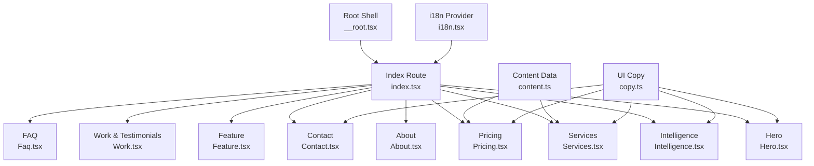
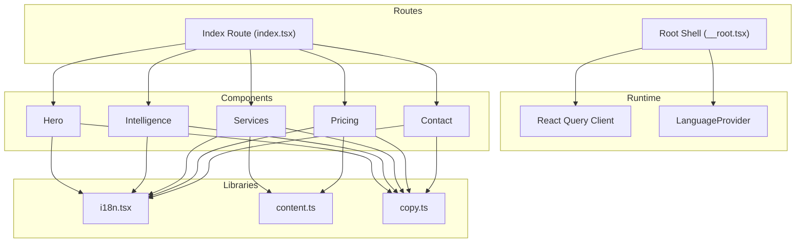
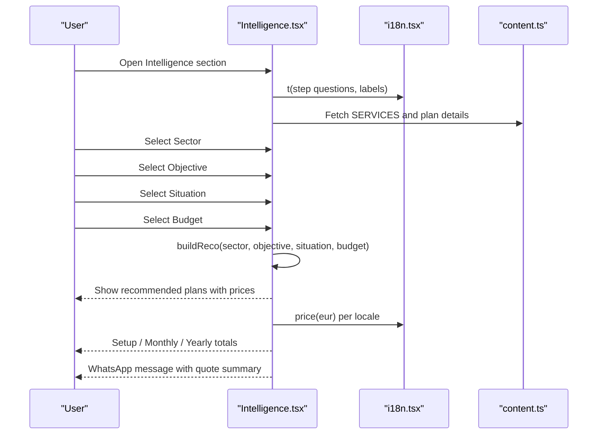
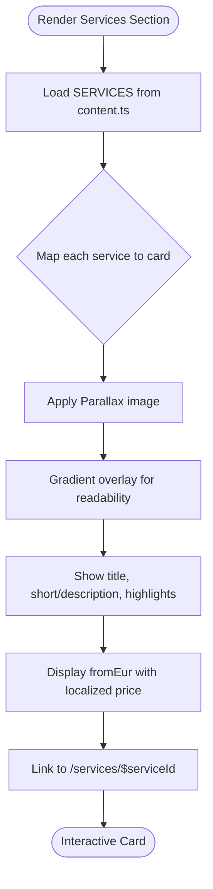
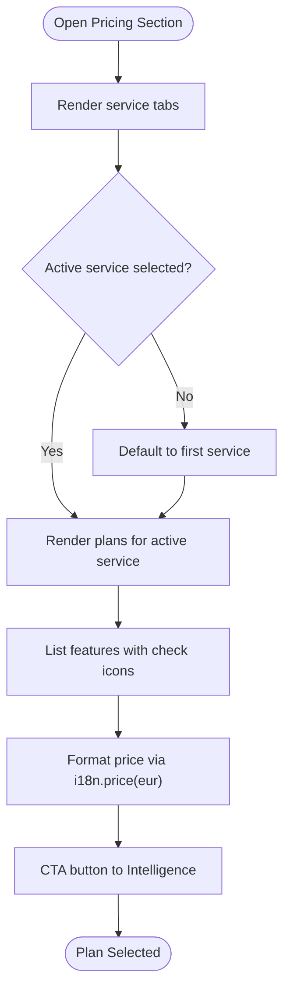
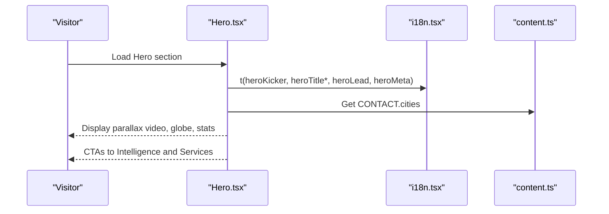
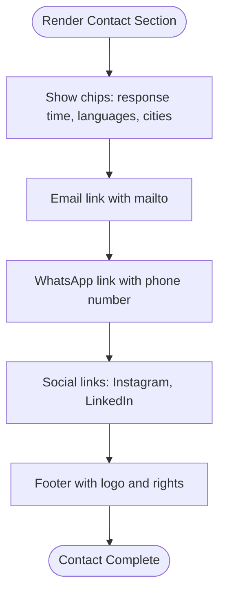
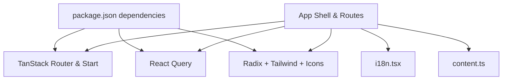

# Project Overview

<cite>
**Referenced Files in This Document**
- [README.md](file://README.md)
- [package.json](file://package.json)
- [vite.config.ts](file://vite.config.ts)
- [src/routes/__root.tsx](file://src/routes/__root.tsx)
- [src/routes/index.tsx](file://src/routes/index.tsx)
- [src/lib/i18n.tsx](file://src/lib/i18n.tsx)
- [src/lib/content.ts](file://src/lib/content.ts)
- [src/components/site/Hero.tsx](file://src/components/site/Hero.tsx)
- [src/components/site/Services.tsx](file://src/components/site/Services.tsx)
- [src/components/site/Pricing.tsx](file://src/components/site/Pricing.tsx)
- [src/components/site/Intelligence.tsx](file://src/components/site/Intelligence.tsx)
- [src/components/site/Contact.tsx](file://src/components/site/Contact.tsx)
</cite>

## Table of Contents

1. [Introduction](#introduction)
2. [Project Structure](#project-structure)
3. [Core Components](#core-components)
4. [Architecture Overview](#architecture-overview)
5. [Detailed Component Analysis](#detailed-component-analysis)
6. [Dependency Analysis](#dependency-analysis)
7. [Performance Considerations](#performance-considerations)
8. [Troubleshooting Guide](#troubleshooting-guide)
9. [Conclusion](#conclusion)

## Introduction

Xragency is a premium digital agency website that fuses cinematic design with XR Agency business content. It targets businesses across France, English-speaking countries, and Vietnam markets with a modern React application built on the TanStack Start framework. The site showcases services such as website creation, branding, SEO optimization, Google Maps visibility, social media, AI-powered solutions, and maintenance. It features multilingual support (FR/EN/VI), an AI-powered strategy tool called XRAGENCY Intelligence, an interactive pricing system, and a service showcase grid.

For beginners: this site helps businesses understand how a premium studio can build high-performance websites, strong brand identities, SEO strategies, and AI tools to grow their presence online. For experienced developers: it demonstrates a clean, modular architecture using TanStack Router, React Query, Tailwind CSS, and a robust i18n system with localized pricing and content.

Key capabilities demonstrated on the site include:

- Website creation plans tailored for artisans, SMEs, and e-commerce/booking needs
- Branding packages with logo, guidelines, and complete identity systems
- SEO Domination System with local SEO, content optimization, and link building
- Google Maps optimization for local visibility
- Social media and maintenance retainer options
- AI-powered assistant recommendations based on sector, objectives, situation, and budget

**Section sources**

- [README.md:1-113](file://README.md#L1-L113)
- [src/routes/__root.tsx:77-120](file://src/routes/__root.tsx#L77-L120)
- [src/routes/index.tsx:13-33](file://src/routes/index.tsx#L13-L33)

## Project Structure

The project follows a feature-based organization under src/components/site for page sections and src/lib for shared utilities like i18n and content definitions. Routes are defined via TanStack Router with a root shell and index route composing the main landing page.

**Diagram sources**

- [src/routes/__root.tsx:128-153](file://src/routes/__root.tsx#L128-L153)
- [src/routes/index.tsx:35-58](file://src/routes/index.tsx#L35-L58)
- [src/lib/i18n.tsx:51-82](file://src/lib/i18n.tsx#L51-L82)
- [src/lib/content.ts:77-346](file://src/lib/content.ts#L77-L346)
- [src/components/site/Hero.tsx:15-119](file://src/components/site/Hero.tsx#L15-L119)
- [src/components/site/Services.tsx:26-119](file://src/components/site/Services.tsx#L26-L119)
- [src/components/site/Pricing.tsx:9-99](file://src/components/site/Pricing.tsx#L9-L99)
- [src/components/site/Intelligence.tsx:374-636](file://src/components/site/Intelligence.tsx#L374-L636)
- [src/components/site/Contact.tsx:16-159](file://src/components/site/Contact.tsx#L16-L159)

**Section sources**

- [package.json:14-67](file://package.json#L14-L67)
- [vite.config.ts:9-15](file://vite.config.ts#L9-L15)
- [src/routes/__root.tsx:128-153](file://src/routes/__root.tsx#L128-L153)
- [src/routes/index.tsx:35-58](file://src/routes/index.tsx#L35-L58)

## Core Components

- Multilingual Support (FR/EN/VI): LanguageProvider manages language state, persists selection, detects browser language, and provides t() translation and price formatting per locale.
- XRAGENCY Intelligence (AI Configurator): A step-by-step wizard that asks about sector, objective, current situation, and budget to generate a tailored recommendation with setup, monthly, and yearly costs.
- Interactive Pricing: Service tabs switch between offerings; each plan shows features, period, and localized pricing.
- Services Showcase: Grid cards with images, highlights, and pricing from data-driven content.
- Contact and Global Navigation: Centralized contact info, WhatsApp integration, and consistent UI copy.

Practical examples:

- Website Creation: Plans range from Pro Showcase to E-commerce & Booking, with performance metrics and delivery timelines.
- Branding: Logo, guidelines, and complete identity packages with source files and usage rules.
- SEO Optimization: Local SEO, Boost, and advanced tiers with content, link building, and rank tracking.
- AI-Powered Solutions: Assistant automation and strategic recommendations integrated into the Intelligence tool.

**Section sources**

- [src/lib/i18n.tsx:11-40](file://src/lib/i18n.tsx#L11-L40)
- [src/lib/i18n.tsx:51-82](file://src/lib/i18n.tsx#L51-L82)
- [src/components/site/Intelligence.tsx:374-636](file://src/components/site/Intelligence.tsx#L374-L636)
- [src/components/site/Pricing.tsx:9-99](file://src/components/site/Pricing.tsx#L9-L99)
- [src/components/site/Services.tsx:26-119](file://src/components/site/Services.tsx#L26-L119)
- [src/lib/content.ts:77-346](file://src/lib/content.ts#L77-L346)

## Architecture Overview

The app uses TanStack Start with React and TypeScript. The root shell sets up global providers (React Query and LanguageProvider), while the index route composes the landing page sections. Content and UI copy are centralized in lib modules, enabling consistent translations and pricing across components.

**Diagram sources**

- [src/routes/__root.tsx:128-153](file://src/routes/__root.tsx#L128-L153)
- [src/routes/index.tsx:35-58](file://src/routes/index.tsx#L35-L58)
- [src/lib/i18n.tsx:51-82](file://src/lib/i18n.tsx#L51-L82)
- [src/lib/content.ts:77-346](file://src/lib/content.ts#L77-L346)
- [src/components/site/Hero.tsx:15-119](file://src/components/site/Hero.tsx#L15-L119)
- [src/components/site/Intelligence.tsx:374-636](file://src/components/site/Intelligence.tsx#L374-L636)
- [src/components/site/Services.tsx:26-119](file://src/components/site/Services.tsx#L26-L119)
- [src/components/site/Pricing.tsx:9-99](file://src/components/site/Pricing.tsx#L9-L99)
- [src/components/site/Contact.tsx:16-159](file://src/components/site/Contact.tsx#L16-L159)

## Detailed Component Analysis

### XRAGENCY Intelligence (AI Configurator)

A guided flow that collects user inputs and generates a personalized strategy with cost breakdowns and rationale. It integrates with content data to recommend relevant services and plans.

**Diagram sources**

- [src/components/site/Intelligence.tsx:239-372](file://src/components/site/Intelligence.tsx#L239-L372)
- [src/components/site/Intelligence.tsx:374-636](file://src/components/site/Intelligence.tsx#L374-L636)
- [src/lib/i18n.tsx:30-40](file://src/lib/i18n.tsx#L30-L40)
- [src/lib/content.ts:77-346](file://src/lib/content.ts#L77-L346)

**Section sources**

- [src/components/site/Intelligence.tsx:374-636](file://src/components/site/Intelligence.tsx#L374-L636)

### Services Showcase

A responsive grid displaying service cards with images, highlights, and pricing. Each card links to a dynamic service detail route.

**Diagram sources**

- [src/components/site/Services.tsx:26-119](file://src/components/site/Services.tsx#L26-L119)
- [src/lib/content.ts:77-346](file://src/lib/content.ts#L77-L346)

**Section sources**

- [src/components/site/Services.tsx:26-119](file://src/components/site/Services.tsx#L26-L119)

### Interactive Pricing

Tabs switch between services; each plan displays features, period, and localized pricing. Popular plans are highlighted.

**Diagram sources**

- [src/components/site/Pricing.tsx:9-99](file://src/components/site/Pricing.tsx#L9-L99)
- [src/lib/i18n.tsx:30-40](file://src/lib/i18n.tsx#L30-L40)
- [src/lib/content.ts:77-346](file://src/lib/content.ts#L77-L346)

**Section sources**

- [src/components/site/Pricing.tsx:9-99](file://src/components/site/Pricing.tsx#L9-L99)

### Hero Section

Immersive hero with parallax video background, animated text reveals, stats, and CTAs linking to Intelligence and Services.

**Diagram sources**

- [src/components/site/Hero.tsx:15-119](file://src/components/site/Hero.tsx#L15-L119)
- [src/lib/i18n.tsx:51-82](file://src/lib/i18n.tsx#L51-L82)
- [src/lib/content.ts:12-19](file://src/lib/content.ts#L12-L19)

**Section sources**

- [src/components/site/Hero.tsx:15-119](file://src/components/site/Hero.tsx#L15-L119)

### Contact Section

Centralizes contact methods, response time, languages, cities, and direct links to email and WhatsApp.

**Diagram sources**

- [src/components/site/Contact.tsx:16-159](file://src/components/site/Contact.tsx#L16-L159)
- [src/lib/content.ts:12-19](file://src/lib/content.ts#L12-L19)

**Section sources**

- [src/components/site/Contact.tsx:16-159](file://src/components/site/Contact.tsx#L16-L159)

## Dependency Analysis

The application relies on a cohesive set of libraries and internal modules:

- Routing and SSR: TanStack Router and TanStack Start configured via Vite plugin
- State and Data: React Query for caching and server state
- UI: Radix primitives, Tailwind CSS, Lucide icons, Embla carousel, Recharts
- Internationalization: Custom i18n provider with localization and currency conversion
- Content: Centralized service data and UI copy for consistency

**Diagram sources**

- [package.json:14-67](file://package.json#L14-L67)
- [vite.config.ts:9-15](file://vite.config.ts#L9-L15)
- [src/routes/__root.tsx:128-153](file://src/routes/__root.tsx#L128-L153)

**Section sources**

- [package.json:14-67](file://package.json#L14-L67)
- [vite.config.ts:9-15](file://vite.config.ts#L9-L15)

## Performance Considerations

- Use lazy loading for images and videos to improve initial load times.
- Prefer static assets and optimized media formats for hero and service cards.
- Leverage React Query caching for any future API calls to reduce network overhead.
- Keep component re-renders minimal by memoizing derived values (e.g., recommendations).
- Ensure accessibility and semantic HTML for better SEO and screen reader support.

[No sources needed since this section provides general guidance]

## Troubleshooting Guide

- Root Error Handling: The root shell includes error and not-found components to gracefully handle runtime errors and missing routes.
- Language Context Errors: Using useLang outside LanguageProvider will throw an error; ensure proper provider wrapping.
- Pricing Formatting: Verify locale-specific currency conversions and rounding logic when adding new currencies or adjusting rates.

**Section sources**

- [src/routes/__root.tsx:16-74](file://src/routes/__root.tsx#L16-L74)
- [src/lib/i18n.tsx:84-88](file://src/lib/i18n.tsx#L84-L88)

## Conclusion

Xragency’s premium digital agency website combines cinematic design with XR Agency business content to deliver a compelling, multilingual experience for clients in France, English-speaking markets, and Vietnam. Built on TanStack Start with React, it offers an AI-powered strategy tool, interactive pricing, and a rich service showcase. The architecture emphasizes modularity, localization, and performance, making it scalable and maintainable for future enhancements.

[No sources needed since this section summarizes without analyzing specific files]
