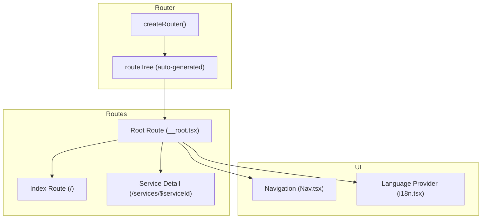
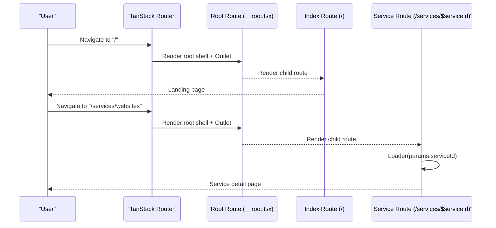
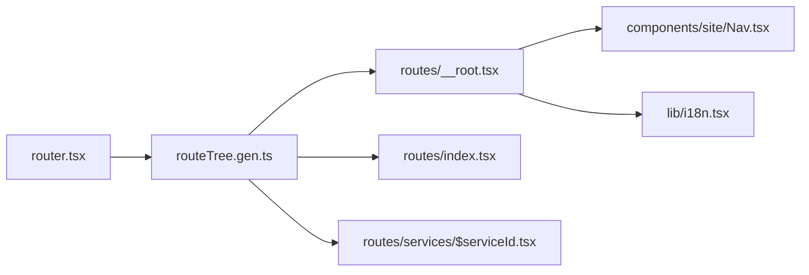

# Routing and Navigation

<cite>
**Referenced Files in This Document**
- [router.tsx](file://src/router.tsx)
- [routeTree.gen.ts](file://src/routeTree.gen.ts)
- [__root.tsx](file://src/routes/__root.tsx)
- [index.tsx](file://src/routes/index.tsx)
- [$serviceId.tsx](file://src/routes/services/$serviceId.tsx)
- [Nav.tsx](file://src/components/site/Nav.tsx)
- [i18n.tsx](file://src/lib/i18n.tsx)
- [start.ts](file://src/start.ts)
</cite>

## Table of Contents

1. Introduction
2. Project Structure
3. Core Components
4. Architecture Overview
5. Detailed Component Analysis
6. Dependency Analysis
7. Performance Considerations
8. Troubleshooting Guide
9. Conclusion
10. Appendices

## Introduction

This document explains the file-based routing and navigation system implemented with TanStack Router in this application. It covers route configuration, dynamic service pages with parameter handling, navigation patterns, route guards, lazy loading strategies, performance optimizations for route transitions, programmatic navigation, SEO considerations (meta tags, canonical URLs), navigation state management, breadcrumb generation, mobile navigation patterns, URL hygiene, redirects, and route aliases.

## Project Structure

The application uses a file-based routing convention under src/routes:

- Root layout and global error/404 handling live in __root.tsx.
- The homepage is index.tsx at /.
- A dynamic service detail page lives at services/$serviceId.tsx.
- The router instance is created in router.tsx using the auto-generated route tree from routeTree.gen.ts.
- Navigation UI is provided by Nav.tsx.
- Internationalization context is provided by i18n.tsx.
- Server start and middleware are defined in start.ts.

**Diagram sources**

- [router.tsx:5-16](file://src/router.tsx#L5-L16)
- [routeTree.gen.ts:11-24](file://src/routeTree.gen.ts#L11-L24)
- [__root.tsx:76-153](file://src/routes/__root.tsx#L76-L153)
- [index.tsx:13-33](file://src/routes/index.tsx#L13-L33)
- [$serviceId.tsx:40-68](file://src/routes/services/$serviceId.tsx#L40-L68)
- [Nav.tsx:15-129](file://src/components/site/Nav.tsx#L15-L129)
- [i18n.tsx:51-82](file://src/lib/i18n.tsx#L51-L82)

**Section sources**

- [router.tsx:5-16](file://src/router.tsx#L5-L16)
- [routeTree.gen.ts:11-24](file://src/routeTree.gen.ts#L11-L24)
- [__root.tsx:76-153](file://src/routes/__root.tsx#L76-L153)
- [index.tsx:13-33](file://src/routes/index.tsx#L13-L33)
- [$serviceId.tsx:40-68](file://src/routes/services/$serviceId.tsx#L40-L68)
- [Nav.tsx:15-129](file://src/components/site/Nav.tsx#L15-L129)
- [i18n.tsx:51-82](file://src/lib/i18n.tsx#L51-L82)

## Core Components

- Router initialization: Creates a TanStack Router with the generated route tree, provides a QueryClient via router context, enables scroll restoration, and sets default preload stale time.
- Root route: Defines the HTML shell, global head metadata, not found and error components, and wraps child routes with providers (QueryClientProvider, LanguageProvider).
- Index route: Renders the landing page and defines its own head metadata to override root defaults.
- Dynamic service route: Uses createFileRoute with a path parameter $serviceId, loads data via loader, throws notFound when invalid, and renders a rich service detail page.
- Navigation: Nav component renders top-level links and a mobile menu; it uses direct anchor links for in-page anchors on the home page and Link components for cross-route navigation where applicable.
- Internationalization: LanguageProvider supplies current language, translation function, and price formatting across the app.

**Section sources**

- [router.tsx:5-16](file://src/router.tsx#L5-L16)
- [__root.tsx:76-153](file://src/routes/__root.tsx#L76-L153)
- [index.tsx:13-33](file://src/routes/index.tsx#L13-L33)
- [$serviceId.tsx:40-68](file://src/routes/services/$serviceId.tsx#L40-L68)
- [Nav.tsx:15-129](file://src/components/site/Nav.tsx#L15-L129)
- [i18n.tsx:51-82](file://src/lib/i18n.tsx#L51-L82)

## Architecture Overview

The routing architecture centers around TanStack Router’s file-based conventions:

- File-to-route mapping is generated automatically into routeTree.gen.ts.
- The root route acts as a layout shell and error boundary.
- Child routes render via Outlet within the root.
- Data fetching is performed per-route using loaders, enabling route-based data loading and preloading.
- Navigation can be declarative (Link) or programmatic (useNavigate/useRouter) depending on needs.

**Diagram sources**

- [router.tsx:5-16](file://src/router.tsx#L5-L16)
- [routeTree.gen.ts:11-24](file://src/routeTree.gen.ts#L11-L24)
- [__root.tsx:76-153](file://src/routes/__root.tsx#L76-L153)
- [index.tsx:13-33](file://src/routes/index.tsx#L13-L33)
- [$serviceId.tsx:40-68](file://src/routes/services/$serviceId.tsx#L40-L68)

## Detailed Component Analysis

### Root Route (__root.tsx)

Responsibilities:

- Provides the HTML shell and injects <HeadContent /> and <Scripts />.
- Sets global meta tags and link resources (stylesheets, favicon).
- Wraps all routes with QueryClientProvider and LanguageProvider.
- Defines notFoundComponent and errorComponent for graceful error handling.
- Renders nested routes via Outlet.

SEO notes:

- Global meta tags include charset, viewport, title, description, Open Graph, Twitter Card, and image references.
- Per-route head functions can override or extend these values.

Error handling:

- ErrorComponent logs errors, reports them via an error reporting utility, and offers retry/reset actions.
- Not found component provides a user-friendly 404 experience with a link back to home.

**Section sources**

- [__root.tsx:16-74](file://src/routes/__root.tsx#L16-L74)
- [__root.tsx:76-153](file://src/routes/__root.tsx#L76-L153)

### Index Route (/)

Responsibilities:

- Declares the route with createFileRoute("/").
- Overrides head metadata for the landing page (title, description, OG/Twitter tags).
- Renders the full landing page composed of multiple site sections.

Navigation usage:

- Uses Nav component for top-level navigation.
- Links within the page use anchor hashes for in-page scrolling.

**Section sources**

- [index.tsx:13-33](file://src/routes/index.tsx#L13-L33)
- [index.tsx:35-58](file://src/routes/index.tsx#L35-L58)

### Dynamic Service Route (/services/$serviceId)

Responsibilities:

- Declares a dynamic route with createFileRoute("/services/$serviceId").
- Implements a loader that reads params.serviceId, finds the corresponding service, and throws notFound if missing.
- Provides route-specific head metadata based on loaded service data.
- Renders a comprehensive service detail page including hero, metrics, process steps, pricing plans, comparison matrix, related services, and contact section.

Parameter handling:

- Reads params.serviceId from the route parameters.
- Uses Route.useLoaderData to access loader data safely in the component.

Navigation patterns:

- Uses Link to navigate between routes and to hash anchors within the home page.
- Builds WhatsApp links with pre-filled messages based on selected plan/service.

**Section sources**

- [$serviceId.tsx:40-68](file://src/routes/services/$serviceId.tsx#L40-L68)
- [$serviceId.tsx:70-116](file://src/routes/services/$serviceId.tsx#L70-L116)
- [$serviceId.tsx:118-521](file://src/routes/services/$serviceId.tsx#L118-L521)

### Navigation (Nav.tsx)

Responsibilities:

- Renders a responsive header with logo, desktop links, mobile menu toggle, language switcher, and call-to-action button.
- Desktop and mobile menus use direct anchor links for in-page navigation on the home page (e.g., /#services, /#pricing).
- Language switcher updates the current language via useLang().

Mobile navigation:

- Collapsible menu toggled by state; closes on link click.
- Language buttons are duplicated in the mobile menu.

**Section sources**

- [Nav.tsx:15-129](file://src/components/site/Nav.tsx#L15-L129)

### Internationalization (i18n.tsx)

Responsibilities:

- Provides LanguageProvider with lang state persisted to localStorage.
- Exposes t() for translations, price formatter, and setLang() to update language and document.lang.
- Initializes language from localStorage or navigator.language.

Integration with routing:

- Language changes do not trigger route transitions but affect rendering across routes.

**Section sources**

- [i18n.tsx:51-82](file://src/lib/i18n.tsx#L51-L82)

### Router Initialization (router.tsx)

Responsibilities:

- Creates a new QueryClient and passes it via router context.
- Configures scrollRestoration to preserve scroll position across navigations.
- Sets defaultPreloadStaleTime to 0 to control prefetching behavior.

**Section sources**

- [router.tsx:5-16](file://src/router.tsx#L5-L16)

### Server Start and Middleware (start.ts)

Responsibilities:

- Defines request middleware for error handling and CSRF protection for server functions.
- Ensures consistent error responses during SSR.

**Section sources**

- [start.ts:5-29](file://src/start.ts#L5-L29)

## Dependency Analysis

The routing dependencies form a clear hierarchy:

- router.tsx depends on routeTree.gen.ts for route definitions.
- routeTree.gen.ts imports actual route modules (__root, index, services/$serviceId).
- Routes depend on shared UI components (Nav) and contexts (i18n).
- The root route provides global providers consumed by all child routes.

**Diagram sources**

- [router.tsx:5-16](file://src/router.tsx#L5-L16)
- [routeTree.gen.ts:11-24](file://src/routeTree.gen.ts#L11-L24)
- [__root.tsx:76-153](file://src/routes/__root.tsx#L76-L153)
- [index.tsx:13-33](file://src/routes/index.tsx#L13-L33)
- [$serviceId.tsx:40-68](file://src/routes/services/$serviceId.tsx#L40-L68)
- [Nav.tsx:15-129](file://src/components/site/Nav.tsx#L15-L129)
- [i18n.tsx:51-82](file://src/lib/i18n.tsx#L51-L82)

**Section sources**

- [router.tsx:5-16](file://src/router.tsx#L5-L16)
- [routeTree.gen.ts:11-24](file://src/routeTree.gen.ts#L11-L24)

## Performance Considerations

- Scroll restoration is enabled to improve UX across navigations.
- Preload stale time is set to 0, which affects how aggressively routes are prefetched; tune this based on network conditions and content size.
- Route-based data loading via loaders ensures data is fetched only when needed and can be cached by TanStack Query through the provided QueryClient.
- Avoid heavy computations inside route components; prefer offloading to loaders or memoized hooks.
- Use Link for client-side navigation to avoid full page reloads and leverage TanStack Router’s optimizations.

[No sources needed since this section provides general guidance]

## Troubleshooting Guide

Common issues and resolutions:

- Invalid dynamic route parameter: The service route throws notFound when the requested serviceId does not exist. Ensure params.serviceId matches known service IDs.
- Missing loader data: Access loader data via Route.useLoaderData; ensure loader returns expected structure before rendering dependent UI.
- Global errors: The root error component logs and reports errors; check console and error reporting tooling for stack traces.
- 404 handling: The root notFoundComponent renders a friendly 404 page; verify custom routes do not accidentally match unintended paths.

**Section sources**

- [$serviceId.tsx:40-47](file://src/routes/services/$serviceId.tsx#L40-L47)
- [__root.tsx:16-74](file://src/routes/__root.tsx#L16-L74)

## Conclusion

The application implements a robust, file-based routing system with TanStack Router. Routes are organized clearly, with a strong root layout providing global context and error boundaries. Dynamic routes handle parameters safely via loaders and notFound guards. Navigation is primarily declarative with Link, complemented by in-page anchor links. SEO is addressed through per-route head metadata and global meta setup. Performance is optimized with scroll restoration and configurable preload settings. The system is extensible for adding new routes, implementing programmatic navigation, and refining SEO and performance as the application grows.

[No sources needed since this section summarizes without analyzing specific files]

## Appendices

### How to Create New Routes

- Add a new file under src/routes following the desired path structure. For example, a new page at /about would be src/routes/about.tsx.
- Export a Route using createFileRoute with the appropriate path.
- If the route requires data, implement a loader to fetch and return data; throw notFound for invalid inputs.
- Define head metadata to set title, description, and social tags for SEO.

**Section sources**

- [index.tsx:13-33](file://src/routes/index.tsx#L13-L33)
- [$serviceId.tsx:40-68](file://src/routes/services/$serviceId.tsx#L40-L68)

### Handling Nested Routing

- Nested routes render via Outlet in the root route. To add nested children, place files under a folder and reference them in the route tree generation.
- Keep shared layouts in parent routes and use Outlet to compose child routes.

**Section sources**

- [__root.tsx:142-153](file://src/routes/__root.tsx#L142-L153)

### Implementing Programmatic Navigation

- Use Link for declarative navigation within JSX.
- For programmatic navigation (e.g., after form submission), import useRouter or useNavigate from @tanstack/react-router and call navigate with the target path and options.
- Combine with query strings and hash fragments for fine-grained navigation.

[No sources needed since this section provides general guidance]

### Route Parameters and Query Strings

- Route parameters: Access via params in the loader and component using Route.useParams or destructured params from loader arguments. Example: params.serviceId in the service route.
- Query strings: Read from searchParams in the loader and component to filter or paginate content.

**Section sources**

- [$serviceId.tsx:40-47](file://src/routes/services/$serviceId.tsx#L40-L47)

### Route-Based Data Loading Patterns

- Use loader to fetch data required by the route; return data for use in the component via Route.useLoaderData.
- Throw notFound for invalid parameters to trigger the root notFoundComponent.
- Leverage QueryClient for caching and deduplication of requests across routes.

**Section sources**

- [$serviceId.tsx:40-47](file://src/routes/services/$serviceId.tsx#L40-L47)
- [router.tsx:5-16](file://src/router.tsx#L5-L16)

### SEO Considerations

- Meta tag management: Each route can define head metadata to set title, description, and social tags. The root route sets global defaults.
- Canonical URLs: Add a canonical link in head metadata for each route to specify the preferred URL version.
- Search engine optimization: Ensure descriptive titles and descriptions per route, proper semantic HTML, and fast load times.

**Section sources**

- [__root.tsx:76-121](file://src/routes/__root.tsx#L76-L121)
- [index.tsx:13-33](file://src/routes/index.tsx#L13-L33)
- [$serviceId.tsx:48-66](file://src/routes/services/$serviceId.tsx#L48-L66)

### Navigation State Management

- Language state is managed via LanguageProvider and persisted to localStorage.
- Router context provides QueryClient for data caching and sharing across routes.
- Scroll restoration preserves user scroll position across navigations.

**Section sources**

- [i18n.tsx:51-82](file://src/lib/i18n.tsx#L51-L82)
- [router.tsx:5-16](file://src/router.tsx#L5-L16)

### Breadcrumb Generation

- Implement breadcrumbs by composing a list of links based on the current route path.
- Use Link components to navigate between levels and display human-readable labels derived from route metadata or content.

[No sources needed since this section provides general guidance]

### Mobile Navigation Patterns

- The Nav component includes a collapsible mobile menu with the same links as desktop.
- Language switcher is available in both desktop and mobile views.
- Ensure touch-friendly targets and accessible markup for mobile users.

**Section sources**

- [Nav.tsx:15-129](file://src/components/site/Nav.tsx#L15-L129)

### Maintaining Clean URL Structures

- Prefer flat, readable paths for top-level features and nested folders for logical groupings.
- Use dynamic segments sparingly and validate parameters to avoid ambiguous URLs.
- Avoid unnecessary query strings for core navigation; reserve them for filtering or pagination.

[No sources needed since this section provides general guidance]

### Redirects and Route Aliases

- Implement redirects by returning a redirect response from a loader or by navigating programmatically after certain conditions.
- For route aliases, consider creating wrapper routes that redirect to the canonical path using Link or programmatic navigation.

[No sources needed since this section provides general guidance]
