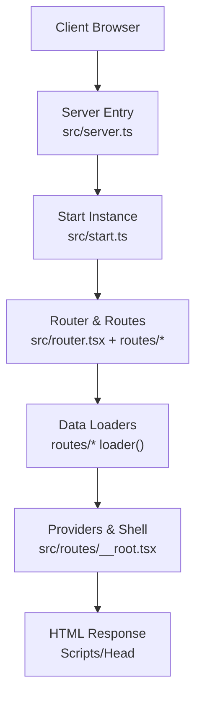
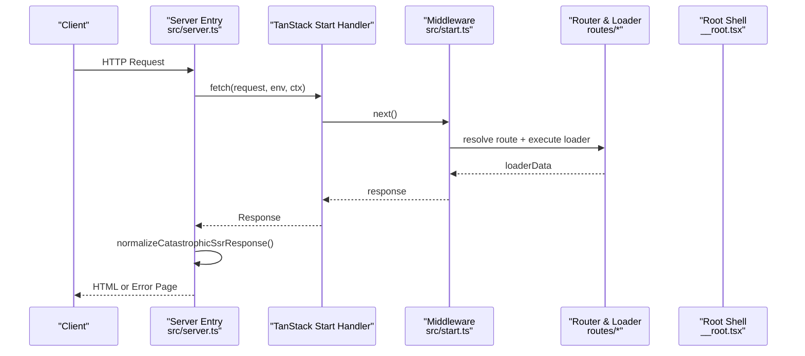
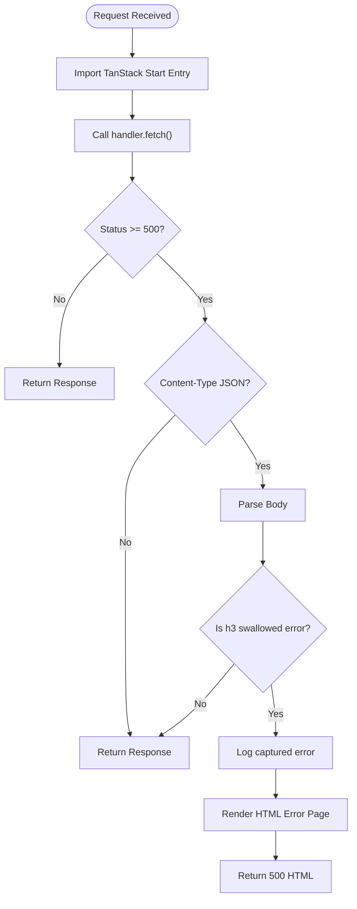
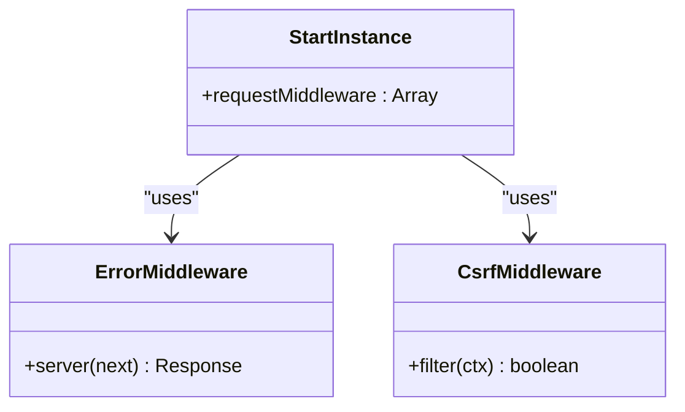
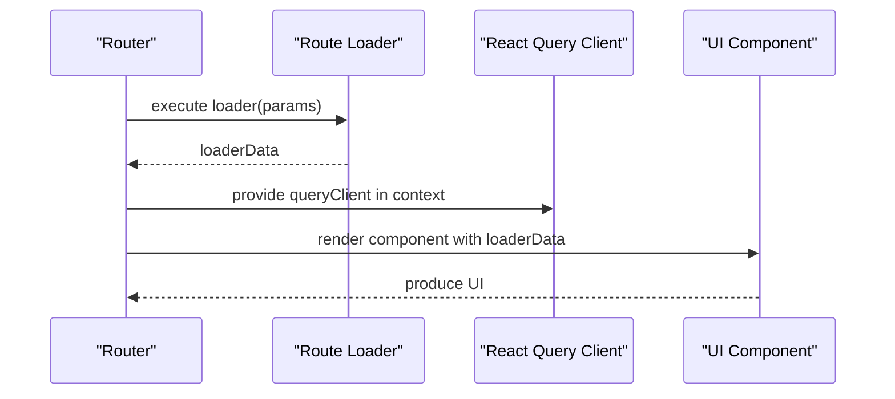
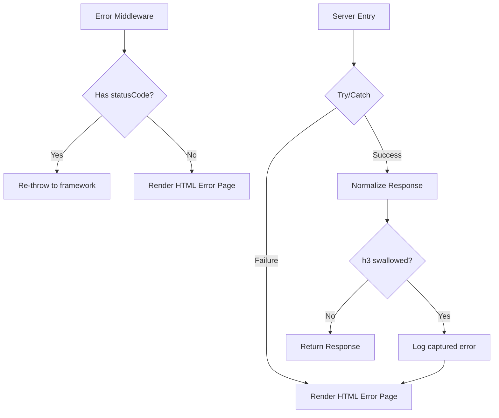
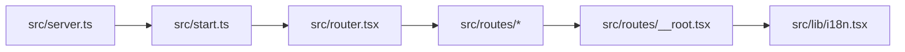

# Server-Side Rendering

<cite>
**Referenced Files in This Document**
- [server.ts](file://src/server.ts)
- [start.ts](file://src/start.ts)
- [vite.config.ts](file://vite.config.ts)
- [package.json](file://package.json)
- [router.tsx](file://src/router.tsx)
- [__root.tsx](file://src/routes/__root.tsx)
- [index.tsx](file://src/routes/index.tsx)
- [$serviceId.tsx](file://src/routes/services/$serviceId.tsx)
- [error-page.ts](file://src/lib/error-page.ts)
- [error-capture.ts](file://src/lib/error-capture.ts)
- [i18n.tsx](file://src/lib/i18n.tsx)
</cite>

## Table of Contents

1. [Introduction](#introduction)
2. [Project Structure](#project-structure)
3. [Core Components](#core-components)
4. [Architecture Overview](#architecture-overview)
5. [Detailed Component Analysis](#detailed-component-analysis)
6. [Dependency Analysis](#dependency-analysis)
7. [Performance Considerations](#performance-considerations)
8. [Troubleshooting Guide](#troubleshooting-guide)
9. [Conclusion](#conclusion)
10. [Appendices](#appendices)

## Introduction

This document explains the server-side rendering (SSR) implementation for a TanStack Start application. It covers server setup, middleware configuration, request/response handling, data loading strategies, caching, performance optimizations, error handling, logging, monitoring integration points, security considerations, and guidance for debugging and scaling SSR workloads. The project uses Vite with a TanStack Start preset that configures Nitro as the server target and integrates React Router and React Query for routing and data management.

## Project Structure

The SSR surface is defined by:

- A custom server entry that wraps the TanStack Start server handler to normalize errors and render fallback HTML on failures.
- A start configuration that registers request middleware for error handling and CSRF protection for server functions.
- Route definitions using TanStack Router with loaders for data fetching and head metadata for SEO.
- A root shell that provides global providers and scripts injection.

**Diagram sources**

- [server.ts:47-61](file://src/server.ts#L47-L61)
- [start.ts:27-29](file://src/start.ts#L27-L29)
- [router.tsx:5-16](file://src/router.tsx#L5-L16)
- [__root.tsx:76-153](file://src/routes/__root.tsx#L76-L153)

**Section sources**

- [server.ts:1-61](file://src/server.ts#L1-L61)
- [start.ts:1-29](file://src/start.ts#L1-L29)
- [vite.config.ts:1-16](file://vite.config.ts#L1-L16)
- [package.json:1-88](file://package.json#L1-L88)

## Core Components

- Server entry wrapper: intercepts requests, invokes the TanStack Start handler, normalizes catastrophic SSR errors, and returns a user-friendly HTML error page when needed.
- Start instance: defines request middleware pipeline including a generic error handler and CSRF protection scoped to server functions.
- Router and routes: configure React Query client, define route context, and implement per-route loaders for data fetching and head metadata.
- Root shell: injects global meta tags, styles, and script tags; wraps app with providers.

Key responsibilities:

- Error normalization and safe fallback responses.
- Middleware-based request processing and protection.
- Declarative data loading via route loaders.
- SEO-friendly head metadata from routes.

**Section sources**

- [server.ts:21-61](file://src/server.ts#L21-L61)
- [start.ts:5-29](file://src/start.ts#L5-L29)
- [router.tsx:1-16](file://src/router.tsx#L1-L16)
- [__root.tsx:76-153](file://src/routes/__root.tsx#L76-L153)

## Architecture Overview

The request lifecycle flows through a small set of layers:

1. The runtime invokes the default export in the server entry.
2. The server entry lazily imports the TanStack Start server entry and calls its fetch handler.
3. The Start instance runs configured request middleware (error handling, CSRF).
4. Router resolves the route and executes the route’s loader to fetch data.
5. The root shell renders the HTML with head content and scripts.
6. Responses are normalized to ensure robust error pages even if lower layers swallow exceptions.

**Diagram sources**

- [server.ts:47-61](file://src/server.ts#L47-L61)
- [start.ts:5-29](file://src/start.ts#L5-L29)
- [__root.tsx:76-153](file://src/routes/__root.tsx#L76-L153)

## Detailed Component Analysis

### Server Entry and Error Normalization

- Lazily loads the TanStack Start server entry to avoid unnecessary startup overhead.
- Wraps the handler call in try/catch to return a consistent HTML error page on unexpected failures.
- Detects h3-swallowed SSR errors by inspecting JSON bodies with specific markers and replaces them with an HTML error page while logging the original error via a capture utility.

**Diagram sources**

- [server.ts:21-61](file://src/server.ts#L21-L61)
- [error-capture.ts:52-81](file://src/lib/error-capture.ts#L52-L81)

**Section sources**

- [server.ts:10-61](file://src/server.ts#L10-L61)
- [error-capture.ts:1-82](file://src/lib/error-capture.ts#L1-L82)
- [error-page.ts:1-31](file://src/lib/error-page.ts#L1-L31)

### Start Configuration and Middleware

- Error middleware catches non-status errors during request processing and returns a 500 HTML error page.
- CSRF middleware is explicitly added to protect server functions against cross-site requests.
- The start instance exports a configured instance used by the build/runtime.

**Diagram sources**

- [start.ts:5-29](file://src/start.ts#L5-L29)

**Section sources**

- [start.ts:1-29](file://src/start.ts#L1-L29)

### Routing, Data Loading, and Head Metadata

- Router creates a React Query client and attaches it to route context for data sharing across components.
- Root route defines global head metadata, links, and shell structure including Scripts injection.
- Index route sets page-specific head metadata.
- Dynamic service route implements a loader to fetch data based on route params and throws notFound when missing, enabling proper 404 behavior.

**Diagram sources**

- [router.tsx:5-16](file://src/router.tsx#L5-L16)
- [__root.tsx:76-153](file://src/routes/__root.tsx#L76-L153)
- [index.tsx:13-33](file://src/routes/index.tsx#L13-L33)
- [$serviceId.tsx:40-68](file://src/routes/services/$serviceId.tsx#L40-L68)

**Section sources**

- [router.tsx:1-16](file://src/router.tsx#L1-L16)
- [__root.tsx:76-153](file://src/routes/__root.tsx#L76-L153)
- [index.tsx:1-59](file://src/routes/index.tsx#L1-L59)
- [$serviceId.tsx:40-68](file://src/routes/services/$serviceId.tsx#L40-L68)

### Error Handling and Logging Strategy

- Global error middleware converts unhandled errors into a friendly HTML response.
- Server entry detects h3-swallowed errors and logs the original error via a capture utility that records the last error and expands cause chains.
- A minimal HTML error page is rendered for both middleware and server entry error paths.

**Diagram sources**

- [start.ts:5-18](file://src/start.ts#L5-L18)
- [server.ts:21-61](file://src/server.ts#L21-L61)
- [error-capture.ts:52-81](file://src/lib/error-capture.ts#L52-L81)
- [error-page.ts:1-31](file://src/lib/error-page.ts#L1-L31)

**Section sources**

- [start.ts:5-18](file://src/start.ts#L5-L18)
- [server.ts:21-61](file://src/server.ts#L21-L61)
- [error-capture.ts:1-82](file://src/lib/error-capture.ts#L1-L82)
- [error-page.ts:1-31](file://src/lib/error-page.ts#L1-L31)

### Data Loading Strategies and Caching

- Use route loaders to fetch data before rendering, ensuring first meaningful paint includes required data.
- React Query client is created once per router instance and provided globally, enabling caching and deduplication across components.
- For static or infrequently changing data, consider memoizing results within loaders or leveraging React Query’s stale times and refetch policies.

Guidelines:

- Prefer loaders for critical data to enable SSR hydration with complete state.
- Use React Query options like staleTime and cache time to reduce redundant network calls.
- For large datasets, paginate or segment data to minimize payload size.

**Section sources**

- [router.tsx:1-16](file://src/router.tsx#L1-L16)
- [$serviceId.tsx:40-68](file://src/routes/services/$serviceId.tsx#L40-L68)

### Security Considerations

- CSRF protection is enabled for server functions via explicit middleware registration.
- Input validation should be applied at route loaders and server functions using a schema validator (e.g., Zod) to sanitize inputs before use.
- Avoid injecting untrusted content into HTML; rely on React’s escaping and avoid dangerouslySetInnerHTML unless strictly controlled.
- Configure secure headers (e.g., Content-Security-Policy, X-Frame-Options) at the hosting layer or via a reverse proxy to harden responses.

**Section sources**

- [start.ts:20-25](file://src/start.ts#L20-L25)

### Authentication on the Server

- Implement authentication checks inside route loaders or server functions to guard sensitive data.
- Validate tokens or session cookies early in the middleware chain to fail fast for unauthorized requests.
- Store minimal auth state in secure, httpOnly cookies and validate on each request.

[No sources needed since this section provides general guidance]

### Optimizing Bundle Sizes for Production

- The build toolchain is configured via a TanStack Start preset that includes necessary plugins and targets cloud environments.
- Keep dependencies lean; prefer tree-shakeable libraries and avoid bundling heavy modules unnecessarily.
- Use code splitting at route boundaries to load only what is needed per route.

**Section sources**

- [vite.config.ts:1-16](file://vite.config.ts#L1-L16)
- [package.json:1-88](file://package.json#L1-L88)

## Dependency Analysis

High-level dependencies:

- Server entry depends on TanStack Start server entry and local error utilities.
- Start configuration depends on TanStack Start primitives for middleware creation.
- Routes depend on TanStack Router and React Query for data and navigation.
- Root shell depends on React Query provider and language provider for global context.

**Diagram sources**

- [server.ts:47-61](file://src/server.ts#L47-L61)
- [start.ts:27-29](file://src/start.ts#L27-L29)
- [router.tsx:5-16](file://src/router.tsx#L5-L16)
- [__root.tsx:76-153](file://src/routes/__root.tsx#L76-L153)
- [i18n.tsx:51-82](file://src/lib/i18n.tsx#L51-L82)

**Section sources**

- [server.ts:47-61](file://src/server.ts#L47-L61)
- [start.ts:27-29](file://src/start.ts#L27-L29)
- [router.tsx:5-16](file://src/router.tsx#L5-L16)
- [__root.tsx:76-153](file://src/routes/__root.tsx#L76-L153)
- [i18n.tsx:51-82](file://src/lib/i18n.tsx#L51-L82)

## Performance Considerations

- SSR latency: Minimize synchronous work in loaders; prefer async streaming where supported by your host.
- Caching: Leverage React Query caching to avoid repeated data fetches; tune staleTime and gcTime based on data volatility.
- Payload size: Serialize only necessary fields; paginate lists; compress responses at the edge/proxy.
- Hydration: Ensure server-rendered HTML matches client expectations to avoid hydration mismatches.
- Edge deployment: Consider deploying to edge runtimes for lower cold starts and reduced latency.

[No sources needed since this section provides general guidance]

## Troubleshooting Guide

Common issues and resolutions:

- Unexpected 500 responses with JSON body indicating swallowed errors: The server entry detects and logs these cases, returning an HTML error page. Inspect logs for the captured error stack.
- Middleware swallowing errors: Verify that status-bearing errors are re-thrown so the framework can handle them appropriately.
- Missing route data: Ensure loaders return correct data or throw notFound for invalid parameters.

Debugging steps:

- Enable verbose logging in development mode.
- Reproduce issues locally and check console output for expanded error descriptions.
- Validate route loaders and server function inputs with schema validation.

Monitoring integration points:

- Hook into error middleware and server entry to forward errors to external monitoring services.
- Instrument loader execution times to identify slow data sources.

**Section sources**

- [server.ts:21-61](file://src/server.ts#L21-L61)
- [start.ts:5-18](file://src/start.ts#L5-L18)
- [error-capture.ts:52-81](file://src/lib/error-capture.ts#L52-L81)

## Conclusion

This SSR setup leverages TanStack Start with a focused server entry, middleware-driven request handling, and declarative route loaders for predictable data flow. Robust error normalization ensures users see friendly pages even when underlying layers swallow exceptions. By combining React Query caching, careful input validation, and CSRF protection, the application balances performance and security. Extend monitoring and observability by instrumenting middleware and loaders, and optimize for scale through caching, payload reduction, and edge deployment strategies.

[No sources needed since this section summarizes without analyzing specific files]

## Appendices

### Example Patterns and Where to Apply Them

- Implementing server functions: Protect with CSRF middleware already configured for serverFn handlers.
- Handling authentication on the server: Add checks in route loaders or server functions; validate tokens early.
- Optimizing bundle sizes: Rely on the preset configuration and split code at route boundaries.

[No sources needed since this section provides general guidance]
