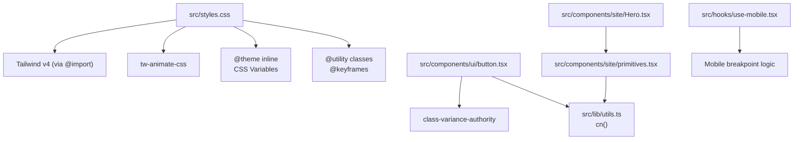
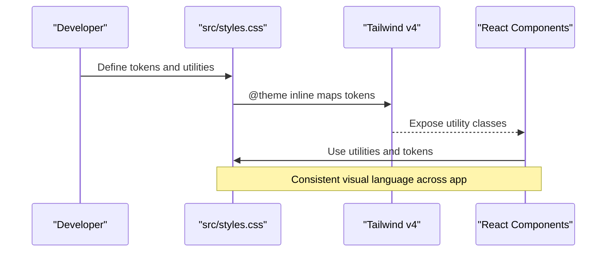
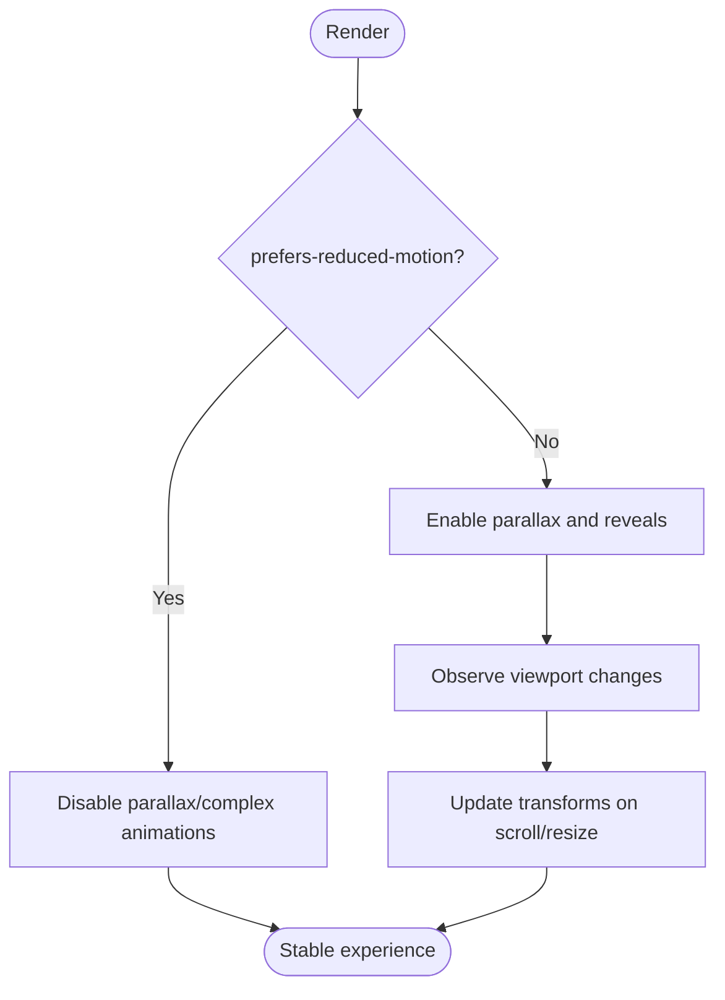
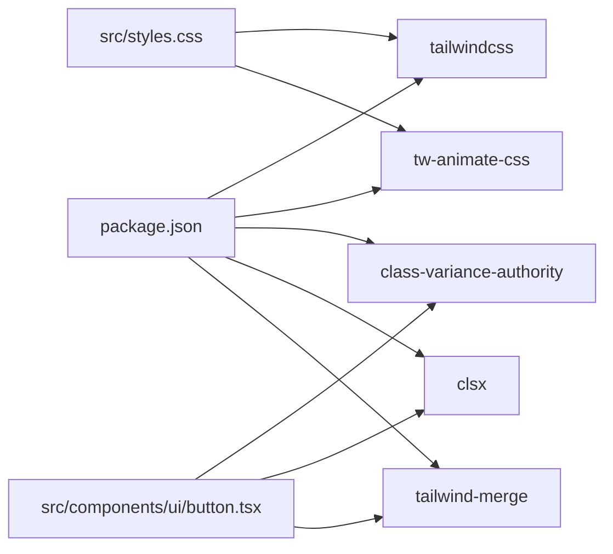

# Styling and Design System

<cite>
**Referenced Files in This Document**
- [styles.css](file://src/styles.css)
- [package.json](file://package.json)
- [components.json](file://components.json)
- [vite.config.ts](file://vite.config.ts)
- [Hero.tsx](file://src/components/site/Hero.tsx)
- [primitives.tsx](file://src/components/site/primitives.tsx)
- [button.tsx](file://src/components/ui/button.tsx)
- [utils.ts](file://src/lib/utils.ts)
- [use-mobile.tsx](file://src/hooks/use-mobile.tsx)
</cite>

## Table of Contents

1. Introduction
2. Project Structure
3. Core Components
4. Architecture Overview
5. Detailed Component Analysis
6. Dependency Analysis
7. Performance Considerations
8. Troubleshooting Guide
9. Conclusion
10. Appendices

## Introduction

This document explains the styling and design system built on Tailwind CSS v4 with a custom theme, semantic tokens, typography scale, spacing conventions, animations, transitions, and responsive patterns. It covers how to extend the system, maintain consistency, and optimize performance for CSS delivery and animations.

## Project Structure

The design system is centered around a single CSS entry that imports Tailwind v4, registers source scanning, includes an animation library, defines a theme via CSS variables, and exposes utilities and keyframes. React components consume these tokens and utilities through class names and small helper utilities.

**Diagram sources**

- [styles.css:1-69](file://src/styles.css#L1-L69)
- [button.tsx:1-49](file://src/components/ui/button.tsx#L1-L49)
- [utils.ts:1-7](file://src/lib/utils.ts#L1-L7)
- [primitives.tsx:69-111](file://src/components/site/primitives.tsx#L69-L111)
- [Hero.tsx:18-117](file://src/components/site/Hero.tsx#L18-L117)
- [use-mobile.tsx:1-19](file://src/hooks/use-mobile.tsx#L1-L19)

**Section sources**

- [styles.css:1-69](file://src/styles.css#L1-L69)
- [package.json:42-66](file://package.json#L42-L66)
- [components.json:1-23](file://components.json#L1-L23)
- [vite.config.ts:1-16](file://vite.config.ts#L1-L16)

## Core Components

- Theme and tokens: Defined via CSS custom properties and mapped into Tailwind’s theme using @theme inline. Colors, fonts, radii, shadows, and gradients are centralized.
- Utilities: Custom utility classes for typography and surfaces (e.g., label-mono, display-serif, surface-plate, grain).
- Animations: Keyframes and animation utilities for cinematic effects (ember-rise, slow-spin, marquee-x, pulse-soft), plus integration with tw-animate-css.
- Dark mode: A custom variant enables dark-mode styling via a .dark context.
- UI primitives: Button component uses class-variance-authority to compose variants and sizes while consuming design tokens.
- Site primitives: Parallax and Reveal provide motion-aware interactions; Hero composes layout, typography, and motion.

**Section sources**

- [styles.css:21-69](file://src/styles.css#L21-L69)
- [styles.css:155-212](file://src/styles.css#L155-L212)
- [styles.css:214-267](file://src/styles.css#L214-L267)
- [button.tsx:7-32](file://src/components/ui/button.tsx#L7-L32)
- [primitives.tsx:69-111](file://src/components/site/primitives.tsx#L69-L111)
- [Hero.tsx:18-117](file://src/components/site/Hero.tsx#L18-L117)

## Architecture Overview

The design system follows a token-first approach:

- Tokens live as CSS variables under :root and .dark.
- @theme inline maps tokens to Tailwind utilities (e.g., --color-primary -> bg-primary).
- Components use semantic tokens and utilities rather than ad-hoc values.
- Motion is layered: CSS keyframes + utilities for simple effects; lightweight JS for parallax and reveal.

**Diagram sources**

- [styles.css:1-69](file://src/styles.css#L1-L69)
- [button.tsx:7-32](file://src/components/ui/button.tsx#L7-L32)
- [Hero.tsx:18-117](file://src/components/site/Hero.tsx#L18-L117)

## Detailed Component Analysis

### Design Token System

- Fonts: Display, sans, mono families are registered as tokens and used by utilities.
- Radii: Base radius variable drives a scale of radii tokens.
- Colors: Semantic colors (background, foreground, primary, secondary, muted, accent, destructive, border, input, ring) and extended palette (chart series, sidebar, ember, azure, jade, plum).
- Gradients and shadows: Named gradient and shadow tokens enable consistent surfaces and depth.
- Dark mode: Separate token values under .dark ensure contrast and accessibility.

How to add a new semantic color:

1. Add light and dark values as CSS variables.
2. Register the token in @theme inline so it becomes available as a Tailwind utility.

**Section sources**

- [styles.css:21-69](file://src/styles.css#L21-L69)
- [styles.css:71-153](file://src/styles.css#L71-L153)

### Typography Scale

- Utility classes encapsulate typographic intent:
  - label-mono: Monospaced labels with uppercase and wide letter-spacing.
  - display-serif: Elegant serif headings with tight tracking and compact line-height.
- These utilities reference font tokens, ensuring consistency across components.

Usage examples in components:

- Headings and section titles use display-serif.
- Small labels and metadata use label-mono.

**Section sources**

- [styles.css:172-184](file://src/styles.css#L172-L184)
- [Hero.tsx:47-80](file://src/components/site/Hero.tsx#L47-L80)
- [primitives.tsx:156-195](file://src/components/site/primitives.tsx#L156-L195)

### Spacing Conventions

- Spacing is primarily handled via Tailwind’s spacing utilities (margins, paddings, gaps).
- Layouts rely on flexbox/grid with responsive modifiers to adapt from mobile to desktop.
- Surfaces use consistent borders and shadows via tokens.

Practical patterns:

- Section padding scales with breakpoints (e.g., px-6 to lg:px-10).
- Grid layouts switch columns at sm/breakpoints for better density.

**Section sources**

- [Hero.tsx:18-117](file://src/components/site/Hero.tsx#L18-L117)
- [primitives.tsx:156-195](file://src/components/site/primitives.tsx#L156-L195)

### Color Palette and Theming

- All colors use oklch for perceptual uniformity and improved contrast control.
- Light and dark palettes are defined separately to maintain readability.
- Extended palette supports charts, sidebars, and brand accents.

Extending themes:

- Add new tokens in :root and .dark.
- Map them in @theme inline to expose Tailwind utilities.

**Section sources**

- [styles.css:71-153](file://src/styles.css#L71-L153)
- [styles.css:21-69](file://src/styles.css#L21-L69)

### Animations, Transitions, and Visual Effects

- Keyframes:
  - ember-rise: Fade-in and slide-up entrance.
  - slow-spin: Continuous rotation for decorative elements.
  - marquee-x: Horizontal infinite scroll for lists or badges.
  - pulse-soft: Subtle opacity pulsing for status indicators.
- Animation utilities:
  - animate-rise, animate-slow-spin, animate-marquee, animate-pulse-soft.
- Text effects:
  - text-aurora: Gradient text using background-clip.
- Surface effects:
  - grain: Subtle noise overlay for texture.
  - surface-plate: Glass-like card with gradient and shadow.

Cinematic usage:

- Staggered entrances via inline styles with delays.
- Parallax layers for depth during scroll.

**Section sources**

- [styles.css:207-267](file://src/styles.css#L207-L267)
- [Hero.tsx:18-117](file://src/components/site/Hero.tsx#L18-L117)
- [primitives.tsx:69-111](file://src/components/site/primitives.tsx#L69-L111)

### Responsive Design Approach

- Mobile-first methodology:
  - Default styles target small screens; enhancements apply at sm/md/lg breakpoints.
- Breakpoint usage:
  - Grid column counts increase at sm.
  - Padding and typography scale up at larger breakpoints.
- Device-specific optimizations:
  - Reduced motion respected via prefers-reduced-motion checks in interactive components.
  - Hook provides programmatic access to mobile state for conditional behavior.

**Diagram sources**

- [primitives.tsx:81-104](file://src/components/site/primitives.tsx#L81-L104)
- [use-mobile.tsx:1-19](file://src/hooks/use-mobile.tsx#L1-L19)

**Section sources**

- [Hero.tsx:18-117](file://src/components/site/Hero.tsx#L18-L117)
- [use-mobile.tsx:1-19](file://src/hooks/use-mobile.tsx#L1-L19)
- [primitives.tsx:81-104](file://src/components/site/primitives.tsx#L81-L104)

### Implementing Custom Themes and Extending the System

- Add new tokens:
  - Define light/dark values in :root and .dark.
  - Register in @theme inline to expose utilities.
- Create reusable utilities:
  - Use @utility for shared patterns (typography, surfaces, effects).
- Maintain consistency:
  - Prefer tokens and utilities over raw values in components.
- Integrate with UI primitives:
  - Extend button variants or create new components using class-variance-authority and cn().

**Section sources**

- [styles.css:21-69](file://src/styles.css#L21-L69)
- [styles.css:172-212](file://src/styles.css#L172-L212)
- [button.tsx:7-32](file://src/components/ui/button.tsx#L7-L32)
- [utils.ts:1-7](file://src/lib/utils.ts#L1-L7)

### Maintaining Visual Consistency Across Components

- Centralize tokens and utilities in styles.css.
- Compose components from tokens/utilities rather than hardcoding values.
- Use consistent naming for variants and states (default, hover, focus, disabled).
- Leverage class merging (cn) to avoid conflicts when composing classes.

**Section sources**

- [button.tsx:7-49](file://src/components/ui/button.tsx#L7-L49)
- [utils.ts:1-7](file://src/lib/utils.ts#L1-L7)
- [styles.css:155-212](file://src/styles.css#L155-L212)

## Dependency Analysis

Key dependencies shaping the design system:

- Tailwind CSS v4: Provides utility-first styling and theme mapping via @theme.
- tw-animate-css: Adds prebuilt animations integrated via @import.
- class-variance-authority: Enables variant-driven component styling.
- clsx and tailwind-merge: Used in cn() to merge classes deterministically.
- Radix UI primitives: Provide accessible base components styled with tokens.

**Diagram sources**

- [package.json:42-66](file://package.json#L42-L66)
- [styles.css:1-3](file://src/styles.css#L1-L3)
- [button.tsx:1-6](file://src/components/ui/button.tsx#L1-L6)
- [utils.ts:1-7](file://src/lib/utils.ts#L1-L7)

**Section sources**

- [package.json:42-66](file://package.json#L42-L66)
- [styles.css:1-3](file://src/styles.css#L1-L3)
- [button.tsx:1-6](file://src/components/ui/button.tsx#L1-L6)
- [utils.ts:1-7](file://src/lib/utils.ts#L1-L7)

## Performance Considerations

- CSS delivery:
  - Tailwind v4 compiles only used utilities based on source scanning (@source).
  - Keep tokens and utilities centralized to minimize duplication.
- Animation optimization:
  - Prefer CSS animations for simple effects; use requestAnimationFrame for scroll-driven transforms.
  - Respect prefers-reduced-motion to reduce jank and improve accessibility.
- Bundle size reduction:
  - Avoid unnecessary libraries; leverage tw-animate-css for common animations.
  - Use class merging to prevent redundant class strings.
- Rendering efficiency:
  - Use will-change-transform sparingly and only where needed (e.g., parallax containers).
  - Debounce or throttle expensive operations; the current implementation uses rAF gating.

[No sources needed since this section provides general guidance]

## Troubleshooting Guide

- Dark mode not applying:
  - Ensure the .dark class is present on a parent element and that the custom variant is configured.
- Colors not updating:
  - Verify tokens are defined in both :root and .dark and registered in @theme inline.
- Animations not visible:
  - Check if prefers-reduced-motion is enabled; disable complex animations accordingly.
- Class conflicts:
  - Use cn() to merge classes deterministically and avoid overriding unintended styles.

**Section sources**

- [styles.css:5-5](file://src/styles.css#L5-L5)
- [styles.css:71-153](file://src/styles.css#L71-L153)
- [primitives.tsx:81-104](file://src/components/site/primitives.tsx#L81-L104)
- [utils.ts:1-7](file://src/lib/utils.ts#L1-L7)

## Conclusion

The design system leverages Tailwind CSS v4 with a robust token layer, clear typography utilities, and a cohesive animation strategy. By centralizing tokens, using utilities consistently, and optimizing motion, the application maintains visual coherence, accessibility, and performance as it scales.

[No sources needed since this section summarizes without analyzing specific files]

## Appendices

### Adding New Styles and Patterns

- Define tokens in :root and .dark.
- Register tokens in @theme inline.
- Create @utility classes for reusable patterns.
- Compose components using tokens/utilities and cn().

**Section sources**

- [styles.css:21-69](file://src/styles.css#L21-L69)
- [styles.css:172-212](file://src/styles.css#L172-L212)
- [utils.ts:1-7](file://src/lib/utils.ts#L1-L7)

### Responsive Guidelines

- Start with mobile defaults; enhance at sm/md/lg.
- Use grid/flex with responsive prefixes for layout shifts.
- Test reduced motion scenarios.

**Section sources**

- [Hero.tsx:18-117](file://src/components/site/Hero.tsx#L18-L117)
- [use-mobile.tsx:1-19](file://src/hooks/use-mobile.tsx#L1-L19)

### Animation Best Practices

- Use CSS keyframes for declarative animations.
- Gate scroll-driven transforms behind rAF and reduced motion checks.
- Limit heavy effects to non-critical paths.

**Section sources**

- [styles.css:214-267](file://src/styles.css#L214-L267)
- [primitives.tsx:81-104](file://src/components/site/primitives.tsx#L81-L104)
