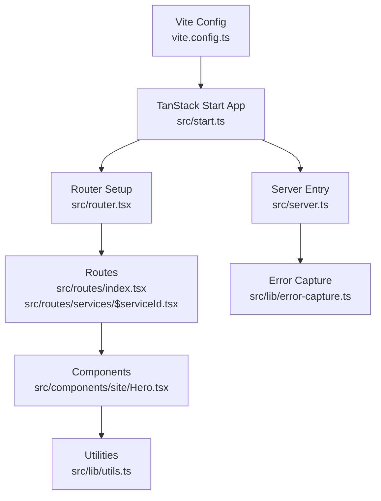
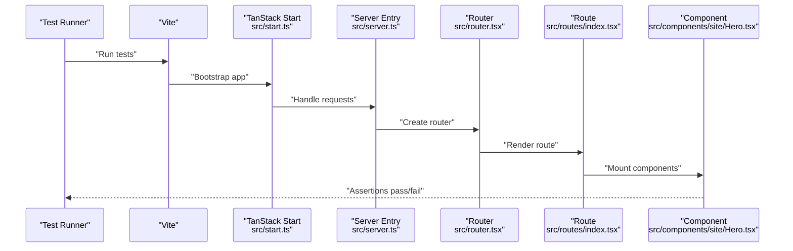
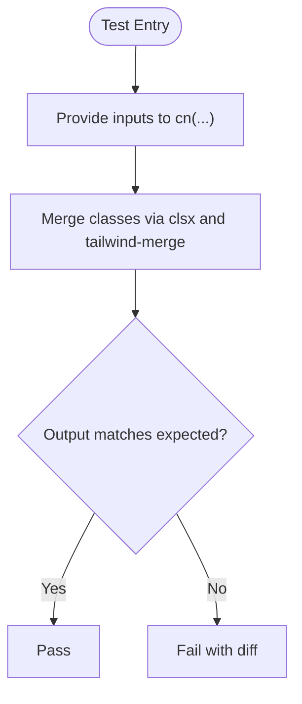
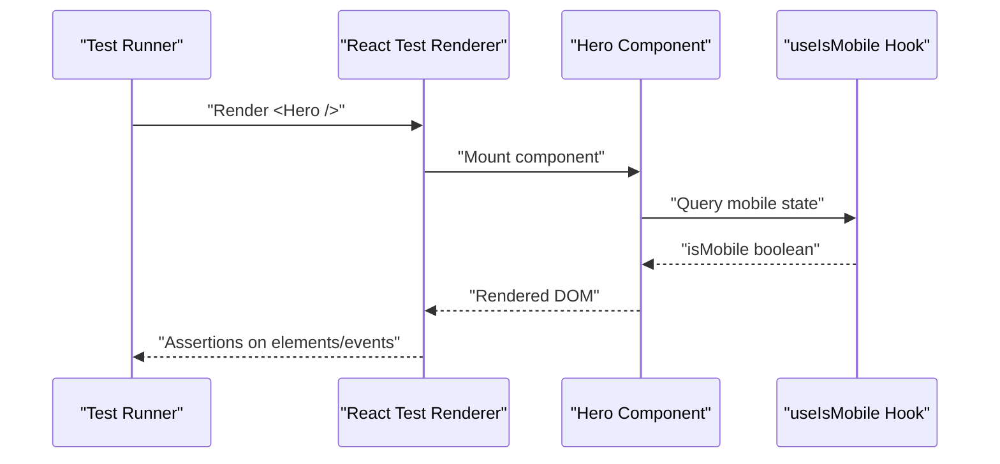
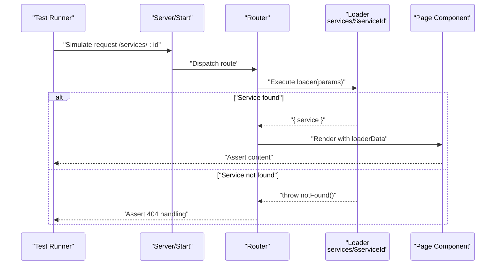
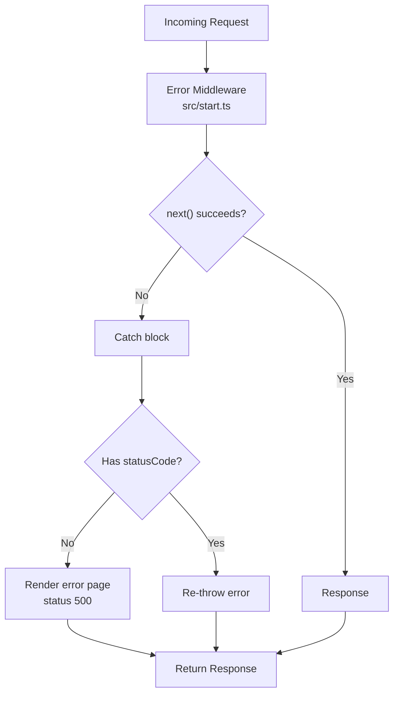
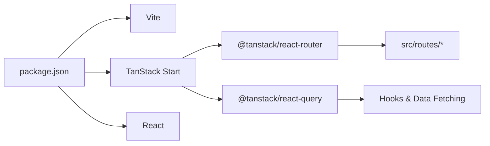

# Testing Strategy

<cite>
**Referenced Files in This Document**
- [package.json](file://package.json)
- [vite.config.ts](file://vite.config.ts)
- [tsconfig.json](file://tsconfig.json)
- [src/server.ts](file://src/server.ts)
- [src/start.ts](file://src/start.ts)
- [src/router.tsx](file://src/router.tsx)
- [src/routes/index.tsx](file://src/routes/index.tsx)
- [src/routes/services/$serviceId.tsx](file://src/routes/services/$serviceId.tsx)
- [src/components/site/Hero.tsx](file://src/components/site/Hero.tsx)
- [src/hooks/use-mobile.tsx](file://src/hooks/use-mobile.tsx)
- [src/lib/utils.ts](file://src/lib/utils.ts)
- [src/lib/error-capture.ts](file://src/lib/error-capture.ts)
</cite>

## Table of Contents

1. Introduction
2. Project Structure
3. Core Components
4. Architecture Overview
5. Detailed Component Analysis
6. Dependency Analysis
7. Performance Considerations
8. Troubleshooting Guide
9. Conclusion
10. Appendices

## Introduction

This document defines the testing strategy for the Xragency application, covering unit tests, component tests, and integration tests. It explains how to set up a testing framework, organize tests, mock external dependencies, and validate React components, server-side behavior, and utility modules. It also outlines continuous integration, coverage requirements, performance and load testing strategies, end-to-end testing approaches, and guidelines for maintaining test quality and debugging failures.

## Project Structure

The project is a TanStack Start + Vite application with:

- UI components under src/components/site and src/components/ui
- Routes under src/routes
- Server entry and middleware under src/server.ts and src/start.ts
- Utilities and libraries under src/lib
- Router configuration under src/router.tsx

**Diagram sources**

- [vite.config.ts:1-16](file://vite.config.ts#L1-L16)
- [src/start.ts:1-29](file://src/start.ts#L1-L29)
- [src/server.ts:1-61](file://src/server.ts#L1-L61)
- [src/router.tsx:1-17](file://src/router.tsx#L1-L17)
- [src/routes/index.tsx:1-59](file://src/routes/index.tsx#L1-L59)
- [src/routes/services/$serviceId.tsx:40-80](file://src/routes/services/$serviceId.tsx#L40-L80)
- [src/components/site/Hero.tsx:1-121](file://src/components/site/Hero.tsx#L1-L121)
- [src/lib/utils.ts:1-7](file://src/lib/utils.ts#L1-L7)
- [src/lib/error-capture.ts:1-81](file://src/lib/error-capture.ts#L1-L81)

**Section sources**

- [vite.config.ts:1-16](file://vite.config.ts#L1-L16)
- [src/start.ts:1-29](file://src/start.ts#L1-L29)
- [src/server.ts:1-61](file://src/server.ts#L1-L61)
- [src/router.tsx:1-17](file://src/router.tsx#L1-L17)
- [src/routes/index.tsx:1-59](file://src/routes/index.tsx#L1-L59)
- [src/routes/services/$serviceId.tsx:40-80](file://src/routes/services/$serviceId.tsx#L40-L80)
- [src/components/site/Hero.tsx:1-121](file://src/components/site/Hero.tsx#L1-L121)
- [src/lib/utils.ts:1-7](file://src/lib/utils.ts#L1-L7)
- [src/lib/error-capture.ts:1-81](file://src/lib/error-capture.ts#L1-L81)

## Core Components

- Server entry and error handling: The server entry normalizes SSR errors and returns an error page when necessary. Error capture wraps console.error and global error events to preserve stack traces.
- Application bootstrap: start.ts configures request middleware (error handling and CSRF protection).
- Router: router.tsx creates a router instance with React Query client and routing options.
- Routes: index.tsx composes the home page; $serviceId.tsx loads service data and renders detail pages.
- Components: Hero.tsx demonstrates typical site components using i18n and shared primitives.
- Utilities: utils.ts provides a class name merging helper used across components.

Testing implications:

- Unit test pure utilities (e.g., cn) and business logic functions.
- Component tests render UI fragments and assert interactions without full browser.
- Integration tests verify route loaders, navigation, and server function flows where applicable.

**Section sources**

- [src/server.ts:1-61](file://src/server.ts#L1-L61)
- [src/start.ts:1-29](file://src/start.ts#L1-L29)
- [src/router.tsx:1-17](file://src/router.tsx#L1-L17)
- [src/routes/index.tsx:1-59](file://src/routes/index.tsx#L1-L59)
- [src/routes/services/$serviceId.tsx:40-80](file://src/routes/services/$serviceId.tsx#L40-L80)
- [src/components/site/Hero.tsx:1-121](file://src/components/site/Hero.tsx#L1-L121)
- [src/lib/utils.ts:1-7](file://src/lib/utils.ts#L1-L7)
- [src/lib/error-capture.ts:1-81](file://src/lib/error-capture.ts#L1-L81)

## Architecture Overview

The runtime flow spans Vite build, TanStack Start bootstrap, server entry, and routes rendering components. Tests should cover each layer appropriately:

- Build-time: ensure Vite/TanStack plugins are configured correctly for tests.
- Runtime: validate server middleware behavior and route loaders.
- UI: assert component rendering and user interactions.

**Diagram sources**

- [vite.config.ts:1-16](file://vite.config.ts#L1-L16)
- [src/start.ts:1-29](file://src/start.ts#L1-L29)
- [src/server.ts:1-61](file://src/server.ts#L1-L61)
- [src/router.tsx:1-17](file://src/router.tsx#L1-L17)
- [src/routes/index.tsx:1-59](file://src/routes/index.tsx#L1-L59)
- [src/components/site/Hero.tsx:1-121](file://src/components/site/Hero.tsx#L1-L121)

## Detailed Component Analysis

### Utility Module Testing (Unit Tests)

Focus on pure functions like the class name merger. Validate input combinations and output stability.

Guidelines:

- Test edge cases: empty arrays, duplicates, conflicting classes, conditional values.
- Keep tests fast and deterministic.

**Section sources**

- [src/lib/utils.ts:1-7](file://src/lib/utils.ts#L1-L7)

### React Component Testing (Component Tests)

Target representative components such as Hero to validate rendering and interactions. Use a component test runner that supports React and DOM APIs.

Key areas to test:

- Rendering structure and text content derived from i18n.
- Button clicks and navigation anchors.
- Responsive behavior via hooks like useIsMobile.

Guidelines:

- Mock i18n and any third-party providers if needed.
- Simulate user actions (clicks, scrolls) and assert side effects or rendered changes.
- For responsive checks, stub matchMedia or the mobile hook to control breakpoints.

**Section sources**

- [src/components/site/Hero.tsx:1-121](file://src/components/site/Hero.tsx#L1-L121)
- [src/hooks/use-mobile.tsx:1-19](file://src/hooks/use-mobile.tsx#L1-L19)

### Route and Loader Testing (Integration Tests)

Validate route loaders and data fetching patterns. For example, the service detail loader uses notFound() when data is missing.

Guidelines:

- Test both success and not-found paths.
- Verify meta/head updates for SEO tags.
- Stub network calls or data sources if present.

**Section sources**

- [src/routes/services/$serviceId.tsx:40-80](file://src/routes/services/$serviceId.tsx#L40-L80)
- [src/routes/index.tsx:1-59](file://src/routes/index.tsx#L1-L59)

### Server Middleware and Error Handling (Integration Tests)

Validate error middleware and server entry behavior. Ensure unhandled errors return appropriate responses and captured errors are logged.

Guidelines:

- Assert status codes and response bodies for error scenarios.
- Verify CSRF middleware protects server functions.
- Confirm error capture preserves stack traces for diagnostics.

**Section sources**

- [src/start.ts:1-29](file://src/start.ts#L1-L29)
- [src/server.ts:1-61](file://src/server.ts#L1-L61)
- [src/lib/error-capture.ts:1-81](file://src/lib/error-capture.ts#L1-L81)

## Dependency Analysis

The application depends on Vite, TanStack Start, React, and various UI libraries. Tests should isolate these dependencies through mocking where necessary.

**Diagram sources**

- [package.json:1-88](file://package.json#L1-L88)
- [src/router.tsx:1-17](file://src/router.tsx#L1-L17)
- [src/routes/index.tsx:1-59](file://src/routes/index.tsx#L1-L59)

**Section sources**

- [package.json:1-88](file://package.json#L1-L88)
- [src/router.tsx:1-17](file://src/router.tsx#L1-L17)

## Performance Considerations

- Prefer unit and component tests over heavy integration tests for speed.
- Use isolated environments and mocks to avoid real I/O.
- Batch assertions and minimize re-renders in component tests.
- For performance-sensitive features (animations, large lists), add targeted benchmarks or profiling tests.

[No sources needed since this section provides general guidance]

## Troubleshooting Guide

Common issues and resolutions:

- Flaky tests due to timers or animations: stabilize by controlling animation states or mocking time-based hooks.
- Network-dependent tests: stub fetch or data loaders to deterministic outcomes.
- SSR error handling: verify error middleware catches unexpected errors and returns proper responses.
- Debugging: enable verbose logging in tests and inspect captured errors via error capture utilities.

**Section sources**

- [src/lib/error-capture.ts:1-81](file://src/lib/error-capture.ts#L1-L81)
- [src/start.ts:1-29](file://src/start.ts#L1-L29)
- [src/server.ts:1-61](file://src/server.ts#L1-L61)

## Conclusion

Adopt a layered testing strategy:

- Unit tests for utilities and pure logic.
- Component tests for UI behavior and interactions.
- Integration tests for routes, loaders, and server middleware.
  Ensure CI runs all tests with coverage thresholds, and maintain high-quality tests through regular refactoring and clear naming conventions.

[No sources needed since this section summarizes without analyzing specific files]

## Appendices

### Testing Framework Setup

Recommended setup:

- Add a test runner compatible with Vite and React (for example, Vitest).
- Configure environment to support DOM and Node APIs as needed.
- Set up path aliases matching tsconfig.json for imports.

Configuration references:

- Path alias configuration ensures consistent imports in tests.
- Vite configuration indicates plugin usage and server entry points.

**Section sources**

- [tsconfig.json:1-27](file://tsconfig.json#L1-L27)
- [vite.config.ts:1-16](file://vite.config.ts#L1-L16)

### Test Organization Patterns

Suggested structure:

- Place tests adjacent to source files or in dedicated directories per feature.
- Group tests by concern: unit, component, integration.
- Name files clearly to reflect tested units.

[No sources needed since this section provides general guidance]

### Mocking Strategies

- Mock i18n functions and providers to control translations.
- Stub hooks like useIsMobile to simulate different screen sizes.
- Isolate network calls by intercepting fetch or mocking data loaders.
- For server functions, mock CSRF middleware behavior if needed.

**Section sources**

- [src/hooks/use-mobile.tsx:1-19](file://src/hooks/use-mobile.tsx#L1-L19)
- [src/start.ts:1-29](file://src/start.ts#L1-L29)

### Continuous Integration and Coverage

- Run tests on every push/PR with a headless environment.
- Enforce minimum code coverage thresholds for critical layers (utilities, components, routes).
- Generate coverage reports and fail builds below thresholds.

[No sources needed since this section provides general guidance]

### Performance and Load Testing

- Use lightweight benchmarks for hot paths (class name merging, list rendering).
- For load testing, consider simulating concurrent requests against server endpoints if applicable.
- Profile component rendering to identify bottlenecks.

[No sources needed since this section provides general guidance]

### End-to-End Testing Methodology

- Validate critical user workflows (navigation, form submissions, service detail loading).
- Use a browser automation tool to drive the app and assert visible outcomes.
- Keep e2e tests focused on high-value flows to maintain speed and reliability.

[No sources needed since this section provides general guidance]

### Guidelines for Maintaining Test Quality

- Keep tests readable and focused on one behavior per test.
- Avoid brittle selectors; prefer semantic queries.
- Refactor tests alongside production code to maintain clarity.
- Regularly review flaky tests and stabilize them.

[No sources needed since this section provides general guidance]
