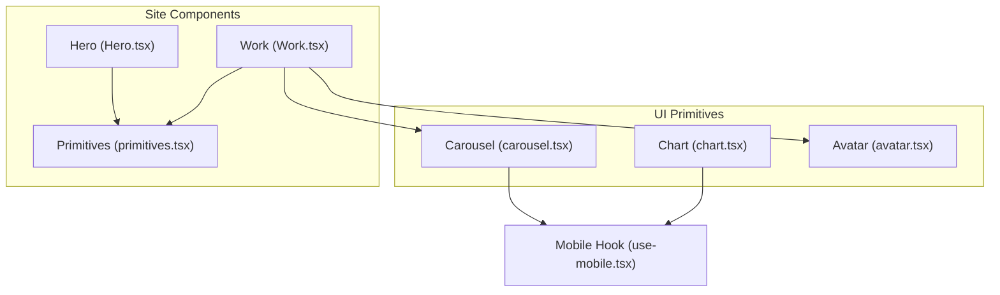
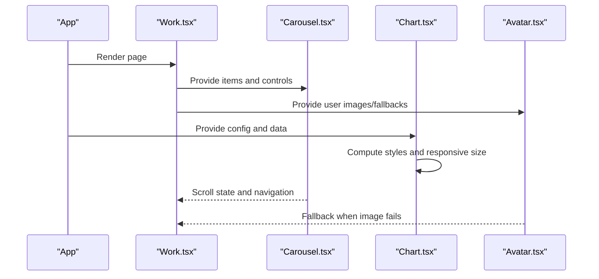
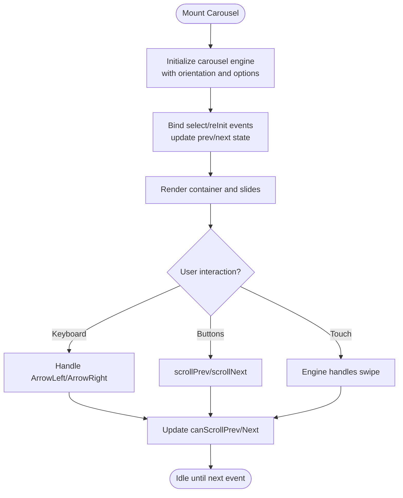
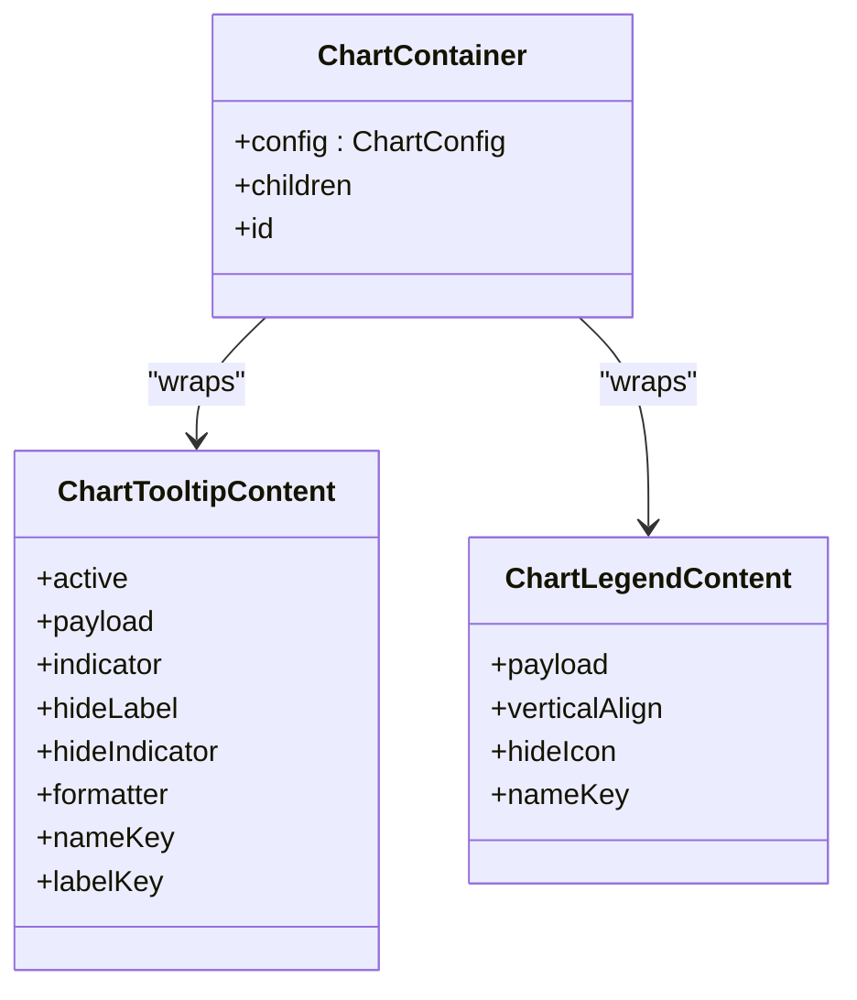
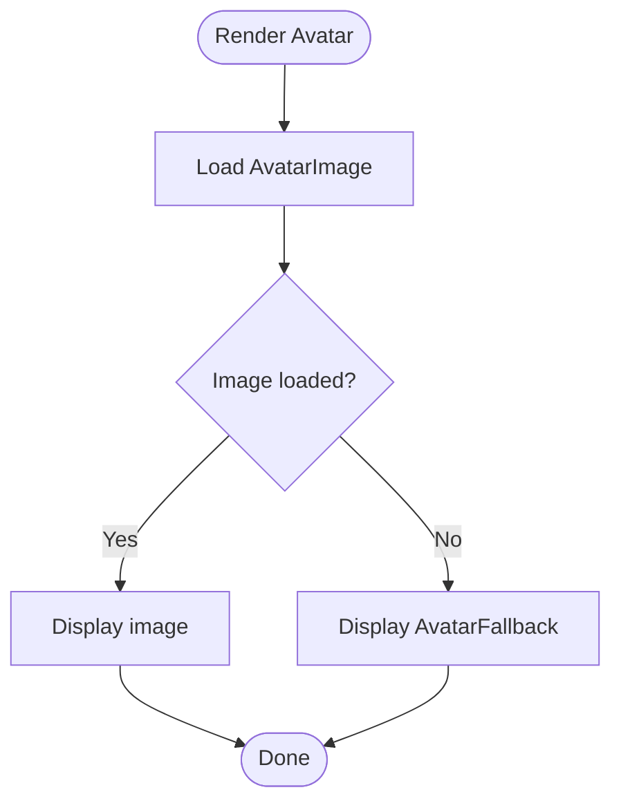
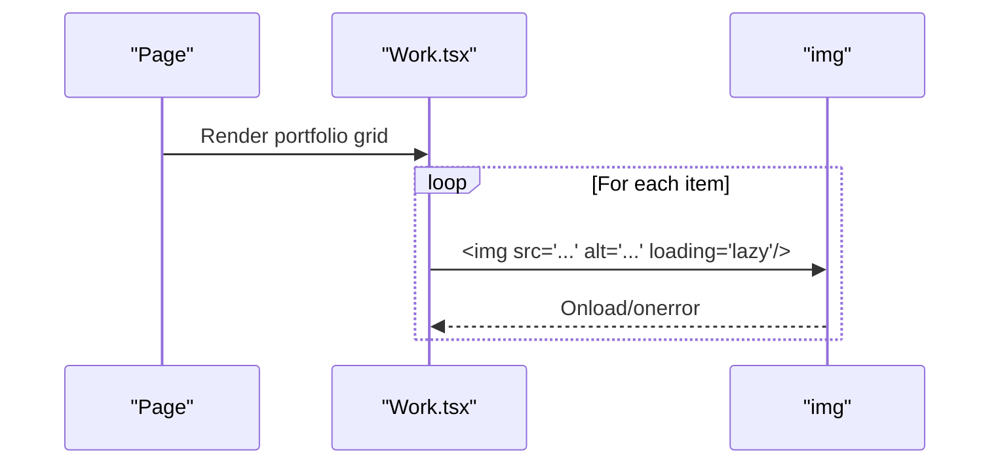
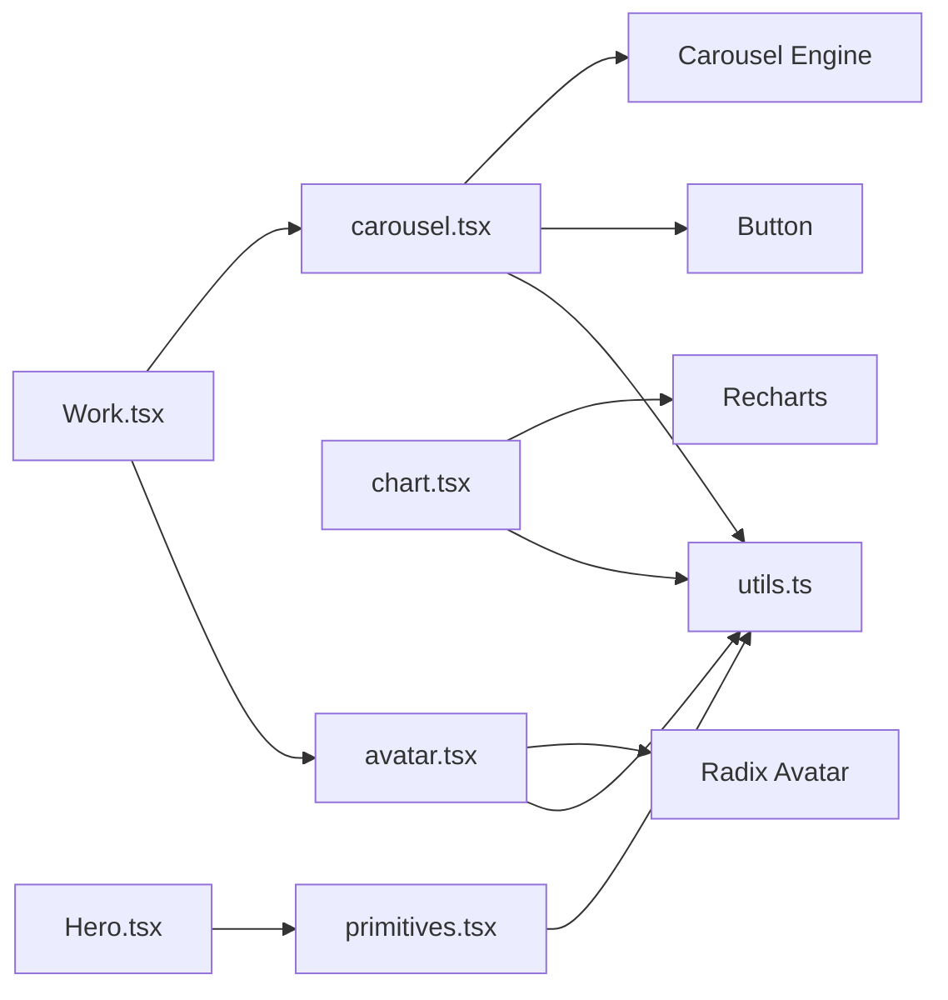

# Data Display Components

<cite>
**Referenced Files in This Document**
- [carousel.tsx](file://src/components/ui/carousel.tsx)
- [chart.tsx](file://src/components/ui/chart.tsx)
- [avatar.tsx](file://src/components/ui/avatar.tsx)
- [Work.tsx](file://src/components/site/Work.tsx)
- [Hero.tsx](file://src/components/site/Hero.tsx)
- [primitives.tsx](file://src/components/site/primitives.tsx)
- [use-mobile.tsx](file://src/hooks/use-mobile.tsx)
</cite>

## Table of Contents

1. [Introduction](#introduction)
2. [Project Structure](#project-structure)
3. [Core Components](#core-components)
4. [Architecture Overview](#architecture-overview)
5. [Detailed Component Analysis](#detailed-component-analysis)
6. [Dependency Analysis](#dependency-analysis)
7. [Performance Considerations](#performance-considerations)
8. [Troubleshooting Guide](#troubleshooting-guide)
9. [Conclusion](#conclusion)
10. [Appendices](#appendices)

## Introduction

This document explains the data display and visualization components in the project: carousels, charts, and avatars. It covers configuration patterns, data binding approaches, customization options, accessibility, performance for large datasets, lazy loading strategies, memory management, responsive rendering, and touch interactions on mobile devices. Where applicable, it references concrete source files to ground recommendations in the actual implementation.

## Project Structure

The relevant UI primitives are located under src/components/ui and are composed by site-level components that render content from centralized data sources.

**Diagram sources**

- [carousel.tsx:1-241](file://src/components/ui/carousel.tsx#L1-L241)
- [chart.tsx:1-332](file://src/components/ui/chart.tsx#L1-L332)
- [avatar.tsx:1-48](file://src/components/ui/avatar.tsx#L1-L48)
- [Work.tsx:1-128](file://src/components/site/Work.tsx#L1-L128)
- [Hero.tsx:1-121](file://src/components/site/Hero.tsx#L1-L121)
- [primitives.tsx:1-242](file://src/components/site/primitives.tsx#L1-L242)
- [use-mobile.tsx:1-19](file://src/hooks/use-mobile.tsx#L1-L19)

**Section sources**

- [carousel.tsx:1-241](file://src/components/ui/carousel.tsx#L1-L241)
- [chart.tsx:1-332](file://src/components/ui/chart.tsx#L1-L332)
- [avatar.tsx:1-48](file://src/components/ui/avatar.tsx#L1-L48)
- [Work.tsx:1-128](file://src/components/site/Work.tsx#L1-L128)
- [Hero.tsx:1-121](file://src/components/site/Hero.tsx#L1-L121)
- [primitives.tsx:1-242](file://src/components/site/primitives.tsx#L1-L242)
- [use-mobile.tsx:1-19](file://src/hooks/use-mobile.tsx#L1-L19)

## Core Components

- Carousel: A composable carousel built on a third-party carousel engine with keyboard navigation, orientation support, and accessible roles.
- Chart: A chart container and helpers around a charting library, including responsive sizing, theme-aware colors, tooltips, and legends.
- Avatar: An avatar component with image and fallback support using an accessible primitive.

Key capabilities:

- Configuration via props and context
- Data binding through children and props
- Accessibility attributes and semantics
- Responsive behavior and mobile considerations

**Section sources**

- [carousel.tsx:13-133](file://src/components/ui/carousel.tsx#L13-L133)
- [chart.tsx:9-62](file://src/components/ui/chart.tsx#L9-L62)
- [avatar.tsx:8-47](file://src/components/ui/avatar.tsx#L8-L47)

## Architecture Overview

The components follow a layered approach:

- UI primitives provide reusable building blocks
- Site components compose these primitives and bind data
- Mobile detection hook informs responsive behavior where needed

**Diagram sources**

- [Work.tsx:15-60](file://src/components/site/Work.tsx#L15-L60)
- [carousel.tsx:41-133](file://src/components/ui/carousel.tsx#L41-L133)
- [chart.tsx:35-62](file://src/components/ui/chart.tsx#L35-L62)
- [avatar.tsx:8-47](file://src/components/ui/avatar.tsx#L8-L47)

## Detailed Component Analysis

### Carousel

- Purpose: Present multiple slides horizontally or vertically with navigation and keyboard support.
- Configuration:
  - Orientation: horizontal or vertical
  - Options and plugins passed to the underlying carousel engine
  - API exposure via callback to control programmatic navigation
- Data binding:
  - Children define slide content; each slide is wrapped in a dedicated item component
- Customization:
  - Styling via class names and utility functions
  - Navigation buttons can be styled and positioned relative to the carousel
- Accessibility:
  - Uses region role and aria-roledescription for the carousel container
  - Each slide has group role and aria-roledescription
  - Previous/Next buttons include screen-reader-only labels
  - Keyboard navigation supports arrow keys to move between slides
- Performance and memory:
  - The underlying engine manages slide visibility; avoid heavy per-slide work
  - Use lazy loading for images inside slides to reduce initial load
- Mobile and touch:
  - Touch gestures are handled by the underlying engine
  - Ensure adequate spacing and button sizes for touch targets

**Diagram sources**

- [carousel.tsx:41-133](file://src/components/ui/carousel.tsx#L41-L133)
- [carousel.tsx:177-231](file://src/components/ui/carousel.tsx#L177-L231)

**Section sources**

- [carousel.tsx:13-133](file://src/components/ui/carousel.tsx#L13-L133)
- [carousel.tsx:177-231](file://src/components/ui/carousel.tsx#L177-L231)

### Chart

- Purpose: Render responsive charts with configurable themes, tooltips, and legends.
- Configuration:
  - ChartContainer accepts a config object mapping series keys to labels, icons, and colors (including theme-specific colors)
  - Tooltip and legend components accept formatting options and key mappings
- Data binding:
  - Pass chart data to Recharts primitives within the responsive container
  - Use nameKey/dataKey to map payload fields to labels and values
- Customization:
  - Theme-aware color variables injected via style tag scoped to the chart instance
  - Legend and tooltip indicators can be customized (dot, line, dashed)
  - Icons and labels can be provided per series
- Accessibility:
  - Tooltips present structured information; ensure meaningful labels
  - Legends provide visual identification; consider adding descriptive text if needed
- Performance and memory:
  - Use the responsive container to avoid reflows
  - For large datasets, consider aggregating or sampling data before rendering
  - Avoid excessive custom renderers in tooltips to prevent layout thrashing
- Mobile and touch:
  - Responsive sizing adapts to container width
  - Touch-friendly tooltips and legends improve usability on small screens

**Diagram sources**

- [chart.tsx:35-62](file://src/components/ui/chart.tsx#L35-L62)
- [chart.tsx:95-239](file://src/components/ui/chart.tsx#L95-L239)
- [chart.tsx:243-296](file://src/components/ui/chart.tsx#L243-L296)

**Section sources**

- [chart.tsx:9-62](file://src/components/ui/chart.tsx#L9-L62)
- [chart.tsx:95-239](file://src/components/ui/chart.tsx#L95-L239)
- [chart.tsx:243-296](file://src/components/ui/chart.tsx#L243-L296)

### Avatar

- Purpose: Display user images with graceful fallbacks.
- Configuration:
  - Image and fallback components are provided; fallback renders when image fails to load
- Data binding:
  - Pass image URL to the image component; fallback content is rendered automatically on error
- Customization:
  - Style via class names; fallback uses a muted background and centered content
- Accessibility:
  - Built on an accessible primitive; ensure alt text on images and meaningful fallback content
- Performance and memory:
  - Images should be appropriately sized; use lazy loading for offscreen avatars
  - Keep fallback lightweight to avoid unnecessary re-renders

**Diagram sources**

- [avatar.tsx:8-47](file://src/components/ui/avatar.tsx#L8-L47)

**Section sources**

- [avatar.tsx:8-47](file://src/components/ui/avatar.tsx#L8-L47)

### Usage Examples in Site Components

- Image gallery pattern:
  - The Work section renders a grid of portfolio items with images, titles, tags, and hover effects. Images use lazy loading to defer offscreen resources.
- Video and media:
  - The Hero section includes a looping video with appropriate attributes for autoplay and muted playback.
- Parallax and reveal:
  - Custom primitives provide parallax scrolling and reveal-on-scroll animations with reduced motion support.

**Diagram sources**

- [Work.tsx:15-60](file://src/components/site/Work.tsx#L15-L60)
- [Hero.tsx:18-33](file://src/components/site/Hero.tsx#L18-L33)
- [primitives.tsx:69-154](file://src/components/site/primitives.tsx#L69-L154)

**Section sources**

- [Work.tsx:15-60](file://src/components/site/Work.tsx#L15-L60)
- [Hero.tsx:18-33](file://src/components/site/Hero.tsx#L18-L33)
- [primitives.tsx:69-154](file://src/components/site/primitives.tsx#L69-L154)

## Dependency Analysis

- Carousel depends on:
  - A third-party carousel engine for gesture handling and slide management
  - Button component for navigation controls
  - Utility function for class merging
- Chart depends on:
  - A charting library for rendering
  - Utility function for class merging
  - Context for passing configuration to nested components
- Avatar depends on:
  - An accessible primitive for consistent behavior across platforms
  - Utility function for class merging
- Mobile detection:
  - A hook provides a boolean flag based on viewport width to inform responsive decisions at higher layers

**Diagram sources**

- [carousel.tsx:1-7](file://src/components/ui/carousel.tsx#L1-L7)
- [chart.tsx:1-5](file://src/components/ui/chart.tsx#L1-L5)
- [avatar.tsx:1-7](file://src/components/ui/avatar.tsx#L1-L7)
- [Work.tsx:1-6](file://src/components/site/Work.tsx#L1-L6)
- [Hero.tsx:1-6](file://src/components/site/Hero.tsx#L1-L6)
- [primitives.tsx:1-4](file://src/components/site/primitives.tsx#L1-L4)

**Section sources**

- [carousel.tsx:1-7](file://src/components/ui/carousel.tsx#L1-L7)
- [chart.tsx:1-5](file://src/components/ui/chart.tsx#L1-L5)
- [avatar.tsx:1-7](file://src/components/ui/avatar.tsx#L1-L7)
- [Work.tsx:1-6](file://src/components/site/Work.tsx#L1-L6)
- [Hero.tsx:1-6](file://src/components/site/Hero.tsx#L1-L6)
- [primitives.tsx:1-4](file://src/components/site/primitives.tsx#L1-L4)

## Performance Considerations

- Large datasets
  - Charts: Aggregate or sample data before rendering; avoid overly granular points on small screens
  - Carousels: Keep slide content lightweight; defer heavy computations until a slide becomes active
  - Avatars: Use appropriately sized images; prefer modern formats and compression
- Lazy loading
  - Images: Use lazy loading attribute to defer offscreen images
  - Media: Defer non-critical assets until they enter the viewport
- Memory management
  - Unsubscribe or clean up listeners in custom hooks/effects to prevent leaks
  - Avoid holding references to large objects in component state unless necessary
- Rendering efficiency
  - Memoize expensive computations and derived data
  - Minimize re-renders by keeping state localized and stable
- Reduced motion
  - Respect prefers-reduced-motion to disable animations for users who prefer reduced motion

[No sources needed since this section provides general guidance]

## Troubleshooting Guide

- Carousel not responding to keyboard
  - Ensure focus is within the carousel container and that keyboard handlers are attached
  - Verify that previous/next states update correctly on selection changes
- Chart tooltip not showing
  - Confirm that active and payload are present and that hideLabel/hideIndicator flags are not hiding content unintentionally
  - Check that nameKey/labelKey resolve to valid fields in the payload
- Avatar fallback not appearing
  - Ensure the image element triggers an error handler; verify that fallback is mounted when the image fails to load
  - Validate that the image URL is correct and accessible
- Mobile responsiveness issues
  - Use the mobile hook to adapt layouts at breakpoints
  - Ensure touch targets are adequately sized and spaced

**Section sources**

- [carousel.tsx:72-105](file://src/components/ui/carousel.tsx#L72-L105)
- [chart.tsx:95-239](file://src/components/ui/chart.tsx#L95-L239)
- [avatar.tsx:20-47](file://src/components/ui/avatar.tsx#L20-L47)
- [use-mobile.tsx:1-19](file://src/hooks/use-mobile.tsx#L1-L19)

## Conclusion

The project’s data display components provide a solid foundation for building accessible, responsive, and performant interfaces. The carousel offers flexible navigation and accessibility, the chart layer enables theme-aware, responsive visualizations with rich tooltips and legends, and the avatar component ensures robust image fallbacks. By following the guidelines for data binding, customization, performance, and accessibility outlined here, you can extend these components to meet diverse requirements while maintaining high quality and user experience.

[No sources needed since this section summarizes without analyzing specific files]

## Appendices

### Configuration Quick Reference

- Carousel
  - Props: orientation, opts, plugins, setApi
  - Exposed methods: scrollPrev, scrollNext, canScrollPrev, canScrollNext
- Chart
  - Config: per-series label, icon, color or theme-specific color
  - Tooltip: indicator types, formatter, label/name keys
  - Legend: vertical alignment, hide icon option, name key
- Avatar
  - Image and fallback composition; styling via class names

[No sources needed since this section provides general guidance]
