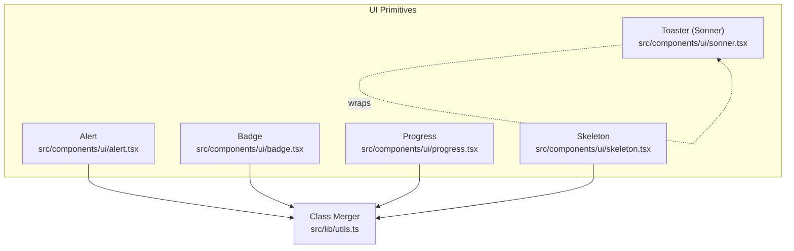
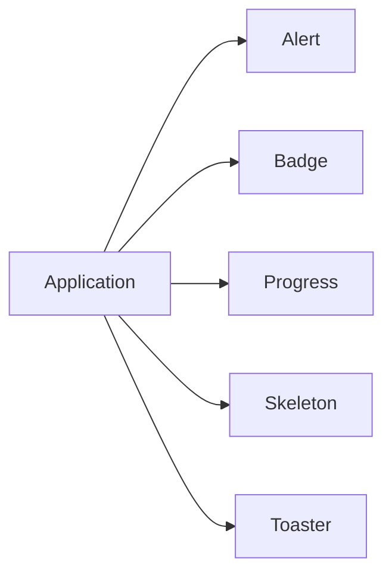
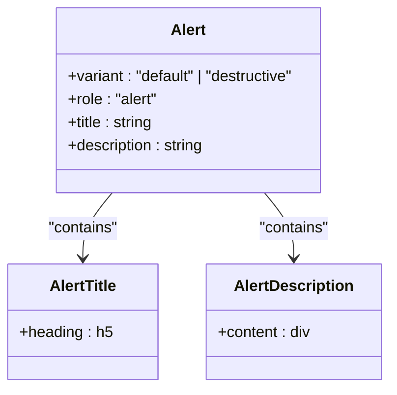
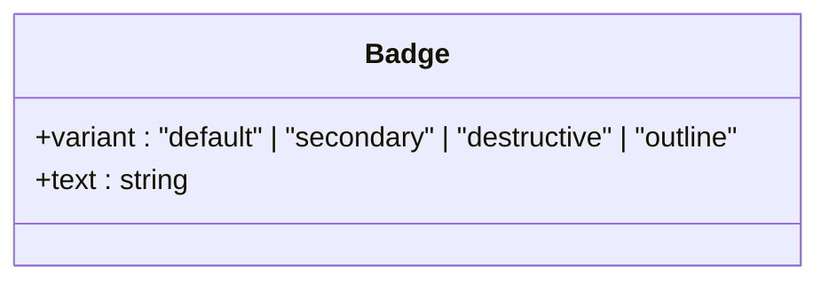
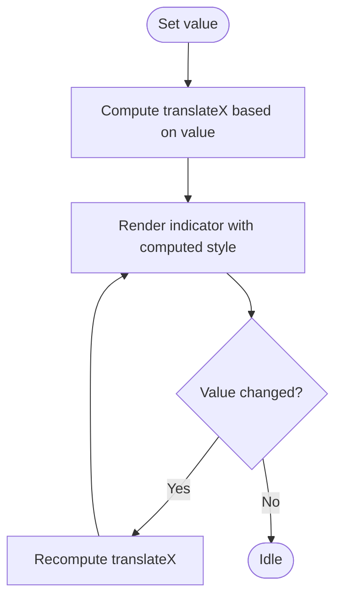
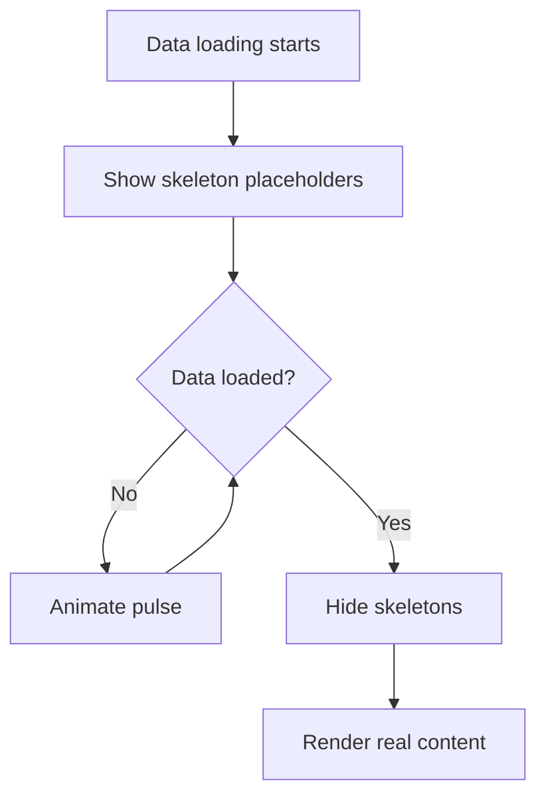
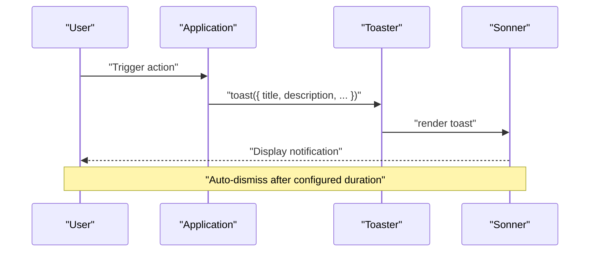
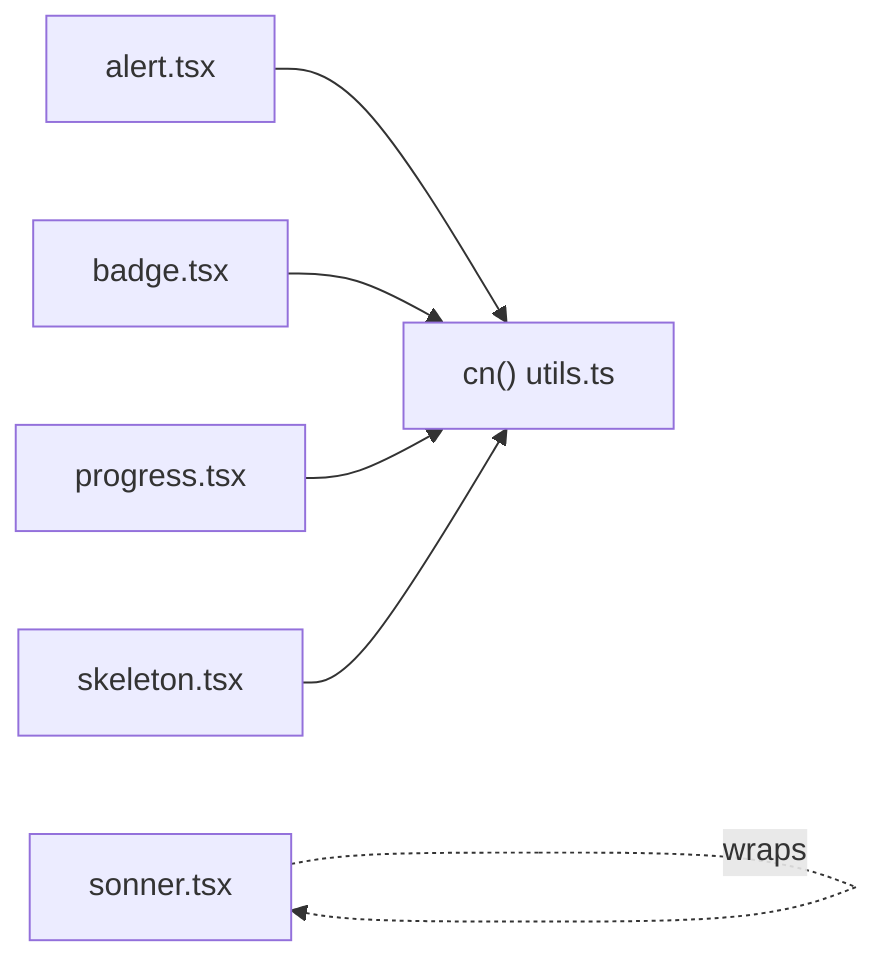

# Feedback Components

<cite>
**Referenced Files in This Document**
- [alert.tsx](file://src/components/ui/alert.tsx)
- [badge.tsx](file://src/components/ui/badge.tsx)
- [progress.tsx](file://src/components/ui/progress.tsx)
- [skeleton.tsx](file://src/components/ui/skeleton.tsx)
- [sonner.tsx](file://src/components/ui/sonner.tsx)
- [utils.ts](file://src/lib/utils.ts)
</cite>

## Table of Contents

1. [Introduction](#introduction)
2. [Project Structure](#project-structure)
3. [Core Components](#core-components)
4. [Architecture Overview](#architecture-overview)
5. [Detailed Component Analysis](#detailed-component-analysis)
6. [Dependency Analysis](#dependency-analysis)
7. [Performance Considerations](#performance-considerations)
8. [Troubleshooting Guide](#troubleshooting-guide)
9. [Conclusion](#conclusion)
10. [Appendices](#appendices)

## Introduction

This document provides detailed guidance for feedback and status indicator components: alerts, badges, progress bars, skeleton loaders, and toast notifications. It explains component variants, styling customization, animation options, accessibility considerations, and UX best practices to deliver clear system feedback. The goal is to help you choose the right component for each scenario, configure it consistently, and ensure an accessible, responsive user experience.

## Project Structure

Feedback-related UI primitives are implemented as reusable React components under src/components/ui. They rely on a shared utility for class merging and integrate with design tokens via Tailwind classes. Toast notifications are provided by a wrapper around Sonner.

**Diagram sources**

- [alert.tsx:1-50](file://src/components/ui/alert.tsx#L1-L50)
- [badge.tsx:1-33](file://src/components/ui/badge.tsx#L1-L33)
- [progress.tsx:1-26](file://src/components/ui/progress.tsx#L1-L26)
- [skeleton.tsx:1-8](file://src/components/ui/skeleton.tsx#L1-L8)
- [sonner.tsx:1-24](file://src/components/ui/sonner.tsx#L1-L24)
- [utils.ts:1-7](file://src/lib/utils.ts#L1-L7)

**Section sources**

- [alert.tsx:1-50](file://src/components/ui/alert.tsx#L1-L50)
- [badge.tsx:1-33](file://src/components/ui/badge.tsx#L1-L33)
- [progress.tsx:1-26](file://src/components/ui/progress.tsx#L1-L26)
- [skeleton.tsx:1-8](file://src/components/ui/skeleton.tsx#L1-L8)
- [sonner.tsx:1-24](file://src/components/ui/sonner.tsx#L1-L24)
- [utils.ts:1-7](file://src/lib/utils.ts#L1-L7)

## Core Components

- Alert: Contextual messages for success, error, warning, or info states. Uses semantic roles and structured title/description parts.
- Badge: Small status or category labels with multiple visual variants.
- Progress: Linear progress indicator for long-running operations.
- Skeleton: Placeholder shapes that animate while content loads.
- Toaster: Global toast notification container with theme-aware styles.

These components share consistent styling through Tailwind classes and a class merger utility.

**Section sources**

- [alert.tsx:1-50](file://src/components/ui/alert.tsx#L1-L50)
- [badge.tsx:1-33](file://src/components/ui/badge.tsx#L1-L33)
- [progress.tsx:1-26](file://src/components/ui/progress.tsx#L1-L26)
- [skeleton.tsx:1-8](file://src/components/ui/skeleton.tsx#L1-L8)
- [sonner.tsx:1-24](file://src/components/ui/sonner.tsx#L1-L24)
- [utils.ts:1-7](file://src/lib/utils.ts#L1-L7)

## Architecture Overview

The feedback layer is composed of independent, composable primitives:

- Alerts provide inline, persistent messages with semantic roles.
- Badges annotate UI elements with short statuses.
- Progress communicates ongoing work with a value-bound indicator.
- Skeletons simulate layout structure during loading.
- Toaster renders transient notifications globally.

[No sources needed since this diagram shows conceptual workflow, not actual code structure]

## Detailed Component Analysis

### Alert

Alerts communicate important information to users. They support variants and are structured with a title and description for clarity.

- Variants
  - Default: neutral context
  - Destructive: indicates errors or negative outcomes
- Composition
  - Container with role="alert" for screen readers
  - Title for concise message
  - Description for additional details
- Styling
  - Border and background colors adapt to variant
  - Icon spacing and alignment are handled automatically
- Accessibility
  - Semantic role="alert" ensures announcements
  - Use descriptive titles and concise descriptions
- Customization
  - Extend variants via class utilities
  - Override styles using className prop

**Diagram sources**

- [alert.tsx:6-27](file://src/components/ui/alert.tsx#L6-L27)
- [alert.tsx:30-47](file://src/components/ui/alert.tsx#L30-L47)

**Section sources**

- [alert.tsx:6-27](file://src/components/ui/alert.tsx#L6-L27)
- [alert.tsx:30-47](file://src/components/ui/alert.tsx#L30-L47)

### Badge

Badges are compact labels used for status, categories, or counts.

- Variants
  - Default: primary emphasis
  - Secondary: muted emphasis
  - Destructive: error or removal context
  - Outline: subtle border-only style
- Styling
  - Consistent padding, font weight, and focus ring
  - Hover states for interactive contexts
- Accessibility
  - Ensure meaningful text; avoid decorative-only badges when possible
- Customization
  - Add new variants by extending the variant map
  - Adjust size or shape via className

**Diagram sources**

- [badge.tsx:6-23](file://src/components/ui/badge.tsx#L6-L23)
- [badge.tsx:25-30](file://src/components/ui/badge.tsx#L25-L30)

**Section sources**

- [badge.tsx:6-23](file://src/components/ui/badge.tsx#L6-L23)
- [badge.tsx:25-30](file://src/components/ui/badge.tsx#L25-L30)

### Progress

A linear progress bar indicating completion percentage.

- Behavior
  - Value-driven width via transform translation
  - Smooth transitions on value changes
- Styling
  - Track uses a subtle background
  - Indicator uses primary color with transition
- Accessibility
  - Provide aria-valuenow, aria-valuemin, aria-valuemax where appropriate
  - Pair with a visible label or surrounding context
- Customization
  - Change track/indicator colors via Tailwind classes
  - Adjust height and radius with className

**Diagram sources**

- [progress.tsx:8-22](file://src/components/ui/progress.tsx#L8-L22)

**Section sources**

- [progress.tsx:8-22](file://src/components/ui/progress.tsx#L8-L22)

### Skeleton

Skeleton placeholders mimic content layout while data loads.

- Behavior
  - Animated pulse to indicate activity
  - Rounded rectangles as generic placeholders
- Styling
  - Background tinted against theme
  - Pulse animation for motion cues
- Accessibility
  - Avoid placing inside interactive controls
  - Use sparingly; prefer real content when available
- Customization
  - Size and shape via className
  - Combine with grid/flex layouts to match final content

**Diagram sources**

- [skeleton.tsx:3-5](file://src/components/ui/skeleton.tsx#L3-L5)

**Section sources**

- [skeleton.tsx:3-5](file://src/components/ui/skeleton.tsx#L3-L5)

### Toaster (Toast Notifications)

Global toast notifications for transient feedback such as success, error, warning, and info.

- Integration
  - Wrapper around Sonner with theme-aware class names
  - Provides consistent toast, description, and button styles
- Usage Patterns
  - Trigger toasts from event handlers or side effects
  - Group related actions with action/cancel buttons
- Positioning and Dismissal
  - Default positioning and stacking managed by Sonner
  - Auto-dismiss behavior controlled by toast options
- Accessibility
  - Ensure descriptive messages
  - Provide actionable buttons when necessary
- Customization
  - Extend classNames for custom themes
  - Configure global toast options at the Toaster level

**Diagram sources**

- [sonner.tsx:5-20](file://src/components/ui/sonner.tsx#L5-L20)

**Section sources**

- [sonner.tsx:5-20](file://src/components/ui/sonner.tsx#L5-L20)

## Dependency Analysis

All feedback components use a shared class merger utility to compose Tailwind classes safely. Progress integrates with Radix UI primitives for robust behavior.

**Diagram sources**

- [utils.ts:1-7](file://src/lib/utils.ts#L1-L7)
- [alert.tsx:1-50](file://src/components/ui/alert.tsx#L1-L50)
- [badge.tsx:1-33](file://src/components/ui/badge.tsx#L1-L33)
- [progress.tsx:1-26](file://src/components/ui/progress.tsx#L1-L26)
- [skeleton.tsx:1-8](file://src/components/ui/skeleton.tsx#L1-L8)
- [sonner.tsx:1-24](file://src/components/ui/sonner.tsx#L1-L24)

**Section sources**

- [utils.ts:1-7](file://src/lib/utils.ts#L1-L7)
- [alert.tsx:1-50](file://src/components/ui/alert.tsx#L1-L50)
- [badge.tsx:1-33](file://src/components/ui/badge.tsx#L1-L33)
- [progress.tsx:1-26](file://src/components/ui/progress.tsx#L1-L26)
- [skeleton.tsx:1-8](file://src/components/ui/skeleton.tsx#L1-L8)
- [sonner.tsx:1-24](file://src/components/ui/sonner.tsx#L1-L24)

## Performance Considerations

- Prefer lightweight components for frequent updates (e.g., skeleton for large lists).
- Debounce rapid progress updates to minimize reflows.
- Keep toast messages concise to reduce rendering overhead.
- Avoid heavy animations on low-power devices; rely on CSS transitions.

[No sources needed since this section provides general guidance]

## Troubleshooting Guide

- Alerts not announced: Ensure the alert container has role="alert" and contains meaningful text.
- Progress not updating: Verify value is within expected bounds and triggers re-render.
- Skeletons causing layout shifts: Reserve space with fixed dimensions before content loads.
- Toasts not appearing: Confirm Toaster is mounted in the app tree and toast calls are invoked.

**Section sources**

- [alert.tsx:22-27](file://src/components/ui/alert.tsx#L22-L27)
- [progress.tsx:11-21](file://src/components/ui/progress.tsx#L11-L21)
- [skeleton.tsx:3-5](file://src/components/ui/skeleton.tsx#L3-L5)
- [sonner.tsx:5-20](file://src/components/ui/sonner.tsx#L5-L20)

## Conclusion

Use alerts for persistent contextual messages, badges for compact status indicators, progress bars for long-running tasks, skeletons for loading states, and toasts for transient notifications. Maintain consistency through shared variants and theme-aware styling, and prioritize accessibility and clarity to guide users effectively.

[No sources needed since this section summarizes without analyzing specific files]

## Appendices

### Visual Hierarchy and UX Best Practices

- Use destructive variants for errors and default for neutral messages.
- Place toasts away from critical content to avoid blocking workflows.
- Keep progress visible during long operations; pair with status text.
- Use skeletons only when they improve perceived performance.

[No sources needed since this section provides general guidance]
