# Form Controls

<cite>
**Referenced Files in This Document**
- [input.tsx](file://src/components/ui/input.tsx)
- [textarea.tsx](file://src/components/ui/textarea.tsx)
- [button.tsx](file://src/components/ui/button.tsx)
- [select.tsx](file://src/components/ui/select.tsx)
- [checkbox.tsx](file://src/components/ui/checkbox.tsx)
- [radio-group.tsx](file://src/components/ui/radio-group.tsx)
- [switch.tsx](file://src/components/ui/switch.tsx)
- [slider.tsx](file://src/components/ui/slider.tsx)
- [calendar.tsx](file://src/components/ui/calendar.tsx)
- [input-otp.tsx](file://src/components/ui/input-otp.tsx)
- [form.tsx](file://src/components/ui/form.tsx)
- [label.tsx](file://src/components/ui/label.tsx)
- [toggle.tsx](file://src/components/ui/toggle.tsx)
- [toggle-group.tsx](file://src/components/ui/toggle-group.tsx)
- [utils.ts](file://src/lib/utils.ts)
</cite>

## Table of Contents

1. [Introduction](#introduction)
2. [Project Structure](#project-structure)
3. [Core Components](#core-components)
4. [Architecture Overview](#architecture-overview)
5. [Detailed Component Analysis](#detailed-component-analysis)
6. [Dependency Analysis](#dependency-analysis)
7. [Performance Considerations](#performance-considerations)
8. [Troubleshooting Guide](#troubleshooting-guide)
9. [Conclusion](#conclusion)
10. [Appendices](#appendices)

## Introduction

This document provides comprehensive documentation for the form control components used across the application. It covers input fields, text areas, buttons, select dropdowns, checkboxes, radio groups, switches, sliders, toggles, calendar pickers, OTP inputs, and form validation patterns. For each component, you will find:

- Props and styling options
- Events and behavior
- Accessibility features (keyboard navigation, screen reader support)
- Integration with React Hook Form via the provided form primitives
- Responsive design considerations
- Practical usage guidance and best practices

The components are built on accessible primitives and styled with utility classes to ensure consistency, responsiveness, and accessibility by default.

## Project Structure

Form controls live under src/components/ui and integrate with a shared form wrapper that connects to React Hook Form. Utilities for class merging are centralized to keep styling consistent.

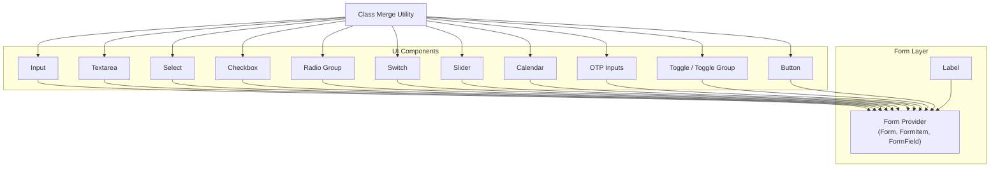

**Diagram sources**

- [input.tsx:1-23](file://src/components/ui/input.tsx#L1-L23)
- [textarea.tsx:1-22](file://src/components/ui/textarea.tsx#L1-L22)
- [button.tsx:1-50](file://src/components/ui/button.tsx#L1-L50)
- [select.tsx:1-153](file://src/components/ui/select.tsx#L1-L153)
- [checkbox.tsx:1-27](file://src/components/ui/checkbox.tsx#L1-L27)
- [radio-group.tsx:1-37](file://src/components/ui/radio-group.tsx#L1-L37)
- [switch.tsx:1-28](file://src/components/ui/switch.tsx#L1-L28)
- [slider.tsx:1-24](file://src/components/ui/slider.tsx#L1-L24)
- [calendar.tsx:1-178](file://src/components/ui/calendar.tsx#L1-L178)
- [input-otp.tsx:1-70](file://src/components/ui/input-otp.tsx#L1-L70)
- [form.tsx:1-172](file://src/components/ui/form.tsx#L1-L172)
- [label.tsx:1-22](file://src/components/ui/label.tsx#L1-L22)
- [toggle.tsx:1-43](file://src/components/ui/toggle.tsx#L1-L43)
- [toggle-group.tsx:1-58](file://src/components/ui/toggle-group.tsx#L1-L58)
- [utils.ts:1-7](file://src/lib/utils.ts#L1-L7)

**Section sources**

- [input.tsx:1-23](file://src/components/ui/input.tsx#L1-L23)
- [textarea.tsx:1-22](file://src/components/ui/textarea.tsx#L1-L22)
- [button.tsx:1-50](file://src/components/ui/button.tsx#L1-L50)
- [select.tsx:1-153](file://src/components/ui/select.tsx#L1-L153)
- [checkbox.tsx:1-27](file://src/components/ui/checkbox.tsx#L1-L27)
- [radio-group.tsx:1-37](file://src/components/ui/radio-group.tsx#L1-L37)
- [switch.tsx:1-28](file://src/components/ui/switch.tsx#L1-L28)
- [slider.tsx:1-24](file://src/components/ui/slider.tsx#L1-F24)
- [calendar.tsx:1-178](file://src/components/ui/calendar.tsx#L1-L178)
- [input-otp.tsx:1-70](file://src/components/ui/input-otp.tsx#L1-L70)
- [form.tsx:1-172](file://src/components/ui/form.tsx#L1-L172)
- [label.tsx:1-22](file://src/components/ui/label.tsx#L1-L22)
- [toggle.tsx:1-43](file://src/components/ui/toggle.tsx#L1-L43)
- [toggle-group.tsx:1-58](file://src/components/ui/toggle-group.tsx#L1-L58)
- [utils.ts:1-7](file://src/lib/utils.ts#L1-L7)

## Core Components

Below is a concise overview of each form control’s purpose, key props, events, styling, and accessibility.

- Input
  - Purpose: Single-line text entry.
  - Key props: type, placeholder, disabled, value/onChange (via React Hook Form), className.
  - Events: onChange, onBlur, onFocus, onKeyDown.
  - Styling: Uses utility classes for borders, focus rings, disabled state; responsive font sizing.
  - Accessibility: Native input semantics; focus-visible ring; supports aria attributes via props.

- Textarea
  - Purpose: Multi-line text entry.
  - Key props: rows, placeholder, disabled, value/onChange (via React Hook Form), className.
  - Events: onChange, onBlur, onFocus, onKeyDown.
  - Styling: Consistent border/focus/disabled styles; min-height for usability.
  - Accessibility: Native textarea semantics; keyboard-friendly.

- Button
  - Purpose: Triggers actions or submits forms.
  - Key props: variant (default, destructive, outline, secondary, ghost, link), size (default, sm, lg, icon), asChild, disabled, className.
  - Events: onClick, onKeyDown, etc.
  - Styling: Variants and sizes via class-variance-authority; hover states; focus-visible ring.
  - Accessibility: Focusable; supports asChild to render inside other interactive elements while preserving semantics.

- Select
  - Purpose: Choose one option from a list.
  - Key props: onValueChange, placeholder, disabled, position (popper), className.
  - Events: onValueChange, open/close via primitive APIs.
  - Styling: Trigger/content styling; scroll up/down buttons; item indicators.
  - Accessibility: Keyboard navigation (arrow keys, Enter/Space); ARIA roles managed by primitives.

- Checkbox
  - Purpose: Toggle boolean values.
  - Key props: checked/indeterminate, onCheckedChange, disabled, className.
  - Events: onCheckedChange.
  - Styling: Checked state indicator; focus-visible ring; disabled opacity.
  - Accessibility: Managed by primitives; keyboard support; ARIA attributes.

- Radio Group
  - Purpose: Select exactly one option from a set.
  - Key props: value/onValueChange, disabled, orientation (via primitives).
  - Events: onValueChange.
  - Styling: Grid layout; focused ring; selected indicator.
  - Accessibility: Grouped selection; arrow key navigation between items.

- Switch
  - Purpose: Binary toggle control.
  - Key props: checked/onCheckedChange, disabled, className.
  - Events: onCheckedChange.
  - Styling: Thumb transition; checked/unchecked backgrounds; focus-visible ring.
  - Accessibility: Keyboard toggle; ARIA role and state managed by primitives.

- Slider
  - Purpose: Select a value within a range.
  - Key props: value/onValueChange, min, max, step, disabled, className.
  - Events: onValueChange.
  - Styling: Track, range, thumb; focus-visible ring; disabled state.
  - Accessibility: Arrow keys to adjust; ARIA role/value/valuemin/valuemax handled by primitives.

- Calendar
  - Purpose: Date picker with single or range selection.
  - Key props: showOutsideDays, captionLayout, buttonVariant, classNames, components, formatters, and all DayPicker props.
  - Events: onSelect, onMonthChange, etc., via DayPicker.
  - Styling: Customizable via classNames and components; uses Button variants for nav.
  - Accessibility: Keyboard navigation between days; focus management; ARIA attributes via react-day-picker.

- OTP Inputs
  - Purpose: Enter multi-character codes (e.g., verification).
  - Key props: length, containerClassName, className, disabled, autoFocus, etc.
  - Events: onFilled, onChange via input-otp.
  - Styling: Slot-based layout; active slot ring; separator.
  - Accessibility: Screen-reader friendly; keyboard movement between slots.

- Toggle / Toggle Group
  - Purpose: On/off state buttons; grouped toggles with shared style context.
  - Key props: variant, size, pressed/onPressedChange, disabled, className.
  - Events: onPressedChange.
  - Styling: Variant and size variants; focus-visible ring; pressed state background.
  - Accessibility: Keyboard activation; ARIA pressed state managed by primitives.

- Form Primitives (React Hook Form integration)
  - Purpose: Provide structured, accessible form building blocks bound to React Hook Form.
  - Key pieces: Form (provider), FormItem (scoped id), FormField (Controller wrapper), FormLabel (linked label), FormControl (slot with aria-describedby/aria-invalid), FormDescription (helper text), FormMessage (error display).
  - Events: Controlled via React Hook Form field events.
  - Styling: Spacing and error colors via utility classes.
  - Accessibility: Automatic id linking, aria-describedby, aria-invalid; focus management via primitives.

**Section sources**

- [input.tsx:1-23](file://src/components/ui/input.tsx#L1-L23)
- [textarea.tsx:1-22](file://src/components/ui/textarea.tsx#L1-L22)
- [button.tsx:1-50](file://src/components/ui/button.tsx#L1-L50)
- [select.tsx:1-153](file://src/components/ui/select.tsx#L1-L153)
- [checkbox.tsx:1-27](file://src/components/ui/checkbox.tsx#L1-L27)
- [radio-group.tsx:1-37](file://src/components/ui/radio-group.tsx#L1-L37)
- [switch.tsx:1-28](file://src/components/ui/switch.tsx#L1-L28)
- [slider.tsx:1-24](file://src/components/ui/slider.tsx#L1-L24)
- [calendar.tsx:1-178](file://src/components/ui/calendar.tsx#L1-L178)
- [input-otp.tsx:1-70](file://src/components/ui/input-otp.tsx#L1-L70)
- [toggle.tsx:1-43](file://src/components/ui/toggle.tsx#L1-L43)
- [toggle-group.tsx:1-58](file://src/components/ui/toggle-group.tsx#L1-L58)
- [form.tsx:1-172](file://src/components/ui/form.tsx#L1-L172)
- [label.tsx:1-22](file://src/components/ui/label.tsx#L1-L22)

## Architecture Overview

The form system composes accessible primitives with a React Hook Form layer to deliver consistent UX and robust validation.

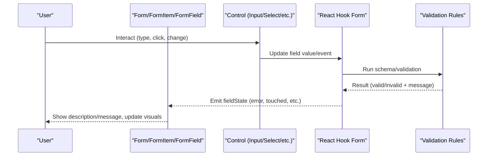

**Diagram sources**

- [form.tsx:1-172](file://src/components/ui/form.tsx#L1-L172)
- [input.tsx:1-23](file://src/components/ui/input.tsx#L1-L23)
- [select.tsx:1-153](file://src/components/ui/select.tsx#L1-L153)
- [checkbox.tsx:1-27](file://src/components/ui/checkbox.tsx#L1-L27)
- [radio-group.tsx:1-37](file://src/components/ui/radio-group.tsx#L1-L37)
- [switch.tsx:1-28](file://src/components/ui/switch.tsx#L1-L28)
- [slider.tsx:1-24](file://src/components/ui/slider.tsx#L1-L24)
- [calendar.tsx:1-178](file://src/components/ui/calendar.tsx#L1-L178)
- [input-otp.tsx:1-70](file://src/components/ui/input-otp.tsx#L1-L70)

## Detailed Component Analysis

### Input

- Props: Inherits standard input attributes; className for overrides.
- Events: Standard input events; controlled via React Hook Form.
- Styling: Border, focus ring, disabled state; responsive typography.
- Accessibility: Focus-visible ring; native semantics.

```mermaid
flowchart TD
Start(["Render Input"]) --> ApplyStyles["Apply base styles + className"]
ApplyStyles --> BindProps["Bind ref + spread props"]
BindProps --> Output["<input /> rendered"]
```

**Diagram sources**

- [input.tsx:1-23](file://src/components/ui/input.tsx#L1-L23)

**Section sources**

- [input.tsx:1-23](file://src/components/ui/input.tsx#L1-L23)

### Textarea

- Props: Inherits standard textarea attributes; className.
- Events: Standard textarea events; controlled via React Hook Form.
- Styling: Min-height, border, focus ring, disabled state.
- Accessibility: Native textarea semantics; keyboard-friendly.

```mermaid
flowchart TD
Start(["Render Textarea"]) --> ApplyStyles["Apply base styles + className"]
ApplyStyles --> BindProps["Bind ref + spread props"]
BindProps --> Output["<textarea /> rendered"]
```

**Diagram sources**

- [textarea.tsx:1-22](file://src/components/ui/textarea.tsx#L1-L22)

**Section sources**

- [textarea.tsx:1-22](file://src/components/ui/textarea.tsx#L1-L22)

### Button

- Props: variant, size, asChild, className, plus standard button attributes.
- Events: onClick and others; supports asChild to render inside other elements.
- Styling: Variants and sizes via class-variance-authority; hover and focus states.
- Accessibility: Focus-visible ring; pointer events handling for icons.

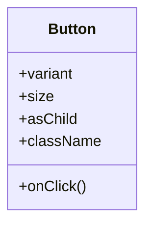

**Diagram sources**

- [button.tsx:1-50](file://src/components/ui/button.tsx#L1-L50)

**Section sources**

- [button.tsx:1-50](file://src/components/ui/button.tsx#L1-L50)

### Select

- Props: Trigger, Content, Item, Label, Separator; position; className.
- Events: Value changes; open/close handled by primitives.
- Styling: Popover content with animations; scroll buttons; item check indicator.
- Accessibility: Keyboard navigation; ARIA roles via primitives.

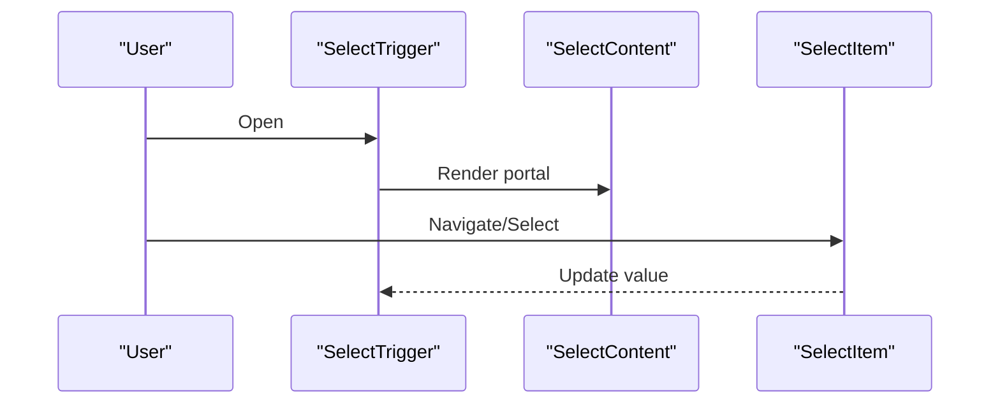

**Diagram sources**

- [select.tsx:1-153](file://src/components/ui/select.tsx#L1-L153)

**Section sources**

- [select.tsx:1-153](file://src/components/ui/select.tsx#L1-L153)

### Checkbox

- Props: checked/indeterminate, onCheckedChange, disabled, className.
- Events: onCheckedChange.
- Styling: Checked state indicator; focus-visible ring; disabled opacity.
- Accessibility: Keyboard toggle; ARIA state managed by primitives.

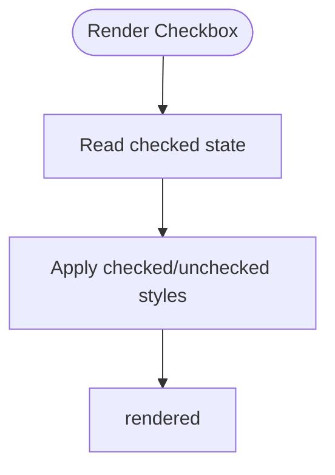

**Diagram sources**

- [checkbox.tsx:1-27](file://src/components/ui/checkbox.tsx#L1-L27)

**Section sources**

- [checkbox.tsx:1-27](file://src/components/ui/checkbox.tsx#L1-L27)

### Radio Group

- Props: Root and Item; value/onValueChange; disabled; className.
- Events: onValueChange.
- Styling: Grid layout; focus-visible ring; selected indicator.
- Accessibility: Arrow key navigation; ARIA group semantics.

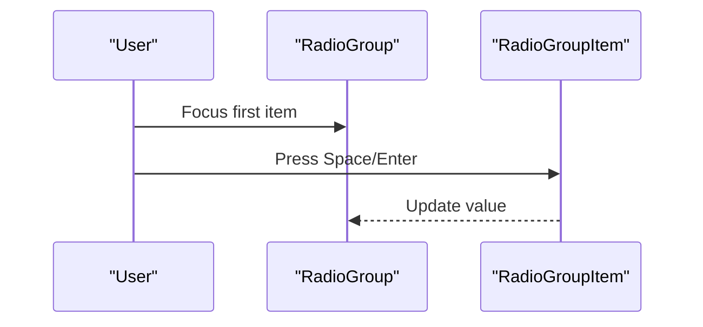

**Diagram sources**

- [radio-group.tsx:1-37](file://src/components/ui/radio-group.tsx#L1-L37)

**Section sources**

- [radio-group.tsx:1-37](file://src/components/ui/radio-group.tsx#L1-L37)

### Switch

- Props: checked/onCheckedChange, disabled, className.
- Events: onCheckedChange.
- Styling: Thumb transition; checked/unchecked backgrounds; focus-visible ring.
- Accessibility: Keyboard toggle; ARIA role/state managed by primitives.

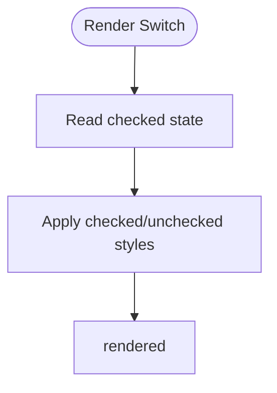

**Diagram sources**

- [switch.tsx:1-28](file://src/components/ui/switch.tsx#L1-L28)

**Section sources**

- [switch.tsx:1-28](file://src/components/ui/switch.tsx#L1-L28)

### Slider

- Props: value/onValueChange, min, max, step, disabled, className.
- Events: onValueChange.
- Styling: Track, range, thumb; focus-visible ring; disabled state.
- Accessibility: Arrow keys to adjust; ARIA role/value handled by primitives.

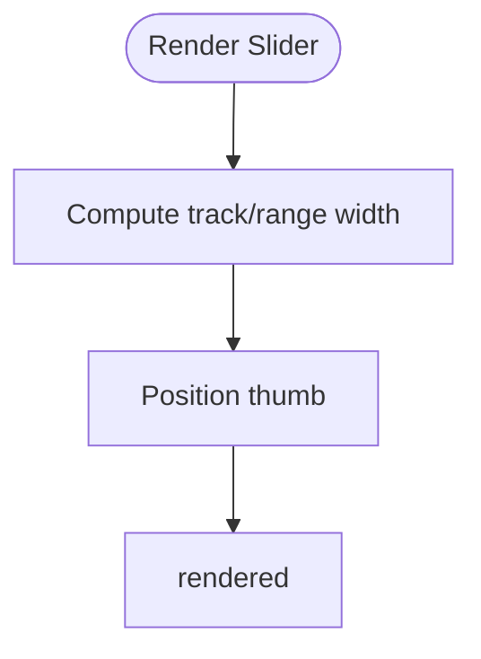

**Diagram sources**

- [slider.tsx:1-24](file://src/components/ui/slider.tsx#L1-L24)

**Section sources**

- [slider.tsx:1-24](file://src/components/ui/slider.tsx#L1-L24)

### Calendar

- Props: showOutsideDays, captionLayout, buttonVariant, classNames, components, formatters, plus DayPicker props.
- Events: onSelect, onMonthChange, etc.
- Styling: Customizable via classNames and components; uses Button variants for navigation.
- Accessibility: Keyboard navigation; focus management; ARIA attributes via react-day-picker.

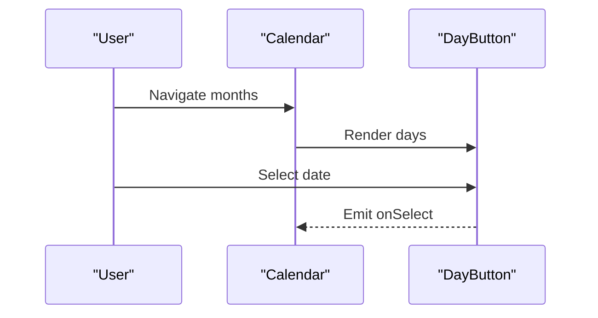

**Diagram sources**

- [calendar.tsx:1-178](file://src/components/ui/calendar.tsx#L1-L178)

**Section sources**

- [calendar.tsx:1-178](file://src/components/ui/calendar.tsx#L1-L178)

### OTP Inputs

- Props: length, containerClassName, className, disabled, autoFocus, etc.
- Events: onFilled, onChange via input-otp.
- Styling: Slot-based layout; active slot ring; separator.
- Accessibility: Screen-reader friendly; keyboard movement between slots.

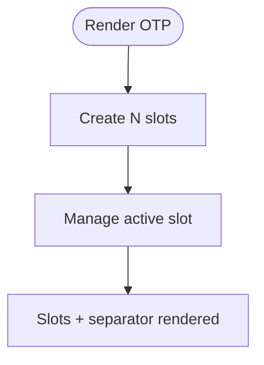

**Diagram sources**

- [input-otp.tsx:1-70](file://src/components/ui/input-otp.tsx#L1-L70)

**Section sources**

- [input-otp.tsx:1-70](file://src/components/ui/input-otp.tsx#L1-L70)

### Toggle / Toggle Group

- Props: variant, size, pressed/onPressedChange, disabled, className.
- Events: onPressedChange.
- Styling: Variant and size variants; focus-visible ring; pressed state background.
- Accessibility: Keyboard activation; ARIA pressed state managed by primitives.

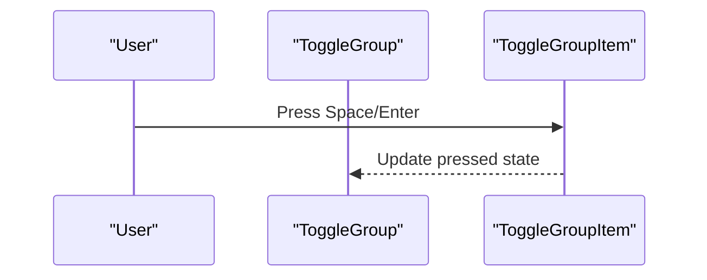

**Diagram sources**

- [toggle.tsx:1-43](file://src/components/ui/toggle.tsx#L1-L43)
- [toggle-group.tsx:1-58](file://src/components/ui/toggle-group.tsx#L1-L58)

**Section sources**

- [toggle.tsx:1-43](file://src/components/ui/toggle.tsx#L1-L43)
- [toggle-group.tsx:1-58](file://src/components/ui/toggle-group.tsx#L1-L58)

### Form Primitives and Validation

- Purpose: Provide a consistent, accessible pattern to build forms with React Hook Form.
- Key behaviors:
  - Form wraps the form tree and provides context.
  - FormItem scopes an id for label/control association.
  - FormField binds a field to React Hook Form via Controller.
  - FormLabel links to the control via htmlFor.
  - FormControl wires aria-describedby and aria-invalid based on errors.
  - FormDescription renders helper text.
  - FormMessage displays validation messages when present.

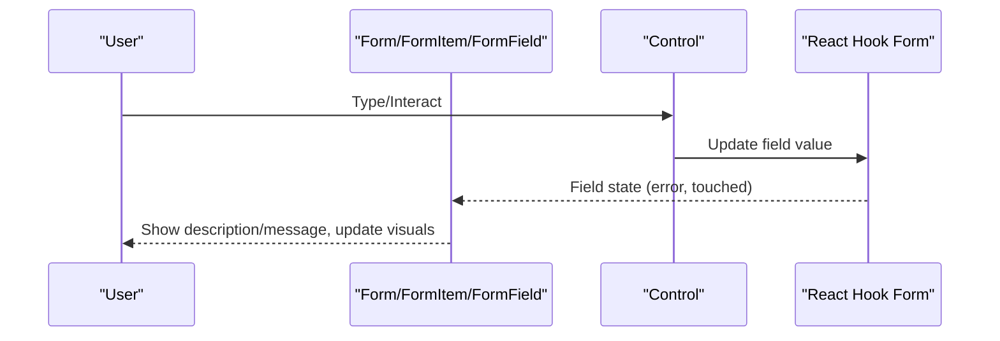

**Diagram sources**

- [form.tsx:1-172](file://src/components/ui/form.tsx#L1-L172)

**Section sources**

- [form.tsx:1-172](file://src/components/ui/form.tsx#L1-L172)
- [label.tsx:1-22](file://src/components/ui/label.tsx#L1-L22)

## Dependency Analysis

- Class utilities: All UI components use a central cn utility to merge Tailwind classes deterministically.
- Radix primitives: Many components wrap Radix primitives to provide accessible, unstyled foundations.
- React Hook Form: The form primitives integrate tightly with React Hook Form for state and validation.
- Icons: Lucide icons are used for visual affordances (checkmarks, chevrons, circles).

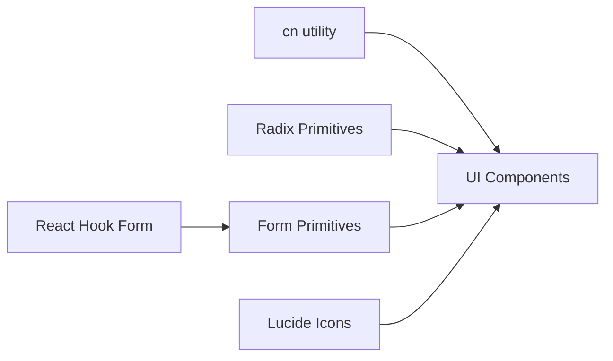

**Diagram sources**

- [utils.ts:1-7](file://src/lib/utils.ts#L1-L7)
- [form.tsx:1-172](file://src/components/ui/form.tsx#L1-L172)
- [select.tsx:1-153](file://src/components/ui/select.tsx#L1-L153)
- [checkbox.tsx:1-27](file://src/components/ui/checkbox.tsx#L1-L27)
- [radio-group.tsx:1-37](file://src/components/ui/radio-group.tsx#L1-L37)
- [switch.tsx:1-28](file://src/components/ui/switch.tsx#L1-L28)
- [slider.tsx:1-24](file://src/components/ui/slider.tsx#L1-L24)
- [calendar.tsx:1-178](file://src/components/ui/calendar.tsx#L1-L178)
- [input-otp.tsx:1-70](file://src/components/ui/input-otp.tsx#L1-L70)
- [toggle.tsx:1-43](file://src/components/ui/toggle.tsx#L1-L43)
- [toggle-group.tsx:1-58](file://src/components/ui/toggle-group.tsx#L1-L58)

**Section sources**

- [utils.ts:1-7](file://src/lib/utils.ts#L1-L7)
- [form.tsx:1-172](file://src/components/ui/form.tsx#L1-L172)

## Performance Considerations

- Prefer controlled components via React Hook Form to avoid unnecessary re-renders; memoize expensive computations outside fields.
- Use asChild on Button where appropriate to reduce DOM overhead when composing with other interactive elements.
- Defer heavy operations (e.g., complex validations) until blur or submit to minimize jank during typing.
- Avoid excessive inline styles; rely on utility classes for better caching and reduced CSS churn.
- For calendars and large lists, consider virtualization if rendering many items beyond what primitives handle efficiently.
- Keep OTP length reasonable; very long sequences can impact performance and user experience.

[No sources needed since this section provides general guidance]

## Troubleshooting Guide

Common issues and resolutions:

- Missing form context: Ensure FormField is used within Form and FormItem; otherwise, hooks may throw due to missing context.
- Labels not linked: Verify FormLabel is paired with FormControl so that htmlFor and ids align for accessibility.
- Errors not showing: Confirm FormMessage is placed within the same FormItem and that validation rules return messages.
- Select not updating: Ensure onValueChange is wired through React Hook Form and that Select.Value reflects the current selection.
- Calendar selection not reflected: Make sure onSelect updates the field value via React Hook Form.
- OTP not focusing next slot: Check container and slot classNames; ensure no custom CSS interferes with focus management.

**Section sources**

- [form.tsx:1-172](file://src/components/ui/form.tsx#L1-L172)
- [select.tsx:1-153](file://src/components/ui/select.tsx#L1-L153)
- [calendar.tsx:1-178](file://src/components/ui/calendar.tsx#L1-L178)
- [input-otp.tsx:1-70](file://src/components/ui/input-otp.tsx#L1-L70)

## Conclusion

The form control library provides a cohesive, accessible, and customizable set of components that integrate seamlessly with React Hook Form. By leveraging Radix primitives, consistent styling utilities, and structured form wrappers, developers can build robust forms with strong keyboard and screen reader support. Follow the guidelines above for consistent UX, responsive layouts, and optimal performance.

[No sources needed since this section summarizes without analyzing specific files]

## Appendices

### React Hook Form Integration Patterns

- Wrap your form with Form and use FormItem/FormField to bind fields.
- Use FormLabel, FormControl, FormDescription, and FormMessage to associate labels, descriptions, and errors.
- Connect each control’s value and onChange to React Hook Form using the controller pattern exposed by FormField.

**Section sources**

- [form.tsx:1-172](file://src/components/ui/form.tsx#L1-L172)

### Accessibility Checklist

- Ensure every control has an associated label (use FormLabel).
- Verify focus-visible styles are visible for keyboard users.
- Confirm ARIA attributes are correctly applied (handled by primitives and form layer).
- Test with screen readers to validate announcements and navigation order.

**Section sources**

- [form.tsx:1-172](file://src/components/ui/form.tsx#L1-L172)
- [select.tsx:1-153](file://src/components/ui/select.tsx#L1-L153)
- [checkbox.tsx:1-27](file://src/components/ui/checkbox.tsx#L1-L27)
- [radio-group.tsx:1-37](file://src/components/ui/radio-group.tsx#L1-L37)
- [switch.tsx:1-28](file://src/components/ui/switch.tsx#L1-L28)
- [slider.tsx:1-24](file://src/components/ui/slider.tsx#L1-L24)
- [calendar.tsx:1-178](file://src/components/ui/calendar.tsx#L1-L178)
- [input-otp.tsx:1-70](file://src/components/ui/input-otp.tsx#L1-L70)

### Responsive Design Tips

- Use utility classes for spacing and sizing; they scale across breakpoints.
- For selects and calendars, prefer popper positioning to avoid overflow on small screens.
- Ensure touch targets meet minimum sizes for mobile interactions.

**Section sources**

- [select.tsx:1-153](file://src/components/ui/select.tsx#L1-L153)
- [calendar.tsx:1-178](file://src/components/ui/calendar.tsx#L1-L178)
- [button.tsx:1-50](file://src/components/ui/button.tsx#L1-L50)
