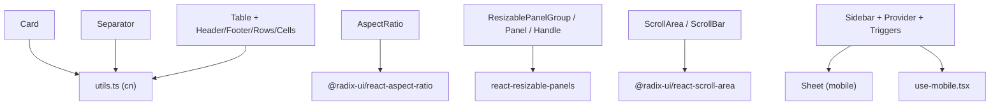
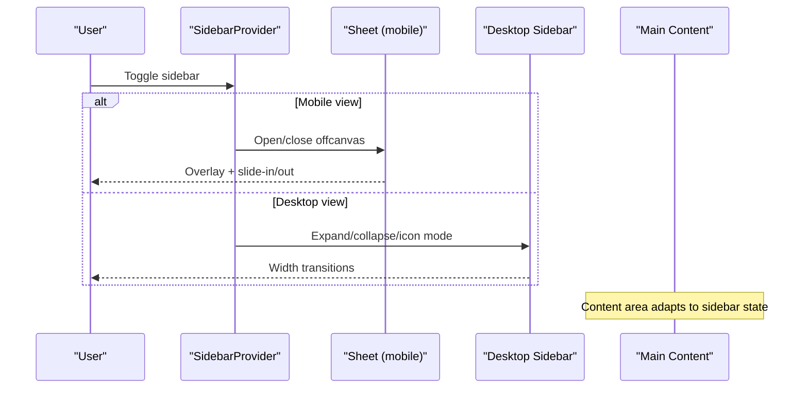
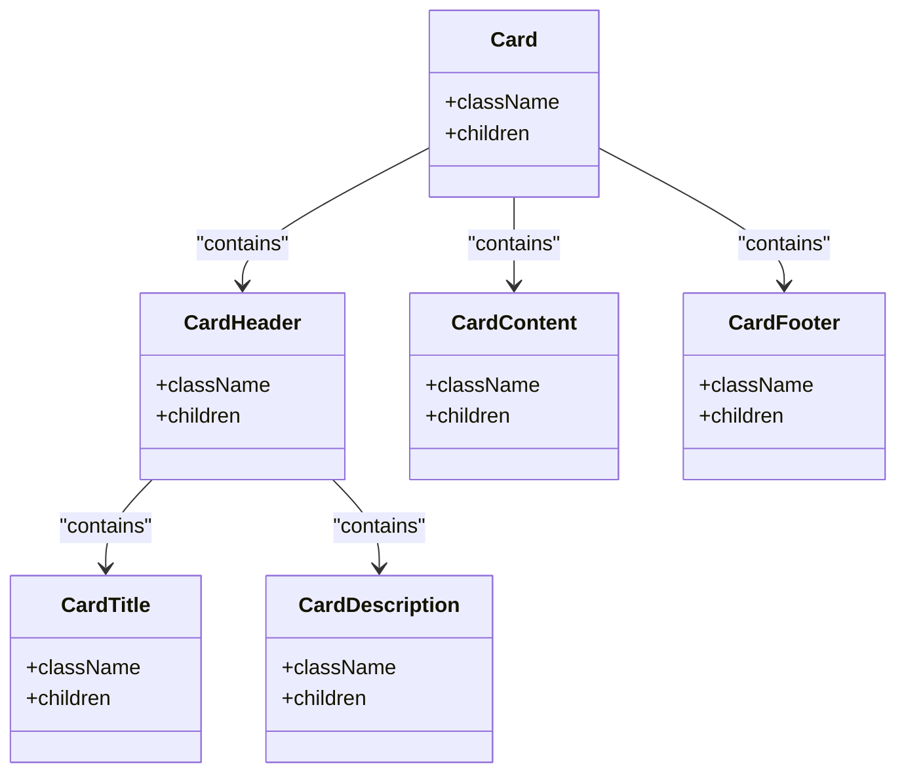
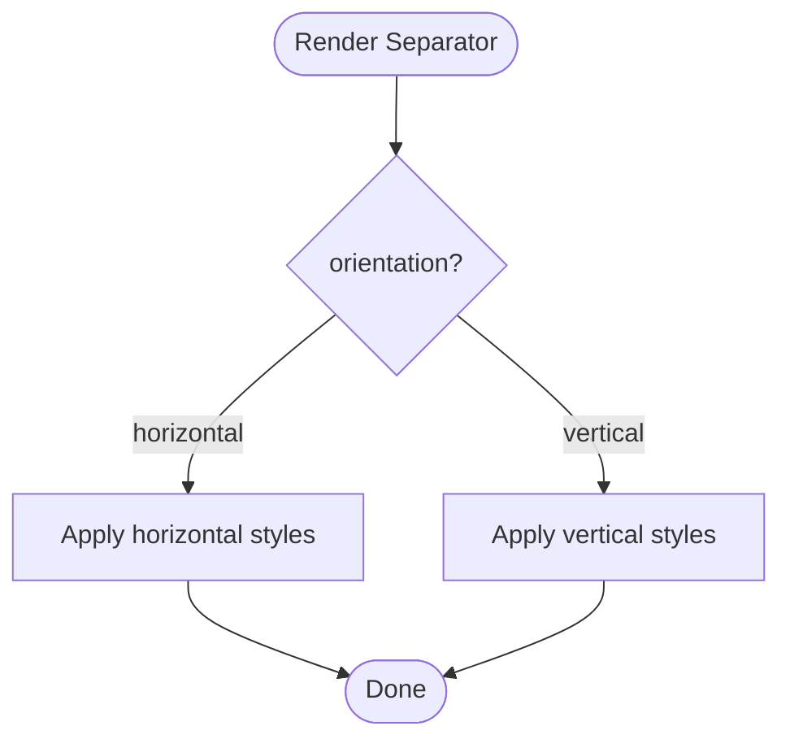
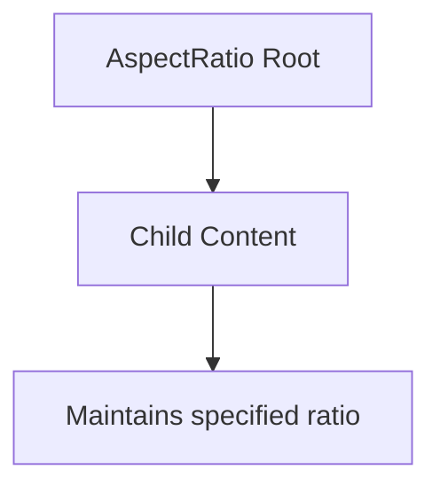
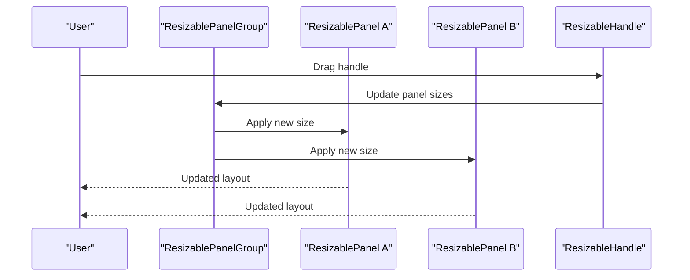
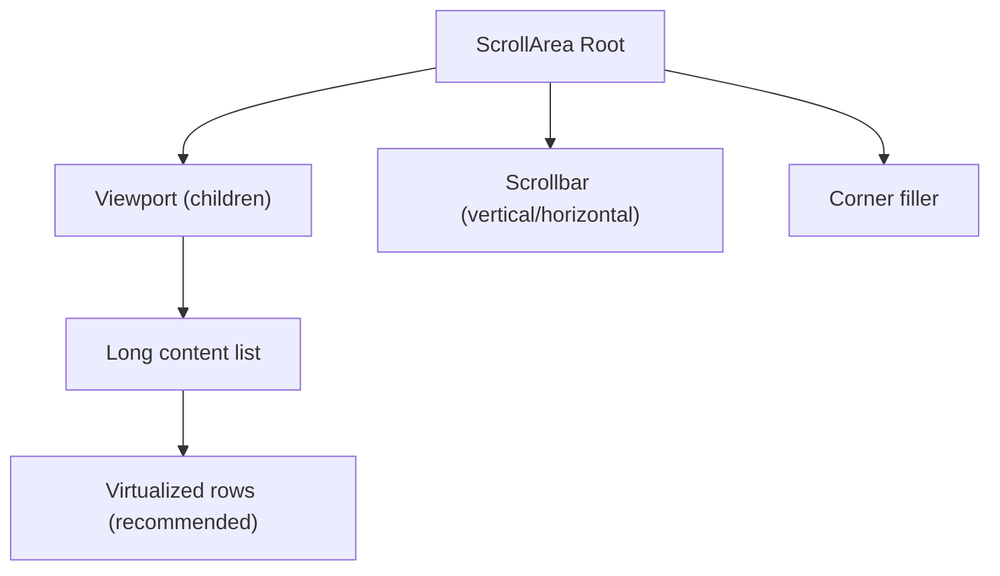
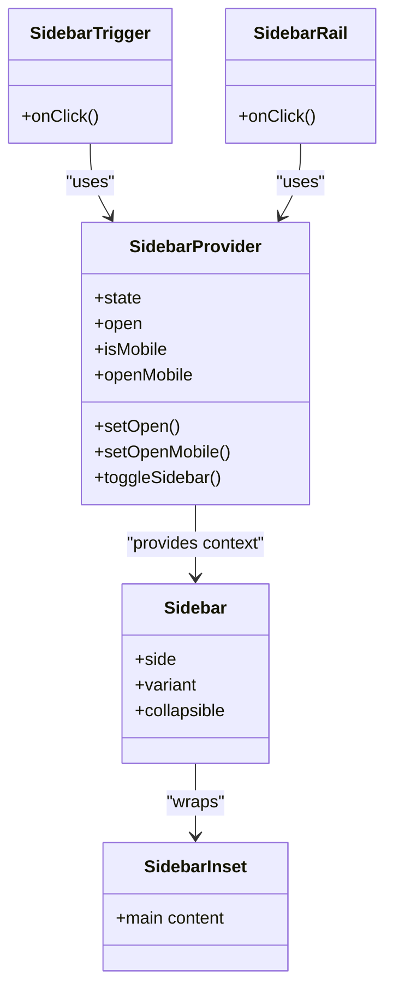
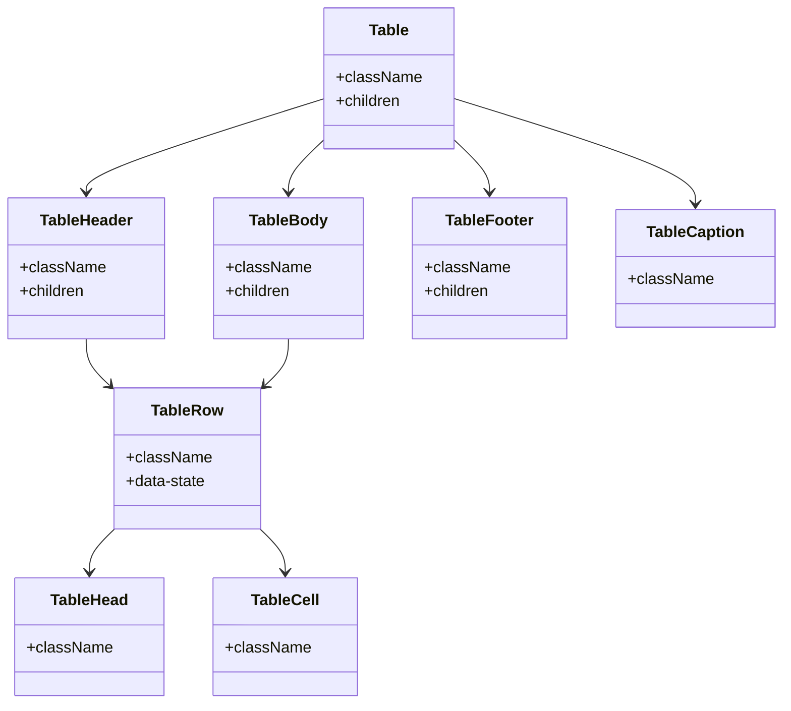
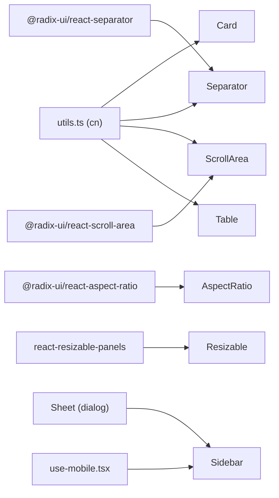

# Layout Components

<cite>
**Referenced Files in This Document**
- [card.tsx](file://src/components/ui/card.tsx)
- [separator.tsx](file://src/components/ui/separator.tsx)
- [aspect-ratio.tsx](file://src/components/ui/aspect-ratio.tsx)
- [resizable.tsx](file://src/components/ui/resizable.tsx)
- [scroll-area.tsx](file://src/components/ui/scroll-area.tsx)
- [sidebar.tsx](file://src/components/ui/sidebar.tsx)
- [table.tsx](file://src/components/ui/table.tsx)
- [sheet.tsx](file://src/components/ui/sheet.tsx)
- [use-mobile.tsx](file://src/hooks/use-mobile.tsx)
- [utils.ts](file://src/lib/utils.ts)
</cite>

## Table of Contents

1. [Introduction](#introduction)
2. [Project Structure](#project-structure)
3. [Core Components](#core-components)
4. [Architecture Overview](#architecture-overview)
5. [Detailed Component Analysis](#detailed-component-analysis)
6. [Dependency Analysis](#dependency-analysis)
7. [Performance Considerations](#performance-considerations)
8. [Troubleshooting Guide](#troubleshooting-guide)
9. [Conclusion](#conclusion)
10. [Appendices](#appendices)

## Introduction

This document explains the layout and structural components used to build responsive, accessible, and performant interfaces: cards, separators, aspect ratio containers, resizable panels, scroll areas, sidebars, and data tables. It covers composition patterns, responsive behavior, performance optimizations, complex layouts, data presentation patterns, interactive elements, scrolling behavior, virtualization strategies for large datasets, touch interactions on mobile devices, and accessibility considerations for screen readers and keyboard navigation.

## Project Structure

The layout system is implemented as a set of composable UI primitives under src/components/ui, with shared utilities and hooks:

- Card, Separator, Aspect Ratio, Scroll Area, Table are lightweight presentational wrappers around Radix primitives or semantic HTML.
- Resizable uses react-resizable-panels for draggable panel groups.
- Sidebar orchestrates responsive offcanvas/desktop behaviors using Sheet on mobile and CSS-driven states on desktop.
- use-mobile provides a consistent breakpoint hook for responsive logic.
- utils.ts centralizes class merging via clsx and tailwind-merge.

**Diagram sources**

- [card.tsx:1-56](file://src/components/ui/card.tsx#L1-L56)
- [separator.tsx:1-25](file://src/components/ui/separator.tsx#L1-L25)
- [aspect-ratio.tsx:1-6](file://src/components/ui/aspect-ratio.tsx#L1-L6)
- [resizable.tsx:1-38](file://src/components/ui/resizable.tsx#L1-L38)
- [scroll-area.tsx:1-45](file://src/components/ui/scroll-area.tsx#L1-L45)
- [sidebar.tsx:1-745](file://src/components/ui/sidebar.tsx#L1-L745)
- [table.tsx:1-95](file://src/components/ui/table.tsx#L1-L95)
- [sheet.tsx:1-123](file://src/components/ui/sheet.tsx#L1-L123)
- [use-mobile.tsx:1-20](file://src/hooks/use-mobile.tsx#L1-L20)
- [utils.ts:1-7](file://src/lib/utils.ts#L1-L7)

**Section sources**

- [card.tsx:1-56](file://src/components/ui/card.tsx#L1-L56)
- [separator.tsx:1-25](file://src/components/ui/separator.tsx#L1-L25)
- [aspect-ratio.tsx:1-6](file://src/components/ui/aspect-ratio.tsx#L1-L6)
- [resizable.tsx:1-38](file://src/components/ui/resizable.tsx#L1-L38)
- [scroll-area.tsx:1-45](file://src/components/ui/scroll-area.tsx#L1-L45)
- [sidebar.tsx:1-745](file://src/components/ui/sidebar.tsx#L1-L745)
- [table.tsx:1-95](file://src/components/ui/table.tsx#L1-L95)
- [sheet.tsx:1-123](file://src/components/ui/sheet.tsx#L1-L123)
- [use-mobile.tsx:1-20](file://src/hooks/use-mobile.tsx#L1-L20)
- [utils.ts:1-7](file://src/lib/utils.ts#L1-L7)

## Core Components

- Card: A composable container with header, title, description, content, and footer regions. Uses semantic divs and utility classes for spacing, borders, and shadows.
- Separator: A visual divider supporting horizontal and vertical orientations; marks itself as decorative by default to avoid unnecessary announcements.
- AspectRatio: Maintains a fixed aspect ratio for media or nested content using a Radix primitive.
- Resizable Panels: Grouped panels with draggable handles; supports both horizontal and vertical directions and optional handle visibility.
- ScrollArea: Custom scrollable region with styled scrollbar and corner handling; ensures rounded corners inherit from parent.
- Sidebar: Full-featured sidebar with provider context, mobile offcanvas via Sheet, desktop collapsible modes, keyboard shortcuts, and rich menu primitives.
- Table: Accessible table structure with header, body, footer, rows, cells, and caption; includes hover and selection states.

**Section sources**

- [card.tsx:1-56](file://src/components/ui/card.tsx#L1-L56)
- [separator.tsx:1-25](file://src/components/ui/separator.tsx#L1-L25)
- [aspect-ratio.tsx:1-6](file://src/components/ui/aspect-ratio.tsx#L1-L6)
- [resizable.tsx:1-38](file://src/components/ui/resizable.tsx#L1-L38)
- [scroll-area.tsx:1-45](file://src/components/ui/scroll-area.tsx#L1-L45)
- [sidebar.tsx:1-745](file://src/components/ui/sidebar.tsx#L1-L745)
- [table.tsx:1-95](file://src/components/ui/table.tsx#L1-L95)

## Architecture Overview

The layout system follows a layered architecture:

- Presentation layer: Lightweight wrappers that apply consistent styling and semantics.
- Interaction layer: Resizable panels and scroll areas manage user interactions (dragging, scrolling).
- Orchestration layer: Sidebar coordinates responsive behavior and state across contexts.
- Utilities: Shared helpers like cn for class merging and use-mobile for breakpoint detection.

**Diagram sources**

- [sidebar.tsx:49-148](file://src/components/ui/sidebar.tsx#L49-L148)
- [sidebar.tsx:153-257](file://src/components/ui/sidebar.tsx#L153-L257)
- [sheet.tsx:1-123](file://src/components/ui/sheet.tsx#L1-L123)

## Detailed Component Analysis

### Cards

- Composition: Use CardHeader, CardTitle, CardDescription, CardContent, CardFooter to structure information hierarchically.
- Responsive behavior: Cards adapt to container width; combine with grid/flex layouts for multi-column arrangements.
- Performance: Keep card content minimal; defer heavy images or charts until visible.
- Accessibility: Use semantic headings within headers; ensure contrast and focus styles for interactive children.

**Diagram sources**

- [card.tsx:5-55](file://src/components/ui/card.tsx#L5-L55)

**Section sources**

- [card.tsx:5-55](file://src/components/ui/card.tsx#L5-L55)

### Separators

- Purpose: Visual dividers between sections or items; can be decorative to avoid screen reader noise.
- Orientation: Horizontal by default; switch to vertical for columnar layouts.
- Styling: Uses border color tokens; integrates with theme variables.

**Diagram sources**

- [separator.tsx:6-21](file://src/components/ui/separator.tsx#L6-L21)

**Section sources**

- [separator.tsx:6-21](file://src/components/ui/separator.tsx#L6-L21)

### Aspect Ratio Containers

- Behavior: Enforces a fixed aspect ratio for child content, ideal for images, videos, or charts.
- Usage: Wrap any media or content block to maintain proportions across breakpoints.

**Diagram sources**

- [aspect-ratio.tsx:1-6](file://src/components/ui/aspect-ratio.tsx#L1-L6)

**Section sources**

- [aspect-ratio.tsx:1-6](file://src/components/ui/aspect-ratio.tsx#L1-L6)

### Resizable Panels

- Composition: Group panels horizontally or vertically; add handles for resizing.
- Interactions: Drag handles to resize; supports optional handle visualization.
- Accessibility: Ensure focus management when panels change sizes; provide labels for handles if needed.

**Diagram sources**

- [resizable.tsx:6-37](file://src/components/ui/resizable.tsx#L6-L37)

**Section sources**

- [resizable.tsx:6-37](file://src/components/ui/resizable.tsx#L6-L37)

### Scroll Areas

- Behavior: Provides a scrollable viewport with custom scrollbar and corner handling; inherits border radius.
- Touch support: Scrollbar is configured to ignore touch events to prevent conflicts with native gestures.
- Performance: Use virtualization for very long lists inside scroll areas to avoid rendering all items at once.

**Diagram sources**

- [scroll-area.tsx:6-44](file://src/components/ui/scroll-area.tsx#L6-L44)

**Section sources**

- [scroll-area.tsx:6-44](file://src/components/ui/scroll-area.tsx#L6-L44)

### Sidebars

- Responsive behavior: On mobile, renders as an offcanvas sheet; on desktop, supports expanded, collapsed, icon, floating, and inset variants.
- State management: Provider maintains open state, mobile state, and exposes toggle methods; persists state via cookie.
- Keyboard shortcuts: Supports a keyboard shortcut to toggle sidebar; includes focus management through underlying primitives.
- Rich menu: Includes group, label, action, badge, sub-menu, and skeleton components for comprehensive navigation structures.

**Diagram sources**

- [sidebar.tsx:49-148](file://src/components/ui/sidebar.tsx#L49-L148)
- [sidebar.tsx:153-329](file://src/components/ui/sidebar.tsx#L153-L329)
- [sidebar.tsx:260-312](file://src/components/ui/sidebar.tsx#L260-L312)

**Section sources**

- [sidebar.tsx:21-27](file://src/components/ui/sidebar.tsx#L21-L27)
- [sidebar.tsx:49-148](file://src/components/ui/sidebar.tsx#L49-L148)
- [sidebar.tsx:153-329](file://src/components/ui/sidebar.tsx#L153-L329)
- [sidebar.tsx:260-312](file://src/components/ui/sidebar.tsx#L260-L312)
- [use-mobile.tsx:1-20](file://src/hooks/use-mobile.tsx#L1-L20)

### Tables

- Structure: Table, TableHeader, TableBody, TableFooter, TableRow, TableHead, TableCell, TableCaption.
- Selection and hover: Rows support hover and selected states; head/cell alignment optimized for checkboxes.
- Accessibility: Use caption for descriptions; ensure proper roles and semantics for interactive cells.

**Diagram sources**

- [table.tsx:5-94](file://src/components/ui/table.tsx#L5-L94)

**Section sources**

- [table.tsx:5-94](file://src/components/ui/table.tsx#L5-L94)

## Dependency Analysis

- Class utilities: All components use cn for safe, mergeable Tailwind classes.
- Radix primitives: Separator, AspectRatio, ScrollArea rely on Radix for robust accessibility and interaction.
- Third-party libraries: Resizable uses react-resizable-panels; Sidebar uses Sheet (Radix Dialog-based) for mobile offcanvas.
- Hooks: Sidebar depends on use-mobile to detect device type and adjust behavior.

**Diagram sources**

- [utils.ts:1-7](file://src/lib/utils.ts#L1-L7)
- [separator.tsx:1-25](file://src/components/ui/separator.tsx#L1-L25)
- [aspect-ratio.tsx:1-6](file://src/components/ui/aspect-ratio.tsx#L1-L6)
- [scroll-area.tsx:1-45](file://src/components/ui/scroll-area.tsx#L1-L45)
- [resizable.tsx:1-38](file://src/components/ui/resizable.tsx#L1-L38)
- [sidebar.tsx:1-745](file://src/components/ui/sidebar.tsx#L1-L745)
- [use-mobile.tsx:1-20](file://src/hooks/use-mobile.tsx#L1-L20)

**Section sources**

- [utils.ts:1-7](file://src/lib/utils.ts#L1-L7)
- [separator.tsx:1-25](file://src/components/ui/separator.tsx#L1-L25)
- [aspect-ratio.tsx:1-6](file://src/components/ui/aspect-ratio.tsx#L1-L6)
- [scroll-area.tsx:1-45](file://src/components/ui/scroll-area.tsx#L1-L45)
- [resizable.tsx:1-38](file://src/components/ui/resizable.tsx#L1-L38)
- [sidebar.tsx:1-745](file://src/components/ui/sidebar.tsx#L1-L745)
- [use-mobile.tsx:1-20](file://src/hooks/use-mobile.tsx#L1-L20)

## Performance Considerations

- Virtualization for large datasets:
  - For tables and scroll areas containing thousands of rows, implement virtualization to render only visible items. This reduces DOM nodes and improves scroll performance.
  - Combine with memoization for row components and stable keys to minimize re-renders.
- Image and media optimization:
  - Use lazy loading and appropriate sizing; wrap media in AspectRatio to avoid layout shifts.
- Efficient state updates:
  - Debounce or throttle expensive operations during panel resizing or scrolling.
  - Avoid unnecessary re-renders by lifting state minimally and using React.memo where appropriate.
- Reduced motion:
  - Respect prefers-reduced-motion for animations and parallax effects to improve comfort and performance for sensitive users.

[No sources needed since this section provides general guidance]

## Troubleshooting Guide

- Sidebar not toggling on mobile:
  - Ensure useIsMobile returns expected values and that the Sheet is mounted conditionally based on mobile state.
  - Verify keyboard shortcut handlers are attached and event.preventDefault is called appropriately.
- Scroll area not scrolling:
  - Confirm the root has a constrained height and overflow hidden; check that the viewport has full height and width.
  - Ensure no parent container overrides overflow settings.
- Resizable panels not responding:
  - Verify the group has explicit dimensions; check that handles are not obscured by z-index or pointer-events.
  - Ensure orientation matches layout direction.
- Table accessibility issues:
  - Add a caption for descriptive context.
  - For interactive cells, ensure proper roles and keyboard navigation.
- Separator announced by screen readers:
  - Set decorative to true so assistive technologies skip it.

**Section sources**

- [sidebar.tsx:96-107](file://src/components/ui/sidebar.tsx#L96-L107)
- [scroll-area.tsx:6-21](file://src/components/ui/scroll-area.tsx#L6-L21)
- [resizable.tsx:15-35](file://src/components/ui/resizable.tsx#L15-L35)
- [table.tsx:86-94](file://src/components/ui/table.tsx#L86-L94)
- [separator.tsx:6-21](file://src/components/ui/separator.tsx#L6-L21)

## Conclusion

The layout components form a cohesive, responsive, and accessible system. Cards organize content; separators divide sections; aspect ratio containers preserve media proportions; resizable panels enable flexible layouts; scroll areas provide smooth scrolling; sidebars offer adaptive navigation; and tables present structured data. By combining these primitives thoughtfully and applying virtualization and performance best practices, you can build scalable interfaces that work well across devices and assistive technologies.

[No sources needed since this section summarizes without analyzing specific files]

## Appendices

### Complex Layout Patterns

- Dashboard layout:
  - Use Sidebar for navigation, ResizablePanelGroup for main workspace split, ScrollArea for data-heavy panels, and Table for listings.
  - Wrap media in AspectRatio to keep charts and images proportional.
- Content page:
  - Use Card for feature blocks, Separator to delineate sections, and ScrollArea for long articles.
  - Integrate SidebarInset to align content with sidebar state.

[No sources needed since this section provides conceptual guidance]

### Data Presentation Patterns

- Paginated or filtered tables:
  - Combine Table with client-side filtering and pagination controls outside the table.
  - Use virtualization for large datasets to maintain responsiveness.
- Interactive cards:
  - Place actions in CardFooter; ensure keyboard focus and aria attributes for buttons and links.

[No sources needed since this section provides conceptual guidance]

### Scrolling Behavior and Virtualization

- Virtualization strategy:
  - Render only visible rows within ScrollArea or TableBody.
  - Use stable IDs and memoized row components to optimize re-renders.
  - Debounce resize handlers to avoid excessive recalculations.

[No sources needed since this section provides conceptual guidance]

### Touch Interactions for Mobile Devices

- Sidebar:
  - On mobile, Sidebar renders as a Sheet offcanvas; swipe-to-dismiss and overlay interactions are handled by the underlying dialog primitive.
- ScrollArea:
  - Scrollbar ignores touch events to avoid conflicts with native gestures; rely on native scrolling for smooth mobile experience.

**Section sources**

- [sidebar.tsx:189-210](file://src/components/ui/sidebar.tsx#L189-L210)
- [scroll-area.tsx:24-41](file://src/components/ui/scroll-area.tsx#L24-L41)

### Accessibility Considerations

- Screen readers:
  - Use semantic elements (thead, tbody, tfoot, caption) for tables.
  - Mark decorative separators to avoid unnecessary announcements.
- Keyboard navigation:
  - Ensure focusable elements have visible focus styles; provide keyboard shortcuts for critical actions like toggling the sidebar.
- Assistive technology:
  - Provide descriptive labels for triggers and actions; use aria attributes where necessary to convey state changes.

**Section sources**

- [table.tsx:5-94](file://src/components/ui/table.tsx#L5-L94)
- [separator.tsx:6-21](file://src/components/ui/separator.tsx#L6-L21)
- [sidebar.tsx:96-107](file://src/components/ui/sidebar.tsx#L96-L107)
