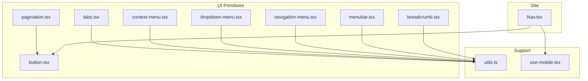
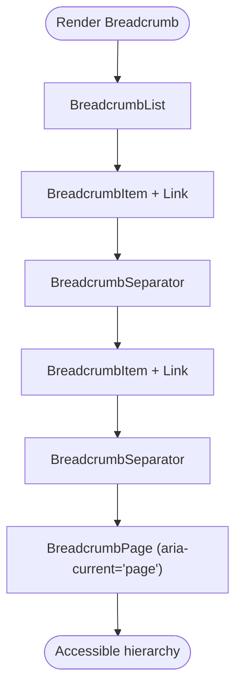
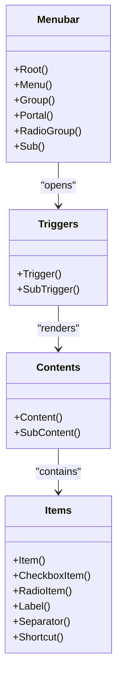
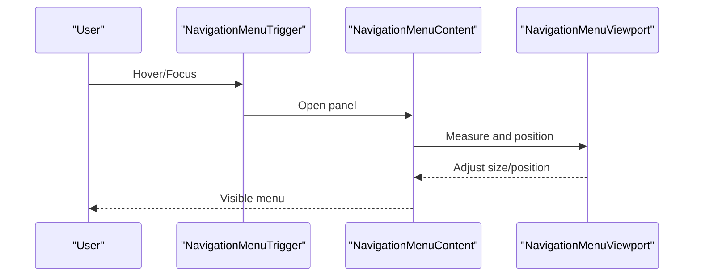
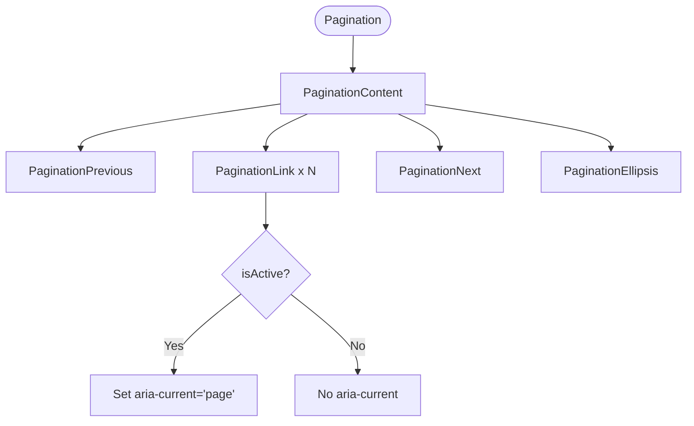
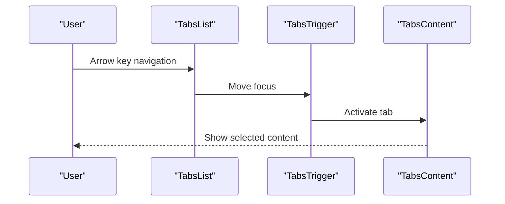
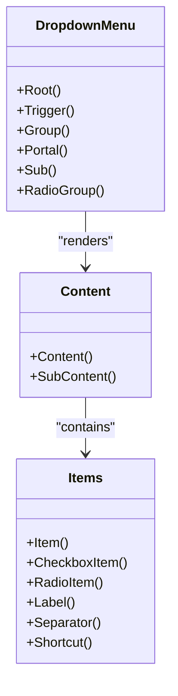
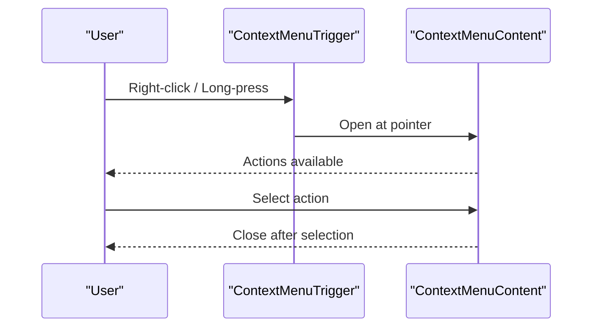
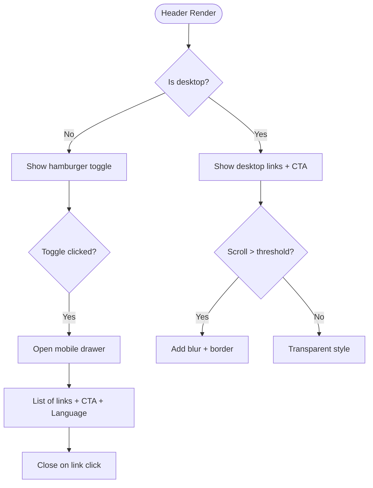
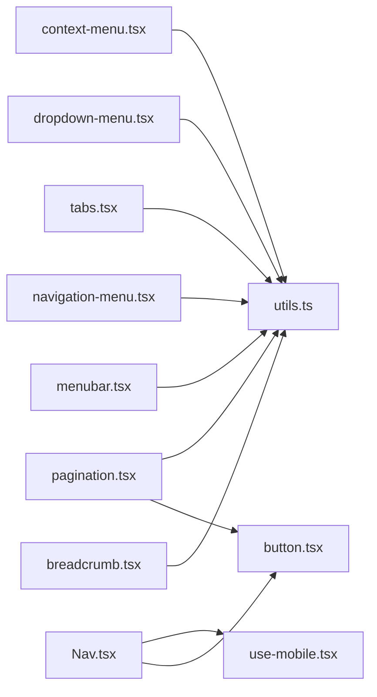

# Navigation Components

<cite>
**Referenced Files in This Document**
- [breadcrumb.tsx](file://src/components/ui/breadcrumb.tsx)
- [menubar.tsx](file://src/components/ui/menubar.tsx)
- [navigation-menu.tsx](file://src/components/ui/navigation-menu.tsx)
- [pagination.tsx](file://src/components/ui/pagination.tsx)
- [tabs.tsx](file://src/components/ui/tabs.tsx)
- [dropdown-menu.tsx](file://src/components/ui/dropdown-menu.tsx)
- [context-menu.tsx](file://src/components/ui/context-menu.tsx)
- [Nav.tsx](file://src/components/site/Nav.tsx)
- [button.tsx](file://src/components/ui/button.tsx)
- [use-mobile.tsx](file://src/hooks/use-mobile.tsx)
- [utils.ts](file://src/lib/utils.ts)
</cite>

## Table of Contents

1. Introduction
2. Project Structure
3. Core Components
4. Architecture Overview
5. Detailed Component Analysis
6. Dependency Analysis
7. Performance Considerations
8. Troubleshooting Guide
9. Conclusion

## Introduction

This document provides comprehensive guidance for navigation and menu components in the project, including breadcrumbs, menus, navigation bars, pagination, tabs, dropdown menus, and context menus. It covers component structure, event handling, keyboard navigation, accessibility features, nested menus, dynamic content loading, responsive patterns, state management for active states and focus, and mobile adaptations. It also includes guidelines for information architecture and consistent navigation experiences across screen sizes.

## Project Structure

The navigation-related UI is implemented as reusable primitives under src/components/ui, with a site-level navigation bar in src/components/site/Nav.tsx. Utilities and hooks support responsive behavior and styling.



**Diagram sources**

- [Nav.tsx:1-130](file://src/components/site/Nav.tsx#L1-L130)
- [breadcrumb.tsx:1-102](file://src/components/ui/breadcrumb.tsx#L1-L102)
- [menubar.tsx:1-230](file://src/components/ui/menubar.tsx#L1-L230)
- [navigation-menu.tsx:1-121](file://src/components/ui/navigation-menu.tsx#L1-L121)
- [pagination.tsx:1-99](file://src/components/ui/pagination.tsx#L1-L99)
- [tabs.tsx:1-54](file://src/components/ui/tabs.tsx#L1-L54)
- [dropdown-menu.tsx:1-189](file://src/components/ui/dropdown-menu.tsx#L1-L189)
- [context-menu.tsx:1-188](file://src/components/ui/context-menu.tsx#L1-L188)
- [button.tsx:1-50](file://src/components/ui/button.tsx#L1-L50)
- [use-mobile.tsx:1-20](file://src/hooks/use-mobile.tsx#L1-L20)
- [utils.ts:1-7](file://src/lib/utils.ts#L1-L7)

**Section sources**

- [Nav.tsx:1-130](file://src/components/site/Nav.tsx#L1-L130)
- [breadcrumb.tsx:1-102](file://src/components/ui/breadcrumb.tsx#L1-L102)
- [menubar.tsx:1-230](file://src/components/ui/menubar.tsx#L1-L230)
- [navigation-menu.tsx:1-121](file://src/components/ui/navigation-menu.tsx#L1-L121)
- [pagination.tsx:1-99](file://src/components/ui/pagination.tsx#L1-L99)
- [tabs.tsx:1-54](file://src/components/ui/tabs.tsx#L1-L54)
- [dropdown-menu.tsx:1-189](file://src/components/ui/dropdown-menu.tsx#L1-L189)
- [context-menu.tsx:1-188](file://src/components/ui/context-menu.tsx#L1-L188)
- [button.tsx:1-50](file://src/components/ui/button.tsx#L1-L50)
- [use-mobile.tsx:1-20](file://src/hooks/use-mobile.tsx#L1-L20)
- [utils.ts:1-7](file://src/lib/utils.ts#L1-L7)

## Core Components

- Breadcrumbs: Provide hierarchical location with accessible roles and current page indication.
- Menus: Menubar (desktop app-like), Dropdown Menu (contextual actions), Context Menu (right-click or long-press).
- Navigation Menu: Primary site navigation with hover/focus-triggered panels and viewport management.
- Pagination: Page controls with active state and ARIA labels.
- Tabs: Tabbed content switching with keyboard navigation and focus management.
- Site Navigation Bar: Responsive header with desktop links, language switcher, CTA, and mobile drawer.

Key implementation highlights:

- All menu primitives are built on Radix UI, ensuring robust keyboard and screen reader support out of the box.
- Styling uses class-variance-authority and Tailwind via a shared cn utility for consistent classes.
- Active states are managed through props and data attributes exposed by primitives (e.g., aria-current, data-[state]).

**Section sources**

- [breadcrumb.tsx:1-102](file://src/components/ui/breadcrumb.tsx#L1-L102)
- [menubar.tsx:1-230](file://src/components/ui/menubar.tsx#L1-L230)
- [dropdown-menu.tsx:1-189](file://src/components/ui/dropdown-menu.tsx#L1-L189)
- [context-menu.tsx:1-188](file://src/components/ui/context-menu.tsx#L1-L188)
- [navigation-menu.tsx:1-121](file://src/components/ui/navigation-menu.tsx#L1-L121)
- [pagination.tsx:1-99](file://src/components/ui/pagination.tsx#L1-L99)
- [tabs.tsx:1-54](file://src/components/ui/tabs.tsx#L1-L54)
- [button.tsx:1-50](file://src/components/ui/button.tsx#L1-L50)
- [utils.ts:1-7](file://src/lib/utils.ts#L1-L7)

## Architecture Overview

The navigation system composes Radix primitives with lightweight wrappers to standardize appearance and behavior. The site header coordinates global navigation and adapts to mobile viewports.

```mermaid
sequenceDiagram
participant User as "User"
participant Nav as "Nav.tsx"
participant Link as "Anchor/Button"
participant Router as "Router"
participant View as "Page Content"
User->>Nav : Click nav link
Nav->>Link : Navigate to href
Link->>Router : Route change
Router-->>View : Render target route
View-->>User : Updated content
```

**Diagram sources**

- [Nav.tsx:1-130](file://src/components/site/Nav.tsx#L1-L130)

## Detailed Component Analysis

### Breadcrumbs

- Structure: Root nav, ordered list, items, links, current page span, separators, ellipsis for overflow.
- Accessibility: Uses semantic nav and ol; current page has aria-current="page"; separators are presentation-only; ellipsis includes sr-only text.
- Keyboard: Standard link/tab navigation; no custom trapping required.
- State: Current page indicated via role and aria attributes.
- Usage pattern: Compose multiple BreadcrumbItem/BreadcrumbLink elements; use BreadcrumbPage for the current item and BreadcrumbSeparator between steps.



**Diagram sources**

- [breadcrumb.tsx:1-102](file://src/components/ui/breadcrumb.tsx#L1-L102)

**Section sources**

- [breadcrumb.tsx:1-102](file://src/components/ui/breadcrumb.tsx#L1-L102)

### Menubar (Desktop App-style Menu)

- Structure: Root container, groups, triggers, contents, items, checkboxes/radio items, labels, separators, shortcuts, submenus.
- Accessibility: Full keyboard support (arrow keys, Enter/Space, Escape), proper roles and states from primitives.
- Nested menus: Use Sub/SubTrigger/SubContent for cascading options.
- Focus management: Handled by primitives; ensure tab order into the menubar root.
- Styling: Consistent focus rings and open states via data attributes.



**Diagram sources**

- [menubar.tsx:1-230](file://src/components/ui/menubar.tsx#L1-L230)

**Section sources**

- [menubar.tsx:1-230](file://src/components/ui/menubar.tsx#L1-L230)

### Navigation Menu (Primary Site Navigation)

- Structure: Root, list, items, triggers, content, viewport, indicator, link.
- Behavior: Hover/focus opens content; viewport ensures content fits within bounds; indicator shows alignment.
- Accessibility: Keyboard navigation with arrow keys and Enter/Space; focus management handled by primitives.
- Styling: Open state styles via data attributes; responsive width via viewport.



**Diagram sources**

- [navigation-menu.tsx:1-121](file://src/components/ui/navigation-menu.tsx#L1-L121)

**Section sources**

- [navigation-menu.tsx:1-121](file://src/components/ui/navigation-menu.tsx#L1-L121)

### Pagination

- Structure: Nav wrapper, content list, items, links, previous/next, ellipsis.
- Accessibility: Nav with aria-label; active link sets aria-current="page"; previous/next have descriptive aria-labels; ellipsis uses sr-only text.
- Keyboard: Standard link/tab navigation.
- Active state: Controlled via isActive prop to set outline variant and aria-current.



**Diagram sources**

- [pagination.tsx:1-99](file://src/components/ui/pagination.tsx#L1-L99)

**Section sources**

- [pagination.tsx:1-99](file://src/components/ui/pagination.tsx#L1-L99)

### Tabs

- Structure: Root, list, trigger, content.
- Accessibility: Keyboard navigation with arrow keys; focus ring; active state via data attribute.
- Dynamic content: Each tab’s content is rendered when activated; consider lazy-loading heavy content inside TabsContent for performance.
- Focus management: Primitive handles focus movement between triggers and content.



**Diagram sources**

- [tabs.tsx:1-54](file://src/components/ui/tabs.tsx#L1-L54)

**Section sources**

- [tabs.tsx:1-54](file://src/components/ui/tabs.tsx#L1-L54)

### Dropdown Menu

- Structure: Root, trigger, group, portal, submenu, radio group, content, items, checkbox/radio items, label, separator, shortcut.
- Accessibility: Keyboard navigation, proper roles/states, submenu support.
- Nested menus: Use Sub/SubTrigger/SubContent for multi-level structures.
- Focus management: Opens on click/hover; focuses first item; Escape closes.



**Diagram sources**

- [dropdown-menu.tsx:1-189](file://src/components/ui/dropdown-menu.tsx#L1-L189)

**Section sources**

- [dropdown-menu.tsx:1-189](file://src/components/ui/dropdown-menu.tsx#L1-L189)

### Context Menu

- Structure: Root, trigger, group, portal, submenu, radio group, content, items, checkbox/radio items, label, separator, shortcut.
- Accessibility: Keyboard and mouse interactions; proper roles/states; supports submenus.
- Use cases: Right-click or long-press actions on content areas.



**Diagram sources**

- [context-menu.tsx:1-188](file://src/components/ui/context-menu.tsx#L1-L188)

**Section sources**

- [context-menu.tsx:1-188](file://src/components/ui/context-menu.tsx#L1-L188)

### Site Navigation Bar (Responsive)

- Structure: Fixed header with logo, desktop links, language switcher, CTA button, and mobile toggle.
- Behavior: Scroll detection adds background blur and border; mobile drawer toggles visibility; links close drawer on tap.
- Accessibility: Descriptive aria-label on toggle; visible focus states; semantic nav.
- Mobile adaptation: Hidden desktop links replaced by a collapsible drawer; language switcher included in drawer.



**Diagram sources**

- [Nav.tsx:1-130](file://src/components/site/Nav.tsx#L1-L130)

**Section sources**

- [Nav.tsx:1-130](file://src/components/site/Nav.tsx#L1-L130)

## Dependency Analysis

- UI primitives depend on Radix UI for interaction models and accessibility.
- Styling depends on Tailwind utilities merged via a shared cn helper.
- Pagination reuses the Button primitive for consistent sizing and variants.
- The site Nav uses a mobile breakpoint hook to adapt layout and behavior.



**Diagram sources**

- [breadcrumb.tsx:1-102](file://src/components/ui/breadcrumb.tsx#L1-L102)
- [menubar.tsx:1-230](file://src/components/ui/menubar.tsx#L1-L230)
- [navigation-menu.tsx:1-121](file://src/components/ui/navigation-menu.tsx#L1-L121)
- [pagination.tsx:1-99](file://src/components/ui/pagination.tsx#L1-L99)
- [tabs.tsx:1-54](file://src/components/ui/tabs.tsx#L1-L54)
- [dropdown-menu.tsx:1-189](file://src/components/ui/dropdown-menu.tsx#L1-L189)
- [context-menu.tsx:1-188](file://src/components/ui/context-menu.tsx#L1-L188)
- [button.tsx:1-50](file://src/components/ui/button.tsx#L1-L50)
- [use-mobile.tsx:1-20](file://src/hooks/use-mobile.tsx#L1-L20)
- [utils.ts:1-7](file://src/lib/utils.ts#L1-L7)

**Section sources**

- [pagination.tsx:1-99](file://src/components/ui/pagination.tsx#L1-L99)
- [button.tsx:1-50](file://src/components/ui/button.tsx#L1-L50)
- [use-mobile.tsx:1-20](file://src/hooks/use-mobile.tsx#L1-L20)
- [utils.ts:1-7](file://src/lib/utils.ts#L1-L7)

## Performance Considerations

- Prefer lazy loading of heavy tab content inside TabsContent to reduce initial bundle load.
- Avoid excessive nesting in menus; deep hierarchies increase cognitive load and render cost.
- Use portals provided by primitives to avoid layout thrashing when positioning overlays.
- Debounce scroll listeners if adding more scroll-driven behaviors beyond the existing minimal check.
- Keep menu item lists static where possible; virtualize very long lists if needed.

[No sources needed since this section provides general guidance]

## Troubleshooting Guide

- Menus not closing: Ensure Escape is not intercepted upstream; verify that only one menu instance is open at a time.
- Focus trap issues: Confirm that focus moves into the opened menu and returns to the trigger on close; test with keyboard only.
- Overflows and clipping: For NavigationMenu, ensure parent containers do not clip the viewport; adjust margins or padding if necessary.
- Pagination active state: Verify that only one link has aria-current="page" at any time to avoid confusion for assistive technologies.
- Mobile drawer: Ensure the toggle button has an accessible label and that links close the drawer to prevent stale overlays.

**Section sources**

- [menubar.tsx:1-230](file://src/components/ui/menubar.tsx#L1-L230)
- [navigation-menu.tsx:1-121](file://src/components/ui/navigation-menu.tsx#L1-L121)
- [pagination.tsx:1-99](file://src/components/ui/pagination.tsx#L1-L99)
- [dropdown-menu.tsx:1-189](file://src/components/ui/dropdown-menu.tsx#L1-L189)
- [context-menu.tsx:1-188](file://src/components/ui/context-menu.tsx#L1-L188)
- [Nav.tsx:1-130](file://src/components/site/Nav.tsx#L1-L130)

## Conclusion

The navigation system leverages accessible, composable primitives to deliver consistent experiences across devices. By following the patterns outlined here—semantic structure, proper ARIA usage, keyboard-first interactions, and responsive adaptations—you can build reliable navigation flows that scale from small screens to complex desktop interfaces. Use nested menus judiciously, manage active states explicitly, and prioritize focus management to ensure inclusive user experiences.

[No sources needed since this section summarizes without analyzing specific files]
