# Overlay Components

<cite>
**Referenced Files in This Document**
- [dialog.tsx](file://src/components/ui/dialog.tsx)
- [alert-dialog.tsx](file://src/components/ui/alert-dialog.tsx)
- [sheet.tsx](file://src/components/ui/sheet.tsx)
- [drawer.tsx](file://src/components/ui/drawer.tsx)
- [popover.tsx](file://src/components/ui/popover.tsx)
- [hover-card.tsx](file://src/components/ui/hover-card.tsx)
- [tooltip.tsx](file://src/components/ui/tooltip.tsx)
- [accordion.tsx](file://src/components/ui/accordion.tsx)
- [collapsible.tsx](file://src/components/ui/collapsible.tsx)
- [utils.ts](file://src/lib/utils.ts)
- [use-mobile.tsx](file://src/hooks/use-mobile.tsx)
- [components.json](file://components.json)
</cite>

## Table of Contents

1. Introduction
2. Project Structure
3. Core Components
4. Architecture Overview
5. Detailed Component Analysis
6. Dependency Analysis
7. Performance Considerations
8. Troubleshooting Guide
9. Conclusion
10. Appendices

## Introduction

This document provides comprehensive documentation for overlay and modal components in the project, including dialogs, drawers, popovers, hover cards, tooltips, accordions, collapsibles, and alert dialogs. It covers component APIs, event handling, focus management, backdrop behavior, accessibility features (keyboard navigation, screen reader announcements, focus trapping), stacking contexts, performance considerations for multiple overlays, and mobile-specific behaviors such as swipe gestures and safe area handling. Examples include nested overlays, content streaming patterns, and responsive adaptations.

## Project Structure

The overlay components are implemented as thin wrappers around Radix UI primitives with consistent styling via Tailwind CSS utilities. A shared utility function merges class names, and a mobile hook supports responsive behavior. The configuration file defines aliases and style settings used across components.

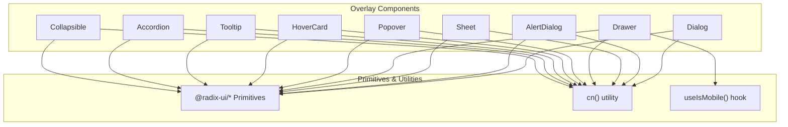

**Diagram sources**

- [dialog.tsx:1-105](file://src/components/ui/dialog.tsx#L1-L105)
- [alert-dialog.tsx:1-116](file://src/components/ui/alert-dialog.tsx#L1-L116)
- [sheet.tsx:1-123](file://src/components/ui/sheet.tsx#L1-L123)
- [drawer.tsx:1-99](file://src/components/ui/drawer.tsx#L1-L99)
- [popover.tsx:1-32](file://src/components/ui/popover.tsx#L1-L32)
- [hover-card.tsx:1-28](file://src/components/ui/hover-card.tsx#L1-L28)
- [tooltip.tsx:1-33](file://src/components/ui/tooltip.tsx#L1-L33)
- [accordion.tsx:1-52](file://src/components/ui/accordion.tsx#L1-L52)
- [collapsible.tsx:1-12](file://src/components/ui/collapsible.tsx#L1-L12)
- [utils.ts:1-7](file://src/lib/utils.ts#L1-L7)
- [use-mobile.tsx:1-20](file://src/hooks/use-mobile.tsx#L1-L20)

**Section sources**

- [dialog.tsx:1-105](file://src/components/ui/dialog.tsx#L1-L105)
- [alert-dialog.tsx:1-116](file://src/components/ui/alert-dialog.tsx#L1-L116)
- [sheet.tsx:1-123](file://src/components/ui/sheet.tsx#L1-L123)
- [drawer.tsx:1-99](file://src/components/ui/drawer.tsx#L1-L99)
- [popover.tsx:1-32](file://src/components/ui/popover.tsx#L1-L32)
- [hover-card.tsx:1-28](file://src/components/ui/hover-card.tsx#L1-L28)
- [tooltip.tsx:1-33](file://src/components/ui/tooltip.tsx#L1-L33)
- [accordion.tsx:1-52](file://src/components/ui/accordion.tsx#L1-L52)
- [collapsible.tsx:1-12](file://src/components/ui/collapsible.tsx#L1-L12)
- [utils.ts:1-7](file://src/lib/utils.ts#L1-L7)
- [use-mobile.tsx:1-20](file://src/hooks/use-mobile.tsx#L1-L20)
- [components.json:1-23](file://components.json#L1-L23)

## Core Components

- Dialog: Modal overlay with portal, overlay, trigger, close, header/footer/title/description. Uses Radix Dialog primitive.
- AlertDialog: Confirmation dialog variant with action and cancel buttons, styled via button variants.
- Sheet: Side panel overlay with configurable side (top/bottom/left/right), overlay, and close button.
- Drawer: Mobile drawer with background scaling, bottom sheet layout, and handle indicator.
- Popover: Floating content anchored to a trigger with alignment and offset controls.
- HoverCard: Hover-triggered floating content with alignment and offset controls.
- Tooltip: Lightweight tooltip with provider, trigger, and portal-backed content.
- Accordion: Expandable sections with animated open/close states and chevron indicator.
- Collapsible: Generic expand/collapse container with trigger and content.

All components use consistent z-indexing and animations through data-state attributes provided by Radix primitives. Styling is composed via the cn utility for class merging.

**Section sources**

- [dialog.tsx:9-104](file://src/components/ui/dialog.tsx#L9-L104)
- [alert-dialog.tsx:7-115](file://src/components/ui/alert-dialog.tsx#L7-L115)
- [sheet.tsx:10-122](file://src/components/ui/sheet.tsx#L10-L122)
- [drawer.tsx:6-98](file://src/components/ui/drawer.tsx#L6-L98)
- [popover.tsx:6-31](file://src/components/ui/popover.tsx#L6-L31)
- [hover-card.tsx:6-27](file://src/components/ui/hover-card.tsx#L6-L27)
- [tooltip.tsx:8-32](file://src/components/ui/tooltip.tsx#L8-L32)
- [accordion.tsx:7-51](file://src/components/ui/accordion.tsx#L7-L51)
- [collapsible.tsx:5-11](file://src/components/ui/collapsible.tsx#L5-L11)

## Architecture Overview

The architecture follows a layered approach:

- Presentation layer: UI components that wrap Radix primitives and apply consistent styles.
- Utility layer: Shared helpers like cn for class merging and useIsMobile for responsive logic.
- Configuration layer: components.json defines aliases and style defaults used by the build.

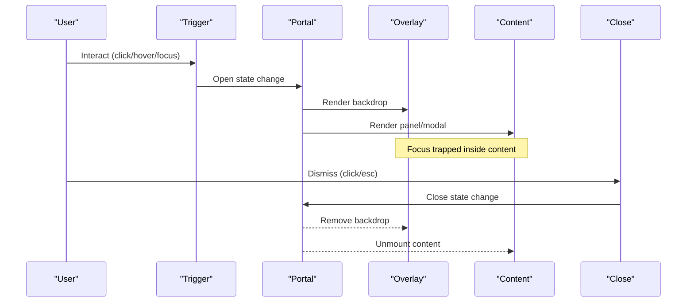

**Diagram sources**

- [dialog.tsx:17-54](file://src/components/ui/dialog.tsx#L17-L54)
- [alert-dialog.tsx:13-44](file://src/components/ui/alert-dialog.tsx#L13-L44)
- [sheet.tsx:18-72](file://src/components/ui/sheet.tsx#L18-L72)
- [drawer.tsx:20-51](file://src/components/ui/drawer.tsx#L20-L51)

## Detailed Component Analysis

### Dialog

- API surface: Root, Trigger, Portal, Close, Overlay, Content, Header, Footer, Title, Description.
- Backdrop: Fullscreen overlay with fade transitions; z-index ensures it sits above page content.
- Focus management: Radix handles focus trap within content and returns focus on close.
- Events: Controlled via Radix state; can be opened/closed programmatically or via triggers.
- Accessibility: Semantic roles and aria attributes managed by primitives; close button includes sr-only text.

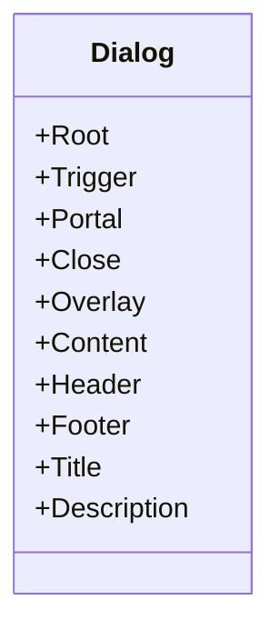

**Diagram sources**

- [dialog.tsx:9-104](file://src/components/ui/dialog.tsx#L9-L104)

**Section sources**

- [dialog.tsx:9-104](file://src/components/ui/dialog.tsx#L9-L104)

### AlertDialog

- API surface: Root, Trigger, Portal, Overlay, Content, Header, Footer, Title, Description, Action, Cancel.
- Backdrop: Same as Dialog with fade transitions.
- Focus management: Focus trap within content; default focus on first actionable element.
- Events: Standard open/close lifecycle; actions typically commit changes and close.
- Accessibility: Screen reader friendly due to semantic structure and aria attributes from primitives.

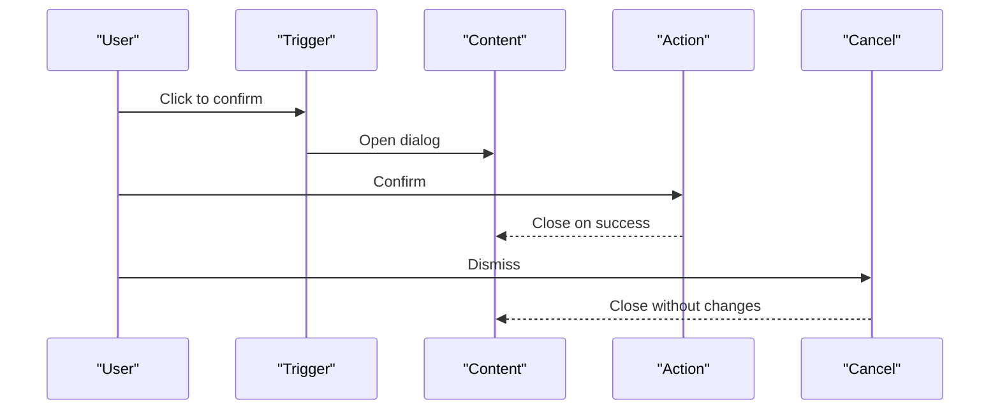

**Diagram sources**

- [alert-dialog.tsx:7-115](file://src/components/ui/alert-dialog.tsx#L7-L115)

**Section sources**

- [alert-dialog.tsx:7-115](file://src/components/ui/alert-dialog.tsx#L7-L115)

### Sheet

- API surface: Root, Trigger, Portal, Overlay, Close, Content, Header, Footer, Title, Description.
- Backdrop: Fullscreen overlay with fade transitions.
- Positioning: Configurable sides (top/bottom/left/right) with slide-in/out animations.
- Focus management: Focus trap within content; close button accessible via keyboard.
- Events: Controlled via Radix state; can be opened/closed programmatically.

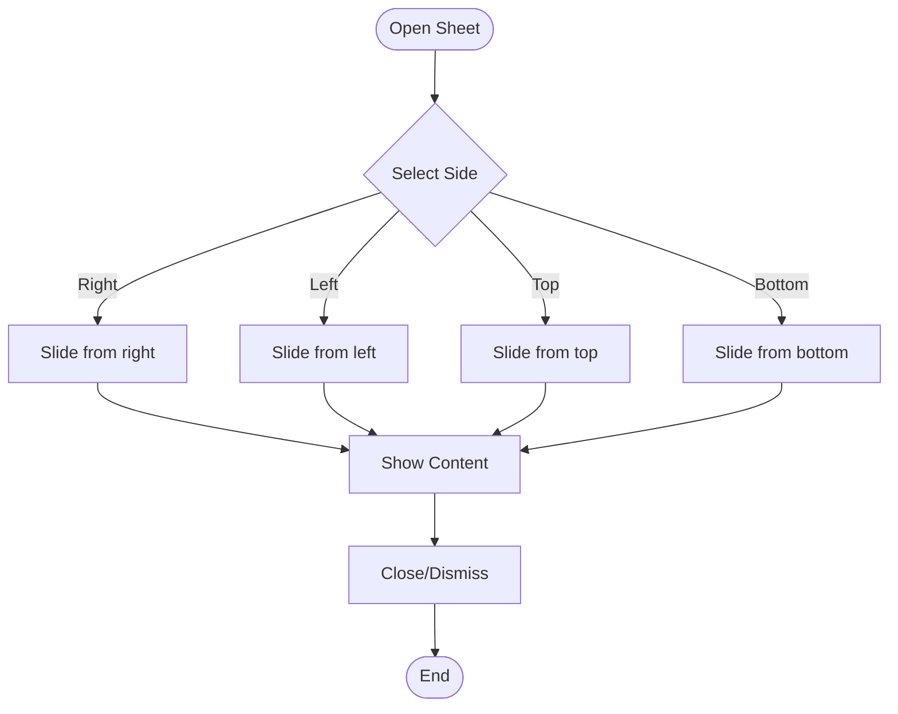

**Diagram sources**

- [sheet.tsx:33-72](file://src/components/ui/sheet.tsx#L33-L72)

**Section sources**

- [sheet.tsx:10-122](file://src/components/ui/sheet.tsx#L10-L122)

### Drawer

- API surface: Root, Trigger, Portal, Overlay, Close, Content, Header, Footer, Title, Description.
- Backdrop: Fullscreen overlay with fade transitions.
- Behavior: Background scaling option; bottom sheet with handle indicator.
- Focus management: Focus trap within content; keyboard dismiss supported by underlying primitive.
- Mobile: Designed for touch interactions; swipe-to-dismiss handled by vaul primitive.

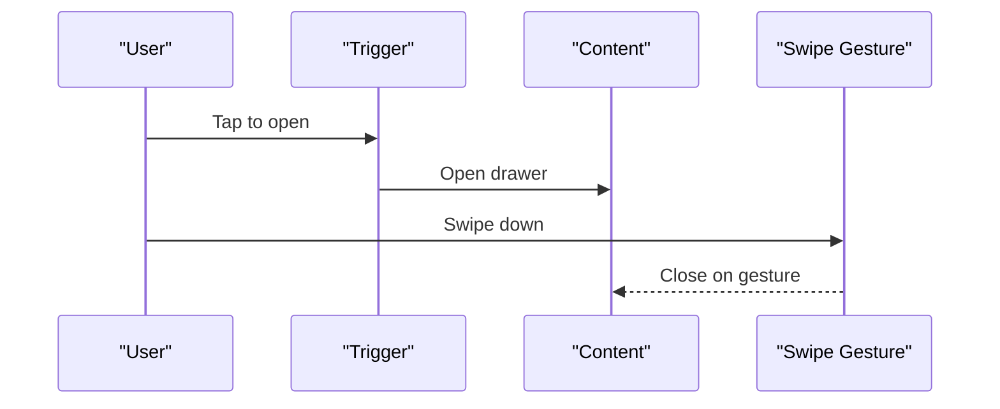

**Diagram sources**

- [drawer.tsx:6-51](file://src/components/ui/drawer.tsx#L6-L51)

**Section sources**

- [drawer.tsx:6-98](file://src/components/ui/drawer.tsx#L6-L98)

### Popover

- API surface: Root, Trigger, Anchor, Content.
- Positioning: Align and sideOffset props control placement relative to trigger.
- Backdrop: No backdrop; floats above content.
- Focus management: Focus moves into content when opened; returns on close.
- Events: Controlled via Radix state; opens on click/focus depending on trigger behavior.

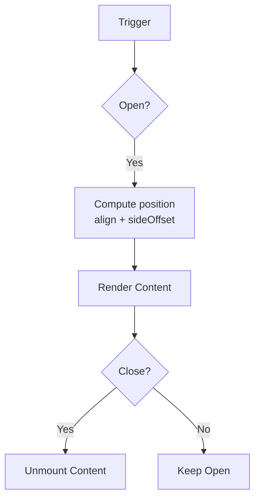

**Diagram sources**

- [popover.tsx:6-31](file://src/components/ui/popover.tsx#L6-L31)

**Section sources**

- [popover.tsx:6-31](file://src/components/ui/popover.tsx#L6-L31)

### HoverCard

- API surface: Root, Trigger, Content.
- Positioning: Align and sideOffset props control placement.
- Backdrop: None; floats above content.
- Focus management: Focus behavior controlled by primitive; suitable for hover interactions.
- Events: Opens on hover; closes on mouse leave.

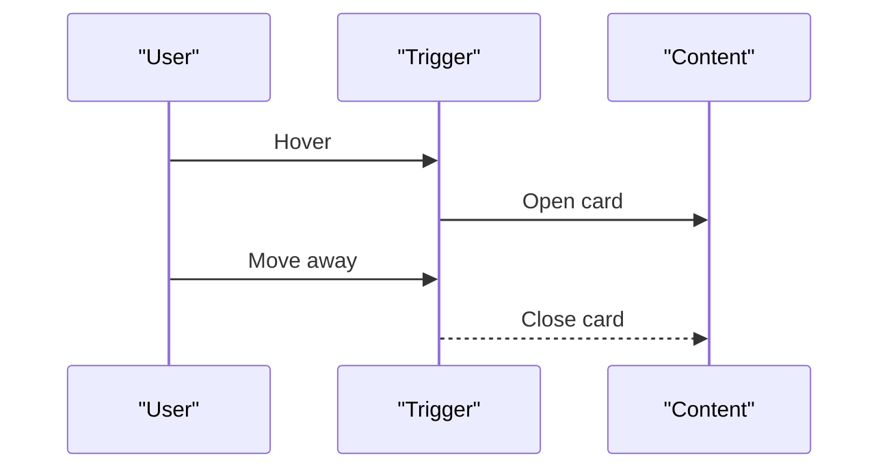

**Diagram sources**

- [hover-card.tsx:6-27](file://src/components/ui/hover-card.tsx#L6-L27)

**Section sources**

- [hover-card.tsx:6-27](file://src/components/ui/hover-card.tsx#L6-L27)

### Tooltip

- API surface: Provider, Root, Trigger, Content.
- Positioning: sideOffset controls distance from trigger.
- Backdrop: None; lightweight floating label.
- Focus management: Accessible via keyboard; announces content to screen readers.
- Events: Controlled via Radix state; opens on hover/focus.

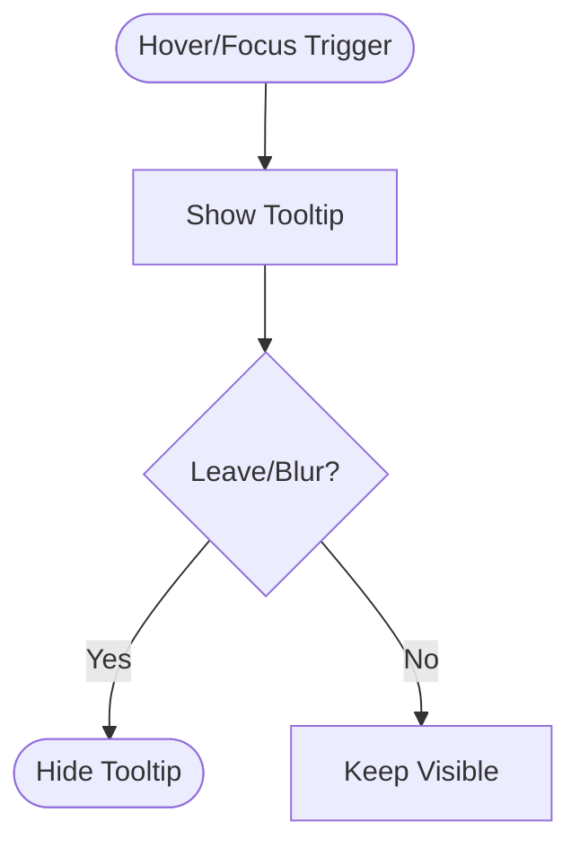

**Diagram sources**

- [tooltip.tsx:8-32](file://src/components/ui/tooltip.tsx#L8-L32)

**Section sources**

- [tooltip.tsx:8-32](file://src/components/ui/tooltip.tsx#L8-L32)

### Accordion

- API surface: Root, Item, Trigger, Content.
- Behavior: Expand/collapse with animated transitions; chevron rotates based on state.
- Focus management: Focus moves between triggers and content; keyboard navigation supported.
- Events: Controlled via Radix state; single or multiple expansion modes via primitive options.

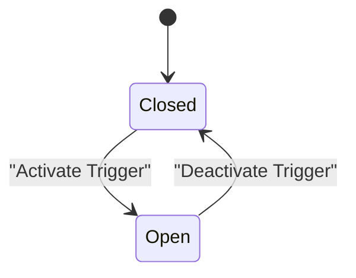

**Diagram sources**

- [accordion.tsx:7-51](file://src/components/ui/accordion.tsx#L7-L51)

**Section sources**

- [accordion.tsx:7-51](file://src/components/ui/accordion.tsx#L7-L51)

### Collapsible

- API surface: Root, Trigger, Content.
- Behavior: Generic expand/collapse container with no built-in animations beyond primitive defaults.
- Focus management: Focus moves into content when opened; returns on close.
- Events: Controlled via Radix state; suitable for simple toggles.

**Section sources**

- [collapsible.tsx:5-11](file://src/components/ui/collapsible.tsx#L5-L11)

## Dependency Analysis

Components depend on Radix primitives for robust state, focus management, and accessibility. Styling relies on Tailwind classes merged via cn. Mobile behavior leverages useIsMobile where needed.

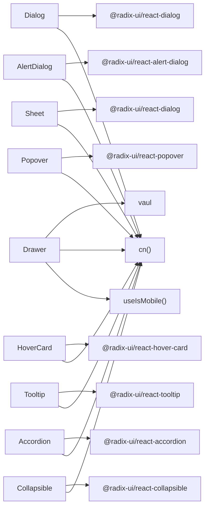

**Diagram sources**

- [dialog.tsx:4-104](file://src/components/ui/dialog.tsx#L4-L104)
- [alert-dialog.tsx:2-115](file://src/components/ui/alert-dialog.tsx#L2-L115)
- [sheet.tsx:3-122](file://src/components/ui/sheet.tsx#L3-L122)
- [drawer.tsx:2-98](file://src/components/ui/drawer.tsx#L2-L98)
- [popover.tsx:2-31](file://src/components/ui/popover.tsx#L2-L31)
- [hover-card.tsx:2-27](file://src/components/ui/hover-card.tsx#L2-L27)
- [tooltip.tsx:4-32](file://src/components/ui/tooltip.tsx#L4-L32)
- [accordion.tsx:2-51](file://src/components/ui/accordion.tsx#L2-L51)
- [collapsible.tsx:3-11](file://src/components/ui/collapsible.tsx#L3-L11)
- [utils.ts:4-6](file://src/lib/utils.ts#L4-L6)
- [use-mobile.tsx:5-18](file://src/hooks/use-mobile.tsx#L5-L18)

**Section sources**

- [dialog.tsx:4-104](file://src/components/ui/dialog.tsx#L4-L104)
- [alert-dialog.tsx:2-115](file://src/components/ui/alert-dialog.tsx#L2-L115)
- [sheet.tsx:3-122](file://src/components/ui/sheet.tsx#L3-L122)
- [drawer.tsx:2-98](file://src/components/ui/drawer.tsx#L2-L98)
- [popover.tsx:2-31](file://src/components/ui/popover.tsx#L2-L31)
- [hover-card.tsx:2-27](file://src/components/ui/hover-card.tsx#L2-L27)
- [tooltip.tsx:4-32](file://src/components/ui/tooltip.tsx#L4-L32)
- [accordion.tsx:2-51](file://src/components/ui/accordion.tsx#L2-L51)
- [collapsible.tsx:3-11](file://src/components/ui/collapsible.tsx#L3-L11)
- [utils.ts:4-6](file://src/lib/utils.ts#L4-L6)
- [use-mobile.tsx:5-18](file://src/hooks/use-mobile.tsx#L5-L18)

## Performance Considerations

- Portal rendering: Overlays render in portals to avoid DOM depth issues and ensure correct stacking context.
- Z-index management: Consistent z-50 values keep overlays above content; avoid overriding unless necessary.
- Animation costs: Data-state animations provide smooth transitions; limit concurrent open overlays to reduce reflows.
- Memory usage: Unmount content on close to free resources; prefer lazy loading for heavy content.
- Mobile interactions: Use swipe gestures judiciously; ensure gestures do not conflict with scrollable content.
- Responsive adaptation: Use breakpoints and hooks to adjust overlay size and behavior on small screens.

[No sources needed since this section provides general guidance]

## Troubleshooting Guide

- Focus not trapped: Ensure content is wrapped in a primitive that manages focus; verify portal is mounted.
- Backdrop not visible: Check z-index and opacity classes; ensure overlay component is rendered.
- Keyboard events blocked: Verify trigger and close elements are focusable and not disabled.
- Nested overlays: Use separate portals per overlay to maintain independent stacking contexts.
- Mobile swipe conflicts: Disable scroll hijacking inside content; ensure gestures target the drawer root.
- Screen reader announcements: Include descriptive titles and descriptions; rely on primitive aria attributes.

**Section sources**

- [dialog.tsx:17-54](file://src/components/ui/dialog.tsx#L17-L54)
- [alert-dialog.tsx:13-44](file://src/components/ui/alert-dialog.tsx#L13-L44)
- [sheet.tsx:18-72](file://src/components/ui/sheet.tsx#L18-L72)
- [drawer.tsx:20-51](file://src/components/ui/drawer.tsx#L20-L51)

## Conclusion

The overlay components provide a consistent, accessible, and performant foundation for modals, panels, and floating content. By leveraging Radix primitives and Tailwind styling, they offer robust focus management, keyboard navigation, and screen reader support. Follow the guidelines for stacking contexts, performance, and mobile behaviors to deliver high-quality user experiences across devices.

[No sources needed since this section summarizes without analyzing specific files]

## Appendices

### Accessibility Features

- Keyboard navigation: Tab order within overlays; Escape to close where applicable.
- Screen reader announcements: Titles and descriptions convey context; close buttons include sr-only labels.
- Focus trapping: Prevents focus leaving overlay until dismissed.

**Section sources**

- [dialog.tsx:47-50](file://src/components/ui/dialog.tsx#L47-L50)
- [sheet.tsx:64-67](file://src/components/ui/sheet.tsx#L64-L67)
- [alert-dialog.tsx:83-101](file://src/components/ui/alert-dialog.tsx#L83-L101)

### Stacking Contexts and Multiple Overlays

- Each overlay uses a portal to create an independent stacking context.
- Maintain consistent z-index to avoid unexpected overlaps.
- Avoid deep nesting; prefer sequential overlays with clear dismissal paths.

**Section sources**

- [dialog.tsx:36-53](file://src/components/ui/dialog.tsx#L36-L53)
- [alert-dialog.tsx:32-43](file://src/components/ui/alert-dialog.tsx#L32-L43)
- [sheet.tsx:61-71](file://src/components/ui/sheet.tsx#L61-L71)
- [drawer.tsx:36-50](file://src/components/ui/drawer.tsx#L36-L50)

### Mobile-Specific Behaviors

- Swipe gestures: Drawer supports swipe-to-dismiss via underlying primitive.
- Safe area handling: Use inset-safe utilities if needed; ensure content respects device insets.
- Responsive sizing: Adjust widths and positions using breakpoints; consider full-screen on small devices.

**Section sources**

- [drawer.tsx:6-11](file://src/components/ui/drawer.tsx#L6-L11)
- [use-mobile.tsx:5-18](file://src/hooks/use-mobile.tsx#L5-L18)

### Examples and Patterns

- Nested overlays: Combine popover inside dialog for contextual actions; ensure each has its own portal.
- Content streaming: Load heavy content lazily within overlays to improve initial render time.
- Responsive adaptations: Use media queries and hooks to switch between modal and drawer patterns on mobile.

[No sources needed since this section provides conceptual examples]
