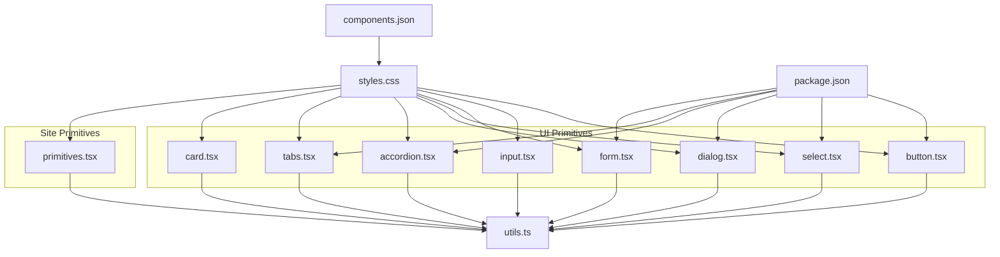
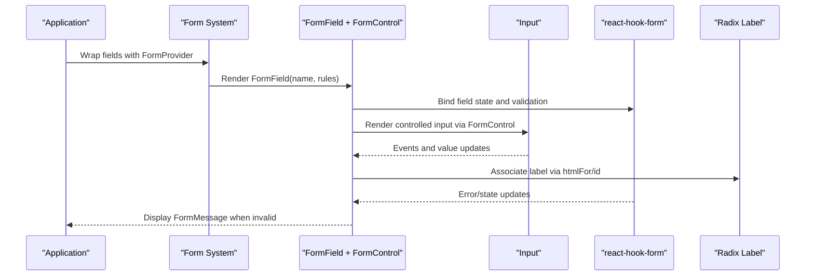
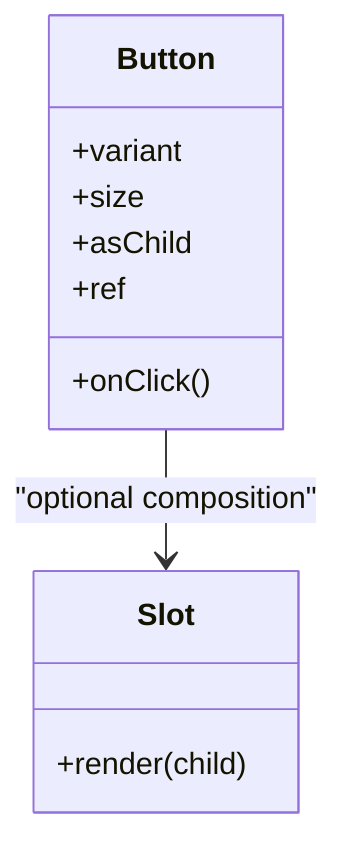
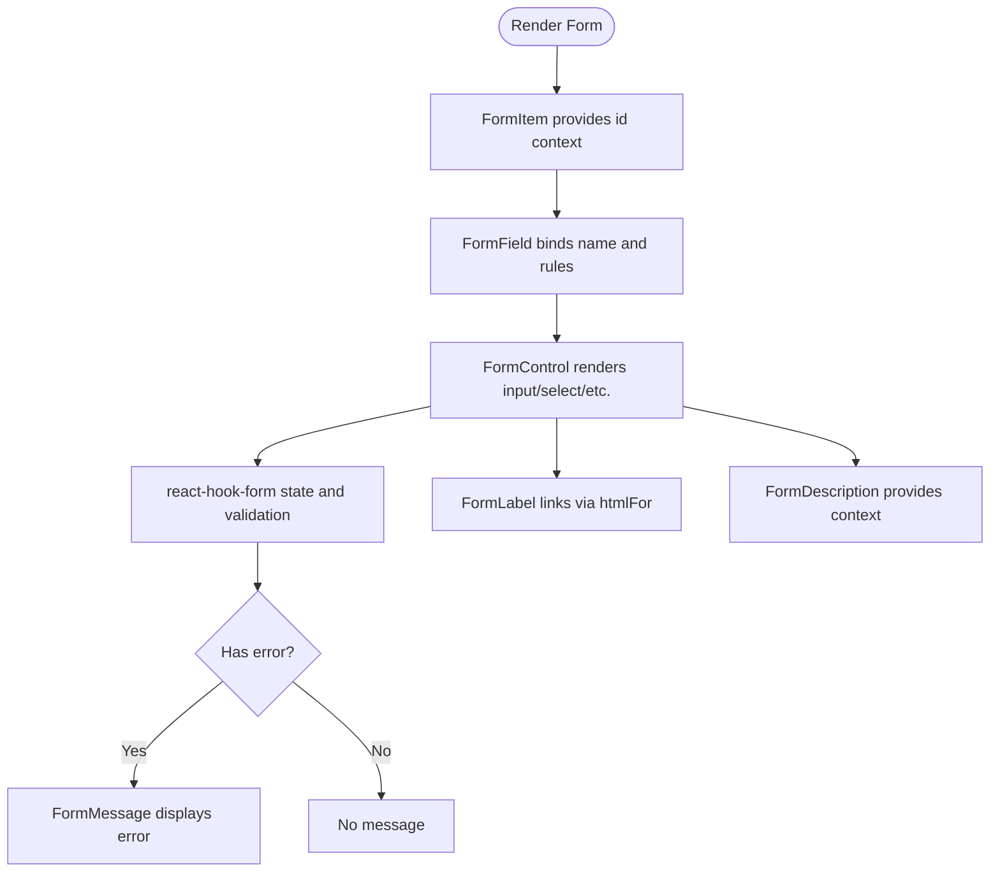
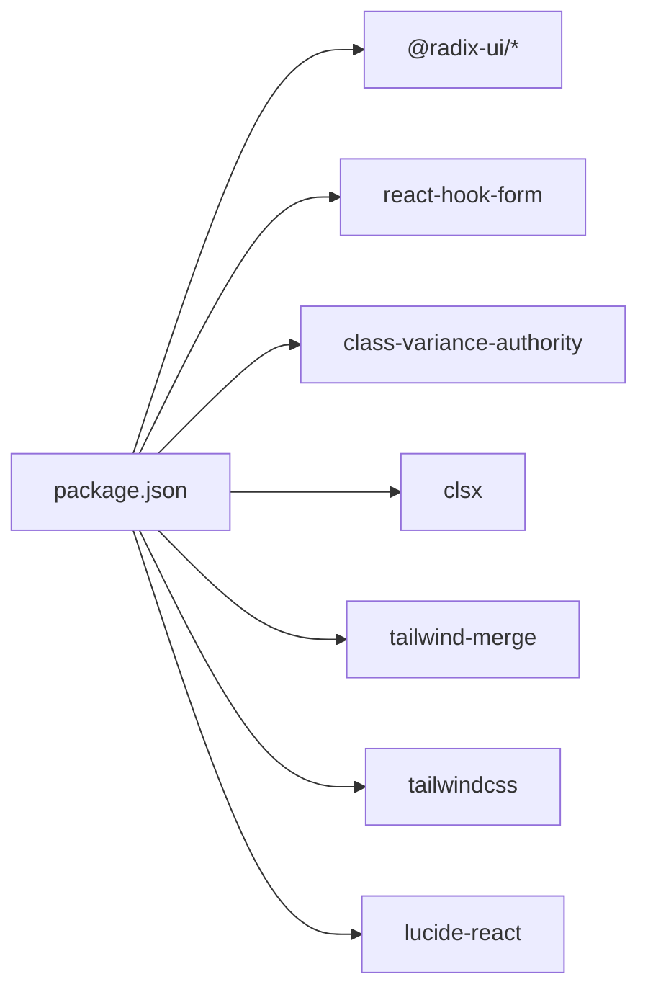

# UI Component Library

<cite>
**Referenced Files in This Document**
- [package.json](file://package.json)
- [components.json](file://components.json)
- [styles.css](file://src/styles.css)
- [utils.ts](file://src/lib/utils.ts)
- [button.tsx](file://src/components/ui/button.tsx)
- [input.tsx](file://src/components/ui/input.tsx)
- [form.tsx](file://src/components/ui/form.tsx)
- [select.tsx](file://src/components/ui/select.tsx)
- [dialog.tsx](file://src/components/ui/dialog.tsx)
- [accordion.tsx](file://src/components/ui/accordion.tsx)
- [tabs.tsx](file://src/components/ui/tabs.tsx)
- [card.tsx](file://src/components/ui/card.tsx)
- [primitives.tsx](file://src/components/site/primitives.tsx)
</cite>

## Table of Contents

1. [Introduction](#introduction)
2. [Project Structure](#project-structure)
3. [Core Components](#core-components)
4. [Architecture Overview](#architecture-overview)
5. [Detailed Component Analysis](#detailed-component-analysis)
6. [Dependency Analysis](#dependency-analysis)
7. [Performance Considerations](#performance-considerations)
8. [Accessibility and WCAG Compliance](#accessibility-and-wcag-compliance)
9. [Theming and Customization](#theming-and-customization)
10. [Responsive Design Guidelines](#responsive-design-guidelines)
11. [Cross-Browser Compatibility](#cross-browser-compatibility)
12. [Integration Patterns](#integration-patterns)
13. [Troubleshooting Guide](#troubleshooting-guide)
14. [Conclusion](#conclusion)
15. [Appendices](#appendices)

## Introduction

This document describes a reusable UI component library built on accessible Radix UI primitives with Tailwind CSS styling. It covers the architecture, component categories (form controls, feedback elements, navigation components, layout utilities), props/events/slots, customization options, responsive design, accessibility compliance, theming, performance optimizations, animations, integration patterns, and best practices for extending or creating new components.

The library emphasizes:

- Accessibility-first primitives from Radix UI
- Consistent, theme-driven styling via Tailwind CSS and CSS custom properties
- Composable building blocks that can be combined into higher-level UI
- Performance-conscious implementations with minimal re-renders and efficient animations
- Clear extension points for brand-specific customization

## Project Structure

The project organizes UI components under src/components/ui as thin wrappers around Radix UI primitives, styled with Tailwind utility classes and merged through a shared cn helper. Site-specific primitives live under src/components/site and provide branded building blocks like Logo, Parallax, Reveal, SectionHeading, and EmberButton.

**Diagram sources**

- [button.tsx:1-50](file://src/components/ui/button.tsx#L1-L50)
- [input.tsx:1-23](file://src/components/ui/input.tsx#L1-L23)
- [form.tsx:1-172](file://src/components/ui/form.tsx#L1-L172)
- [select.tsx:1-153](file://src/components/ui/select.tsx#L1-L153)
- [dialog.tsx:1-105](file://src/components/ui/dialog.tsx#L1-L105)
- [accordion.tsx:1-52](file://src/components/ui/accordion.tsx#L1-L52)
- [tabs.tsx:1-54](file://src/components/ui/tabs.tsx#L1-L54)
- [card.tsx:1-56](file://src/components/ui/card.tsx#L1-L56)
- [primitives.tsx:1-242](file://src/components/site/primitives.tsx#L1-L242)
- [utils.ts:1-7](file://src/lib/utils.ts#L1-L7)
- [styles.css:1-268](file://src/styles.css#L1-L268)
- [components.json:1-23](file://components.json#L1-L23)
- [package.json:14-66](file://package.json#L14-L66)

**Section sources**

- [components.json:1-23](file://components.json#L1-L23)
- [styles.css:1-268](file://src/styles.css#L1-L268)
- [package.json:14-66](file://package.json#L14-L66)

## Core Components

This section outlines the primary building blocks and their responsibilities.

- Button: A versatile button with variants and sizes, supporting composition via Slot for flexible rendering.
- Input: Accessible text input with focus rings, disabled states, and consistent sizing.
- Form: A form system integrating react-hook-form with accessible labels, descriptions, and messages.
- Select: A fully accessible select dropdown with keyboard navigation and animated content.
- Dialog: A modal dialog with overlay, portal, header/footer, and accessible close behavior.
- Accordion: Expandable sections with animated content and accessible triggers.
- Tabs: Tabbed interface with keyboard navigation and active state styling.
- Card: Layout container with header, title, description, content, and footer regions.
- Site Primitives: Branded components such as Logo, Parallax, Reveal, SectionHeading, and EmberButton for page-level composition.

Key implementation patterns:

- Wrapping Radix primitives to add Tailwind styles while preserving accessibility features
- Using class-variance-authority for variant-based styling (e.g., Button)
- Merging classes with clsx and tailwind-merge via the cn helper
- ForwardRef usage for proper ref forwarding and accessibility attributes

**Section sources**

- [button.tsx:1-50](file://src/components/ui/button.tsx#L1-L50)
- [input.tsx:1-23](file://src/components/ui/input.tsx#L1-L23)
- [form.tsx:1-172](file://src/components/ui/form.tsx#L1-L172)
- [select.tsx:1-153](file://src/components/ui/select.tsx#L1-L153)
- [dialog.tsx:1-105](file://src/components/ui/dialog.tsx#L1-L105)
- [accordion.tsx:1-52](file://src/components/ui/accordion.tsx#L1-L52)
- [tabs.tsx:1-54](file://src/components/ui/tabs.tsx#L1-L54)
- [card.tsx:1-56](file://src/components/ui/card.tsx#L1-L56)
- [primitives.tsx:1-242](file://src/components/site/primitives.tsx#L1-L242)

## Architecture Overview

The architecture layers Radix UI primitives with Tailwind CSS styling and a shared utility layer. Each UI component is a small wrapper that composes Radix parts, applies consistent styles, and exposes a clean API. The site primitives layer provides higher-level, brand-aware components that compose the UI primitives.

**Diagram sources**

- [form.tsx:1-172](file://src/components/ui/form.tsx#L1-L172)
- [input.tsx:1-23](file://src/components/ui/input.tsx#L1-L23)

**Section sources**

- [form.tsx:1-172](file://src/components/ui/form.tsx#L1-L172)
- [input.tsx:1-23](file://src/components/ui/input.tsx#L1-L23)

## Detailed Component Analysis

### Button

- Purpose: Primary interactive element with multiple visual variants and sizes.
- Props: variant (default, destructive, outline, secondary, ghost, link), size (default, sm, lg, icon), asChild, plus standard HTML button attributes.
- Events: onClick, onKeyDown, etc., forwarded to underlying element.
- Slots: Supports asChild to render any element while inheriting styles and events.
- Styling: Uses class-variance-authority for variants; Tailwind utilities for spacing, typography, and focus states.
- Accessibility: Focus-visible ring, disabled states, pointer-events handling.

**Diagram sources**

- [button.tsx:1-50](file://src/components/ui/button.tsx#L1-L50)

**Section sources**

- [button.tsx:1-50](file://src/components/ui/button.tsx#L1-L50)

### Input

- Purpose: Standard text input with consistent styling and accessibility.
- Props: type, placeholder, disabled, plus all native input attributes.
- Events: onChange, onBlur, onFocus, etc.
- Styling: Border, padding, focus ring, disabled opacity, responsive font sizing.
- Accessibility: Proper focus management and disabled state.

**Section sources**

- [input.tsx:1-23](file://src/components/ui/input.tsx#L1-L23)

### Form System

- Purpose: Provides an accessible form pattern integrated with react-hook-form.
- Components: Form, FormItem, FormLabel, FormControl, FormDescription, FormMessage, FormField.
- Props: ControllerProps for FormField; standard HTML attributes for other components.
- Events: Validation and submission handled by react-hook-form; error display via FormMessage.
- Accessibility: Labels linked via htmlFor/id, aria-describedby for descriptions and messages, aria-invalid for errors.

**Diagram sources**

- [form.tsx:1-172](file://src/components/ui/form.tsx#L1-L172)

**Section sources**

- [form.tsx:1-172](file://src/components/ui/form.tsx#L1-L172)

### Select

- Purpose: Accessible dropdown with keyboard navigation and animated open/close states.
- Components: Select, SelectTrigger, SelectContent, SelectItem, SelectGroup, SelectLabel, SelectSeparator, SelectScrollUpButton, SelectScrollDownButton, SelectValue.
- Props: position ("popper" or others), item selection, grouping, separators.
- Events: Selection changes, scroll interactions.
- Styling: Portal-based content, slide-in animations, focus states, disabled states.

**Section sources**

- [select.tsx:1-153](file://src/components/ui/select.tsx#L1-L153)

### Dialog

- Purpose: Modal dialog with overlay, portal, header/footer, and accessible close behavior.
- Components: Dialog, DialogTrigger, DialogPortal, DialogOverlay, DialogContent, DialogHeader, DialogFooter, DialogTitle, DialogDescription, DialogClose.
- Props: State control via Radix, positioning, animation classes.
- Events: Open/close lifecycle, focus trapping, escape key handling.
- Styling: Backdrop blur/fade, zoom transitions, responsive layout.

**Section sources**

- [dialog.tsx:1-105](file://src/components/ui/dialog.tsx#L1-L105)

### Accordion

- Purpose: Collapsible sections with animated content and accessible triggers.
- Components: Accordion, AccordionItem, AccordionTrigger, AccordionContent.
- Props: Multiple expansion modes, trigger content, content children.
- Events: Toggle state changes, keyboard navigation.
- Styling: Chevron rotation, fade/slide animations, borders.

**Section sources**

- [accordion.tsx:1-52](file://src/components/ui/accordion.tsx#L1-L52)

### Tabs

- Purpose: Tabbed interface for organizing content with keyboard navigation.
- Components: Tabs, TabsList, TabsTrigger, TabsContent.
- Props: Active tab state, orientation, disabled tabs.
- Events: Switching tabs, focus management.
- Styling: Active background, focus rings, spacing.

**Section sources**

- [tabs.tsx:1-54](file://src/components/ui/tabs.tsx#L1-L54)

### Card

- Purpose: Content container with semantic regions for structured layouts.
- Components: Card, CardHeader, CardTitle, CardDescription, CardContent, CardFooter.
- Props: Standard HTML attributes for each region.
- Styling: Borders, shadows, spacing, typography hierarchy.

**Section sources**

- [card.tsx:1-56](file://src/components/ui/card.tsx#L1-L56)

### Site Primitives

- Logo: Brand logo with hover effects and optional subtitle.
- Parallax: Lightweight scroll parallax respecting reduced motion preferences.
- Reveal: IntersectionObserver-based reveal animation with configurable delay.
- SectionHeading: Composed heading with label, title lines, lead paragraph, parallax and reveal.
- EmberButton: Branded button with solid/outline/ghost variants and hover shadow effects.

These components demonstrate composition strategies and animation patterns used across the application.

**Section sources**

- [primitives.tsx:1-242](file://src/components/site/primitives.tsx#L1-L242)

## Dependency Analysis

The library depends on:

- Radix UI primitives for accessibility and behavior
- React Hook Form for form state and validation
- Class Variance Authority for variant-based styling
- clsx and tailwind-merge for robust class merging
- Tailwind CSS for utility-first styling and theme variables
- Lucide icons for consistent iconography

**Diagram sources**

- [package.json:14-66](file://package.json#L14-L66)

**Section sources**

- [package.json:14-66](file://package.json#L14-L66)

## Performance Considerations

- Use Radix primitives which are optimized for performance and accessibility.
- Avoid unnecessary re-renders by keeping component logic minimal and leveraging memoization where appropriate.
- Prefer CSS animations and transforms for smooth, GPU-accelerated effects; respect prefers-reduced-motion.
- Use IntersectionObserver sparingly and disconnect observers on cleanup.
- Keep class merging efficient with clsx and tailwind-merge; avoid large conditional class strings.
- Debounce or throttle expensive operations (e.g., scroll handlers) using requestAnimationFrame as shown in Parallax.

[No sources needed since this section provides general guidance]

## Accessibility and WCAG Compliance

- Keyboard Navigation: All interactive components support keyboard interaction (Tab, Enter, Space, Arrow keys).
- Focus Management: Visible focus indicators via focus-visible and ring utilities; focus traps in dialogs.
- ARIA Attributes: Proper use of aria-describedby, aria-invalid, role semantics via Radix primitives.
- Color Contrast: Theme colors defined in CSS variables ensure sufficient contrast; verify with tools.
- Screen Reader Support: Semantic HTML and descriptive labels; hidden text via sr-only where needed.
- Reduced Motion: Respect prefers-reduced-motion to disable animations for users who prefer reduced motion.

**Section sources**

- [dialog.tsx:1-105](file://src/components/ui/dialog.tsx#L1-L105)
- [form.tsx:1-172](file://src/components/ui/form.tsx#L1-L172)
- [styles.css:155-170](file://src/styles.css#L155-L170)
- [primitives.tsx:69-111](file://src/components/site/primitives.tsx#L69-L111)

## Theming and Customization

- Theme Variables: Centralized in styles.css using CSS custom properties mapped to Tailwind theme tokens.
- Dark Mode: Defined via .dark class with alternate color values; automatic toggling supported by framework.
- Utility Classes: Custom utilities (e.g., label-mono, display-serif, surface-plate) encapsulate design tokens.
- Variant System: Use class-variance-authority to define component variants (e.g., Button variants).
- Composition: Combine primitives to create themed higher-order components; override styles via className prop.
- Icon Library: Lucide icons provide consistent iconography across components.

**Section sources**

- [styles.css:21-69](file://src/styles.css#L21-L69)
- [styles.css:71-153](file://src/styles.css#L71-L153)
- [styles.css:172-268](file://src/styles.css#L172-L268)
- [button.tsx:7-32](file://src/components/ui/button.tsx#L7-L32)
- [components.json:1-23](file://components.json#L1-L23)

## Responsive Design Guidelines

- Mobile-First: Use Tailwind’s responsive prefixes to adapt layouts from small to large screens.
- Fluid Typography: Leverage utility classes and theme variables for scalable text sizes.
- Flexible Containers: Use max-width, padding, and grid/flex utilities to maintain readability and spacing.
- Touch Targets: Ensure adequate sizing for interactive elements on mobile devices.
- Media Queries: Prefer Tailwind utilities over custom media queries for consistency.

[No sources needed since this section provides general guidance]

## Cross-Browser Compatibility

- Modern Browsers: Tailwind CSS and Radix UI target modern browsers; test on latest Chrome, Firefox, Safari, Edge.
- Polyfills: No additional polyfills required for core features; rely on browser APIs (IntersectionObserver, requestAnimationFrame).
- Animations: Use CSS animations and transforms; fallback gracefully if unsupported.
- Forms: Validate behavior across browsers; ensure consistent focus and validation messaging.

[No sources needed since this section provides general guidance]

## Integration Patterns

- Forms: Integrate with react-hook-form using FormField and FormControl; validate with Zod or other resolvers.
- Modals: Use Dialog for confirmations, forms, or complex content; manage focus and backdrop behavior.
- Lists and Menus: Compose Select, Dropdown Menu, and Popover for rich interactive lists.
- Layouts: Use Card, Tabs, Accordion to structure content; combine with site primitives for branding.
- Utilities: Share common logic via hooks and utils; keep components focused on presentation and accessibility.

**Section sources**

- [form.tsx:1-172](file://src/components/ui/form.tsx#L1-L172)
- [dialog.tsx:1-105](file://src/components/ui/dialog.tsx#L1-L105)
- [select.tsx:1-153](file://src/components/ui/select.tsx#L1-L153)

## Troubleshooting Guide

Common issues and resolutions:

- Form validation not displaying: Ensure FormField wraps inputs and FormMessage is present; check hook form context.
- Dialog focus not trapped: Verify DialogContent uses Radix primitives; ensure no external focus traps interfere.
- Select content misaligned: Check position prop and viewport constraints; adjust margins or container widths.
- Button variant not applying: Confirm variant prop matches cva definitions; ensure className overrides do not conflict.
- Animations not respecting reduced motion: Verify media query checks in custom hooks/components.

**Section sources**

- [form.tsx:40-65](file://src/components/ui/form.tsx#L40-L65)
- [dialog.tsx:32-54](file://src/components/ui/dialog.tsx#L32-L54)
- [select.tsx:63-93](file://src/components/ui/select.tsx#L63-L93)
- [button.tsx:7-32](file://src/components/ui/button.tsx#L7-L32)
- [primitives.tsx:69-111](file://src/components/site/primitives.tsx#L69-L111)

## Conclusion

This UI component library provides a robust, accessible, and customizable foundation built on Radix UI and Tailwind CSS. By adhering to the patterns described—composing primitives, leveraging theme variables, ensuring accessibility, and optimizing performance—you can build consistent, high-quality user interfaces that scale across your application. Extend existing components by adding new variants, slots, or behaviors while preserving accessibility and style consistency.

[No sources needed since this section summarizes without analyzing specific files]

## Appendices

### Best Practices for Extending Components

- Preserve accessibility: Always forward refs and preserve ARIA attributes when composing.
- Use variants wisely: Define clear, limited sets of variants to avoid complexity.
- Keep styling cohesive: Rely on theme variables and utility classes; avoid hard-coded values.
- Test interactions: Validate keyboard navigation, focus states, and screen reader announcements.
- Document props and usage: Provide clear examples and guidelines for consumers.

[No sources needed since this section provides general guidance]
