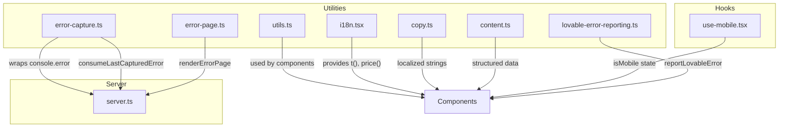
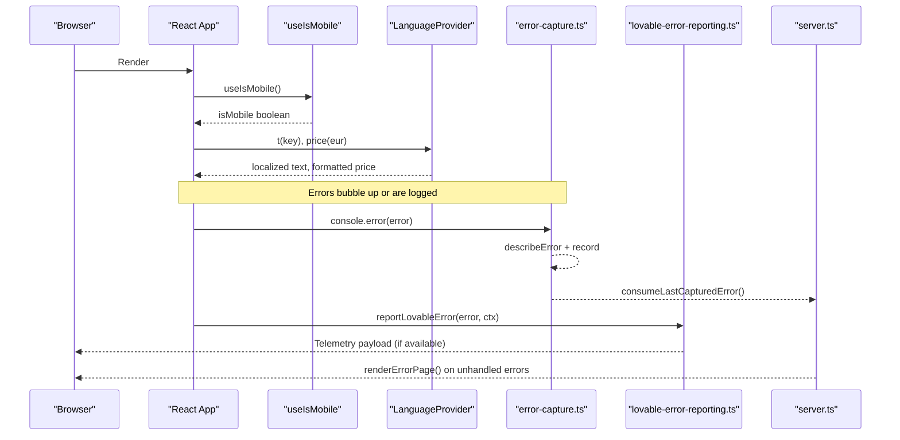
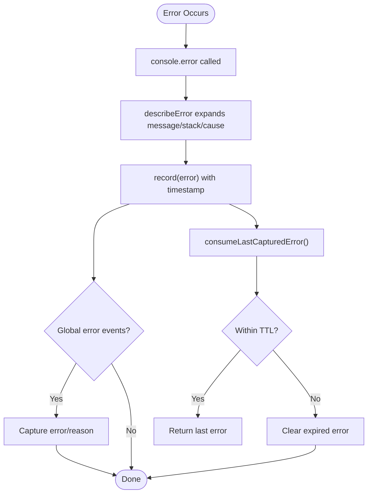
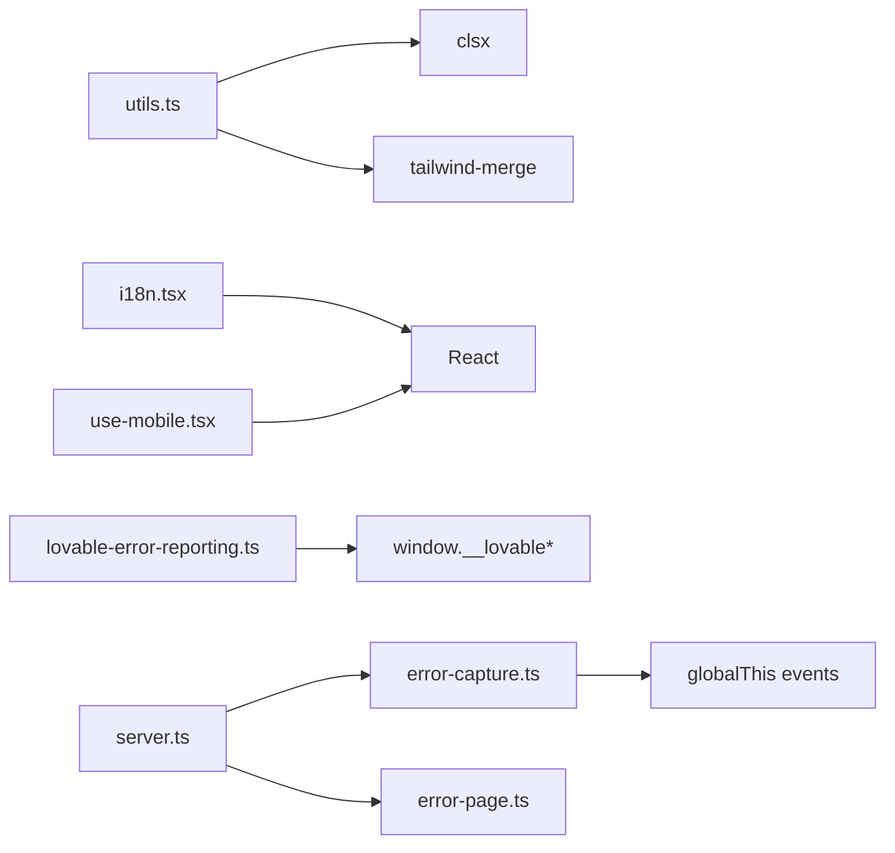

# Utilities and Helpers

<cite>
**Referenced Files in This Document**
- [utils.ts](file://src/lib/utils.ts)
- [use-mobile.tsx](file://src/hooks/use-mobile.tsx)
- [error-capture.ts](file://src/lib/error-capture.ts)
- [lovable-error-reporting.ts](file://src/lib/lovable-error-reporting.ts)
- [i18n.tsx](file://src/lib/i18n.tsx)
- [copy.ts](file://src/lib/copy.ts)
- [content.ts](file://src/lib/content.ts)
- [error-page.ts](file://src/lib/error-page.ts)
- [server.ts](file://src/server.ts)
</cite>

## Table of Contents

1. [Introduction](#introduction)
2. [Project Structure](#project-structure)
3. [Core Components](#core-components)
4. [Architecture Overview](#architecture-overview)
5. [Detailed Component Analysis](#detailed-component-analysis)
6. [Dependency Analysis](#dependency-analysis)
7. [Performance Considerations](#performance-considerations)
8. [Troubleshooting Guide](#troubleshooting-guide)
9. [Conclusion](#conclusion)
10. [Appendices](#appendices)

## Introduction

This document explains the shared utility functions, helper modules, and custom hooks that power cross-cutting functionality across the application. It covers:

- Utility library for class name merging and internationalization helpers
- Custom React hooks such as mobile detection
- Error capture and reporting mechanisms
- Logging strategies and debugging integrations
- Examples and best practices for extending and testing utilities

The goal is to make these utilities approachable for both new and experienced contributors while providing a clear map of responsibilities, data flows, and integration points.

## Project Structure

The utilities are organized into focused modules under src/lib and src/hooks:

- src/lib/utils.ts: Class name merging utility
- src/lib/i18n.tsx: Internationalization context, language switching, and price formatting
- src/lib/copy.ts: UI copy (localized strings) used throughout the app
- src/lib/content.ts: Content models and structured content (services, plans, etc.)
- src/lib/error-capture.ts: Global error capture and console.error expansion
- src/lib/lovable-error-reporting.ts: Integration with Lovable editor telemetry
- src/lib/error-page.ts: Fallback HTML error page renderer
- src/hooks/use-mobile.tsx: Mobile breakpoint detection hook
- src/server.ts: Server entry that uses error capture and renders error pages

**Diagram sources**

- [utils.ts:1-7](file://src/lib/utils.ts#L1-L7)
- [i18n.tsx:1-89](file://src/lib/i18n.tsx#L1-L89)
- [copy.ts:1-418](file://src/lib/copy.ts#L1-L418)
- [content.ts:1-800](file://src/lib/content.ts#L1-L800)
- [error-capture.ts:1-82](file://src/lib/error-capture.ts#L1-L82)
- [lovable-error-reporting.ts:1-58](file://src/lib/lovable-error-reporting.ts#L1-L58)
- [error-page.ts:1-31](file://src/lib/error-page.ts#L1-L31)
- [use-mobile.tsx:1-20](file://src/hooks/use-mobile.tsx#L1-L20)
- [server.ts:38-61](file://src/server.ts#L38-L61)

**Section sources**

- [utils.ts:1-7](file://src/lib/utils.ts#L1-L7)
- [use-mobile.tsx:1-20](file://src/hooks/use-mobile.tsx#L1-L20)
- [error-capture.ts:1-82](file://src/lib/error-capture.ts#L1-L82)
- [lovable-error-reporting.ts:1-58](file://src/lib/lovable-error-reporting.ts#L1-L58)
- [i18n.tsx:1-89](file://src/lib/i18n.tsx#L1-L89)
- [copy.ts:1-418](file://src/lib/copy.ts#L1-L418)
- [content.ts:1-800](file://src/lib/content.ts#L1-L800)
- [error-page.ts:1-31](file://src/lib/error-page.ts#L1-L31)
- [server.ts:38-61](file://src/server.ts#L38-L61)

## Core Components

- Class name utility: A small function that merges class values safely using clsx and tailwind-merge.
- Internationalization: Language provider with context, language detection, persistence, translation lookup, and currency formatting.
- Mobile detection hook: Detects viewport width against a breakpoint and updates reactively.
- Error capture: Wraps console.error to expand errors, records last captured error with TTL, and listens to global error events.
- Lovable error reporting: Sends runtime errors to Lovable editor telemetry when available.
- Error page rendering: Returns a minimal HTML string for fallback error pages.
- Copy and content: Centralized localized strings and structured content models for services and pricing.

**Section sources**

- [utils.ts:1-7](file://src/lib/utils.ts#L1-L7)
- [i18n.tsx:1-89](file://src/lib/i18n.tsx#L1-L89)
- [use-mobile.tsx:1-20](file://src/hooks/use-mobile.tsx#L1-L20)
- [error-capture.ts:1-82](file://src/lib/error-capture.ts#L1-L82)
- [lovable-error-reporting.ts:1-58](file://src/lib/lovable-error-reporting.ts#L1-L58)
- [error-page.ts:1-31](file://src/lib/error-page.ts#L1-L31)
- [copy.ts:1-418](file://src/lib/copy.ts#L1-L418)
- [content.ts:1-800](file://src/lib/content.ts#L1-L800)

## Architecture Overview

The utilities form a cohesive layer supporting UI rendering, i18n, responsiveness, and robust error handling. The server integrates error capture to recover stack traces and render user-friendly error pages.

**Diagram sources**

- [use-mobile.tsx:1-20](file://src/hooks/use-mobile.tsx#L1-L20)
- [i18n.tsx:1-89](file://src/lib/i18n.tsx#L1-L89)
- [error-capture.ts:1-82](file://src/lib/error-capture.ts#L1-L82)
- [lovable-error-reporting.ts:1-58](file://src/lib/lovable-error-reporting.ts#L1-L58)
- [error-page.ts:1-31](file://src/lib/error-page.ts#L1-L31)
- [server.ts:38-61](file://src/server.ts#L38-L61)

## Detailed Component Analysis

### Class Name Utility

A concise utility that merges multiple class inputs into a single, deduplicated class string suitable for Tailwind CSS. It leverages clsx for conditional classes and tailwind-merge to resolve conflicts deterministically.

Usage pattern:

- Import the utility where needed
- Pass dynamic and static classes as arguments
- Use the returned string in className attributes

Benefits:

- Predictable class resolution
- No manual string concatenation
- Safe with undefined/null values

**Section sources**

- [utils.ts:1-7](file://src/lib/utils.ts#L1-L7)

### Internationalization (i18n)

Provides:

- Language context with provider and hook
- Automatic language detection from browser and localStorage
- Translation lookup via a typed dictionary
- Price formatting per locale with exchange rates

Key behaviors:

- Default language selection respects stored preference and browser language
- Changing language persists to localStorage and sets document language attribute
- Price formatter converts EUR to USD/VND based on configured rates and formats accordingly

Integration:

- Wrap your app with the language provider
- Access translations and prices via the provided hook
- Use typed dictionaries to ensure type safety

**Section sources**

- [i18n.tsx:1-89](file://src/lib/i18n.tsx#L1-L89)

### Mobile Detection Hook

Detects whether the current viewport is below a defined breakpoint and updates reactively.

Behavior:

- Initializes state as undefined to avoid hydration mismatches
- Uses matchMedia to listen for changes
- Updates state on initial load and on resize events
- Returns a boolean indicating mobile state

Best practices:

- Use this hook to conditionally render mobile-specific layouts
- Keep breakpoint configuration centralized if you extend it

**Section sources**

- [use-mobile.tsx:1-20](file://src/hooks/use-mobile.tsx#L1-L20)

### Error Capture and Reporting

Two complementary layers:

- Global error capture: Wraps console.error to expand errors, records the last captured error with a time-to-live, and listens to global error/unhandledrejection events. Exposes a consumer function to retrieve the last error within its TTL window.
- Lovable error reporting: Sends runtime errors to Lovable editor telemetry when available, including route context and mechanism metadata.

Flow highlights:

- Any console.error call triggers expansion and recording
- Global error listeners capture uncaught exceptions and promise rejections
- Consumer can retrieve the last error for server-side recovery
- Lovable integration forwards errors to editor telemetry when present

**Diagram sources**

- [error-capture.ts:1-82](file://src/lib/error-capture.ts#L1-L82)

**Section sources**

- [error-capture.ts:1-82](file://src/lib/error-capture.ts#L1-L82)
- [lovable-error-reporting.ts:1-58](file://src/lib/lovable-error-reporting.ts#L1-L58)
- [server.ts:38-61](file://src/server.ts#L38-L61)

### Error Page Rendering

Returns a minimal HTML string for fallback error pages, enabling graceful degradation when the app fails to load.

Usage:

- Called by the server when an unhandled error occurs during request processing
- Provides actions to retry or navigate home

**Section sources**

- [error-page.ts:1-31](file://src/lib/error-page.ts#L1-L31)
- [server.ts:38-61](file://src/server.ts#L38-L61)

### Copy and Content

- copy.ts: Centralized localized strings for UI elements across the application. Organized by feature area and language keys.
- content.ts: Structured content models and data for services, plans, steps, metrics, comparisons, and contact information.

These modules decouple content from presentation, making localization and maintenance straightforward.

**Section sources**

- [copy.ts:1-418](file://src/lib/copy.ts#L1-L418)
- [content.ts:1-800](file://src/lib/content.ts#L1-L800)

## Dependency Analysis

- utils.ts depends on clsx and tailwind-merge for class merging.
- i18n.tsx depends on React context and provides types for languages and translations.
- use-mobile.tsx depends on React and browser APIs (matchMedia).
- error-capture.ts depends on global event listeners and Date.now for TTL.
- lovable-error-reporting.ts depends on optional window globals for editor telemetry.
- server.ts uses error-capture and error-page to handle unhandled errors.

**Diagram sources**

- [utils.ts:1-7](file://src/lib/utils.ts#L1-L7)
- [i18n.tsx:1-89](file://src/lib/i18n.tsx#L1-L89)
- [use-mobile.tsx:1-20](file://src/hooks/use-mobile.tsx#L1-L20)
- [error-capture.ts:1-82](file://src/lib/error-capture.ts#L1-L82)
- [lovable-error-reporting.ts:1-58](file://src/lib/lovable-error-reporting.ts#L1-L58)
- [error-page.ts:1-31](file://src/lib/error-page.ts#L1-L31)
- [server.ts:38-61](file://src/server.ts#L38-L61)

**Section sources**

- [utils.ts:1-7](file://src/lib/utils.ts#L1-L7)
- [i18n.tsx:1-89](file://src/lib/i18n.tsx#L1-L89)
- [use-mobile.tsx:1-20](file://src/hooks/use-mobile.tsx#L1-L20)
- [error-capture.ts:1-82](file://src/lib/error-capture.ts#L1-L82)
- [lovable-error-reporting.ts:1-58](file://src/lib/lovable-error-reporting.ts#L1-L58)
- [error-page.ts:1-31](file://src/lib/error-page.ts#L1-L31)
- [server.ts:38-61](file://src/server.ts#L38-L61)

## Performance Considerations

- Class name merging: Using clsx and tailwind-merge avoids redundant class computations and ensures deterministic output.
- Internationalization: Context memoization prevents unnecessary re-renders; price formatting is lightweight and locale-aware.
- Mobile detection: Uses matchMedia for efficient change notifications rather than polling.
- Error capture: Limits cause chain depth and description length to prevent excessive memory usage; TTL prevents stale error retention.
- Error page rendering: Minimal HTML reduces payload size for fallback scenarios.

[No sources needed since this section provides general guidance]

## Troubleshooting Guide

Common issues and resolutions:

- Missing language context: Ensure components using i18n are wrapped with the language provider; otherwise, accessing the context will throw.
- Hydration mismatch on mobile detection: The hook initializes with undefined to avoid SSR/client mismatches; rely on the final boolean value after mount.
- Errors not captured: Verify that console.error is invoked for errors; global error listeners also capture uncaught exceptions and promise rejections.
- Stale errors: consumeLastCapturedError returns undefined after TTL; refresh or trigger a new error to capture fresh details.
- Lovable telemetry not firing: Check for presence of window.__lovableEvents and __lovableReportRuntimeError; these are only available in the editor preview environment.

**Section sources**

- [i18n.tsx:84-89](file://src/lib/i18n.tsx#L84-L89)
- [use-mobile.tsx:5-19](file://src/hooks/use-mobile.tsx#L5-L19)
- [error-capture.ts:18-82](file://src/lib/error-capture.ts#L18-L82)
- [lovable-error-reporting.ts:26-58](file://src/lib/lovable-error-reporting.ts#L26-L58)

## Conclusion

The utility and helper modules provide essential cross-cutting capabilities:

- Robust internationalization with context and formatting
- Responsive behavior via a mobile detection hook
- Comprehensive error capture and reporting for better observability
- Centralized content and copy for maintainability

Adopting these utilities consistently improves code quality, performance, and developer experience.

[No sources needed since this section summarizes without analyzing specific files]

## Appendices

### Examples and Usage Patterns

- Class names:
  - Import the class name utility and pass dynamic/static classes to get a merged result for className attributes.
- Internationalization:
  - Wrap your app with the language provider.
  - Use the hook to access translations and price formatting.
  - Reference localized strings from the copy module.
- Mobile detection:
  - Use the mobile hook to conditionally render mobile-specific UI.
- Error capture:
  - Rely on console.error for logging; errors are expanded and recorded automatically.
  - On the server, retrieve the last captured error within its TTL for recovery.
- Lovable reporting:
  - Call the reporting function with error and context to send telemetry in the editor preview.

[No sources needed since this section provides general guidance]

### Testing Approaches

- Unit tests:
  - Validate class name merging with various inputs (strings, objects, arrays, undefined).
  - Test i18n context initialization and language switching behavior.
  - Mock matchMedia to assert mobile detection logic.
  - Assert error capture behavior: console.error wrapping, describeError output, TTL expiration.
  - Verify Lovable reporting calls when window globals are present.
- Integration tests:
  - Render components with providers and assert localized outputs.
  - Simulate error paths and verify error page rendering.

[No sources needed since this section provides general guidance]

### Best Practices for Extending Utilities

- Keep utilities pure and side-effect-free where possible (e.g., class name merging).
- Centralize configuration (breakpoints, rates, languages) to avoid duplication.
- Maintain backward compatibility by deprecating rather than removing public APIs.
- Document public APIs with clear types and examples.
- Add tests for edge cases and boundary conditions.

[No sources needed since this section provides general guidance]
